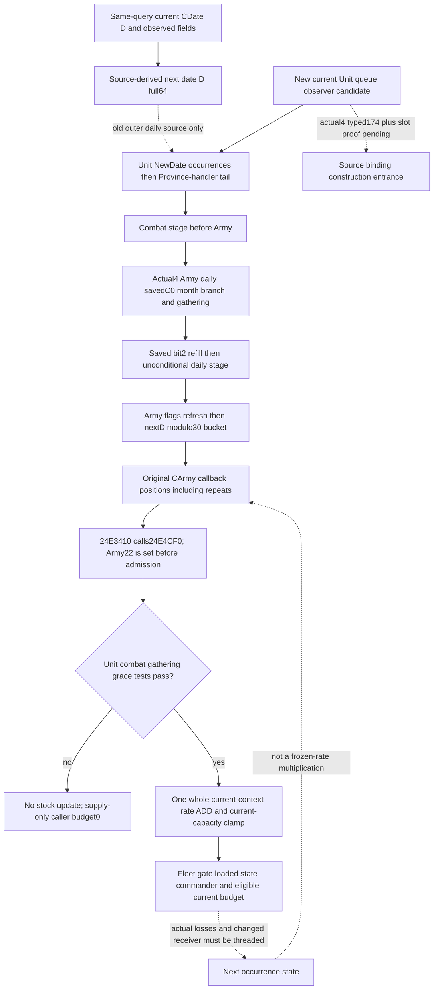

# Next daily Army supply effects: Source24 source frontier

This source package follows the full source-derived CDate64 candidate `22e394c962c494ba7d14a94a57e273a08774ce38`. Root owns runtime24 compilation and its sole FIRST. This work performs no EXE read, build, import, test, native callback, SDK query or game action, and does not replay Source23 or current-callback qualification. Exact installed target is CK3 1.20.0.4 / Steam25734779 / SHA-256 `98702F88A547CDE2EAF29A85F93B85F68EE4CF8148336A4F7AFAEB75319DD518`.

The next date/D/full64 is a source-derived clock. A genuinely changed next-day stock also depends on the receiver and earlier native writes. Neither that clock nor an action ACK observes those writes.

## Genuine daily and month conditions

The old exact3 whole `[22A0D80,22A232D)`/5549B ASM is held at `Z:/ck3_mod_rewrite_process_assets/g2-resume-20261004/battle-calendar-admission-v57/pause-source/evidence/daily-date-stage-22a0d80-primary.asm.txt`. It reconstructs CDate and storedD before the Unit, Combat and Army virtual18 calls: old callsites `22A1D61`, `22A1D75`, `22A1D89`. The Army call itself is unconditional at this point. The full outer actual4 body and these actual4 callsites are not covered by the selected calendar155+7B proof; do not infer their instruction addresses from an offset.

The outer old source separately compares new/old month at `22A0F44` and saves month-changed atF47, compares new/old year atF56 and saves year-changed atF59. When its optional global listener exists, it passes these two Booleans plus the new CDate pointer to382EAE0 at `22A1018`. That listener's event meaning is not closed here, and the Booleans do not directly gate the final Army daily call.

The genuine month-first saved flag has a different producer: old pre-calendar `229C675..229C692` obtains tomorrow's native day-of-month and selects mask2 when that value is **0**, clears the old mask2 at696 and stores GameStateC0 at6AD. Mask1 is the source's normalizedD modulo7 zero condition; mask4 is tomorrow's day-of-year index0. These flags are not interchangeable with the month-changed Boolean. The old Army pre-stage tests GameStateC0 bit2 at `2A9A2E1` before persistent preparation262C6A0. The actual4 attachment of that pre-calendar producer/pre-stage is outside the calendar155+7B proof and remains unqualified in this package.

The actual4 Army daily manager `2A9A570` is independently source-closed by the retained full1539B `support_2A9A590-DETAIL.json` under `Z:/ck3_mod_rewrite_process_assets/g2-background-20261007/upstream-build-migration/army-family-12004/commander-supply/support-first01/`. Its source distinguishes month work from daily work:

| Actual4 source | Native role and boundary |
| --- | --- |
| `2A9A655` | Save GameStateC0 bit2 at entry. Captured currentC0 is not proof of tomorrow's saved bit. |
| `2A9A66D → 2A98C90` | Saved-month cleanup path; reached native target is closed, its full actual4 downstream effects are separate. |
| `2A9A678 → 2A9AF20` | Unconditional gathering stage. |
| `2A9A8DD → 2A98AC0` | Refill stage selected by savedC0 bit2. |
| `2A9A8E5 → 2A97EB0` | Unconditional later daily stage, including assault source lineage; the native target does not by itself qualify all actual4 physical writes. |
| `2A9A966` and following refresh | Clear Army22, copy24→1FC and28→200; branch31→2A97880, clear20→2639A90, clear21→2C44710, branch30→24DD630. |
| `2A9AB46 → 24E3410` | After those stages, choose `uint32(GameState+9C)%30` and walk its original CArmy pointer occurrences in stored order, retaining repeats. |

The decisive distinction is a daily callback opportunity versus a successful supply update. A month-first flag selects earlier work; it does not turn the final daily dispatcher into a once-per-month call. Existing month-first, refill, assault and gathering topics retain their own exact3/actual4 source boundaries.

## One supply callback: actual closed decision

The actual4 `24E3410` logical1580B caller is already closed by Root's current-callback retry02. `24E3430` calls updater `24E4CF0`, `24E3437` testsAL, rejection supplies integer supply budget0, and only success reaches `24E343E → 24E32C0`.

The full463B updater writes **Army22=1 at `24E4D00`**, before every admission test. Rejection paths include Unit170==3, combat, gathering, Army5C!=0, or signed wrapped elapsed `(passedDate.low32-Army190)/24` not exceeding loaded grace. Success writes the full passed CDate at Army188, obtains current-Province whole rate `24E5180`, adds it once to signed stock180, and clamps the result to0/current capacity `2C53BF0`. The whole rate is neither divided by30 nor multiplied by elapsed days. Paused Army22 cannot prove success, callback count, a unique writer or a future callback.

After success, `24E32C0` obtains supply-only integer budget with actual fleet-date suppression, loaded stock-state thresholds/fractions, commander component and source-admitted regiment current counts. Current attrition `24E2E30` remains a separate current observation; it is not a casualty count or next stock write.

`current_callback_supply_risk_v1` already implements the independently named one-current-entry stock/state/budget value and has one eight-scene combined-Service FIRST GREEN at Root freeze `0212161948cc584f6e45caa72c8a03dad9494799`. Reuse [the existing source and qualification](army-current-callback-supply-risk-12004.md); this package adds no duplicate current-risk reader or test.

## Existing observed inputs and the minimum increment

The current Army query already publishes stock/capacity/whole rate/attrition; updater state, combat/gathering and grace; loaded state tables and commander components; current land and fleet inputs; month-firstC0 and current flags; selected original Army occurrences/all30 buckets; and the source-derived clock. Their current values cannot be relabeled post-Unit/post-refill/post-loss values.

The current target-land family observes the native target Province component and owner/target resupply predicate plus independent loaded gain. It is not a complete target monthly-rate getter result or a changed arrival frame. A future fleet suppression comparison can use the existing raw fleet date and explicit next low32 under the same Fleet-association premise; copying the current Boolean is incorrect. The existing conditional fleet helper remains separately qualified according to its own ledger.

The genuinely missing raw schedule is the **Unit NewDate manager's stored full UnitID vector**, not another Army bucket. The held exact3 typed manager has receiver GameData+2A508 / manager secondary+8, vtable477EFC8 virtual18, vector at secondary receiver+20 and signed count+2C: primary+28/+34, or GameData+2A528/+2A534. It consumes four-byte occurrences with a fixed initial loop end. Each valid UnitID occurrence reaches `24AB6D0`, then the manager calls `2A98E50` once. Its exact174B old raw is held at `Z:/ck3_mod_rewrite_process_assets/g2-parallel-20261006/army-supply-tick/followups/disembark-entry-follow-on/unit-manager-daily-2ad6700.bin`, with same-stem ASM/JSON. The raw was located in the existing file index; it was not reread or reconstructed in this package.

The smallest proposed native family is `current_unit_new_date_schedule_inputs_v1`, captured once alongside the existing same-query row. It exposes current signed count/data-pointer presence and this exact full UnitID's original matching positions and occurrence count. Preserve repeats and a genuine empty0. It must not publish all global UnitIDs, invent a next Province/Fleet association or call the mutating NewDate method. Existing actual4 CUnit storage/fullID/type validation is reused.

Its actual4 typed manager/vtable-slot/body attachment is **NOTHELD** here. Root's sole finite construction entrance is cached paired runtime metadata for old `[2AD6700,2AD67AE)`/174B, the held raw cache, and the actual source-use/constructor virtual18 attachment. No constant RVA shift or old vptr alias is accepted. The manifest under the external Source24 packet requests only that named complete function; typed slot/receiver proof must first reuse central caches and otherwise identify its exact narrow witness before a Root read. No whole5549B, calendar, 1580B supply caller or 521B suffix recapture is requested.

The tail matters: old held `2A98E50` processes the no-active-combat Army Province-handler queue through2479180/2479940/24797A0 and clears that queue. It runs at the Unit tail and again at the Army tail. Its exact old operands are data at CArmyManager primary+98 (`2A98E60`) and signed count+A4 (`2A98E6A`), giving GameData+2A5D8/+2A5E4 and a fixed initial end. These original IDs are already captured in `monthly_first_removal_cleanup_inputs_v1.id_lists` at `manager_offset:'98'`, preserving `ordered_army_ids`; reuse them. This is distinct from the separate published removal queue at GameData+2A5A8 (`monthly_daily_queue_inputs_v1`). There is no need for a duplicate tail-ID collector. Zero matching Unit occurrences therefore means zero per-Unit `24AB6D0` opportunities, **not** unchanged Province/Fleet context. Actual4 tail operand attachment and effects must retain their own source coverage; the old offsets are not blindly bound to actual4.

After actual4 attachment, implement one owned native header/collector/serializer and strict family leaf, then join the current Unit occurrences to the existing Army query's source-derived next opportunity projection. This is a current readonly schedule input. A held-context next-callback admission/stock kernel may subsequently reuse existing operands with its premise explicit, but complete next-day stock still needs the earlier stages and each callback's changed receiver/rate/capacity/strength to be threaded. Do not multiply one current callback budget by the occurrence count.

## Delivery and readiness

External package: `Z:/ck3_mod_rewrite_process_assets/g2-parallel-20261007/next-supply-effects-source24/`. `effect-source/SOURCE-LEDGER.json` records exact source and `observer-dto/MINIMUM-OBSERVER-SPEC.md` proposes the current-only17-key DTO and four independently owned implementation files. `ROOT-UNIT174-FAMILY-MANIFEST.json` and `ROOT-UNIT174-ARGV.json` prepare the one named cached-body mapping with the authoritative shared FamilyMapper; neither is executed here. The separate actual4 typed source-use witness is not guessed. This doc is a standalone source-research candidate based on22e; it changes no freeze24 runtime, shared CMake/header or production API.

Readiness is **research with a concrete current readonly observer entrance**. Current clock and current risk qualification are reused, not promoted. Actual next frame, successful update count, post-stage stock, physical casualties, full daily/monthly execution and production-day credit remain unobserved by this package. Root owns all further source reads, integration, unique native/Service qualification and live execution.
