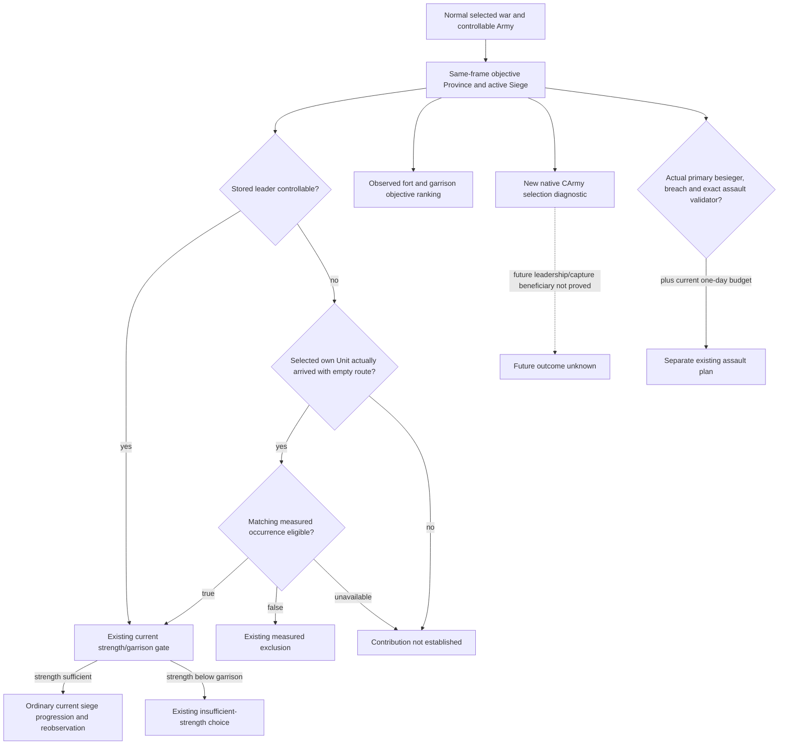

# Ordinary siege contribution consumption — 1.20.0.4

The later downstream cadence consumer repair is recorded separately in
[foreign-leader material cadence](siege-foreign-leader-material-cadence-12004.md).
The earlier source/qualification boundaries below remain their original facts.

The ordinary consumer is already connected at source `6ee7dea1b4d2fa4ecb05223f12c66b7afe72ac2d`. No extra policy or query implementation is needed for this entrance. This bounded source review on 2026-10-08 / ISO week 41 reuses the adopted [selected-subject consumer](siege-subject-contribution-consumer-12004.md), [actual4 contribution tree](war-siege-target-contribution-r76-12004.md) and [current Army selection tree](siege-current-army-selection-12004.md).

Exact game identity is CK3 1.20.0.4 / Steam 25734779, executable SHA-256 `98702F88A547CDE2EAF29A85F93B85F68EE4CF8148336A4F7AFAEB75319DD518`. Native33's new selection observer has Root's four-scene native and registered consumer qualification. Its production-live status remains separate from the existing Runtime32 R77 snapshot.

## Native inputs and the ordinary consuming edge

Foreign stored Siege leader and current own contribution are independent. The native M/K loops reuse current Province occurrences and exact eligibility `24E8340` / `2C16670`; current Province, Unit state18, retreat170 and empty route count44 are separate inputs. The new native `247DC00` selection is a native CArmy FullID, optionally joined to public Unit and controllability. Equality with this selection is not contribution admission, and eligibility does not prove next leadership, capture beneficiary or a future numerical contribution.

| Current source edge | Actual ordinary consumption |
| --- | --- |
| `strategy.py:10981` | Passes the selected `pursuit_army` into `_current_exact_siege_status`, rather than checking only the stored lead. |
| `siege_subject_contribution_v1.py:14` | Requires actual selected controllable subject, matching current Province, no move target and a known empty route. |
| Same helper, lines24–40 | Matches public Unit to measured `active_siege.province_unit_occurrences`; all matching occurrences must be known eligible. Exclusion and unavailable remain distinct. Native CArmy selection equality is reported only as a diagnostic. |
| `strategy.py:15270` | Under foreign stored leadership, admits measured eligible own contribution; preserves rejection for measured exclusion and unavailable qualification. |
| `strategy.py:15279` | Still rejects measured besieging strength below measured garrison when that observation is supported. Eligibility alone does not substitute projected reinforcement for current strength. |
| `strategy.py:15052` | Ranks exact objectives by observed fort, garrison and stored objective order. This is the existing counter-policy, not a newly proved native AI ranking. |
| `strategy.py:11127` | An arrived, progressing current objective without an observed route/threat uses ordinary one-day advance and reobservation. |
| `strategy.py:16137` and `11109` | Assault remains separate: actual primary-besieger flag, breach, exact Start validator, positive daily work and a current casualty/garrison budget. Own contribution under a foreign leader grants no assault ownership. |

## Held R77 frame and qualification boundary

The named Runtime32 paused whole is `Z:/ck3_mod_rewrite_process_assets/g2-background-20261007/upstream-build-migration/managed-full-h9696-startup32restore01/operator/gameplay-responses/001-runtime32-r77-paused-snapshot.json`. Its decoded frame is snapshot `native:2`, native revision2, public revision3, raw date53288544, paused=true. Own public Unit218104048 is controllable and moving from2618 to2615 with route `[2615]`; its coarse soldier field is null. Do not infer arrival or post-refill strength from that field.

War100663329 has objectives2606 and2608. At2606, no active siege is observed, fort4/garrison588. At2608, fort7/garrison1050 and current besieging strength152 accompany foreign stored public335544362/native352321570; the sole occurrence belongs to that foreign Unit and is eligible. Own218104048 is absent. Current work0, total/remaining51353725 and null ETA establish neither near completion nor our current participation. R77 has no new `current_besieging_army_selection` leaf: it is Runtime32, not Native33 live evidence.

Root's `runtime33-first01/root-pairs/ROOT-NEW-PAIRS-RESULTS.json` records siege-selection native exit0 in0.2825621s and the sole registered consumer exit0 in5.3595675s, four new scenes, exact fixture source `90074a79d37a95f1ec96f478d18694cd40011bce`. The receipt's overall RED belongs to the separate pregnancy fixture; the siege domain is GREEN. This package reuses that result and runs no native producer, consumer or old test again.

## No-gap disposition and next actual outcome

This is a doc-only source closure. It adds no reader, null metadata leaf, strategy hook, numerical approximation, new restriction or extra test. The already qualified consumer remains **static-ready with offline whole-fixture qualification**; no Native33 production-live contribution or full siege loop is awarded here.

Root's next useful observation is an ordinary paused Native33 frame after actual arrival: exact war/objective, own public/native identities, empty route, actual own eligibility occurrences, current measured besieging strength/garrison, and the chosen normal plan. If eligible contribution and sufficient current strength are observed, the existing ordinary progression branch can run. If the own occurrence is excluded, arrival is incomplete, or current strength remains insufficient, retain those measured outcomes. Capture must be confirmed by independent occupation/occupier/war-score changes; no new fixture or replay is needed merely to restate this source chain.

External packet: `Z:/ck3_mod_rewrite_process_assets/g2-background-20261008/normal-siege-own-contribution/`. It preserves the selected R77 fields, finite source ledger, domain qualification reference and Oct8/W41 report fields. The first extraction expected a dictionary snapshot and found no rows in the MCP wrapper; the necessary correction decoded its existing text payload. This was source parsing only, not a game query or capability RED. New EXE bytes, imports, tests, builds, SDK/game/process operations and pushes are all zero.

## Production Snapshot ingress confirmed at 7f0ff661

A bounded source review on 2026-10-08 at `7f0ff6613c4f2b08a0c9e7ad8c0c63015d47cf4d` confirms that ordinary `Service.plan_turn` receives these inputs through the production Snapshot. It does not need a second `ck3_query_war_occupation_targets_v1` request merely to obtain the current Siege selector.

| Production edge at this source | Preserved input |
| --- | --- |
| `ck3_12002_adapter.cpp:144` -> `ck3_12004_adapter.cpp:304` | The exact .4 adapter uses `ReadCk3_12004Snapshot`, which calls `ReadWorldSnapshot12004` with its actual .4 Province bindings. |
| `ck3_12004_province.cpp:32` and `ck3_12004_world.cpp:53` | The Province factory supplies native selector `247DC00`; the .4 World wrapper reuses the existing software reader with those supplied bindings. |
| `ck3_12002_world.cpp:317` -> `ck3_12002_province.cpp:250` | Current active-war objective rows are read from the owning Province together with all observed Army rows. The selector, optional public Unit join and controllability are populated here; no private-query result is required. |
| `bridge.cpp:4148` / `5513` -> `bridge/war_contract.py:437` / `701` | Whole Snapshot serialization includes `current_besieging_army_selection`; normal active-war and objective-state normalization retains it. |
| `bridge/native_driver.py:2688` / `2701` / `4384` -> `service.py:1261` | The current semantic Snapshot and internal planning view retain the full `active_wars` rows. Episode projection expands the same Snapshot, and the normal Service passes it into `choose_one_life_turn`. |
| `strategy.py:8750` / `10079` / `15015` / `15272` | Tactical-war selection keeps the original war and Province dictionaries. The selected own Army reaches the existing foreign-leader contribution helper and current Siege progression decision. |

The compact historical war summary is a separate history projection; it does not replace the current Snapshot supplied to the ordinary plan. Map-loading prefixes and unavailable or exhausted objective observations remain their existing behavior. This review adds no schema, query, readiness gate, policy or fixture.

Foreign-leader admission still uses the actual selected own Unit's measured eligibility occurrence. Current native CArmy selection and equality are diagnostics, not prerequisites for contribution. Missing selector metadata alone therefore does not create the proposed own-eligible selection blocker.

Root also supplied the retained R78 response at `managed-full-h9715-startup35restore01/operator/gameplay-responses/001-runtime32-r77-paused-snapshot.json`, container `/result/structured_content`: native revision2, public revision3, date53288568, current war100663329 with objectives2606/2608. Objective2608 has measured strength152 and selector native CArmy352321570 / public Unit335544362 / controllable=false. This is the actual foreign selection, not a controllable own contribution or a new value outcome. The failed R78 session/window qualification remains failed. These fields were supplied by Root from the retained file; this review did not read the response again or query the game. Future requests must use a fresh actual war/revision and retain the genuine saved6010 recovery baseline; historical war117 is not the current frame.

Disposition: **no source gap in ordinary Snapshot ingress**. The prior native/registered consumer qualification is reused without execution. There is no new production-live, arrival, leadership, capture, day, action, save or G2 milestone credit. At review time the user prohibits local CK3 use; no Game, SDK, process, EXE, build, test, import or hash operation was performed. The exact edge ledger and Oct8/W41 fields are in `Z:/ck3_mod_rewrite_process_assets/g2-background-20261008/siege-production-snapshot-ingress-7f0/`.
