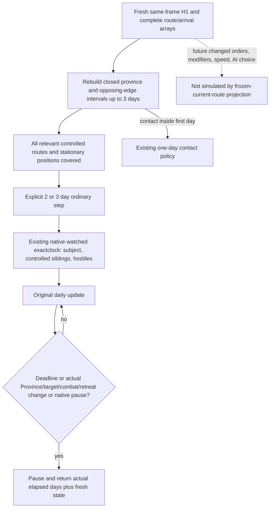

# Normal three-day route window (1.20.0.4)

Source baseline: `e5fd088cde640b0a1ea29ff40888af95d9300c95`. Root completed Native49 native and registered compound-consumer offline qualification on 2026-10-09, then deployed the capability through Native51 in ordinary Robert campaign R83. Readiness is **production-live primitive**: two normal planner windows each advanced three days, with actual arrival and native position-change observation in the second window. The narrow route-window OODA ran twice; this does not qualify complete autonomous war. Root owns execution. The earlier HOT05 one-day result advanced raw date `53288568 -> 53288592` and watched zero armies. Its next Army query took 116.77 seconds. Repeating that granularity limits useful ordinary war progress.

## Native input tree sealed before policy

`RouteContactHorizonRequest` has no day-count operand. The `-h-1-` spelling means one hostile public Unit ID. `ReadRouteContactHorizon` in `ck3_12002_routes.cpp` constructs an exact one-day conflict window, but publishes each subject and hostile's complete committed route and corresponding arrival dates. `BuildTimelineIntervals` / `AppendContactConflicts` use closed occupancy and opposing-edge overlaps. A separate software window can replay those complete same-frame timelines for three days without changing the original H1 observation.

The adopted actual4 tactical daily sentinel binds the mapped core and Unit/Army/Combat storage directly. Its Arm operation accepts a positive whole-day deadline, speed 1–5, and at most 64 watched public Unit IDs. Post-original daily evaluation stops on deadline, native pause, unavailable or changed physical identity, route target, combat, retreat, and combat terminal markers. The existing Unit source proves `CUnit+0x20 -> Province+0x10`; the pre-Native49 fingerprint omitted that actual position. Native49 adds that witness so an intermediate arrival can stop this window even when the final route target stays unchanged.

## Counter-policy and scope

The normal moving-army policy may select an explicit window of at most three days only after recomputing the full chosen window from the same-frame arrays. A later contact reduces the number of complete contact-free days; closed contact endpoints are excluded. All controlled moving siblings require their existing same-frame route evidence, and stationary positions use the already observed Province plus the same hostile timelines. Missing longer-window evidence retains the existing one-day path.

Execution reuses the existing native tactical sentinel and its normal pause/event/result handling, watches the relevant public Unit IDs, and records actual elapsed days. It performs one resume. It does not write movement state or assume that three calendar days actually elapse. The post-original marker can observe combat after it begins; this package makes no promise to stop before battle. A native paused event or the existing Python decision-boundary observer can end the tranche early.

The frozen route calculation does not replay future native AI orders, changed commander movement values, route recalculation, or all native war decision inputs. Those are quality gaps, not claims of a full future battle forecast. The actual arrival marker closes the concrete omitted position witness. No new query, empty metadata leaf, strategic war prohibition, or full-month simulation is introduced.

## Actual Native49 offline qualification, 2026-10-09

Root sealed GREEN at **11:02:22 UTC**. The sole new native whole fixture and
sole registered compound consumer each ran once, with **four packets each**.
The compound uses the normal selector and real Driver execution entry with
offline seams: complete three-day route coverage selects a longer step,
second-day contact retains one-day progression, and a native position marker
ends a requested three-day tranche with its actual elapsed result. Prior H1,
route and clock qualifications were retained without old FIRST replay.

| Source role | Actual pin |
| --- | --- |
| Feature author | `70989fa30d07754a46457bbb0ffb59ecd42df449` |
| Root frozen source, new compiles and qualification | `65c0cc8fd10fc66e168785affa4fac5d14091651` |
| Published baseline for this documentation increment | `8024d9692d7564a300e96f6e3d76a161a407da79` |
| Three retained fixture provider objects | Native47 qualified `a2771c6016247e73d689c4bb8a825d334928bb44` |

The frozen native source is
`Z:/gbs-runtime49-route-window-root-source`. The canonical receipt retains
mixed object lineage; the documentation baseline does not retag those
compiled objects or the qualification source.

Attempt01 remains RED after **seven GREEN compiles** (six production owners
and one fixture; Bridge compile **16.3754996 s**), one fresh Runtime434 archive
(**0.4090565 s**) and DLL link (**0.8812579 s**). Its fixture link lacked
`Serialize`; attempt02's fixture link then lacked `Readprofile`, both LNK1120.
Neither attempt ran a FIRST. Root closed the actual fixture provider list
statically: the original five objects plus the already qualified Features333,
Render171 and Reader172 objects, **eight objects total**, with zero additional
project undefined symbols. That closure is retained in
`Z:/ck3_mod_rewrite_process_assets/g2-background-20261009/runtime49-route-window-preparation/ROOT-FIXTURE-PROVIDER-STATIC-CLOSURE.json`.

Retry03 performed **zero compiles, zero archives and zero DLL links**. It
linked the closed fixture (**0.1295253 s**), ran the unique native FIRST
(**0.1341311 s**) and then the unique registered consumer FIRST
(**4.7848367 s**). Both were GREEN. The two earlier failed results remain
separate from the selected retry03 result.

The production closure is **734 owners**: Bridge299, Runtime434, Protocol1.
This increment replaces **Bridge3 + Runtime3**, retaining **728 owners** and
**502 compiler-command rows**. Runtime434 was freshly archived once in
attempt01. The retained GREEN DLL is **13,419,520 bytes**, Root-recorded SHA-256
`99d20042d57d895abd95d1bfee996075f2b1ce198d07b74aaea7ae0a39656c9c`.
No retained object or helper binary was recompiled or rehashed by this
qualification documentation work.

Canonical metadata is under
`Z:/ck3_mod_rewrite_process_assets/g2-background-20261007/upstream-build-migration/entry-live-fix49/`:
`ROOT-TACTICAL-DAILY-ROUTE-WINDOW-QUALIFICATION.json`,
`ROOT-PARENT-RUNTIME-INCREMENTAL-DLL.json`, and `manifest.json`.
The actual results are
`Z:/g2-native49-build01/attempt01/ROOT-NATIVE49-RESULT.json`,
`Z:/g2-native49-build01/attempt02/ROOT-NATIVE49-RESULT.json`, and
`Z:/g2-native49-build01/attempt03/ROOT-NATIVE49-RESULT.json`.

At this offline cutoff the capability was **static-ready** with no deployment
or live credit. Root's Native48 Game result did not establish Native49 live
behavior. The later deployed ordinary-campaign results below establish the
narrow route-window behavior separately; neither result is fullEntry or
complete autonomous-war qualification.

External source and cost ledger:
`Z:/ck3_mod_rewrite_process_assets/g2-background-20261009/normal-route-horizon-efficiency/`.
October 9 / ISO 2026-W41. The source-author and documentation lanes performed
no compiler, test, FIRST, binary hash, SDK or Game execution.

## Actual ordinary R83 route-window loop, 2026-10-09

Root's minimized Game **4368**, Robert **29829**, ordinary succession and no
pact, ran the normal planner twice. Both selected
`advance-route-contact-window-v1-218104048-to-2609-days-3-h-1-134218098`.
Each used same-frame complete route timelines to establish three contact-free
days, watched public Unit IDs **134218098 and 218104048**, resumed once, and
returned paused with actual before/after war state. The original H1 route
observation remained one day; `-h-1-` denotes one hostile ID, not the selected
window's duration.

| Actual normal response | UTC start / end | Raw date / actual days | Public / native revision | Native stop |
| --- | --- | --- | --- | --- |
| `011-r83-normal-batch01.json` | 12:30:05.515070 / 12:30:39.493419 (33.978349 s) | 53288640 → 53288712 / **3** | 7 / 6 | `date_deadline`, flags **1** |
| `014-r83-normal-batch01.json` | 12:32:57.876076 / 12:33:33.110627 (35.234551 s) | 53288712 → 53288784 / **3** | 11 / 10 | `date_deadline`, `route_target_changed`, `army_position_changed`, flags **65541** |

The second window directly observed player Unit **218104048** arrive:
Province **2615 → 2609**, state **moving (7) → regular (1)**, target
**2609 → null**, and committed route **[2609] → []**. The first window kept
Province 2615, the target and moving state unchanged. Hostile Unit **134218098**
remained regular in Province **2606** throughout. Both actual windows had
three completed daily ticks, zero overshoot, zero intermediate pauses and zero
external rich queries. Robert remained alive; war **100663329** retained
player-relative score **0**. Soldier counts were `null` and remain unknown.

The native position marker is **bit index 16, mask 65536 (`1U << 16`)** in
`tactical_daily_sentinel_v1.hpp:60`; it is not numeric mask 16. The deployed
source reads current Province at `tactical_daily_sentinel_v1.cpp:178` and
compares it with the armed witness at line 841. Actual flags **65541** contain
that mask and publish `army_position_changed`. The arrival and position marker
occurred **at the three-day deadline**. These observations do not demonstrate
a two-day early stop or a position change before the deadline. The wire does
not expose each internal fingerprint; the public before/after Province fields
provide the independent actual-position observation.

Root's actual `015-r83-save-six-normal-days.json` then saved **H9800**, raw date
**53288784**, checkpoint **104,745,611 bytes**, SHA-256
`5e4ed08bd5f09b85d522acc00dec7fcba9303e784d6c7c0627b051af2eb6912e`.
The saved-normal-day count is **6013 + actual 3 + actual 3 = 6019**; it is
derived from completed normal `elapsed_days`, not raw date, history or names.
The SAVE duration was **25.179793 s**. The two windows establish a narrow
production route-window observe/decide/execute/verify loop and six durable
normal days, with no battle, war-completion or full-generation claim.

The SDK source was `bf5cc1761d3389907150156c07c41637ce5997bb` at
`Z:/gbs-r83-native51-sdk-root-source`. Native51 qualified and primary compiled
source was `0d12fbeaf14641747fd984a068bbd181516346c4`, retaining the Runtime
archive at `8024d9692d7564a300e96f6e3d76a161a407da79`. This mixed lineage does
not retag every retained owner to Native51. Its canonical receipt is
`Z:/ck3_mod_rewrite_process_assets/g2-background-20261007/upstream-build-migration/entry-live-fix51/ROOT-PARENT-RUNTIME-INCREMENTAL-DLL.json`.

Raw responses remain under
`Z:/ck3_mod_rewrite_process_assets/g2-background-20261009/managed-full-r83-native51restore01/operator/gameplay-responses/`.
The thin qualification artifact and October 9 / ISO 2026-W41 report fields are
under `Z:/ck3_mod_rewrite_process_assets/g2-background-20261009/r83-three-day-route-window-live01/`:
`ROOT-R83-NATIVE49-THREE-DAY-LIVE-THIN.json` and `OCT9-W41-FIELDS.json`.
The documentation lane read each of the two newly authorized responses once,
preserved them, and reused Root's actual SAVE metadata. It performed no new
query, Driver/save-body read, hash, build, test, SDK or Game operation.
