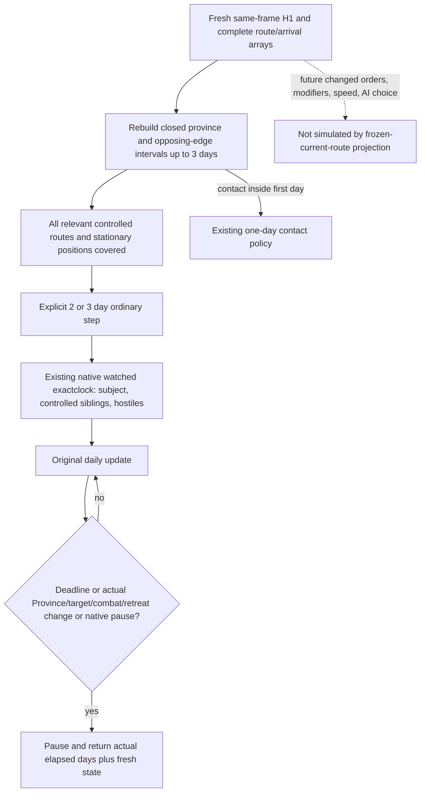

# Normal three-day route window (1.20.0.4)

Source baseline: `e5fd088cde640b0a1ea29ff40888af95d9300c95`. This package is authored source, not a completed native, Python, or live qualification. Root owns execution. The actual HOT05 one-day result advanced raw date `53288568 -> 53288592` and watched zero armies. Its next Army query took 116.77 seconds. Repeating that granularity limits useful ordinary war progress.

## Native input tree sealed before policy

`RouteContactHorizonRequest` has no day-count operand. The `-h-1-` spelling means one hostile public Unit ID. `ReadRouteContactHorizon` in `ck3_12002_routes.cpp` constructs an exact one-day conflict window, but publishes each subject and hostile's complete committed route and corresponding arrival dates. `BuildTimelineIntervals` / `AppendContactConflicts` use closed occupancy and opposing-edge overlaps. A separate software window can replay those complete same-frame timelines for three days without changing the original H1 observation.

The adopted actual4 tactical daily sentinel binds the mapped core and Unit/Army/Combat storage directly. Its Arm operation accepts a positive whole-day deadline, speed 1–5, and at most 64 watched public Unit IDs. Post-original daily evaluation stops on deadline, native pause, unavailable or changed physical identity, route target, combat, retreat, and combat terminal markers. The existing Unit source proves `CUnit+0x20 -> Province+0x10`; the current fingerprint omits that actual position. Adding that witness lets an intermediate arrival stop this window even when the final route target stays unchanged.

## Counter-policy and scope

The normal moving-army policy may select an explicit window of at most three days only after recomputing the full chosen window from the same-frame arrays. A later contact reduces the number of complete contact-free days; closed contact endpoints are excluded. All controlled moving siblings require their existing same-frame route evidence, and stationary positions use the already observed Province plus the same hostile timelines. Missing longer-window evidence retains the existing one-day path.

Execution reuses the existing native tactical sentinel and its normal pause/event/result handling, watches the relevant public Unit IDs, and records actual elapsed days. It performs one resume. It does not write movement state or assume that three calendar days actually elapse. The post-original marker can observe combat after it begins; this package makes no promise to stop before battle. A native paused event or the existing Python decision-boundary observer can end the tranche early.

The frozen route calculation does not replay future native AI orders, changed commander movement values, route recalculation, or all native war decision inputs. Those are quality gaps, not claims of a full future battle forecast. The actual arrival marker closes the concrete omitted position witness. No new query, empty metadata leaf, strategic war prohibition, or full-month simulation is introduced.

## Qualification recipe

Author exactly one new compound through the normal selector and real Driver execution entry: a complete three-day route selects the longer step, a second-day contact retains one-day progression, and a native position marker ends a requested three-day tranche early with its actual elapsed result. Root runs it once after compiling the new position-marker fixture. Previous H1, route, and clock qualifications are reused without rerunning them. New fixture and consumer execution remain `AUTHOR_NOTRUN` until Root records actual receipts.

External source and cost ledger: `Z:/ck3_mod_rewrite_process_assets/g2-background-20261009/normal-route-horizon-efficiency/`. October 9 / ISO 2026-W41. New EXE bytes, SDK, game, process, build, and test executions in this author lane: zero.
