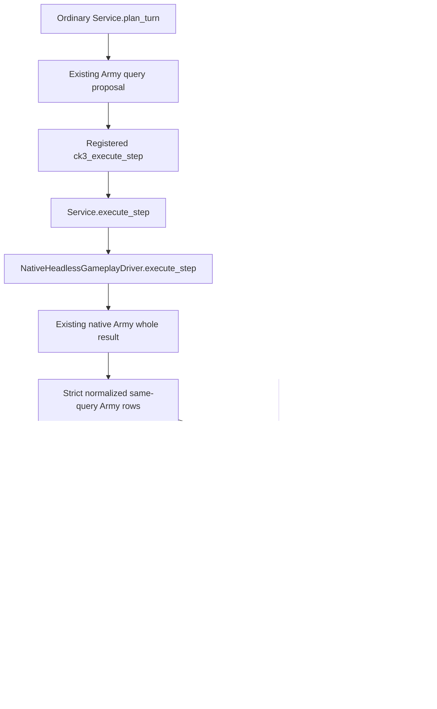

# Ordinary Army query callback projections (1.20.0.4)

## Source finding recorded before implementation

The frozen source is `45ce81348ab7fcdde6900dfa95b9e5fbf546c927`.
The native build remains CK3 `1.20.0.4`, Steam build `25734779`, exact EXE
SHA-256 `98702f88a547cde2eaf29a85f93b85f68ee4cf8148336a4f7afaeb75319dd518`.
This work reads existing source and reuses qualified observations; it performs
no EXE read, native callback, game operation, or qualification replay.

The ordinary planner already schedules `query-army-strengths-v1` for current
war route/replenishment needs (`strategy.py:10096-10137`). The existing siege
selector, own eligible admission, current work and strength already reach the
ordinary planner. These findings do not require another native query family.

The concrete connection gap is in `GameplayBridgeService.execute_step`:
its Army branch calls the real driver, preserves `army_strengths`, and appends
the Unit projections, but omits two existing projections returned by direct
`query_army_strengths`: `current_callback_supply_risk_v1` and
`current_callback_soldier_effects_v1`. The direct path evaluates supply risk
first, then passes that row's risk to the soldier-effects projector. Both paths
already receive normalized native Army rows. No native fields are added here.

## Reused native tree and inputs

The detailed native source and operand evidence remain in
[current callback supply risk](army-current-callback-supply-risk-12004.md) and
[current callback soldier effects](army-current-callback-soldier-effects-12004.md).
The same-query current Army stock/capacity/monthly change, Unit admission,
grace/date inputs, selected callback occurrences, and captured loss operands
feed the existing pure projectors. A missing input remains missing. The
connection changes neither admission nor numerical formulas.

The held actual dispatcher `0x2A9A570` calls the CArmy callback `0x24E3410`.
Its supply stage reaches updater `0x24E4CF0` and budget getter `0x24E32C0`.
The existing projector preserves state/combat/gathering/grace rejection,
current stock plus the captured whole rate and capacity clamp, and the
separate captured supply-budget operands. The soldier-effects projector
receives that corresponding conditional budget; it does not call the native
writer. Unit movement, callback repeats, and earlier stages remain separate.

## Minimal implementation and qualification boundary

One shared Service helper preserves the existing ordered risk-to-effects
calculation. The ordinary Army branch and direct query use it. Other step
returns, raw Army rows, Unit projections, native schema and transport identity
stay intact. The ordinary registered turn query exposes the two existing
outputs without switching to a separate direct query. They enrich the Service
response after the Driver returns; they do not enter the Driver's raw Army
cache or alter the planner's strength balance. This work does not add a risk
gate or change the planner's choice of actions.

The single new connected consumer must exercise the registered ordinary
`ck3_execute_step` through the real Service and NativeHeadless driver, reuse
an authentic qualified native whole result, and compare the direct query's
two outputs on the same rows. Endpoint lifecycle frames are fixture context,
not a new paused game observation. Native producers and old tests are not
rerun. The consumer is authored **NOTRUN** until Root executes its FIRST.

R77 facts supplied by Root are historical only: war `100663329`, targets
`2606`/`2608`, target `2608` strength `152`, Army `352321570`, Unit `335544362`,
`controllable=false`. They establish no current stock, loss, or R79 revision.
R79 full paused Snapshot is not yet proven. No live loss, arrival, battle,
future frame, gameplay action, or ordinary-loop completion is credited here.
