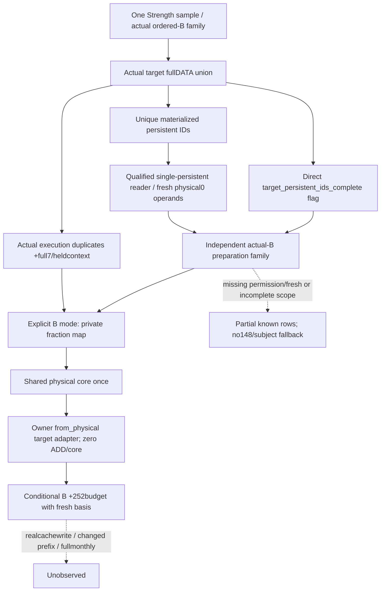

# Actual ordered-B scope fixed-chunk0 preparation inputs, CK3 1.20.0.3

2026-10-06 /2026-W41. Root read and approved the [source-first actual-scope plan](army-ordered-besieging-fresh-preparation-scope-plan-12003.md) once before implementation. This construction starts in a new exclusive C sparse tree from Root `d0e59d9277da0123965800d66c3eff9ea23bb1eb`, which includes the frozen actual-B scope and approved source topic. The earlier old-base cherry-pick conflict was aborted before any implementation; no owner candidate or old tree changed.

Exact1.20.0.3/Steam25652598/EXE SHA `94b55397abb687a3dcd436805a5d885e6be90fa6c693feb44a9e3bbeeade02a6` and [qualified preparation reads](army-fixed-chunk0-preparation-inputs-12003.md) are reused. **No new EXE read/ABI research** is needed. Core owner has sealed FIRST7 actual observed-B service wires and separately owns the next target-ID coverage flag and precomputed physical adapter.

## Source inputs and ownership before counter implementation

The native sampler first captures actual `ordered_besieging_refill_inputs_v1`: target ArRg refresh membership across CArmy receivers, full DATA dependency union, unique materialized persistent IDs and separate manager30/3C execution duplicates. The new collector receives that same object in the same Strength owning-thread sample. It enumerates `persistent_regiments[*].persistent_regiment_id`, never subject Army DATA or another query.

The existing single-persistent preparation reader resolves actual full generation, reads containing Regi+138/definition+118→magic+38, calls read-only262C700(Regi, Regi+18) and262CAD0(Regi,out). A thin exported wrapper reuses that qualified body. It does not call writer262C6A0, observe old148 as fresh or substitute the raw physical chunk owner guard. Per-row DTO/schema and source-defined conditional family computation are shared.

Core owner adds **`target_persistent_ids_complete`** directly while building the real target DATA union, independently of later physical-context read failures. True means complete actual refresh membership and all demanded target DATA IDs are known; false means known incomplete scope. Empty complete nonrefresh/Character1/1 scope is true and has no fresh getter calls. Existing current observed-B qualification stays separate. Owner also exposes `project_ordered_refill_besieging_assault_from_physical_v1(row,stage)`; it runs no physical core or ADD.

## Native and Python contract

Optional Strength leaf `ordered_besieging_fixed_chunk0_preparation_inputs_v1` declares source `native_ordered_besieging_fixed_chunk0_preparation_inputs`, `entry_kind=current_frozen_context_preparation` and `scope_kind=actual_ordered_besieging_target_physical_union`. It carries subject Army/CArmy/province IDs, independent `source_scope_status`, authoritative `target_persistent_ids_complete`, its own read status/ready/reason and existing four-operand per-persistent rows. Old absence stays None. Valid raw0/negative, nativefalse, failed getter and unresolved receiver are distinct.

Conditional family readiness depends on actual coverage and demanded branch operands. Ordinary guard bypass takes fresh directly; the permission path takes legal0 for knownfalse and fresh for knowntrue; missing demanded permission/fresh stays unavailable. Current-input availability and conditional readiness remain independent. Partial scope can retain known real rows and fractions without becoming full fresh-B coverage.

## Explicit entry and one core

Service/MCP `ordered_besieging_entry_mode=observed_prepared|fixed_chunk0_prepare` defaults to observed mode. It is separate from the requested scoped-core parameter. Explicit fresh mode joins actual B union IDs to the new family, replaces only private prepared fractions, invokes the shared physical core **once**, then passes that result to the owner's zero-core target adapter. Native query/revision and observed DATA/148 remain unchanged. The adapter retains real target refresh order, flags0 B deltas and252budget arithmetic; this owner copies none of those algorithms.

The selected B output has a distinct fresh input/projection/context basis and a preparation join ledger. Independent subject scoped/land/monthly/preparation outputs keep their bases. Missing coverage or demanded preparation cannot borrow observed148 or subject-only inputs. Known fractions/physical rows remain visible while unproven full B/assault totals remain unavailable. Actual cachewrite/after-state/preparation execution, full manager/regular/daily-assault/monthly and live remain false.

## FIRST registered-MCP qualification and current boundary

Owner flag/adapter `8ff5108418414935e0b4b68d99255dd2849bea02` was adopted before this FIRST; Root adopted it as `7aa67b16`. One new production MCP compound exercised eight unique cases through the actual registered `ck3_query_army_strengths` schema, dispatch, service, strict contract, shared preparation projection, one selected physical core and owner target adapter. The cases cover target IDs absent from subject DATA, source-based zero/negative, demanded missing permission/family, knownfalse-unusedfresh, retained known scalars with incomplete target DATA and complete empty scope. The selected core is called once; the B adapter calls no core/ADD. Source objects, observed148/native current values and independent requested subject projections remain unchanged.

FIRST01 at **2026-10-06 14:26:07–14:26:11 +08** passed five cases before a **harness RED**: case6 declared DATA count3 while providing only2 stored rows. The existing production contract correctly rejected that malformed fixture. The first receipt and outputs remain at `first01/FIRST-COMPOUND-RECEIPT.json` / `first01/production-output.json` (output SHA `28509c9d85f6096006aa98185dbeb3968620831385720c2de39fa150525113c0`). The necessary fixture correction supplies the real producer's unavailable raw-ID row, with persistentID−1, matching count3/rows3. No production behavior changed for this correction.

FIRST02 at **2026-10-06 14:34:38–14:34:41 +08** dispatched only the failed case6 and previously unexecuted7/8: **GREEN3/3**, unittest1 in0.936s, process2.8395601s. The five successful production outputs were reused without dispatch or physical-core execution. Combined qualification is **eight unique successful cases**, with the FIRST harness failure preserved. Receipt `first02/FAILED-REMAINING-RECEIPT.json`; combined output SHA `c34002b69afefa070f4afe96595b3b83b0015377fbbe617f6a4c7b4dad90ffe9`.

The independent target fresh10000 with observed148=0 produces ordered physical80→90→100, target ArRg160→200, B640→800 and252 expectedloss64→80. Complete target-ID coverage staystrue when later physical context ispartial and legalfresh0 makes that context unused. Genuine incomplete target DATA keeps known fresh10000/physical results but publishes no full B/assault totals. Missing demanded permission cannot borrow positive observed148 or the separate requested-subject preparation family. Knownfalse-unusedfresh and signednegative remain source-defined ready values with no ADD.

This is **limited static-ready for the explicit frozen-context Python composition**. The new native collector/serializer and seven actual producer fixture cases are prepared and **unqualified** pending Root's next formal native batch. Root's current g93 daily-loss target is independent and gives this package no native credit. The unique recipe is `native-fixture/root-native-target-recipe.md`; exact seven filenames are listed there. Prepared `native-fixture/consumer_once.py` will consume only those new compiled wires through the production Root source and registered MCP after Root authorizes the batch. It uses actual full public ArmyID67108875 and binds the immutable native source SHA. Serializer projection JSON/literal CPP are metadata, not wires.

Packet `Z:/ck3_mod_rewrite_process_assets/g2-background-round18-20261006/fresh-ordered-b-preparation/` retains both attempts, recipe and Oct6/W41 fields. This owner ran no native build/CTest, old test/wire or new EXE read. Local CK3/Steam/process/SDK game/pipe/UI operations remain0. Actual cachewrite, actual prepare/after-stage execution, changed prefix/context, full regular/manager/monthly/daily-assault and production-live are not qualified by this package.
