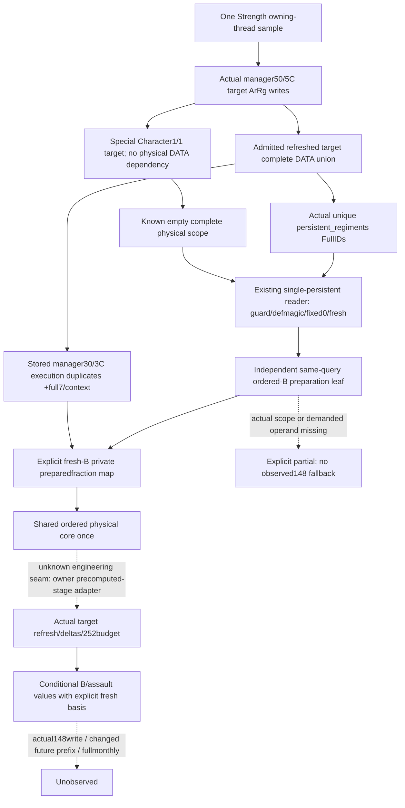

# Fresh fixed-chunk0 preparation for the actual ordered-B target scope

2026-10-06 / 2026-W41. This is a source-first observation and composition plan. It changes no collector/provider/readiness or native algorithm. Published source baseline: `12fdc06f3ebcb135ab7bea04f5812cfa1ab84bca`. Exact CK3 1.20.0.3 / Steam25652598 / EXE SHA-256 `94b55397abb687a3dcd436805a5d885e6be90fa6c693feb44a9e3bbeeade02a6` and already-closed native bytes are reused; **0 new EXE bytes**.

[Current preparation operands](army-fixed-chunk0-preparation-inputs-12003.md), [explicit requested scoped-core entry](army-explicit-preparation-scoped-core-assembly-12003.md), [ordered native refill tree](army-ordered-regular-refill-projection-plan-12003.md) and [province besieging-current source](army-province-besieging-current-12003.md) are the existing source ledger. The prior FIRST qualifications remain separate and are not repeated.

## The concrete missing observation domain

The existing `fixed_chunk0_preparation_inputs_v1` reader enumerates unique persistent FullIDs only from the requested subject Army's complete DATA. Ordered-B's actual target domain is wider: the core owner's `ArmyOrderedBesiegingRefillInputsV1` follows actual manager50/5C target ArRg writes across CArmy receivers, including native fallback and shared targets. Complete target DATA can reference a persistent absent from the requested Army's DATA. Supplying the subject leaf cannot make that demanded fresh-B fraction ready.

Core-owner source metadata identifies the actual union as `ordered_besieging_refill_inputs_v1.persistent_regiments[*].persistent_regiment_id`. These are unique physical IDs; `persistent_occurrences` separately retains every matched manager30/3C execution duplicate. The special2633340 Character1/1 target path skips the physical DATA dependency; a complete empty physical union is a legitimate value. This package neither deduplicates execution occurrences nor manufactures subject DATA to enter another reader.

The owner is delivering the observed-prepared ordered-B package independently. Its qualification is not blocked by this fresh-input extension. Positive frozen candidate: `9520af202b94f47945eef1a6db67f4c75d9ab06e`, clean `C:/codex-ck3-background/ordered-refill-next-source`. Current API: `project_ordered_refill_besieging_assault_v1(row)` in `army_ordered_refill_besieging_assault_projection.py`, which owns one shared physical-core call followed by actual target refresh/deltas/252budget. The current function does not yet accept a precomputed physical stage.

The exact header `army_ordered_besieging_refill_inputs_v1.hpp` publishes subject Army/CArmy IDs, `province_id`, `refresh_membership_ready`, optional `native_persistent_occurrence_count` / `native_army_refresh_occurrence_count`, `target_army_regiment_ids`, `persistent_occurrences`, `persistent_regiments` and `refresh_occurrences`. The same-query native hook is immediately after `scoped_ordered_refill_inputs_v1` in `ck3_12002_army.cpp`, using the already captured `current_province_besieging_contributors_v1` and the same army/unit receivers. The proposed fresh leaf hooks after this actual B family, rather than rescanning subject DATA.

Direct cached construction in `ck3_12003_ordered_besieging_refill_inputs.cpp` proves the edges: lines53–60 select qualified admitted-B target ArRg; lines65–98 resolve actual manager50/5C receivers/fallback and retain refresh occurrences; lines100–110 collect target DATA persistent IDs only for actually refreshed targets and skip the special Character1/1 path; lines112–118 retain matched manager30/3C duplicates; lines119–123 materialize the unique physical rows. No raw EXE capture was needed.

## Reuse the actual single-persistent preparation reader

Published native `ck3_12003_fixed_chunk0_preparation.cpp` contains anonymous-namespace `ReadPersistent(const ArmyBindings&, int32_t id)`. Its actual receiver resolution and read sequence are already qualified:

| Real input | Existing source/read |
| --- | --- |
| Persistent receiver identity | Existing full-generation persistent registry resolver; actual Regi FullID/magic. |
| Containing guard | Containing Regi+138 DWORD; not a physical chunk's resolved raw owner guard. |
| Definition magic | Regi+118 definition pointer, then DWORD+38. |
| Fixed-chunk0 permission | Read-only262C700(Regi, Regi+18), independent of DATA-selected ordinal. |
| Fresh fraction | Read-only262CAD0(Regi,out), signed raw fraction with scale100000. |

Expose a thin public `ReadFixedChunk0PreparationPersistentInput12003(bindings,id)` wrapper around that exact helper. The new actual-scope collector invokes it for the already materialized ordered-B unique IDs during the same Strength owning-thread sample. The existing subject-DATA collector remains unchanged in domain and meaning. Never call262C6A0: its source branch writes prepared148. No native pointer body/ABI needs to be read again.

## Proposed same-query contract and owned hooks

Add an independent optional `ordered_besieging_fixed_chunk0_preparation_inputs_v1` Strength leaf. It declares source/scope as the actual ordered-B target physical union, retains the actual subject Army/CArmy identity and upstream scope completeness, and publishes existing per-persistent preparation rows. Per-persistent DTO/serializer value semantics can be reused; a new family must not claim the current subject-DATA scope. Older wires keep this optional leaf absent/None.

The native function receives the actual `ArmyOrderedBesiegingRefillInputsV1` already captured in that sampler, enumerates `persistent_regiments` directly, and appends real operand reads. No second query, fabricated `ArmyStrengthSnapshot`, implicit current-DATA substitution or observed148 fallback is allowed by the source contract. Complete empty scope produces an available empty set; unresolved/partial scope and each demanded missing operand remain distinguishable from legal0.

There is one exact completeness distinction in the frozen producer: `refresh_membership_ready` proves receiver traversal, not complete target DATA union. Missing DATA/invalid persistent IDs at lines103/106/108 and failed physical context at lines121/122 all share the producer's `partial` status. Thus **available upstream proves complete union; partial alone does not say whether union IDs are complete**. The new leaf can publish known real operand rows for partial input while recording `source_scope_status=partial` and `target_persistent_ids_complete=None`; it must not turn that frame into a known empty union or infer completeness from membership alone. These are partial-frame limits, not permanently null operands.

If exact partial-frame scope readiness is needed, the smallest further producer seam is `target_persistent_ids_complete` recorded during the owner's existing target DATA loop, before physical-context reads. That is a separate direct source result, not another scan or duplicated union algorithm. The owner confirmed this distinction and keeps its current candidate frozen for independent qualification. Root can approve that field in the later fresh package; this plan does not modify the owner's core/B files or delay the current batch.

The existing preparation branch projector should expose a direct row/family pure entry, so the new family can reuse the source-defined guard/permission calculation without being relabelled as a subject Army or copying the branch. Known permissionfalse yields0 even if unused fresh is unavailable. Permissiontrue and ordinary bypass demand fresh under their actual branches; signed0/negative are retained. Read availability remains separate from branch-specific conditional readiness.

## Explicit B entry and one physical execution

Fresh-B must be an explicitly named model entry. The existing `ordered_refill_entry_mode` selects only the requested scoped-core output; B/land/monthly source bases remain independent. Proposed separate `ordered_besieging_entry_mode=observed_prepared|fixed_chunk0_prepare` defaults to the observed path, preserving the existing parameter's meaning. Root will decide this API during the source-plan review.

The fresh assembly joins actual B union IDs to the new same-query preparation family, replaces only private prepared scalars, and calls the shared ordered physical core once. The B owner exposes a minimal target-refresh adapter consuming that precomputed stage; it does not execute a second q-buffer/ADD loop. Actual target ArRg DATA refresh, old/new current contributions and252budget remain the owner's existing algorithms. This package owns the new scope collector/contract/assembly files and small hooks after review; it does not edit the owner's core/B modules.

Construction ownership proposed for the one Root review:

- This owner: new `ck3_12003_ordered_besieging_fixed_chunk0_preparation.cpp`/header, independent family DTO/serializer and strict optional Python contract; a thin export in the existing preparation reader/header; direct pure preparation entry and owned fresh-B assembly; minimal post-B Strength hook and service/MCP mode wiring.
- Core owner: minimal `from_physical` target adapter extraction. If Root approves partial-frame exact ID completeness, its own existing target DATA loop produces that separate flag; current frozen candidate is not modified in this source package.
- Root: serial shared-header/sampler integration, CMake/known native-route TU wiring, one necessary fresh-scope fixture/first compiled qualification and shared publication. Existing qualifications/fixtures are reused, not rerun for this plan.
- New required validation after implementation: one production contract/service/MCP compound whose actual B union includes a persistent absent from subject DATA, proving the fresh row reaches the real target refresh/B/budget consumer with one physical call. Native wire qualification waits for Root. No tests run during this source-only plan.

## Readiness and next construction

This plan is **research/source-ready**, not a new observer or fresh-B capability. Existing observed-prepared B and explicit subject scoped-core qualifications remain valid independently. Fresh-B stays unready for an occurrence lacking actual same-query target preparation rows. Metadata alone does not complete this package: the next approved implementation must read real operands and feed the actual target numeric consumer.

Source plan packet: `Z:/ck3_mod_rewrite_process_assets/g2-background-round17-20261006/fresh-ordered-b-preparation-scope/`. Root reviews the concrete scope/contract/API once before implementation, owns native CMake/build/CTest/CI/shared Oct6/W41 reports and publication. This source-only step performs **0 tests/old cases/wires, native builds, EXE byte reads or local CK3/Steam/process/SDK/pipe/UI operations**. Actual cachewrite, changed prefix, full manager/regular/monthly and live remain unclaimed.
