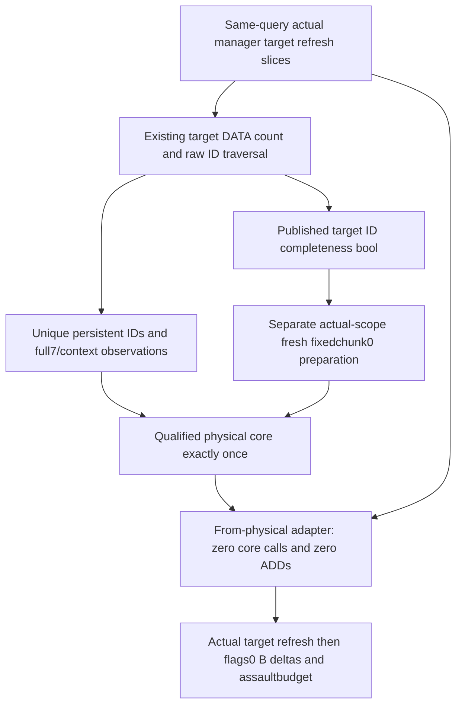

# Ordered target dependency completeness and physical stage adapter — 1.20.0.3

2026-10-06 / W41. This is a separate additive implementation after the FIRST seven [ordered B service](army-ordered-refill-besieging-assault-composition-12003.md) compiled wires were qualified on immutable `ae7819df81a6511c70a58ba371f1e99a636f2dde`. Root authorized this minimal entrance for [actual-target fresh preparation](army-ordered-besieging-fresh-preparation-scope-plan-12003.md); the fresh observer and assembly are owned separately. Native source closure and exact1.20.0.3 / Steam25652598 / SHA `94b55397abb687a3dcd436805a5d885e6be90fa6c693feb44a9e3bbeeade02a6` are reused without EXE/body/hash reads. The implementation plan is round18 `ordered-besieging-physical-stage/IMPLEMENTATION-FIRST-PLAN.md`.

`ordered_besieging_refill_inputs_v1.target_persistent_ids_complete` is a real native bool. It defaults false; the existing actual-target DATA loop proves true only after complete refresh membership and captured B target coverage, known ordinary/special branch selection, complete native DATA count/occurrence coverage and published noninvalid raw persistent IDs. Special Character1/1 consumes no DATA; known nonrefresh and complete empty DATA consume no persistent IDs, so a proven empty union is true. Missing membership, required DATA/header/ID or omitted required published ID coverage is false. There is no second traversal or capture.

The flag is determined before full7/predicate/cleanup context reads. DATA `partial` may still contain every raw record ID: the existing record collector reads each raw ID before per-record physical validation and emits one row per original native count. Count/row-index/raw-ID coverage, rather than DATA `available` or each record's numeric readiness, therefore proves the union. Later prepared148/full7/context failures do not retract true ID completeness. If the persistent occurrence roster read fails before a nonempty union can be published as `persistent_regiments`, the flag is false; a genuine empty union remains known. The field does not prove ordered physical, refresh, B or preparation readiness.

The new serializer always emits bool. The strict Python normalizer rejects a present nonbool field. The first qualified v1 producer lacked this additive field; an old leaf remains accepted with normalized `None`, explicitly unproven completeness. Existing observed-prepared behavior remains independent. Fresh target preparation must use only the actual `persistent_regiments[*].persistent_regiment_id` union from this same row and distinguish true, false and legacy unproven coverage.

`project_ordered_refill_besieging_assault_from_physical_v1(row, physical_projection)` consumes the final physical stage produced by the qualified core. The stage supplies `physical_chunks`, `ordered_core_ready`, `missing_inputs`, `input_basis` and `context_basis`. It calls no physical core and performs zero ADDs. It overlays available or unavailable final slots once, refreshes only actual manager-selected target ArRg occurrences, then applies the same original flags0 whole-current/wrap32 deltas and `25205C0` arithmetic. Repeated target refreshes update the final identity map; original B/ArRg/Province repetitions still contribute their correct repeated deltas. Captured native B/assault values remain independent.

The adapter returns `physical_core_invocations=0` and `refill_ADDs_in_adapter=0`; its `physical_input_basis` and `context_basis` copy the supplied stage. Its composed `input_basis` includes that stage basis plus actual target refresh and held nonphysical B context. Fresh assembly owns its one core call and may report total invocation1 itself. The default `project_ordered_refill_besieging_assault_v1` computes the observed-prepared physical stage exactly once and calls this adapter, retaining its existing observed input basis and invocation count. No q-buffer, ADD, cleanup, refresh or budget algorithm is duplicated.

This additive field/API candidate has no separate test/build/wire execution. First verification belongs to the fresh-B owner's new compound and Root's next new native input batch, with old qualified cases/wires left untouched. Qualification of the preceding g92 observed package does not qualify this new field/API. Actual after/cache writes, complete manager, full daily assault/monthly and live remain false. Local CK3/Steam/process/SDK/UI/pipe/profile/workshop operations are zero.
