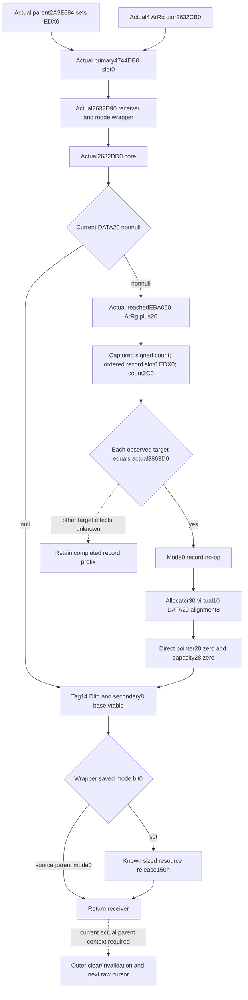

# Ordered detachment callback source — actual CK3 1.20.0.4

Root's exact pin is CK3 **1.20.0.4**, Steam **25734779**, EXE SHA-256
`98702f88a547cde2eaf29a85f93b85f68ee4cf8148336a4f7afaeb75319dd518`.
This October7/W41 work uses source `23c3c4bc7fdf261f46174d35db12732808523463`.
The callback is needed between the known detachment prefix and the ordered
next ArRg visit; it is never installed or invoked as a readonly getter.

Root approved a finite maximum377B/four reads. Actual fresh cost is exactly
**377B/four reads**: actual4 constructor209B, wrapper52B, one primary-slot
QWORD8B and directly reached core108B. Old constructor/wrapper caches were
reused. New metadata, old EXE bytes, hashes, whole scans, builds, tests,
native invocations and game operations are zero.

| Exact source | Proven direct role |
| --- | --- |
| `2632CB0..2632D81`, 209B | Complete constructor with ArRg magic `41725267` at14, primary vtable `4744DB0` at0 and secondary `4744DE8` at8. Actual non-RIP offsets/literals and control topology match the held old constructor; the new RIP targets are recorded explicitly. |
| `4744DB0[0]`, 8B | Sole actual primary slot selects actual wrapper `2632D90`. No adjacent slot was read. |
| `2632D90..2632DC4`, 52B | Preserves original receiver and incoming EDX mode. Unconditionally calls actual `2632DD0`; afterward modebit0 conditionally calls the known sized resource-release role with original receiver and size150h. Normal return yields original receiver. |
| `2632DD0..2632E3C`, 108B | Complete direct core. Rewrites primary/secondary vtables. Reads DATA pointer20; nonnull selects exact `EBA050(&ArRg20)`, then allocator30 virtual10 with `(allocator, DATA20, 8)`. On those ordinary returns writes pointer20=0, DWORD28=0. Both arms finally write14=`446C7464` and secondary8=`4744DF8`. |

The core does not directly write DATA count2C, physical Regi chunks,
Army association140 or Character148. This is a direct-instruction finding,
not a claim about the selected `EBA050` record callbacks. The nonnull path
uses the current allocator30 and rereads DATA20 after the cleanup returns.
The null path skips both selected calls and does not clear DWORD28.

The old complete93B `EBA050` cleanup is held at
`g2-background-round4-20261005/monthly-caller-effects/queue-consumer-source/first-removal-stage-ledger/later-manager-removal-stage/post-group-stage/`.
Its ordinary source loop captures signed vector+C count once; positive count
captures DATA pointer and dispatches stride16 records through each actual
slot0 with EDX0, then writes count0. Nonpositive count skips records and also
writes count0. This historical source supplied the complete cache for the
separate approved actual4 mapping below. No callee was expanded under the
first377B plan.

Root subsequently approved only this actually selected helper's complete93B
mapping. The actual4 **`EBA050..EBA0AD`** maps completely to the cached old93B
source: every instruction, ordinary branch topology and non-RIP member/literal
operand matches. One fresh actual4 read consumed93B; no old EXE, metadata,
hash, neighboring helper or record-target body was read. The total intentional
source cost at this milestone was **470B/five reads** (377+93).

This closes the current DATA cleanup's direct algorithm: header+C signedcount
is captured once; count>0 captures the buffer once and dispatches each original
stride16 record through its current actual slot0 with EDX0, then writes count0.
Count<=0 skips every record callback and writes count0 directly. The loop does
not clamp a negative input, infer a RegiID from a vtable, or reread count after
each callback. A DATA20 null arm in the surrounding core never calls this
helper, so its count2C/capacity28 remain unchanged through that skipped leg.

The already held actual4 `8863D0..8863F1` source provides a selected-target
replacement: it tests incoming DL bit0, and EDX0 branches over its only sized
resource call. This mode0 arm performs no object/game-field reads or writes and
returns the original record pointer. Therefore a current observed record whose
actual slot0 equals that exact bound target has a complete no-op record effect;
the source does not require a guessed canonical vtable when the actual target
already supplies identity. Another actual target remains a concrete dependency
for that record, without discarding preceding independently closed effects.

Root next approved the exact parent caller window only. Actual4
**`2A9E684..2A9E697`**,19B, completely maps to cached old
`2A9E6A4..2A9E6B7`: it sets EDX0, stores the registry4A state, selects RCX=R14,
loads that receiver's primary vtable and calls its slot0 at`2A9E695` without
an intervening EDX change. The selected wrapper mode is therefore source-proven
**0**; its modebit0 sized full-object release is skipped in this role. This is
a source argument, not a runtime execution observation. The complete outer
admission/invalidation method remains a separate approved follow-on. Total
intentional actual4 source cost is **489B/six reads** (377+93+19); old EXE
bytes/new metadata/hashes remain zero for these selected operations.

The independently authored production leaf captures the current ArRg primary/slot0, DATA20,
signedcount2C, capacity28, allocator30/virtual10 and positive-count actual record
targets from the existing same-query incoming DATA seed. It must preserve
incoming aliases and original record order. The conditional core projection
can then carry a ready no-op callback sequence and the source-defined header
writes under an explicit normal resource-return premise. This is not native
execution or an observed after-state. Whole outer admission,
invalidation, future parent/date replay and nonnull Character suffix are
still separate source dependencies.

The five new files expose optional raw family
`current_detachment_callback_inputs_v1`, strict API
`normalize_current_detachment_callback_inputs_v1` and pure API
`project_current_detachment_callback_inputs_v1`; the Service sibling projection
is `conditional_current_detachment_callback_v1`. The new exact4 binding carries
only the proven primary/wrapper/core/record-mode0/base-secondary targets and
`source_parent_wrapper_mode_i32=0`. Native input capture deduplicates physical
ArRg pointers while retaining every original seed occurrence index; each
positive DATA record preserves its native index and actual selected slot0.
Full signed64 current date is copied from the existing query seed, with no
calendar extrapolation or reread. Null DATA skips record/allocator capture and
does not require unused count/capacity context; nonpositive signed count skips
records and permits the helper's zero write. Another actual target retains the
closed record prefix and independent incoming results. The collector never
invokes a native method or mutates the game.

The pure after-header is conditional on ordinary resource return; allocator
internals are explicitly unmodeled. The six actual wire flags
`actual_callback_observed`, `actual_resource_return_observed`,
`actual_after_state_observed`, `full_detachment_transition_ready`,
`full_daily_ready` and `full_monthly_ready` remain false. The independent leaf
does not change baseline current DATA or Army/global readiness, and is not a
new prerequisite for the existing one-day OODA. State is **AUTHORED_NOTRUN**:
no native build, import, test, whole-reader qualification, SDK or game operation
has been run for the new callback leaf. Root owns shared hooks and first
qualification. The exact hook recipes are external
`next-callback-source/SHARED-HOOK-RECIPE.md` and
`next-callback-python/ROOT-HOOK-RECIPE.json`.

This is **research / direct-source closure with AUTHORED_NOTRUN input leaf**.
Actual4 whole parent admission/invalidation and changed roster continuation
remain separate. Native
source readiness does not grant a fixture, paused sample, next-date transition
or full daily/monthly loop. The independently implemented all30-phase supply
schedule in [the value-gap topic](army-future-date-value-gaps-12004.md) provides
date-selection input without waiting for complete detach replay.

Receipts: external `army-future-dates-12004/callback-map01/FAMILY-MAP.json`,
the two complete instruction details, and
`callback-map02/SELECTED-CORE-CAPTURE.json` / `SELECTED-CORE-108B.txt`.
The separately approved complete helper mapping is
`callback-map03/FAMILY-MAP.json`; source mode0 is
`callback-map04/FAMILY-MAP.json`.
Each records actual caches, exact edges and fresh-read accounting. No failed
capture or new capability RED occurred.
