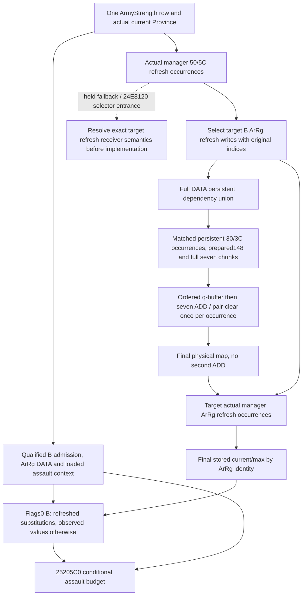

# Ordered observed-prepared refill to besieging current and assault budget — 1.20.0.3

2026-10-06 / W41. This is an independent source and implementation plan, frozen after the first five compiled [scoped ordered core](army-ordered-regular-refill-projection-plan-12003.md) wires passed against immutable `62f3965520c3d849ceabea624f3979cbf032eed0`. Exact build remains CK3 1.20.0.3 / Steam25652598 / held EXE SHA `94b55397abb687a3dcd436805a5d885e6be90fa6c693feb44a9e3bbeeade02a6`. No EXE bytes, new tests, build, old wire or live game were consumed for this plan. Implementation and native qualification of the new join are pending Root review.

The next useful value carries ordered `[A,A]` physical refill into the current Province's flags-0 B and `25205C0` assault budget. The existing core makes physical `80→90→100` available, while selected-once leaves `90`. With two DATA aliases, a repeated Province contributor and the loaded casualty percentage, this difference must survive into B and its budget without another refill ADD.

## Reused source and first-qualified components

- [Actual manager order and preparation](army-monthly-manager-prepared-stage-inputs-12003.md): primary GameData+2A540 persistent+30/+3C occurrences are processed in original order, retaining duplicates. Only after all physical writes does its CArmy+50/+5C roster invoke `24E8120`, which refreshes the CArmy+38/+44 ArRg occurrences through `2633340`.
- [Observed-prepared ordered core](army-ordered-regular-refill-projection-plan-12003.md): actual prepared+148, full seven chunks, raw q ordinal, full q-buffer before ADD, zero-q AL distinction, signed wrap32 ADD and conditional pair-clear are implemented and first-qualified. The nonphysical Army/Unit/Province/Character/native-permission context is explicitly held from the same capture. Preparation is not replayed.
- [Province B and assault](army-province-besieging-current-12003.md): the current-Province observer captures original flags-0 admitted CUnit/CArmy/ArRg occurrences, observed whole-current EAX, complete ArRg DATA and actual breach/table context. `247F1D0` preserves repeated contributions and signed wrap32; `25205C0` consumes B with its closed fixed arithmetic and short-circuit branches.

The plan packet is `Z:/ck3_mod_rewrite_process_assets/g2-background-round16-20261006/ordered-core-assault-join/`. Its `SOURCE-FIRST-PLAN.md` preceded the narrow implementation-interface reads. Round13 source and round15 qualification receipts are reused; no closed native body was read again.

## Existing interfaces and the actual missing join

`ReadScopedOrderedRefillInputs12003` in `ck3_12003_scoped_ordered_refill_core.cpp:114` derives a unique persistent-ID scope from the requested subject Army DATA, then records matched persistent+30/+3C occurrences and only the subject CArmy's raw matching +50/+5C indices. It materializes actual prepared148 and seven mutable physical slots for that scope. It does not publish all current-Province B dependencies or each contributing Army's actual refresh membership.

`ReadCurrentProvinceBesiegingContributors12003` in `ck3_12003_current_province_besieging_contributors.cpp:108` supplies the independent B row family. Each admitted occurrence carries its native resolved CArmy, observed `2A95740(Army+38,flags0)` EAX and original ArRg list; valid ArRg rows carry observed current/max and full DATA. Unit+20 is the source-defined Province pointer with native null fallback. No manager refresh roster is present in this family.

`project_post_refill_besieging_current_v1(army, selected_physical_chunks=...)` already accepts final physical values and executes zero ADDs. Its overlay requires `status=available` for known current/max. Its present reducer refreshes every admitted ArRg from DATA. Passing ordered physical values directly to that reducer would therefore recount a known nonrefreshed ArRg, which is a conditional DATA-count projection rather than the actual manager refresh order.

The new entry must distinguish a true empty manager refresh membership from failed observation. An ArRg refreshed elsewhere in the manager roster has a shared stored current/max identity; its contribution cannot be declared unchanged merely because its own admitted CArmy has no raw matching manager ID. The observer will select actual manager refresh writes by target ArRg identity and retain their original CArmy and ArRg occurrence indices. The exact fallback receiver and `24E8120` traversal instructions are a narrow held-source entrance to resolve before implementing that selector; no full roster uniqueness assumption is introduced.

## Minimum same-query readonly inputs

Use a separate additive family, provisionally `ordered_besieging_refill_inputs_v1`, on the existing ArmyStrength row. Retain the existing core and B families unchanged. The family contains real values that determine physical and stored-count changes; it is not a new MCP command or metadata-only status.

| Published input | Source and numeric use |
| --- | --- |
| Same subject Army/CArmy and actual Province IDs | Existing same-query resolved context; join only within this returned row, with the captured B family. |
| Original persistent manager count and selected persistent occurrence pairs | Primary+30/+3C, original `stored_index/fullID`, retaining `[A,A]`. These drive sequential q recalculation. |
| Unique relevant persistent objects | Reuse `ArmyOrderedRefillPersistentV1`: actual prepared148, complete seven chunks and source-closed dynamic-predicate/cleanup context. The relevant physical scope is full DATA of admitted B ArRg identities that receive an actual captured manager refresh. |
| Original Army refresh manager count and actual target refresh occurrence slices | Primary+50/+5C plus actual resolved/fallback CArmy's original +38/+44 list. Retain manager index, raw/resolved CArmy identity, fallback basis and matched target ArRg `stored_index/fullID` occurrences. Complete traversal proves known empty target membership. |
| Target ArRg DATA and current/max | Reuse the qualified B family's valid original ArRg rows. No second independently captured query or commander substitution. |
| Actual B admission, whole-current baseline and breach/table context | Reuse the same row's qualified B family. No new native eligibility calculation on imagined post-state. |

First determine the target refresh write set from the actual manager roster. Materialize full DATA physical dependencies only for target admitted B ArRg that actually refresh. A known nonrefreshed contributor can keep its observed flags-0 current even if unused DATA is absent. The full seven physical chunks remain necessary for each selected persistent: an unreferenced slot can overwrite a raw q ordinal or cause AL=true and therefore alter a referenced slot.

Other persistent manager occurrences cannot write a selected persistent's inline physical slots: each occurrence zeros its q buffer, reads its own seven chunks, then updates those same seven inline max/current pairs. Its raw-owner context reads nonphysical Province/guard/definition inputs, and the prepared148 input is already observed. Excluding persistents outside the target DATA dependency set is valid for this stated observed-prepared, fixed-context physical scope. This is not proof that preparation or every manager stage has been replayed.

## Pure entrance and calculation order

Prefer a small pure physical entrance `project_observed_prepared_ordered_physical_core_v1(inputs)` factored from the already-qualified core loop, leaving its predicate, q primitive, q-buffer collision/AL and ADD/clear semantics unchanged. The present subject query continues to call that entrance and its own subject refresh stage. A new owned `army_ordered_refill_besieging_assault_projection.py` joins the new scope with the B family; it does not fabricate a synthetic zero-Regiment Army row to invoke the old wrapper.

1. Run the ordered physical core once for the relevant B DATA dependencies. Repeated persistent occurrences use the mutable result of the previous occurrence. Final physical identity is `(containing persistent ID, physical index)`; q ordinal remains a separate raw operand.
2. Adapt each complete known final physical row to the existing overlay shape with explicit `status=available`. For any failed modeled persistent, emit unavailable overlay entries for its required DATA identities; do not use observed current as a substitute. This adapter executes zero ADDs.
3. Traverse captured actual manager refresh occurrences after the entire physical pass. For each target ArRg occurrence, call the qualified `project_observed_raised_regiment_refresh` with the final physical map and full DATA. Keep its special-Character branch and DATA aliases. Store current/max by ArRg identity; repeated refreshes remain visible in receipts and the final write wins.
4. Reduce B in original Province occurrence order. For a target refreshed ArRg, substitute its new stored current for each flags-0 ArRg occurrence; for a known nonrefreshed ArRg, retain the captured stored value. Preserve both ArRg and Province repeats. An efficient equivalent uses the real observed Army whole-current baseline plus wrap32 deltas for changed ArRg occurrences, avoiding a guessed reconstruction of unrelated unchanged rows.
5. Feed the resulting signed B into the held `25205C0` pure arithmetic with the same captured actual Siege/breach/loaded percentage. Keep independent current native B and native assault expectation visible if the conditional join is partial.

## Delivery and first-verification boundary

Planned returned field: `same_input_conditional_ordered_refill_besieging_assault_v1`. Its input basis names observed prepared148, actual captured manager occurrence order, captured nonphysical context and actual refresh selection. It reports scoped physical readiness, refresh readiness, conditional B and conditional assault budget separately. Actual post-state, loss/effects, fresh preparation, full manager, full daily assault and full monthly remain false.

New owned files are a readonly `ck3_12003_ordered_besieging_refill_inputs` collector/header, independent DTO/inline serializer, `army_ordered_besieging_refill_contract.py`, the composition helper above, and `test_ordered_refill_besieging_assault_service.py`. Minimal future shared hooks attach the actual readonly family after same-query B capture, normalize the optional leaf and add the derived service result. The pure physical entrance is a focused extraction from the qualified loop; the old subject wrapper keeps its current query and refresh behavior. Root owns CMake/CI TU registration and the native fixture batch. Existing B/core/native candidates remain frozen during this plan.

One new production service compound will traverse the real normalizer, query route, ordered physical core, actual refresh selector and B/assault reducer. Expected arithmetic is written outside the repository before that first run: repeated `[A,A]`, repeated DATA/Province contributions, actual-refresh versus known-nonmember, zero-q cleanup and nonpositive suppression, unavailable affected inputs versus independent current native B, and signed fixed primitive behavior. A new native fixture and recipe will exercise real same-query manager membership and physical scope. Root alone registers, builds and first-consumes compiled wires. Existing compounds, CTests and wires are not rerun.

Current readiness is `research / source-plan ready`; the new join is not implemented or qualified. Remaining implementation entrance is the actual manager refresh receiver/traversal selector, then readonly family, shared pure physical entrance, strict normalizer, zero-ADD adapter and service hook. There is no new local CK3/Steam/process/SDK/UI/pipe/live operation or full EXE audit.
