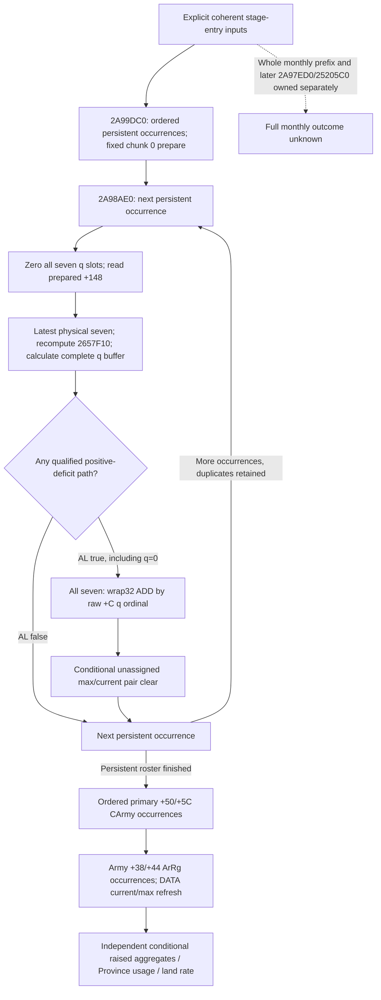

# Ordered regular refill: source and pure-model entrance (1.20.0.3)

This package plans the actual ordered regular-refill subpath. It adds no collector, schema, kernel or query field. The existing selected-once associated refill and current-Province full-rate composition remain independently qualified; their union of observed physical chunks does not replay the native manager order.

Readiness is **research**. The arithmetic, associated current/max refresh and full-land-rate components already have their own qualification. No complete ordered-manager input capture or ordered replay has been implemented or qualified here. Actual post-stage state, the whole monthly transition and production-live readiness remain unclaimed.

## Frozen source and ownership

- Exact build: CK3 1.20.0.3, Steam build 25652598, previously frozen executable SHA-256 `94b55397abb687a3dcd436805a5d885e6be90fa6c693feb44a9e3bbeeade02a6`. This package reuses that pin; it reads and hashes no executable bytes.
- Planning tree: `90a0b7d92e899c9bc8f68456b05bf612c2321aae`, containing the service composition based on published `16f8e01f22ca5221f9094e86aff1dc916783c7bb`.
- Source-first plan: `Z:/ck3_mod_rewrite_process_assets/g2-background-round14-20261006/ordered-regular-refill-pure-plan/SOURCE-FIRST-PLAN.md`, frozen before this topic.
- Manager/preparation source owner: the round-13 `monthly-manager-prepared-order` packet. Held source is `g2-resume-20261004/army-monthly-update-order-v61/source-clock-new-spans/army-pre-stage-entry.asm.txt` (`2A99DC0..2A9A35E`) and the `calendar-bit2-second-army-callee.asm.txt` plus continuation (`2A98AE0..2A98CA1`). This package consumes the owner's closed source summaries, without reopening the bodies.
- Reused predicate/prepare ABI: the ten-function closure recorded in [the replenishment topic](army-regiment-replenishment-raised-reserve-12003.md), including `262C6A0`, `262C700`, `262CAD0`, `262C9D0` and `2657F10`. Its held `native-abi.json` SHA-256 is `8b2848041af660d158ccea8fe51119d355d2f3a5785df9e3235357eb0c1f4fad`. The owner supplied the already-held 320-byte `2657F10` branch summary; no new disassembly was requested.
- Current/max refresh reuses [the source-closed `2633340` contract](army-attrition-soldier-writeback-12003.md). The owner of the outer monthly-manager path retains preparation context, `2A97ED0`, its additional assault-loss budget and `25205C0`. Those functions are outside this package.

## Native execution order

The primary manager is at GameData `+2A540`; the secondary receiver is primary `+8`, at GameData `+2A548`. Preparation's secondary `+28/+34` is the same stored persistent FullID occurrence roster as primary `+30/+3C`. It is an ordered DWORD roster, including repeated FullIDs.

1. `2A99DC0` visits that persistent roster in its stored order and prepares **physical chunk 0**, at persistent `+18`, through `262C6A0`. This is separate from the later selected DATA ordinal.
2. `2A98AE0` visits every occurrence of the same primary `+30/+3C` roster. Before each occurrence it zeros all seven q slots, reads the current prepared fraction at persistent `+148`, and invokes `262C9D0` against the latest physical seven-chunk state.
3. That callee finishes the entire seven-slot request calculation before the caller changes physical current. If AL is true, the caller traverses all seven physical chunks and applies their requests, then the next persistent occurrence sees those changes. AL false skips all physical ADD and pair-clear operations.
4. **Only after all persistent occurrences** does the caller traverse primary `+50/+5C`, the separate ordered CArmy FullID occurrence roster. For each CArmy, `24E8120` traverses Army `+38/+44` ArRg occurrences and calls `2633340` to refresh raised current/max.

Execution occurrence order and physical identity have different uses: retain every roster occurrence for execution and receipts; keep one mutable physical state per resolved persistent/chunk address so later occurrences see earlier writes. Deduplicating the execution roster changes the result. DATA aliases and repeated Province contribution occurrences still count separately in the subsequent aggregations.

## Preparation and request semantics

`262C6A0` always writes prepared `+148` on its ordinary return path. If persistent `+138 == 0` and definition `[persistent+118]+38 != 0x4744624F` (ObDG), it bypasses permission and writes the fresh `262CAD0` fraction. Otherwise it calls `262C700(persistent, persistent+18)` on fixed chunk 0: false writes zero; true writes the fresh fraction. Do not turn the raw ordinary guard into a zero-result condition, manually AND permission with `2657F10`, or substitute an arbitrary DATA chunk's permission.

For one core occurrence, F <= 0 yields AL false and no q-slot stores. For F > 0, each physical chunk is visited in physical order. A false `2657F10` result or nonpositive signed effective deficit skips the slot store, leaving the caller's prezeroed slot intact. A qualified positive-deficit path writes exactly the slot indexed by **chunk raw `+C`**, and sets AL true even if the integer request is zero or negative after native overflow.

The existing `same_input_chunk_q` primitive supplies the closed request arithmetic: effective current is maximum for state 3/current 0, otherwise current; scaled product retains signed64 wrapping; signed minimum and truncation toward zero retain the native q result, including signed32 wrapping. Reuse this primitive after recomputing inputs for each occurrence. Do not reuse the selected-once wrapper that caches one request per observed physical chunk.

The physical position, DATA-selected ordinal and raw q-buffer ordinal are separate observations. The seven-slot buffer is zeroed once per occurrence. If observed raw ordinals collide, later qualified stores overwrite earlier stores in physical iteration order, and the dispatcher reads the resulting shared slot for every chunk using that same raw ordinal. There is no interleaved per-chunk calculate-and-ADD operation and no invented ordinal remapping.

## Evolving `2657F10` predicate entrance

A captured native bool describes the observed physical current. Repeating it after a physical write cannot reproduce this predicate. The held exact-build branch order is:

1. Maximum zero or current >= maximum returns false.
2. Resolve raw chunk `+8` persistent FullID through the native registry/fallback path, then origin Province via persistent `+120`. Province raw `+788 != -1` returns false.
3. Chunk state `+18 == 3` returns `current > 0`.
4. Other states: Province raw `+73C != -1` returns false.
5. Resolve chunk `+10` ArRg. Native invalid magic or FullID -1 returns true.
6. Valid ArRg: resolve its Army `+140` through native fallback. Army bytes `+1D4` and `+1EC` must be zero; native `24E8360(Army)` must be false.
7. Resolve Unit via Army `+124`; Unit raw `+170 <= 0` and native `24ACAC0(Unit)` true are required.

The next collector can expose those raw/resolved context operands through existing exact-build resolvers and readonly bindings. The pure predicate must use evolving current/max/state together with the captured context and reproduce the native invalid/fallback branches. Captured false alone can hide later-required context, so a bool-only extension cannot unlock ordered replay. The declared projection holds the nonphysical context constant; it does not claim to reproduce intervening outer monthly context changes.

## Dispatcher writes and cleanup

With AL true, `2A98BA0..2A98BA8` unconditionally adds the selected shared q to chunk current `+4` with signed32 wrapping. It does not clamp q or current to zero.

The held continuation `2A98BA8..2A98C13` then clears the qword at chunk `+0` (maximum/current together) only when all native conditions hold: new current >= maximum; raw association chunk `+10 == -1`; chunk byte `+14 == 0`; the persistent owner resolved from **raw chunk `+8`** has `+138 == 0`; and that owner's definition `[owner+118]+38 != 0x4744624F`. Owner resolution uses exact `.3` persistent storage `5D1EB68` and fallback `5D1EB58`. Do not assume the raw owner is the containing persistent object. Otherwise the signed ADD remains. This inline cleanup writes neither state `+18` nor the association reference, and it does not clear prepared `+148`.

AL false skips cleanup entirely. AL true with q zero can still reach cleanup, so dispatch cannot be reduced to “apply only positive q”. The existing non-minus-one associated observation branch cannot reach pair clear; that narrower qualification remains valid without covering unassigned stock.

## Minimum real input capture

The next package should extend an existing readonly capture with actual values needed for execution, rather than publish null placeholders or metadata alone. This table is a data plan, not a new query schema.

| Needed input | Existing useful observation | Missing capture / exact entrance |
| --- | --- | --- |
| Explicit stage entry and coherent object context | One Strength row/Province/owner/commander context already serves independent rate components | Declare core entry with observed prepared cache, or preparation entry with its actual inputs. Neither is an actual future calendar transition. |
| Persistent execution occurrences | Selected DATA persistent references | Primary `+30/+3C` ordered DWORD FullIDs and count, retaining duplicates; preparation observes the same roster through secondary `+28/+34`. |
| Post-core Army refresh occurrences | Query's selected Army/ArRg rows | Primary `+50/+5C` ordered CArmy FullIDs; each Army `+38/+44` ordered ArRg FullIDs; complete DATA references for the affected refreshes. |
| Persistent seven physical entries | Complete DATA and observed associated chunks can cover a selected subset | Seven inline chunks at persistent `+18`, stride `0x24`, including unassigned chunks; raw maximum/current, owner `+8`, q ordinal `+C`, ArRg association `+10`, byte `+14`, state `+18`. |
| Core fraction | Prepared persistent `+148` already observed | Capture it for every materialized execution persistent. Do not replace it by fresh monthly fraction. |
| Optional fixed chunk 0 preparation | Fresh whole-persistent fraction and selected chunk permission already useful independently | Persistent `+138`, definition `+118`/magic `+38`, native `262C700(persistent,persistent+18)` and fresh `262CAD0` at the declared preparation entry. |
| Evolving chunk permission | Per-observed-chunk `2657F10` bool | Publish the raw/resolved context in the preceding branch ledger, including hidden branches, then evaluate the closed predicate with evolving physical fields. |
| Pair-clear owner operands | Associated chunk observation excludes this branch | Resolve each raw chunk `+8` owner and observe its `+138` and definition magic independently of the containing persistent. |
| Refreshed raised current/max | Existing DATA layout and `2633340` pure projection are qualified | Bind complete DATA occurrences to the latest replay physical map; retain DATA state and actual special-Character predicate. Count aliases rather than deduplicate them. |

The full roster lists need not imply unrelated strategy work. A scoped consumer may materialize only persistent objects referenced by the requested complete raised aggregates, while retaining every matching occurrence in native order and the resolver/context inputs required by their chunks. Such a result must name that scoped subpath; it cannot claim a whole-manager replay. A full regular-refill replay requires complete coverage of both manager rosters and the corresponding physical/refresh inputs.

## Proposed pure-model entrance

Use a separate future entry, for example `project_ordered_regular_refill_current(stage_entry, prepare_mode=...)`; leave the existing selected-once fields and helper unchanged. Two meaningful entry modes are possible:

- **Observed-prepared core:** take actual observed `+148`, execute the native occurrence order, then refresh. This excludes the preceding preparation stage explicitly.
- **Fixed chunk 0 prepare plus core:** first execute the preparation formula for every stored occurrence using its declared-entry raw guard, native permission and fresh fraction; then execute the same core and refresh order. The outer monthly prefix is still separate.

The model needs a mutable physical map and a seven-slot request buffer. For each occurrence, zero the buffer; compute every qualified slot against that occurrence's entry state; retain native AL independently of integer q; then, only for AL true, dispatch all seven ADD/cleanup operations. Duplicate persistent occurrences use the updated map. After the entire core roster, process Army and ArRg refresh occurrences in their original order, using complete DATA and the latest current/max; the special Character branch remains 1/1 as already source-closed. This current/max entrance does not claim complete Army statistics or invalid-DATA removal behavior.

Return occurrence receipts (prepared input, physical order, raw q ordinals, prezeroed/final requests, AL, ADD/cleanup changes), the latest physical map, and refreshed raised current/max. A subsequent consumer may bind the refreshed results into the existing Province occurrence aggregation and full-land-rate arithmetic under the same explicit context. That chaining requires actual complete inputs; it must not infer usage from a missing manager capture, reuse stale captured permission, or label the projection actual after-state.

An analytical distinction illustrates the required order, without adding a test or live claim: current 80, maximum 100 and prepared F 10000 give q 10. Persistent occurrences `[A, A]` update 80 -> 90 -> 100; selected-once physical union stops at 90. Two DATA aliases then refresh raised current to 200 versus 180. If that raised regiment has two admitted Province contribution occurrences, its contributions are 400 versus 360. A third occurrence at maximum returns AL false. Integer q zero, negative overflow, raw-ordinal collisions and the cleanup branch need their own source-driven cases when the future implementation is authorized.

## Delivery boundary and next package

This package's new executable reads, native builds, Python tests, wire consumers, SDK calls, game/process/Steam/UI/profile/runtime operations and game days are all **zero**. It introduces no capability gate, null query family, full-monthly readiness or new live credit. There was no test attempt and no new RED.

The next functional package is a narrowly owned same-capture readonly observer that actually supplies the ordered roster occurrences, complete seven-chunk state and the closed predicate/prepare/cleanup context above. Once those inputs are available, implement the separate ordered kernel and one meaningful production-path case that distinguishes repeated execution from selected-once union, including post-core refresh. The outer manager/preparation owner remains responsible for the surrounding monthly stages and additional loss/budget path.

### 2026-10-06: scoped observed-prepared implementation plan

The next authorized package implements the observed-prepared entrance only. Its fresh sparse source tree is based on Root `af8dccd492b1165bdcfeb89b6d91af4b14cf72c5`; the previous source tree remains preserved. The implementation plan is frozen at `Z:/ck3_mod_rewrite_process_assets/g2-background-round15-20261006/scoped-ordered-refill-core/IMPLEMENTATION-PLAN.md` before code changes.

The same Strength capture will publish actual manager occurrence positions for every persistent object referenced by the requested Army's complete DATA, their complete seven inline chunks, observed prepared `+148`, raw q ordinals and resolved predicate/cleanup context. Each core occurrence writes only its receiver's inline physical array. Other persistent receivers have separate physical arrays; excluding them cannot change this scoped map. Retain all matching occurrences from the full native roster, including duplicates and their original positions. A missing referenced persistent in the manager roster means no core invocation for it, rather than a guessed invocation or zero request.

After all scoped writes, use the requested Army's observed complete ArRg/DATA roster for raised current/max refresh. Existing native/global readiness and independent values remain unchanged; a new derived value states its scoped conditional coverage. The package neither prepares a new fraction nor claims the whole manager, Army statistics, invalid-record lifecycle, actual post-state or full monthly readiness. Hidden predicates are captured through readonly exact-build bindings only where the held source proves them stable for this core; any missing concrete dependency is resolved before modeling it.

One new compound will exercise production normalization, ordered duplicate execution, q-zero dispatch/cleanup, raised refresh and the service return, including partial and legacy inputs. Its expected arithmetic is frozen before the first run. New native fixture source and a recipe are delivered to Root without local compilation, CTest or native-wire execution. Source-plan and implementation changes use separate English commits; Root owns centralized qualification, shared reports and push.

The required direct-context seam is now recorded before pure implementation. Held `24E8360..24E83B1` is an 81-byte leaf resolving Army `+128` to Combat, then checking Combat full ID/magic; it reads no physical soldiers. Held `24ACAC0..24ACB93` is 211 bytes (SHA `da6c2b9aa165ad26ff37ad915f78b94b0ce806c5f593f743ad7d09c6cd4d31e3`): Unit `+20` Province/fallback and magic `+85C`, Unit `+174` owner/fallback, `247D030` holder/fallback, then `2C09810(owner,holder)`. The direct entrance does not read physical current/max. Equal resolved owner/holder IDs and invalid Province magic have closed early outcomes; the other observed native verdict is explicitly held constant with the nonphysical context for this conditional core. Nonexpanded political helpers remain a quality boundary, not an inferred blocker or a claim of future actual behavior.

Necessary cached `2657F10` input extraction corrects implementation details without an EXE read: persistent `+120` is a **Province pointer**; ArRg reference resolution uses `C171A0(&chunk+10)` and Unit reference resolution uses `AEAA20(&Army+124)`; the inline Army fallback is slot `5D1DE50`. Both preparation and cleanup compare persistent `+138` as a **DWORD**. Native receiver fallback branches are retained. The conditional model recalculates the current/max/state portion for every occurrence and consumes actual captured native nonphysical permission values; it does not run native predicates against hypothetical memory.
