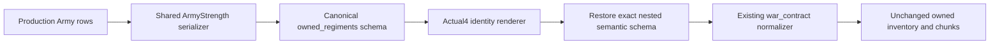

# Owned regiments in the actual 1.20.0.4 Army wire

The original Robert campaign's R58 `ck3_execute_step(step="query-army-strengths-v1", expected_revision=3)` failed on 2026-10-07. The saved registered response is `Z:/ck3_mod_rewrite_process_assets/g2-background-20261007/upstream-build-migration/managed-full-h9613-arrival07/operator/gameplay-responses/g2-route-50a6d8017728-04-readonly-2.json`. It contains `native army-strength query returned malformed rows: native owned_regiments_v1.schema is malformed`; this is a production parsing failure, not an Army order or a fixture failure. That 676-byte receipt contains the registered error, not the original native Army rows.

The frozen source is `e2d45d64a0eabf878cee75caa3fea7102571d638`. Actual executable identity remains CK3 1.20.0.4, Steam build 25734779, SHA-256 `98702F88A547CDE2EAF29A85F93B85F68EE4CF8148336A4F7AFAEB75319DD518`; this work reuses the existing freeze and performs no EXE reads or hashes.

The reached source path is `bridge.cpp`'s Army-strength branch: `ReadArmyStrengths` -> `ArmyStrengthsResultFrame` -> `AppendArmyStrengthV1` -> `AppendOwnedRegimentsV1`, then `RenderCrozierBuildIdentity` -> `Render12004BuildIdentity`. The owned serializer emits canonical semantic schema `ck3_12003_owned_regiments_v1`. The actual4 renderer's generic schema-prefix conversion changed that nested name to `ck3_12004_owned_regiments_v1`. `war_contract._normalize_army_strength_row` delegates it to `normalize_owned_regiments_v1`, which requires the canonical name. The observed `.schema` error follows the successful exact object-key check, so it identifies that specific discriminator mismatch.

The fix restores only that exact nested canonical token after actual4 schema rendering. The outer schemas, backend/version/hash/adapter identity continue to select actual4. Python strict parsing, all row fields, ordered vectors, seven physical chunks, raw pending bytes and null handling remain unchanged. The same Army path's clock has no versioned schema label; recruitment uses numeric `schema_version: 1`; its other native source labels are `source` values and are not affected by the renderer's schema-prefix rule. This source review does not cover unrelated queries.

Qualification is source-ready, FIRST NOTRUN. Root owns the incremental adapter build and the one same-game registered retry of this actual production failure path. No new producer, fixture, CMake hook or Python acceptance is added. The retained R58 failure is not overwritten. No new query, game action, build, test, SDK call, save or production-loop day is claimed by this source change.
