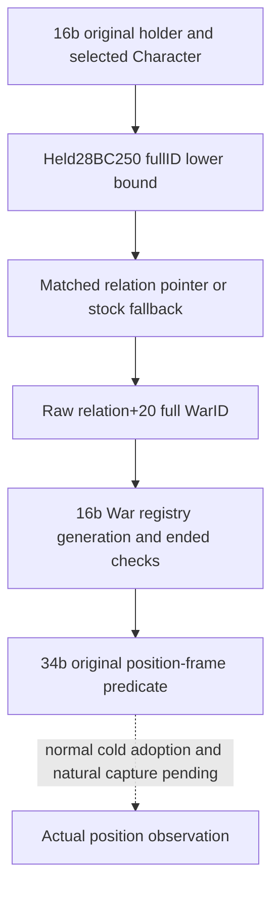

# Position-frame existing relation lookup (1.20.0.4)

October10 continuation24c reuses the complete qualified source already tracked
in `ck3_12004_persisted_truce_expiry_abi.json`. Its four contiguous lookup
fragments cover `[0x28BC250,0x28BC300)`,176 bytes. No executable, section,
metadata, hash or FamilyMapper capture is repeated. Exact build remains
CK3 1.20.0.4/Steam25734779, held EXE identity
`98702F88A547CDE2EAF29A85F93B85F68EE4CF8148336A4F7AFAEB75319DD518`.

The new actual source entry is16b's complete220-byte `[2C09280,2C0935C)`
packet. At2C092D9 RDX receives the selected Character; at2C092DC RCX
receives the original holder. CALL2C092DF reaches28BC250; return2C092E4
copies the returned relation's `+20` full raw WarID. Only `-1` takes that
caller's immediate false branch. The later War registry/fallback, full-ID
equality, ended byte and optional target comparison remain16b's independent
conditional implementation, not a meaning assigned to this raw lookup.

The held lookup reads owner `Character+1B0`, map vector `+20`, signed count
`+2C`, and16-byte rows. It performs unsigned32 lower-bound comparisons
against toward `Character+18` complete ID bits, returning row `+8` for an
exact match. A null map, empty vector or missing key returns the stock
fallback object. Both held tails name the same pointer slot:
`28BC2E4+7+0346B885=5D27B70` and
`28BC2F4+7+0346B875=5D27B70`. This is source-derived pointer storage,
not a relation-kind constant or a guessed getter address.

The complete native body has no calls, allocations, relation construction
or game-state writes; the retained register stack save is not a game-state
write. The new reader reproduces only these guarded reads through34b's
`ArmyRegularCoreReadonlyAccess12004`. It never invokes28BC250 or another
getter. The original per-frame collector owns the shared read budget and
supplies actual owner/toward pointers; no private clock, fresh query or
after-frame value fills a missing original-frame input.

`ReadArmyPositionRelation28BC25012004` returns independently available
`relation_identity`, `war_id` and an unavailable reason. The `war_id=-1`
sentinel is preserved as a valid observed integer. Read failure, missing
image fallback binding or an occurrence count outside the collector's
existing bound is unavailable, not a false predicate. Zero or other full
raw IDs are preserved for16b's actual registry checks. This does not prove
any guardian/ward, truce, diplomatic relation kind or full War identity.

Source evidence: `guardian` research and its prior9/9 or portable7/7
qualification are unrelated and are not replayed. The parent source is
`D:/codex-ck3-background-spill/native71-continuation-20261010/continuation-16b/actual-predicate-source01/2C09280-SOURCE.json`;
the getter evidence is the tracked ABI ledger and
[the persisted truce source explanation](g2-persisted-truce-expiry-12004.md).
Central33/10 owns the sole new connected fixture case. Until its actual
receipt and subsequent normal cold adoption, this package provides source
and a pure reader candidate only,0 Game/SDK/listener/native-getter actions,
0 new live/guardian/G2 completion credit.
