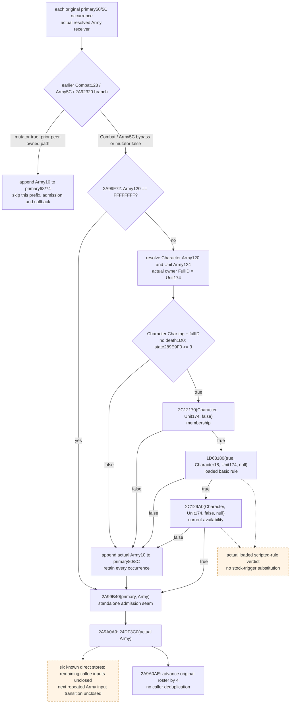
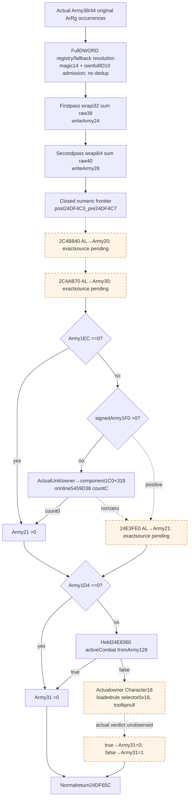

# Pre-date Character prefix and post-admission callback (1.20.0.3)

This package closes the actual caller branches at `2A99F72..2A9A0AE` by reusing the held exact-build `2A99DC0` body and existing commander sources. Status is **research / exact static source**. It adds no reader, model, runtime result, test or native qualification. The existing standalone current `2A99B40` admission query remains a separate qualified primitive; it does not observe this earlier prefix or the post-admission callback.

The useful independent result is a source-proved prefix branch: an actual `Army+120 == 0xFFFFFFFF` bypasses every Character/Unit check; a non-sentinel Character-prefix failure appends the actual Army FullID to `primary+80`, then still calls admission. This provides a concrete second queue output and the precise per-occurrence input seam needed to continue the pre-date model. The named post-admission `24DF3C0` body is now captured once below. Its direct numeric refresh is closed; remaining byte-cache callees and actual loaded-rule inputs are separate branch-local dependencies for the next repeated-Army transition.

## Frozen source and reuse

CK3 **1.20.0.3**, Steam build **25652598**, EXE SHA-256 `94B55397ABB687A3DCD436805A5D885E6BE90FA6C693FEB44A9E3BBEEADE02A6`. These identity pins are reused, without an EXE hash. The initial Character-prefix milestone used no new EXE/code reads; the separately authorized callback increment reads 160 metadata bytes and its exact 669-byte body once. Addresses below are RVAs.

External packet: `Z:/ck3_mod_rewrite_process_assets/g2-background-20261006/pre-date-character-prefix-post-admission-source/`. `SOURCE-FIRST-PLAN.json` preceded the narrow cached caller read; `HELD-CALLER-PREFIX-AND-CALLBACK.txt`, `HELD-NAMED-PIN-METADATA.json`, `CACHED-CHARACTER-STATE-77B.txt`, `SOURCE-PINS.json` and `MINIMAL-RAW-INPUTS.json` preserve the handoff. Cached `disasm-0x289e9f0.json` originally contains a 256-byte capture; its complete pinned getter is only `[289E9F0,289EA3D)` (77 bytes), and the following `int3` is outside that getter. No adjacent function is credited to this conclusion.

| Source | Exact held extent | Bytes | Reused code SHA-256 |
| --- | --- | ---: | --- |
| outer `2A99DC0` | `[2A99DC0,2A9A35E)` | 1438 | `2c339f27c4e6132fb595ee994c9abdfba995cda4eaadf5704c5c1a83f09fccb2` |
| state `289E9F0` | `[289E9F0,289EA3D)` | 77 | `0e74f777a85f7757182f5eb1a498d444411fb32b1f61c5edfb53d406da5ea2b8` |
| membership `2C12170` | `[2C12170,2C12327)` | 439 | `5c154c9f02f72ecc0b35264dce2553d877a7f89a75a3e51d66d46e0f7d79d92c` |
| rule wrapper `1D63180` | `[1D63180,1D63296)` | 278 | `ffa1e3772fdaa7f45ada3a104ca5d75bb0bf09d95f852a8266154e0ea9745c02` |
| availability `2C129A0` | `[2C129A0,2C130B5)` | 1813 | `c65e17846ff601d21d95b16932b9278518ab01f4c86d4ab4cc00d66016ec7848` |

The outer source is `g2-resume-20261004/army-monthly-update-order-v61/source-clock-new-spans/army-pre-stage-entry.{json,asm.txt}`. The four named helper pins and disassemblies already exist at `g2-resume-20261003/commander-native-candidates/pin-disasm-0x<rva>.json` and `disasm-0x<rva>.json`. [Commander candidates and assignment](commander-candidates-and-assignment-12003.md) closes their distinct purposes. Their old complete-body sizes are reuse metadata, not new byte credit or a rerun of their qualification.

## Actual per-occurrence order

The selected actual `CArmy*` is `RSI`; `R13 = primary + 8`. The peer-owned earlier pending-update dispatcher branches determine whether this prefix is reached. Its actual `2A92320` mutator-true path appends to removal `primary+68` and jumps directly to `2A9A0AE`; the prefix, admission and callback are all skipped for that occurrence. A Combat/Army5C bypass or mutator-false result reaches `2A99F72`.

1. `2A99F72..F7B` reads raw Army `+120`; sentinel `0xFFFFFFFF` jumps to `2A9A09A`. Character, Unit, owner, state, membership and loaded rules are undemanded on this branch.
2. Non-sentinel `+120` resolves the actual Character through `5C67568/5C67570`, preserving full-ID match or fallback. Army `+124` resolves the actual Unit through `5D1E380/5D1E378`; the owner argument is raw **Unit `+174`**.
3. The actual selected Character must have magic `+1C == 0x43686172`, own full ID `+18 != 0xFFFFFFFF`, death component `+1D0 == 0`, and signed `289E9F0(Character) >= 3`. `289E9F0` is a **state getter**, not a rank: first non-null `+1C8 -> 5`, else `+1C0 -> 4`, else `+1B8 -> 3`, else `+1B0 -> 2`, else `(+1D0 == 0) -> 1` or `0`. The complete leaf writes only EAX/flags and preserves RCX for the following membership call.
4. `2A9A029..02E` calls `2C12170(Character, Unit174, false)`: actual membership, with guests disallowed. It is distinct from the basic scripted rule and must not be replaced by a single court-list membership assumption.
5. `2A9A057..063` calls `1D63180(true, Character18, Unit174, null)`: actual basic loaded-rule verdict. The wrapper creates a kind-4 Character context, reads the loaded rules table via `1D65660()->EF0`, selects the first D0 slot, and uses `372DF30` for this null-reason branch. Stock rules do not establish the loaded verdict.
6. `2A9A06D..078` calls `2C129A0(Character, Unit174, false, null)`: actual current availability. The argument is **check-existing-assignment false** here; do not demand the existing-Army binding checks of the distinct true branch used by formal assignment. This predicate does not execute commander assignment. Its current action/relations and loaded non-basic-rule dependencies remain stage-specific inputs.
7. Any failed Character validation/state/membership/basic/availability test enters `2A9A081..095`: append actual Army `+10` through `B02D10` to the vector at **primary `+80`**, count `+8C` (capacity `+88`, allocator `+90`). Every occurrence is retained. This is not the removal vector at `+68/+74` or the dated append vector at `+158/+164`.
8. Both the complete prefix success and every prefix failure reach `2A9A09A..0A1`: `2A99B40(primary, Army)`. The caller then unconditionally calls `24DF3C0(Army)` at `2A9A0A9`, regardless of whether standalone admission created a group. At `2A9A0AE` it advances the original roster pointer by four bytes.

## Concrete outputs and input changes

The caller directly proves only the conditional `primary+80` append in this prefix. The Army120 sentinel branch proves no such append and no Character/Unit demand. Prefix failure **does not suppress assault admission**. The actual `2A99B40` table placement and the peer-owned pending-update and dated-append stages retain their own source contracts; their different queues must not be merged by matching IDs.

The selected getter and predicates are not the appointment executor `2971320 -> 24DFA10/24E8120`. This prevents incorrectly modeling a commander reassignment merely because a commander check was called. It does not establish a general no-write proof for every loaded rule, nor prove that `24DF3C0` preserves the fields consumed by a later repeated Army occurrence. No callback writes are invented from its callsite.

## Minimum readonly handoff

Reuse the existing complete original raw roster with occurrence index, requested DWORD, actual Army identity/fullID/fallback, the independently sampled removal68/74 queue and the pending130 table. Publish this new prefix family separately as an **observed-current conditional stage**; no earlier tomorrow/date-dispatch execution is inferred.

Demand raw `Army+120` only after the peer-owned earlier branch reaches this prefix. Its sentinel branch can be fully ready without a Character or Unit read. For a demanded non-sentinel branch, retain actual Character resolution/identity, raw magic/fullID/death, branch-ordered component presence for the state getter, actual Unit resolution/identity and Unit174 owner argument. For this caller's `state >= 3` verdict only, the first three presence reads (`1C8`, `1C0`, `1B8`) suffice: any non-null succeeds; all null fail without a `1B0` read. Reuse existing source-bound commander membership/basic/current-availability observations where their exact false/true/false parameters and current input stage match; a generic assignment boolean is insufficient. `primary+80` requires actual count/data and every original ID only if a concrete existing-vector postimage is requested; known count zero does not demand data.

An explicit prefix model can append failure IDs to its supplied `primary80` stage-start vector and carry the independent per-occurrence admission inputs to the existing standalone `2A99B40` model. It stops **before `24DF3C0`**; completing the next repeated-Army transition now requires the remaining callback helper inputs and the correct actual capture stage, rather than another read of the closed669-byte wrapper. A first occurrence or independent branch value must not be labeled a complete outer dispatch.

## Remaining finite source request

The initial scoped cache miss is preserved in `MISSING-24DF3C0-CAPTURE-PLAN.json`. Root subsequently authorized only its exact metadata stage, then the proven 669-byte body. Both receipts and the new concrete write/input tree below are retained. No neighbor window, section scan, EXE rehash or allocator/catalog read occurred. The three remaining named byte-cache callees have their own finite cache-first plan; no callee body was newly captured.

Scope and ownership: this package owns only this source topic and its external packet. The earlier mutating pending-update, dated-append preparation, existing admission collector, current-table placement and conditional removal families have separate owners. **Initial prefix new EXE bytes 0; callback increment 669 unique code +160 metadata bytes (829 actual frozen-file bytes), with zero duplicate reads. Tests 0; native builds/CTest 0; local game/process/SDK/Steam/UI/pipe operations 0.** Current outputs are source research, not native-qualified or live. Oct6/W41 fields and source costs are in the packet for Root to merge into shared reports.

## Exact callback capture and actual direct writes

Phase ONE located pdata index **128805**, RVA `5F3C5BC`, file offset `5DD37BC`, raw `c0f34d025df64d0200a01005`: exact entry `[24DF3C0,24DF65D)` (**669 B**). Unwind header at RVA `510A000` / file `5108E00` is `01140800`: version1, flags0, prolog20, eight unwind slots, no CHAININFO. Existing PE bounds and cached point records narrowed the binary search; only **13 fresh 12-byte points + one 4-byte header =160 metadata B** were read. Codes/handler/unwind tails were not read. `phase-one-24df3c0-metadata/PHASE-ONE-EXACT-EXTENT-RECEIPT.json` preserves every actual point and offset.

Phase TWO read only `[24DF3C0,24DF65D)` once, **669 unique/actual code B**, SHA-256 `942f9e6dea3a26a7015d75bc8b350b3aa85e0905cc278424a4915a1102766c3a`, fully decoded through normal `RET24DF65C`. Its new metadata cost is0. `phase-two-24df3c0-body/SOURCE-024DF3C0.{bin,json,asm.txt}` preserves the exact body; the prior metadata160 B remains separate.

| Ordered direct output | Actual source and conditional demand |
| --- | --- |
| Army DWORD `+24` at `24DF452` | Wrap-i32 sum of **every admitted original ArRg `+38` DWORD occurrence** from Army pointer38/count44. |
| Army QWORD `+28` at `24DF4C3` | Wrap-i64 sum of **every admitted original ArRg `+40` QWORD occurrence**, using the preserved original base pointer in the second pass. Positive `ArRg38` does not skip this40 read. |
| Army byte `+20` at `24DF4CF` | `AL` from `2C4B840(actualArmy)`; exact inputs remain a named source dependency. |
| Army byte `+30` at `24DF4EC` | `AL` from `2C4AB70(actualArmy)`; exact inputs remain a named source dependency. |
| Army byte `+21` at `24DF5A6` | `Army1EC==0 ->0`. Otherwise signed `Army1F0>0` demands `24E3FE0`. For nonpositive1F0 resolve Army124 Unit, Unit174 owner Character, then select `Character1C0+318` or inline default `5459D38`; header signed countC0 gives0, nonzero demands `24E3FE0`. Preserve the actual default contents, not an inferred empty default. |
| Army byte `+31` at `24DF63E/644` | `Army1D4==0 ->0`; otherwise source-closed activeCombat `24E8360` true ->0. Else resolve actual owner as above and call loaded `1D65B00(0x18, actual selected Character18, null)`; true ->0, false ->1. |

Both sum loops use the actual ArRg registry slot **5D1F340**, fallback **5D1F338**, low24 indexing, full requested DWORD comparison at actual object10, and admit only magic14 `41725267` plus own fullID10!=FFFFFFFF. Failed resolution selects the actual fallback before its admission test. No occurrence deduplication occurs, including repeated physical pointers. Count0 gives two genuinezero numeric outputs with unused row values undemanded. The raw signed-count negative case is not modeled as an empty vector. Unknown reads in one sum preserve the independent other sum and complete earlier occurrence prefix.

The first complete independent numerical frontier is **`post24DF4C3_pre24DF4C7`**, before the first remaining callee. Its output is the prospective refresh of Army24/28 from an explicitly supplied current entrance snapshot. Keep actual observed Army24/28 and all byte caches intact. Do not attach a whole-callback/future-entry label to this prefix or use actual final cache values as its historical inputs.

`24E8360[24E8360,24E83B1)` is the already held81-byte leaf at `g2-resume-20261005/siege-engine-catalog-current/native-permission/evidence/flow-024E8360.{asm.txt,json}`: actual Army128 resolves Combat through5D1DE70 and native fallback, then checks actualCombat8/0C; it does not read physical current/max. The peer's `instruction_address_bytes_sha256` and nested receipt SHA are retained under their exact labels in `MISSING-DIRECT-FLAG-CALLEE-FINITE-PLAN.json`, not promoted to a raw-body hash. No81-byte recapture or body reread occurred.

The reused229-byte `1D65B00[1D65B00,1D65BE5)` wrapper (complete body SHA `fdc7b0dd04b47906655da1d0ec62b82ea605d20be484a4d1735103070930a439`) constructs the Character root and addresses the loaded inline rule. This caller uses **slot0x18 (decimal24), array+1380**, not Rule43. Its loaded singleton/array/evaluator must be independently actual; neither the Rule43 verdict nor arbitrary suppliedbool can stand in. The basic prefix's candidate rule and this actual Unit-owner rule are also different roots.

## Downstream scope and next reader seam

The complete callback directly writes only `Army24/28/20/30/21/31`. It directly writes no Army120/124/38/44/5C/128/1D4/1EC, ArRg physical DATA, registry, primary80/removal68/pending130 state. The source-closed standalone admission operands are Unit18/20/170/178, associatedArmy1D4/1EC/124, Unit174, Province10/788/850/73C and actual Character/relation/War inputs; **none is one of the six direct callback stores**. This concrete intersection prevents treating every admission input as changed merely because the callback exists. It is not a whole-callee no-mutation proof: remaining source callees and actual stage association still bound a complete repeated-occurrence model.

`MINIMAL-CURRENT-REFRESH-INPUTS-AND-FIXTURE-PLAN.json` proposes a disjoint same-query raw refresh family borrowing original Army occurrences/resolvers. Its indispensable new numerical field is **raw QWORD ArRg40 for every admitted original occurrence**, even when rawArRg38>0. A current daily-group denominator transport's intentionally undemanded/null40 on positive38 cannot supply this second sum. Preserve independently ready24, genuinezero40, invalid/fallback/order/repeated-pointer rows, and the precise missing40 reason. A nonempty explicit current snapshot can thus produce actual source-bound prospective24/28 values without completing flags or claiming the engine already refreshed them.

Three newly identified helpers `2C4B840`, `2C4AB70`, `24E3FE0` had no complete body locator in the bounded held-root/canonical searches; `MISSING-DIRECT-FLAG-CALLEE-FINITE-PLAN.json` records exact named-RVA metadata/body requests only if their demanded byte outputs are selected next. No helper, allocator, loadedrule catalogue, native getter call or runtime execution was added. The current package's readiness remains **research / exact static source**; native observer/model, tests and live remain0.
