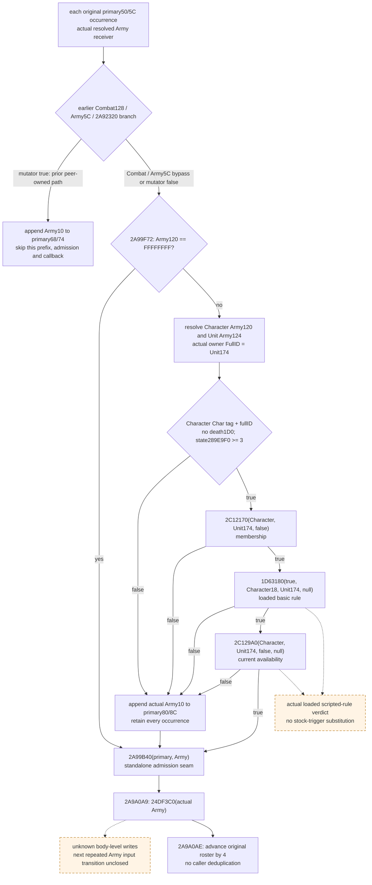

# Pre-date Character prefix and post-admission callback (1.20.0.3)

This package closes the actual caller branches at `2A99F72..2A9A0AE` by reusing the held exact-build `2A99DC0` body and existing commander sources. Status is **research / exact static source**. It adds no reader, model, runtime result, test or native qualification. The existing standalone current `2A99B40` admission query remains a separate qualified primitive; it does not observe this earlier prefix or the post-admission callback.

The useful independent result is a source-proved prefix branch: an actual `Army+120 == 0xFFFFFFFF` bypasses every Character/Unit check; a non-sentinel Character-prefix failure appends the actual Army FullID to `primary+80`, then still calls admission. This provides a concrete second queue output and the precise per-occurrence input seam needed to continue the pre-date model. The next repeated-Army transition is bounded by `24DF3C0`, whose body is not yet held in this package.

## Frozen source and reuse

CK3 **1.20.0.3**, Steam build **25652598**, EXE SHA-256 `94B55397ABB687A3DCD436805A5D885E6BE90FA6C693FEB44A9E3BBEEADE02A6`. These pins are reused; this work performs no EXE hash or new EXE/code reads. Addresses below are RVAs.

External packet: `Z:/ck3_mod_rewrite_process_assets/g2-background-20261006/pre-date-character-prefix-post-admission-source/`. `SOURCE-FIRST-PLAN.json` preceded the narrow cached caller read; `HELD-CALLER-PREFIX-AND-CALLBACK.txt`, `HELD-NAMED-PIN-METADATA.json`, `CACHED-CHARACTER-STATE-77B.txt`, `SOURCE-PINS.json` and `MINIMAL-RAW-INPUTS.json` preserve the handoff. Cached `disasm-0x289e9f0.json` originally contains a 256-byte capture; its complete pinned getter is only `[289E9F0,289EA3D)` (77 bytes), and the following `int3` is outside that getter. No adjacent function is credited to this conclusion.

| Source | Exact held extent | Bytes | Reused code SHA-256 |
| --- | --- | ---: | --- |
| outer `2A99DC0` | `[2A99DC0,2A9A35E)` | 1438 | `2c339f27c4e6132fb595ee994c9abdfba995cda4eaadf5704c5c1a83f09fccb2` |
| state `289E9F0` | `[289E9F0,289EA3D)` | 77 | `0e74f777a85f7757182f5eb1a498d444411fb32b1f61c5edfb53d406da5ea2b8` |
| membership `2C12170` | `[2C12170,2C12327)` | 439 | `5c154c9f02f72ecc0b35264dce2553d877a7f89a75a3e51d66d46e0f7d79d92c` |
| rule wrapper `1D63180` | `[1D63180,1D63296)` | 278 | `ffa1e3772fdaa7f45ada3a104ca5d75bb0bf09d95f852a8266154e0ea9745c02` |
| availability `2C129A0` | `[2C129A0,2C130B5)` | 1813 | `c65e17846ff601d21d95b16932b9278518ab01f4c86d4ab4cc00d66016ec7848` |

The outer source is `g2-resume-20261004/army-monthly-update-order-v61/source-clock-new-spans/army-pre-stage-entry.{json,asm.txt}`. The four named helper pins and disassemblies already exist at `g2-resume-20261003/commander-native-candidates/pin-disasm-0x<rva>.json` and `disasm-0x<rva>.json`. [Commander candidates and assignment](commander-candidates-and-assignment-12003.md) closes their distinct purposes. Their old complete-body sizes are reuse metadata, not new byte credit or a rerun of their qualification.

## Actual per-occurrence order

The selected actual `CArmy*` is `RSI`; `R13 = primary + 8`. The peer-owned earlier pending-update dispatcher branches determine whether this prefix is reached. Its actual `2A92320` mutator-true path appends to removal `primary+68` and jumps directly to `2A9A0AE`; the prefix, admission and callback are all skipped for that occurrence. A Combat/Army5C bypass or mutator-false result reaches `2A99F72`.

1. `2A99F72..F7B` reads raw Army `+120`; sentinel `0xFFFFFFFF` jumps to `2A9A09A`. Character, Unit, owner, state, membership and loaded rules are undemanded on this branch.
2. Non-sentinel `+120` resolves the actual Character through `5C67568/5C67570`, preserving full-ID match or fallback. Army `+124` resolves the actual Unit through `5D1E380/5D1E378`; the owner argument is raw **Unit `+174`**.
3. The actual selected Character must have magic `+1C == 0x43686172`, own full ID `+18 != 0xFFFFFFFF`, death component `+1D0 == 0`, and signed `289E9F0(Character) >= 3`. `289E9F0` is a **state getter**, not a rank: first non-null `+1C8 -> 5`, else `+1C0 -> 4`, else `+1B8 -> 3`, else `+1B0 -> 2`, else `(+1D0 == 0) -> 1` or `0`. The complete leaf writes only EAX/flags and preserves RCX for the following membership call.
4. `2A9A029..02E` calls `2C12170(Character, Unit174, false)`: actual membership, with guests disallowed. It is distinct from the basic scripted rule and must not be replaced by a single court-list membership assumption.
5. `2A9A057..063` calls `1D63180(true, Character18, Unit174, null)`: actual basic loaded-rule verdict. The wrapper creates a kind-4 Character context, reads the loaded rules table via `1D65660()->EF0`, selects the first D0 slot, and uses `372DF30` for this null-reason branch. Stock rules do not establish the loaded verdict.
6. `2A9A06D..078` calls `2C129A0(Character, Unit174, false, null)`: actual current availability. The argument is **check-existing-assignment false** here; do not demand the existing-Army binding checks of the distinct true branch used by formal assignment. This predicate does not execute commander assignment. Its current action/relations and loaded non-basic-rule dependencies remain stage-specific inputs.
7. Any failed Character validation/state/membership/basic/availability test enters `2A9A081..095`: append actual Army `+10` through `B02D10` to the vector at **primary `+80`**, count `+8C` (capacity `+88`, allocator `+90`). Every occurrence is retained. This is not the removal vector at `+68/+74` or the dated append vector at `+158/+164`.
8. Both the complete prefix success and every prefix failure reach `2A9A09A..0A1`: `2A99B40(primary, Army)`. The caller then unconditionally calls `24DF3C0(Army)` at `2A9A0A9`, regardless of whether standalone admission created a group. At `2A9A0AE` it advances the original roster pointer by four bytes.

## Concrete outputs and input changes

The caller directly proves only the conditional `primary+80` append in this prefix. The Army120 sentinel branch proves no such append and no Character/Unit demand. Prefix failure **does not suppress assault admission**. The actual `2A99B40` table placement and the peer-owned pending-update and dated-append stages retain their own source contracts; their different queues must not be merged by matching IDs.

The selected getter and predicates are not the appointment executor `2971320 -> 24DFA10/24E8120`. This prevents incorrectly modeling a commander reassignment merely because a commander check was called. It does not establish a general no-write proof for every loaded rule, nor prove that `24DF3C0` preserves the fields consumed by a later repeated Army occurrence. No callback writes are invented from its callsite.

## Minimum readonly handoff

Reuse the existing complete original raw roster with occurrence index, requested DWORD, actual Army identity/fullID/fallback, the independently sampled removal68/74 queue and the pending130 table. Publish this new prefix family separately as an **observed-current conditional stage**; no earlier tomorrow/date-dispatch execution is inferred.

Demand raw `Army+120` only after the peer-owned earlier branch reaches this prefix. Its sentinel branch can be fully ready without a Character or Unit read. For a demanded non-sentinel branch, retain actual Character resolution/identity, raw magic/fullID/death, branch-ordered component presence for the state getter, actual Unit resolution/identity and Unit174 owner argument. For this caller's `state >= 3` verdict only, the first three presence reads (`1C8`, `1C0`, `1B8`) suffice: any non-null succeeds; all null fail without a `1B0` read. Reuse existing source-bound commander membership/basic/current-availability observations where their exact false/true/false parameters and current input stage match; a generic assignment boolean is insufficient. `primary+80` requires actual count/data and every original ID only if a concrete existing-vector postimage is requested; known count zero does not demand data.

An explicit prefix model can append failure IDs to its supplied `primary80` stage-start vector and carry the independent per-occurrence admission inputs to the existing standalone `2A99B40` model. It stops **before `24DF3C0`**; completing the next repeated-Army transition requires source-closing this named callback and sampling only its demanded receiver fields. A first occurrence or independent branch value must not be labeled a complete outer dispatch.

## Remaining finite source request

`24DF3C0` has no body locator in the scoped held caller/commander and peer source inventories. `MISSING-24DF3C0-CAPTURE-PLAN.json` requests the exact existing-build pdata record and unwind-header extent first, followed by its exact named body once when authorized. There is no neighbor window, section scan, EXE rehash or generic allocator/catalog request. Any necessary direct numeric or receiver-field dependency must be justified from the captured body before a further read. Until then, writes at the callback and the next occurrence's changed inputs are explicit unknowns.

Scope and ownership: this package owns only this source topic and its external packet. The earlier mutating pending-update, dated-append preparation, existing admission collector, current-table placement and conditional removal families have separate owners. **New EXE/code bytes 0; tests 0; native builds/CTest 0; local game/process/SDK/Steam/UI/pipe operations 0.** Current outputs are source research, not native-qualified or live. Oct6/W41 fields and source costs are in the packet for Root to merge into shared reports.
