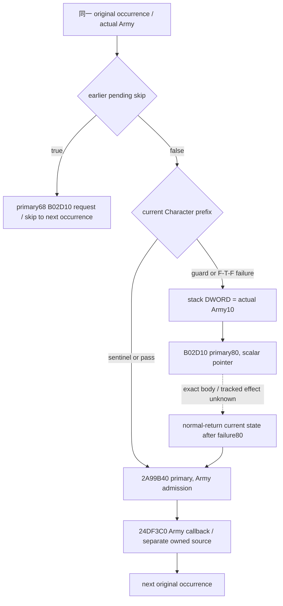

# Pre-date Character prefix failure：B02D10 的 source-first transition 计划（1.20.0.3）

本包只研究已资格 current Character prefix之后的真实失败边：`2A9A095 -> B02D10`。目标是以最小 current input／纯值 transition连接 **failure80 → admission → callback**，先闭合callee的tracked effects，避免把fixed current prefix误称为实际post-effect／下一occurrence状态。此页为 **research / source-first frozen plan**；未设计或修改model/code，执行新测试、native build、game/SDK/pipe/UI/Steam、fresh EXE读取与hash均0。

沿用 CK3 **1.20.0.3 / Steam build25652598**，EXE SHA-256复用 **`94b55397abb687a3dcd436805a5d885e6be90fa6c693feb44a9e3bbeeade02a6`**。新独占稀疏C树 `C:/g2prefixfailure` 基于 Root已正式资格source **`551f1a008afdb746a67f63f3cd51d6ce24558c32`**。前序 [current prefix输入与资格](army-pre-date-character-validation-and-commander-inputs-12003.md) 的source5／native8通过记录不重放；本包没有新增qualification或live。

## 已持有source、caller与exact receiver

| 证据 | 原有完整pin／cache | 本包复用范围 |
| --- | --- | --- |
| Outer `2A99DC0..2A9A35E` | 1438 B，SHA `2c339f27c4e6132fb595ee994c9abdfba995cda4eaadf5704c5c1a83f09fccb2`；`Z:/ck3_mod_rewrite_process_assets/g2-resume-20261004/army-monthly-update-order-v61/source-clock-new-spans/army-pre-stage-entry.{json,asm.txt}` | 已held的selected prefix/callback摘录：`.../g2-background-20261006/pre-date-character-prefix-post-admission-source/HELD-CALLER-PREFIX-AND-CALLBACK.txt`；不重新capture完整caller |
| Admission `2A99B40..2A99DBD` | 637 B，SHA `9d4ffe6848ad80c8bff96c277e8a1acdcb02412a2f18c00af7b35562c42b7ab2`；`.../g2-background-round13-20261006/monthly-manager-prepared-order/SOURCE-02A99B40.{json,asm.txt}` | 两个同helper调用的receiver／DWORD实参及caller内order |
| Prefix readonly predicates | 已held `289E9F0 / 2C12170 / 1D63180 / 2C129A0` exact .3 pins，前序专题已闭 | 复用guard／F-T-F返回失败branch，不重读闭body或callee audit |
| **B02D10 body** | **当前named source scopes没有exact begin/body pin** | 下面有限metadata/body请求；callee tracked effects尚不授予 |

Outer中 `RSI=actual selected Army`、`R13=primary+8`。任一Character guard失败／首个false predicate都到 `2A9A081`；callee实参是：

```text
2A9A081 lea rcx,[r13+78]             // primary +80: vector object address
2A9A085 mov eax,[rsi+10]             // actual Army10 full DWORD, not original roster request
2A9A088 mov [rbp+138],eax            // stack local scalar only
2A9A08E lea rdx,[rbp+138]            // pointer to that scalar
2A9A095 call B02D10
2A9A09A mov rdx,rsi
2A9A09D lea rcx,[r13-8]              // primary
2A9A0A1 call 2A99B40                 // admission, also reached by sentinel/pass
2A9A0A6 mov rcx,rsi
2A9A0A9 call 24DF3C0                // callback after admission
2A9A0AE advance original roster occurrence
```

因此 **B02D10 receiver不是Army或Character**，而是primary80的vector object；RDX也不是人物指针，只指向actual Army10 DWORD。selectedcaller在这条failure边直接写的只有stack scalar。caller不检查B02D10返回值，normal-return后立即按原Army进入admission，再调用callback。这足以闭合callsite与order，**不足以证明callee内部不读全局／不写tracked Army/Character**；该footprint必须由exact body证据闭合，不能从函数看似push的名称或两个寄存器猜测。

两组already-held交叉callsite进一步限定类型，不代替body：

| Site | RCX／RDX | order |
| --- | --- | --- |
| Outer `2A99F68` | `R13+60 = primary68`／`&actual Army10` | pending mutator返回true后追加；随后直接skip prefix/admission/callback |
| Admission `2A99CB4` | `prepared entry RBP+10`／`&actual Army10` | `2AA2030`得到entry之后；再查primary138 table |
| Admission `2A99D99` | `prepared entry RBP+28`／`&Army38 original ordered DWORD` | 只在对应RBX+10/+1C集合firstmatch缺失时调用；随后继续原Army38循环 |

本包不扩张后两组entry准备／map插入／allocator的研究；完整admission输入与callback direct effects分别已有专题／其他owner。

## 原生树与未闭合边



`current prefix`是callee前原始输入。即使qualified pure已经给出logical80 request，也不能把当前Army/Character leaves、admission原始输入或next occurrence的prefix重复观察值升级为post-callback状态。body闭合后只允许将明确tracked fields的source-defined写入带过stage boundary；callback后状态继续以其自身source与inputs为准。

## 最小current-input seam与施工选择

| 决策／transition输入 | 已有实际同query seam | 此包需要的最小增量 |
| --- | --- | --- |
| 该occurrence是否失败、其original order与actual Army10 | qualified `current_pre_date_character_prefix_inputs_v1` 与derived prefix occurrence／failure requests | 无第二次registry扫描或candidate enumeration |
| failure前primary80 logical状态 | prefix `initial_80` 的raw8C与ordered fullDWORDs，复用first-cleanup `id_lists['80']` | 不新增容量、allocator、physical pointer增长model |
| earlier knownskip与重复existing-key输入 | samequery qualified pending raw／Python projection；native仅closed existing-key shortcut | 不执行 `2A92320`，unclosed setup维持独立unknown |
| normal-return后哪些tracked fields改变 | **B02D10 exact body的direct reads/writes与source-normal-return order** | **当前唯一必需source缺口**；先定位metadata与取此named body |
| admission输入是否会被前项改变 | qualified current admission raw family；held637B body的direct load sites | 用B02D10已闭footprint与这些existing source loads求交；不能预先宣称当前raw就是post-effect |
| callback／next occurrence状态 | [prefix/callback source](army-pre-date-character-prefix-and-post-admission-callback-12003.md)，numeric refresh／later removal归其他owner | 本包只冻结进入callback的边界；不扩写其model或重capture |

**Source-reviewed之后的最小选项**：若named body证明正常返回仅维护传入int32 vector的logical内容/count，则当前qualified failure请求＋initial80已足够构造primary80 postimage；优先复用既有pure result并明确stage boundary，而不新建重复observer／helper kernel。若实际body存在另外参与admission或callback的tracked field写入，只添加其具体before-input与source-defined pure transition，列出所属对象／offset／existing reader seam。任何差异先回Root，不以永久null／imagined assignment BOOL把post-effect readiness装成true。

sentinel/pass的**无helper**边与早期knownskip仍可独立说明order，不等待B02D10来反复判未知；这不新增post-callback/live资格。growth／allocation内部不作为独立审计目标；此包只解释调用正常返回时决策必需的logical effects，physical执行继续不模拟。

## Cache locator结果与有限capture request

外置包：`Z:/ck3_mod_rewrite_process_assets/g2-background-20261006/pre-date-prefix-failure-transition/`。`CACHE-LOCATOR-RESULT.json`明确只检查四个held source scopes：monthly update-order v61、round13 prepared-order、commander-native-candidates、prefix/callback source。找到B02D10引用的JSON仅为held caller／slot30 continuation／`SOURCE-02A99B40`／`SOURCE-2A97ED0`；**没有begin RVA B02D10的exact body/metadata**。这不是全资产“绝对不存在”的声称；较广filename-only搜索因成本停止，未读新EXE，已有peer cache locator请求仍可补充。

若Root／peer有其他已持有pin，直接复用其metadata/body，不新capture。Root进一步限定此次只审阅 **metadata-only** 请求，未授权未定extent的body或unwind chain；初版combined request保留外置history。具体bracket与最大新字节如下，完全由held `SOURCE-02A99B40.json` 的record index／read ledger推导，不新读PE header：

| 参数 | 精确值／来源 |
| --- | --- |
| Target | RVA `0xB02D10` |
| 已held upper record | index **146715**，begin **`0x2A99B40`** > target；同pin的下一record index146716，metadata RVA **`0x5F70D50`**／file offset **`0x5E07F50`** |
| Runtime-function record宽度 | 三DWORD，**12 B** |
| 推导table base | RVA **`0x5DC3000`** = `0x5F70D50 - 146716*12`；file **`0x5C5A200`** = `0x5E07F50 - 146716*12` |
| Binary-search bracket | inclusive index **`[0,146715]`**，只查last `BeginRVA<=target`并检验其End；每次中点一个12B record，已held record复用 |
| 首个中点 | index **73357**；RVA **`0x5E99E9C`**／file **`0x5D3109C`**，**12 B** |
| 潜在record地址边界 | RVA `[0x5DC3000,0x5F70D50)`／file `[0x5C5A200,0x5E07F50)`；**不读取这个整区间** |
| 最大新读取 | **18 unique records × 12 B = 216 B**；保留已读candidate的Begin／End／UnwindRVA，不重复取final record |
| PE／function／unwind header | **无范围／0 B**；body **0 B**；actual chain records **0 B**，本次均未授权 |

此metadata查找只产生containing record或精确gap：若candidate `EndRVA<=0xB02D10`，报告target没有被该runtime-function record覆盖，不能猜邻function extent。若有containing record，先向Root交付其实际index／begin/end／unwind RVA，再另行冻结body的确切extent与任何**实际发现**的必要chain缺口。body与chain必须分别最小选择，不能预先打包授权。metadata实现／执行亦等待Root审阅上述bracket，当前fresh reads仍0。

后续取得named body后，才记录direct writes与receiver／scalar对象身份、normal-return logical count/order，并与既有admission load sites求交。若具体directcallee阻断决策必需logical effect，只报告名字和有限缺口，不自动展开generic destructor／allocator或whole-EXE审计。

在本source tree与 **216 B metadata-only plan** 被Root审阅前：**model/code/tests/build/new EXE reads0**。此页与外置 `METADATA-ONLY-PLAN.json / REPORT-FIELDS.json`是下一可施工入口，Root负责采用、共享Oct6/W41报告与push。
