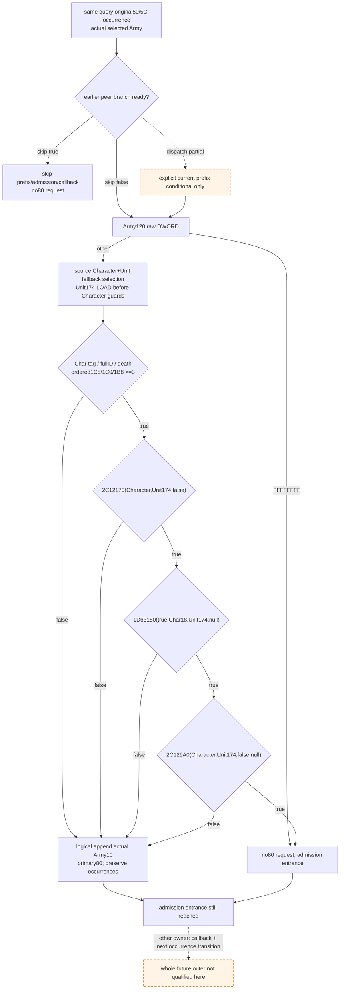

# CK3 1.20.0.3：pre-date Character 前缀与 commander 观测接线

2026-10-06，`research / source-closed interface plan`。本包只规划当前同查询入口的只读输入及纯值 primary80 追加；尚未实现、编译或执行测试，没有新 paused/live artifact、自动游戏日或任命动作。源码基线 `06ef1e1e1e9bc2dbdb4b75bd9feb39d89ac2b247`，独占外置包 `Z:/ck3_mod_rewrite_process_assets/g2-background-20261006/pre-date-character-validation-commander-inputs/`。

复用已采用的 [前缀及 post-admission callback 树](army-pre-date-character-prefix-and-post-admission-callback-12003.md)（原 `c394b760`、补充 `c54981b0`），本页负责 `2A99F72..2A9A095` 的 Army120／Character／Unit174 输入与 logical failure append。numeric24/28 refresh 由 entry 维护，后续 dynamic-removal 由 attrition 维护。

## Exact source 与缓存边界

CK3 **1.20.0.3 / Steam 25652598**，复用 EXE SHA-256 `94b55397abb687a3dcd436805a5d885e6be90fa6c693feb44a9e3bbeeade02a6`；地址为 image-relative RVA。本次新 EXE/code capture、hash、callee 展开均为 **0**。

| 已持有 source | 范围 / 字节 | 复用 SHA-256 | 用途 |
| --- | --- | --- | --- |
| outer `2A99DC0` | `[2A99DC0,2A9A35E)` / 1438 | `2c339f27c4e6132fb595ee994c9abdfba995cda4eaadf5704c5c1a83f09fccb2` | 实际参数与执行顺序 |
| state `289E9F0` | `[289E9F0,289EA3D)` / 77 | `0e74f777a85f7757182f5eb1a498d444411fb32b1f61c5edfb53d406da5ea2b8` | pointer-presence 的 `>=3` |
| membership `2C12170` | `[2C12170,2C12327)` / 439 | `5c154c9f02f72ecc0b35264dce2553d877a7f89a75a3e51d66d46e0f7d79d92c` | guests=false 的真实 verdict |
| loaded basic `1D63180` | `[1D63180,1D63296)` / 278 | `ffa1e3772fdaa7f45ada3a104ca5d75bb0bf09d95f852a8266154e0ea9745c02` | actual loaded rule，basic=true |
| availability `2C129A0` | `[2C129A0,2C130B5)` / 1813 | `c65e17846ff601d21d95b16932b9278518ab01f4c86d4ab4cc00d66016ec7848` | check-existing-assignment=false |

外层原缓存为 `Z:/ck3_mod_rewrite_process_assets/g2-resume-20261004/army-monthly-update-order-v61/source-clock-new-spans/army-pre-stage-entry.{json,asm.txt}`。本次只复用 peer 的 `pre-date-character-prefix-post-admission-source/SOURCE-PINS.json` 与已选取 `HELD-CALLER-PREFIX-AND-CALLBACK.txt`。四个 commander pin 的原缓存位于 `Z:/ck3_mod_rewrite_process_assets/g2-resume-20261003/commander-native-candidates/pin-disasm-0x<rva>.json`；仓库账本为 `native_bridge/research/commander12003_source_pins.json`，此前已闭 body 不重读。

## 实际前缀顺序与最小输入

原 roster 是 primary50/5C，每个原始 DWORD occurrence 都保留；actual selected Army 为 `RSI`，secondary `R13=primary+8`。较早 `2A92320` 返回 true 会跳到 `2A9A0AE`，本前缀、admission 和 callback 全部跳过。[当前 pending projection](army-pre-date-roster-pending-update-12003.md)已发布 `skip_2a99b40_and_24df3c0`，只有其同 occurrence 判定 ready 时，才能加入当前 dispatch 条件。

| 顺序 / source | raw input 或现有 seam | demand / 结果 |
| --- | --- | --- |
| `2A99F72..F7B` | actual Army `+120` 完整 DWORD | `FFFFFFFF` 直接 admission；Character、Unit、三项谓词全部不需求，primary80 不追加 |
| `2A99F81..FBB` | Character registry `5C67568`、fallback `5C67570`，fullID `+18` | 低24位 indexed/fullID match，否则 actual fallback；保存实际 physical identity 与选择账本 |
| `2A99FBB..FFB` | actual Army `+124`；Unit registry `5D1E380`、fallback `5D1E378`，indexed fullID `+10`；selected Unit `+174` | **非 sentinel 时，owner174 的读取先于 Character guards**，不能因后来的 Character 失败而假称此项不需求 |
| `2A9A001..010` | selected Character `+1C`，通过后 `+18` | tag 必须 `43686172`，fullID 必须非 `FFFFFFFF`；失败要求 actual Army10 作为追加值 |
| `2A9A012..01A` | selected Character `+1D0` pointer-present | 非 null 失败；无死组件才需求 state |
| `2A9A01C..027` | 顺序读取 `+1C8`、`+1C0`、`+1B8` 的 pointer-present | 首个非 null 即 `>=3`；三项全 null 失败；停止后不读后项，也不读 `1B0` 来判断此比较 |
| `2A9A029..035` | `2C12170(actual Character, raw Unit174, false)` | membership native verdict；false 立即追加，不调用后两项 |
| `2A9A057..06B` | `1D63180(true, selected Character18, raw Unit174, null)` | 当前加载 playset 的 basic rule verdict；false 立即追加，不调用 availability |
| `2A9A06D..07F` | `2C129A0(actual Character, raw Unit174, false, null)` | 当前 availability native verdict；false 追加，true 不追加 |
| `2A9A081..095` | actual selected Army `+10` | B02D10 的 logical request 写入 **primary80/8C**；保留重复，不能用 roster requested ID 或 CharacterID 替代 |
| `2A9A09A..0A1` | 已有独立 `2A99B40(primary,Army)` admission 输入 | 前缀通过与失败都到达；primary80 failure 不阻断 admission |

`289E9F0` 返回 character state：`1C8→5`、`1C0→4`、`1B8→3`、`1B0→2`，否则按 `1D0` 得 1/0。它保留 RCX；本 observer 可用前三项 branch-ordered raw presence 精确判 `>=3`，无需再次调用 getter或冒称人物 rank。

原生 Unit fallback 分支没有再检查 Unit tag、own ID 或 owner 是否存活才加载 `+174`；前缀参数必须是该 raw DWORD。Character fallback 的实际 `+18` 也可能不同于 requested Army120。新 family 保存两者；basic 使用 **selected Character18**，membership/availability 使用 **selected Character pointer**，owner 三次都使用同一 **raw Unit174**。DWORD 到 int32 的函数实参保持原位模式；合法高位 FullID 不能仅因有符号显示为负就被拒绝或改成 sentinel。

## 现有 commander 能复用什么

[Commander source 树](commander-candidates-and-assignment-12003.md)与现有 `ck3_12003_commander.hpp/.cpp` 已提供 exact .3 identity、Army120／Army124／Unit174 的字段语义和 owning-thread paused query 模式。

| 当前接口 | 实际语义 | 本前缀接线 |
| --- | --- | --- |
| `ReadArmyCommanderCandidates` current commander/owner | 玩家 public CUnit→internal Army；indexed Character round trip，加 `GetArmyCommander` 验证 | 同帧同 physical Army/Unit 时可复用 raw identity；不能用该接口的 unavailable 代替 caller 的 native fallback validation |
| `collect_candidates(owner,out,false,true)` | GUI 风格集合；可包含 guest，输出去重候选 | 无需调用或重新枚举；列表中存在人物不证明本前缀 membership(false) |
| `can_set_commander(1,candidate,army,null)` / `2971510` | 正式 mode1 任命资格，还检查 Unit170、owner/mode 与 availability(**true**) | 现有 `can_assign` 不发布三个独立 verdict，不能作为前缀 true/false 的输入 |
| `daily_assault_roster_detail::Resolve/Read/At` | 已有 exact .3 Army/Unit/Character registry+fallback 和可观察 read failure | 直接复用；Character full_offset18，Unit full_offset10；保持 native fallback，避免 public observer 私有 indexed-only resolver 改变选中对象 |
| `ReadArmyStrengthsForScope` 同 query global observers | `ck3_12002_army.cpp` 已一次采集当前 roster/pending 并分发到 scope rows | Root 最小追加一个同帧 family collector；不建立第二个 MCP/新的候选查询回合 |
| `FirstRemovalCleanupInputsV1.id_lists['80']` | 已采集完整有序 signed FullID 列表 | 新 collector 读 raw primary8C；长度一致时复用原列表位模式，缺失时只读该一个80向量；不重复六表扫描 |

现有 `CommanderBindings` 只有 aggregate `can_set_commander`，尚无 membership/basic/availability 三个独立 callback。**缺口是发布并调用现有三个 pinned predicate，不是缺 source body 或需要猜新的任命 BOOL。** 建议独占新 header-only bindings 复用 `BindCurrentDailyAssaultRosterAdmission12003` 的 exact-image/read-context，并绑定下列已闭只读入口；无需改 commander collection 或 assignment 模块：

```cpp
bool (*membership)(void* character, std::int32_t owner, bool allow_guests);
bool (*basic_rule)(bool basic, std::int32_t candidate, std::int32_t owner, void* reason);
bool (*availability)(void* character, std::int32_t owner, bool check_existing_assignment, void* reason);
// image + 2C12170 / 1D63180 / 2C129A0, exact .3 only.
// Calls in source order: membership(character,owner,false),
// basic_rule(true,selected_character18,owner,nullptr),
// availability(character,owner,false,nullptr).
```

这些是现有 commander 资格树中的读判定入口。`1D63180` 用 actual loaded database `1D65660()->EF0` 与第一 D0 槽；availability 的 false 分支由原 caller 给定，其内部 current action/relations/non-basic rule 保持原生求值。直接输出真实 native verdict，避免手抄 stock trigger、拆造未知枚举，或长期把决定所需字段填 null。`2971320`／`24DFA10`／`24E8120`、B02D10、2A92320 与 callback 均不在 collector 中调用。

## Observer 与纯值 family 的冻结计划

拟发布 `current_pre_date_character_prefix_inputs_v1`，每行带原 `native_index`、requested roster DWORD、actual Army resolution/FullID、raw120、Character/Unit resolution、raw174、branch-demanded Character guards/presence、三项 `observable + verdict`。Native 参数固定为本 source 的 false/true/false；payload 保留 raw owner 与实际 Character18，记录 not-demanded，而非凭缺字段编造 verdict=false。

构造接线：Root 将同查询 `current_daily_assault_roster_admission_v1`、`current_pre_date_pending_update_inputs_v1` 及原 first-removal DTO 传入新 collector。复用原 roster occurrence 与选中 Army账本；如必须取 pointer，只针对该 requested occurrence 用既有 Resolve，匹配实际 physical identity；不重新枚举名单。generic resolver 的 `selected_object_ready` 与 `selected_full_id_read_ready` 分开：fallback 元数据 `+18/+10` 的额外读取失败不能代替真正 tag/owner branch 的需求，但 indexed fullID comparison 的读取缺失仍使选择 partial。非 sentinel 始终先完成 Unit174 source load。

三项 native bool 只在各自 demand 分支、同一个 owning-thread paused query 中调用。前项 false 后不调用下一项；函数没有绑定或实际调用不可完成时，仅该 demanded branch partial。无需公开 reason collector、创建 command、clone packet 或提交队列。

纯值输出拟为 `same_input_conditional_current_pre_date_character_prefix_v1`：每个 occurrence 的 source branch、首个失败 guard/predicate、logical primary80 append request、admission entrance（sentinel/pass/failure 均进入）。所有追加值取 actual Army10，保持原 roster 顺序与重复。primary80 初始 raw8C、完整有序值独立采集；仅 requests ready 时仍可交付 request 序列，完整 logical postimage 还要求 initial80 ready。只折叠80的逻辑追加，不模拟容量、allocator、physical writes 或后续 removal。

| 独立 readiness | 所需实际输入 | 可交付结果 |
| --- | --- | --- |
| earlier branch 已知 skip | 同 occurrence pending projection ready、skip=true | 不 demand Army120/Character/Unit/三谓词；outer 此 occurrence 不追加80且无 admission |
| sentinel | actual Army selection + raw120=`FFFFFFFF` | conditional no80-append + admission，其他 prefix leaf 均 not-demanded |
| validation/death/state failure | 非 sentinel source Unit174 load 完成、逐级 guard/ordered presence，actual Army10 | 精确首个失败与 failure append；后续 native predicate 不 demand |
| membership/basic/availability failure | 上述输入及截至首个 false 的真实 native verdict，actual Army10 | failure append；不需求 false 后的谓词 |
| 完整 pass | 所有 demanded raw leaf 和三个 native verdict true | no80-append + admission |
| initial80 incomplete | 原始 request 判定可独立 ready | request 序列保留；完整向量 postimage partial |
| earlier dispatch incomplete | 本 prefix 当前入口 leaf 可独立 ready | explicit conditional prefix 结果；不能声称原 outer 实际已到达此入口 |

空 roster、skip、sentinel与各早期失败不依赖所有 loaded predicates。具有日期、pending、table 或未来 callback 的缺口也不阻断此独立当前 prefix；但它们不能被该 family 冒充已执行。parent 批准后应一次闭合三个 executable seams，使非空、全 demanded 场景的 readiness 能真正为 true。



## 下一包可施工项与必要首次验证

可直接批准独占 DTO／serializer／header-only collector／strict parser／纯值 kernel，Root 集中整合共享绑定与 service hooks。source、registry、loaded-rule executable seams 已有，不需要新 EXE capture。建议一个新的 compact native fixture/CTest target 验证 source 参数与 ordered demand；一个新的非空 complete-service compound 验证实际80 requests与独立 admission entrance。此页只声明测试计划，**执行数量0**。

必要场景：较早 skip/sentinel 的0谓词调用；非 sentinel owner174先读；Character fallback tag/fullID/death/state早退；首个nonnull state stop；三谓词参数false/true/false与null reason、首个false后0后项调用；selected fallback Character18及actual Army10高位DWORD；重复Army请求保留；initial80 partial而requests可判。非空 compound 组合一个 skip、一个sentinel、一个早期validation failure、一个availability false及一个完整pass，带非空初始80和重复occurrence，避免只验空输入或只镜像字段默认值。后续 Root 新 native whole-wire 应单独首次消费，不能重放已通过 source compound来冒充compiled producer。

本页前沿止于 explicit current prefix 的 logical80 request/admission entrance。尚未获得新的 observer、compiled fixture、完整同查询消费或 paused artifact；`static-ready / fixture-live / production-live` 均不授予。post-admission callback后的逐 occurrence 输入演化、实际下一日、整个 daily update 和任命收益保持各自专题与实际证据边界。Oct6/W41字段交外置 `REPORT-FIELDS.json` 由 Root 合并；共享七报告与索引本包不修改。

## 2026-10-06：最小 observer 源码已创作，FIRST 资格待 Root

Root 采用上述计划为 `7207902f` 后批准九文件施工；新独占树 `C:/g2prefix` 基于 **`58d882f4c55745a38de1b0164a9594839fd10a84`**。本段状态为 **`research / source-authored, FIRST qualification pending`**，保留上方未实现时的计划历史。外置实现包为 `Z:/ck3_mod_rewrite_process_assets/g2-background-20261006/pre-date-character-prefix-observer/`；实现、source compound、compiled whole-wire 资格逐项记录，当前执行数量均0。

冻结 API：

```cpp
CurrentPreDateCharacterPrefixBindings12003 BindCurrentPreDateCharacterPrefix12003(
    std::uintptr_t image_base, std::string_view exact_executable_sha256) noexcept;
ArmyCurrentPreDateCharacterPrefixInputsV1 ReadCurrentPreDateCharacterPrefixInputs12003(
    const CurrentPreDateCharacterPrefixBindings12003&,
    const ArmyCurrentDailyAssaultRosterAdmissionV1& same_query_roster,
    const ArmyCurrentPreDatePendingUpdateInputsV1* same_query_pending = nullptr,
    const ArmyFirstRemovalCleanupInputsV1* same_query_globals = nullptr);
```

只安装 exact .3 的三个 callback，无 .2 绑定。collector 保留原 roster 与 actual Army 选择，非 sentinel 先读取 selected Unit174，再分级读取 Character tag／ownID／death／ordered state presence；三个 native bool 按原 false/true/false 参数及 null reason 调用。缺少 demanded callback时，仅该分支为带明确原因的 partial；已知 false不继续调用后项。observer 不执行 mutator、assignment、logical append helper 或 callback。纯值函数 `project_current_pre_date_character_prefix_v1(army)` 输出 `same_input_conditional_current_pre_date_character_prefix_v1`，读入 actual verdict，不自行调用 native。

native pending DTO 只有 raw inputs，完整 peer skip projection 在 Python；因此只读 native demand shortcut 明确限制为：`pending_mutator_selected=false` 给 known bypass；**已闭 existing-key** 的完整 before-count、原 ArRg count及 branch-observed append 数，按 source signedDWORD wrap 得 after-count并比较；只携带 actual repeated Army 的既有 logical count。来源分别为 `pending_dispatch_bypass`、`same_query_existing_pending_count`；未闭 setup/growth/count 则 `earlier_skip=null/source=unavailable`。这不是调用 `2A92320`，也不是证明 pending mutator 实际已执行。Root 明确批准此最小 shortcut；不新增 insertion／allocator kernel，不修改已资格的 pending schema。service 的完整当前 dispatch join复用原 Python pending projection，当前 prefix的条件输入保持独立。

初始80使用现有 first-cleanup `id_lists['80']` 加 raw8C，按位保留完整 FullID；raw requests 与完整 vector postimage 分开。collector 后续原 roster 的每一 occurrence仍以固定当前输入为条件，不把 callback后输入演化写成已知未来。失败追加 actual Army10，重复保留，admission入口仍到达。

新增目标 **`xar_bridge_pre_date_character_prefix_12003_test`**，一个 fresh CTest fixture，创作 **8** 个 whole Strength wire scenes：11-occurrence 完整源分支；initial80 unavailable；availability callback unavailable；Unit174 required-read failure；fallback Character ownID failure；有效 fallback Character18作为basic实际实参；earlier setup unknown但当前 prefix可判；12-occurrence repeated existing-key count改变 skip。通过真实 `ReadArmyStrengthsForScope` 和 serializer 接线，完整首 scene应有 membership/basic/availability **6/5/4** 次，known skip及sentinel均0谓词调用；有效 fallback 场景独立核验basic未使用Army120原请求ID。这只是声明期望，尚未执行。

新增 source method **`test_pre_date_character_prefix_service.PreDateCharacterPrefixServiceTests.test_nonempty_prefix_false_true_false_failure_requests_and_admission_entrance`**，一个 method、**5** 个新 service query scenes。非空 source场景7个原始 occurrence，期望请求 **`[13,14,13,16]`**，初始80 `[7,7]` 的条件logical结果 `[7,7,13,14,13,16]`，admission入口 occurrence `[1,2,3,4,5,6]`；含真实三谓词输入、earlier known skip、sentinel、fallback、重复与早期失败。constructor 所有完整状态显式 `state(True)`，无生产 parser/kernel 替换或测试运行。

Root 独占共享 DTO/include/query/binder/serializer/normalizer/service hooks与CMake，以及完整冻结树后的首次 source method、formal build和新 CTest。实现包提供外置 integration patch／目标 recipe 与独立 **FIRST whole-wire consumer**，后者只读取实际compiled完整行，经真实normalizer/service/pure路径消费，不重放source method或替换 raw leaf/numeric fields。只有 Root 取得新结果后才可提升静态资格；新 paused/live、next callback/full daily与实际命令收益仍为0。

## 2026-10-06 18:05（Asia/Shanghai）：FIRST source service GREEN，native 资格仍待结果

Root 将九文件候选 `66d84b4d3930d56d38f337910343eff6499c61cd` 与七个真实共享 hooks 手动集成为 **`b044e12d443ac187f63275306cee8a7c268e35a7`**，冻结完整 imports 树 `C:/codex-ck3-background/refresh-prefix-mapper-batch/g100`。prefix binding 位于 actual true tail 的 candidate-detachment mapper之后；行内先生成 existing pending projection，再生成 prefix projection。冻结 receipt 为 `Z:/ck3_mod_rewrite_process_assets/g2-background-round28-20261006/refresh-root/OFFLINE-SOURCE-FREEZE-G100.json`。旧外置 integration patch 因 Root 后续 shared anchors 已变化而弃用，不作为已应用证据。

获 Root 授权后，仅首次执行上段新 source method：**1 method / 5 completed service queries GREEN**，`10:05:39.146247–10:05:40.896514 UTC`，内部 **1.7502654 s**。使用 `Z:/ck3_mod_rewrite/tools/.venv/Scripts/python.exe -B -X utf8`，`optimize=0`；无 service monkeypatch、normalizer/kernel mock 或 projection stub。外置 `first-source-service01/run_first.py` 只构造并留存该五场原始输入、调用该一个 unittest method和记录输出，没有执行 peer 已通过测试。

首场实际 service response 给出7个 ordered occurrence，requests **`[13,14,13,16]`**、logical80 **`[7,7,13,14,13,16]`**／count **6**、admission indices **`[1,2,3,4,5,6]`**；prefix、append requests、current dispatch join、logical80 readiness 均true，existing pending与independent admission projection也ready。initial80 unavailable场仍给出相同requests，而 `logical_80_result_ready=false`；availability demanded verdict partial与Unit174 load partial均保留独立后续分支；earlier context unknown场 `conditional_append_requests_ready=true`、`current_dispatch_join_ready=false`。五场 `actual_next_callback_ready=false`、`full_daily_assault_ready=false`，native calls/writes均0。

实际 inputs／responses／FIRST receipt／五场摘要分别为上述实现包的 `first-source-service01/{actual-source-inputs.json,actual-service-cases.json,FIRST-SOURCE-SERVICE.json,ACTUAL-FIVE-SCENE-SUMMARY.json}`。初次 CMD `start /b /belownormal /wait` launcher报 Access denied，未产生runner receipt，留存 `LAUNCH-BELOWNORMAL-RED.json`；随后直接 fullvenv 启动是本method的首次实际执行。外置摘要 writer 的字段拼写错误另留 `EXTRACT-INITIAL-RED.txt`，只改writer读实际 `logical_80_result_ready`，没有重跑已GREEN method或改变生产代码。

本段只授予 **Python complete-service source compound static qualification**。截至此记录，新 native target／CTest／8个 actual compiled whole-wire consumer 均 **NOTRUN**，正式结果及消费必须等待 Root；observer native整体static-ready仍待这些资格。paused artifact、fixture-live、production-live、完整 next callback、actual daily execution与收益均无新增。Oct6/W41增量字段在外置 `REPORT-FIELDS-SOURCE-FIRST.json`，由 Root 汇入共享报告；上方执行0的计划和source-authored历史保持原样。
