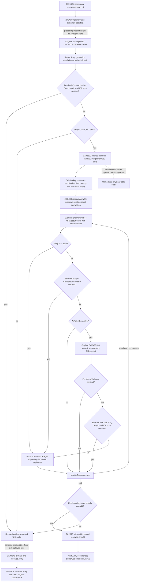

# Pre-date Army roster pending update and skip selection — CK3 1.20.0.3

Source-only closure recorded2026-10-06 / W41. Exact CK3 1.20.0.3 / Steam25652598 EXE SHA`94b55397abb687a3dcd436805a5d885e6be90fa6c693feb44a9e3bbeeade02a6` is reused. Root published baseline`7e621c2497697f018525aad3e5a3c261d71686f3`; this topic adds no production observer, service, test, build or game operation.

The original primary+50/+5C Army occurrence roster is not itself a call list for daily-assault admission. Before`2A99B40`, the actual pre-date dispatcher can update a per-Army pending ArRg list, append the resolved Army ID to the removal queue and skip admission. **`2A92320` is a mutator, not a readonly eligibility getter.** A future observer must read its inputs and model the logical update; it must not invoke this function in a readonly bridge. [Current standalone admission](army-daily-assault-roster-admission-12003.md) remains independently useful.

## Actual caller order and receiver identities

Held complete`2A99DC0` is`[2A99DC0,2A9A35E)`,1438B, SHA`2c339f27c4e6132fb595ee994c9abdfba995cda4eaadf5704c5c1a83f09fccb2`. Cached selected instructions total568B; no old code was read from the frozen EXE or rehashed. `R13` is the secondary callback interface. `2A99E91` calls`2A9A360(primary,tomorrow-date)` **before** loading secondary+48/+54 = primary+50/+5C original Army data/count. The loop fixes its original end pointer and advances4B per occurrence; repeats are not deduplicated.

`2A99EB0..2A99EEC` resolves each raw full DWORD through Army storage`5D1DE48`: unsigned low24 index against registry+2C, registry+20 stride16 pointer+8, nonnull pointer and Army+10 full-generation equality; failure selects native fallback`5D1DE50`. Retain raw roster ID and selected receiver ID separately. The dispatcher does not add an Army magic rejection after fallback.

`2A99EEC..2A99F39` independently resolves Army+128 Combat through storage`5D1DE70` / fallback`5D1DE18`, object fullID+8. Only selected object magicDWORD+0C=`0x436F6D62` (`Comb`) **and** object ID+8 !=`FFFFFFFF` skip the pending mutator. Otherwise `2A99F3B` reads Army+5C DWORD; any nonzero value also bypasses the mutator. These bypasses reach the remaining prefix, rather than directly queue removal.

Only no valid selected Combat plus Army+5C==0 calls`2A92320` at`2A99F4B`, RCX=selected Army, RDX=secondary+128=primary+130. ALtrue copies **selected Army+10**, calls`B02D10(primary+68,&ID)` at`2A99F68`, then jumps`2A9A0AE`. This is an ordered logical removal append request and skips both`2A99B40` and subsequent`24DF3C0`. Allocation/growth completion insideB02D10 is not a new claim in this source package.

ALfalse and both bypass arms reach`2A99F72`. Army+120=`FFFFFFFF` goes directly`2A9A09A`; other values traverse the held Character/Unit prefix. Its source includes Character generation/fallback, Character magic/fullID and +1D0, `289E9F0`, `2C12170`, `1D63180`, `2C129A0`, and a possibleB02D10 append to **primary+80**, a different queue. Every normal-return arm converges on`2A99B40(primary,selectedArmy)` at`2A9A0A1`, then`24DF3C0(Army)` at`2A9A0A9`. This topic does not expand or replay those side effects; their concrete downstream values cannot be replaced by today's snapshot.

## Per-Army pending list update

Complete split`2A92320` is870B in three nonoverlapping pdata ranges: `[2A92320,2A923D4)`180B SHA`47519e7fc730a57fed75c4792e5e24fdd6409c0105fb087b990f145d6291f5d7`; `[2A923D4,2A92672)`670B SHA`42598e8ac28d57693b5d72e93ca811a095460e41198312e744c1e4ef4f75cf50`; `[2A92672,2A92686)`20B SHA`04e6e69936ce079e5d1741f5d8cc6b6728c69083564fecfbce1e5c9ac0ea2c58`. The two continuation unwind records point back to the first fragment; no first-fragment recapture occurred.

It computes little-endian four-byte FNV32 of **selected Army+10**, seed`811C9DC5`, multiplier`01000193`, then calls`2AA0C40(primary+130,out,hash,&ArmyID)` at`2A92394`. Pending map stride28 (40B), hashDWORD0/controlBYTE4/keyDWORD8/value vector+10; inline table data+8/count+10/mask+14/tail+18/float threshold+1C. Thus primary data138/mask144/tail148 are the same inputs already described by standalone admission.

The complete902B`2AA0C40` body `[2AA0C40,2AA0FC6)` SHA`11a663e81dab42de0e27f606a05971e6209059dd8fee0fbdfef66d6da51216f9` proves a direct key hit returns the existing record, without resetting its vector. A direct-empty insertion initializes vector data/capacity/count tozero and allocator to imagebase+`54DEB68`, increments table count once and returns the inserted record. Other local no-growth insertion paths also construct the new vector as empty and use previously closed`C85A90` / `C8EAA0` typed value transfer. This package does not capture their old bodies again, audit allocators, or close independent `2AA2400`, overflow`2AA24D0/2AA2550` and growth`2A9FC80` suffixes. New-key physical placement through those suffixes stays a precise local source gap.

`2A923A5` calls`AB84D0(record+10,Army+44)`. Its complete split151B source is `[AB84D0,AB84EA)`26B SHA`a040ae4e5b29245fa07806eae0b94e19c0fb7b441a42a5aff3c977a610555ecd`, `[AB84EA,AB855C)`114B SHA`656701b5829bb1095f48746fe043e72b2404c4373ca18029f3d3d80cc0697ffa`, `[AB855C,AB8567)`11B SHA`7969ea05733e551f64f55219ccbe50bffb143c0b454246f8519598b9b97da6e4`. Requested count <= vector capacityDWORD+8 returns unchanged. Otherwise normal allocation return copies the existing DWORD elements, releases old buffer, installs new data and requested capacity, and **preserves countDWORD+C**. It does not clear or resize the logical list. Virtual allocation/free implementation bodies are outside this package.

Then the function traverses original Army+38 / signed count+44 in occurrence order. Every raw ArRg ID resolves through `5D1F340` / fallback`5D1F338`, candidate fullID+10; there is no separate ArRg magic rejection after fallback. Appends use the **resolved ArRg+10**, not necessarily the original raw request.

Selection stops at the first satisfied append arm:

1. ArRg+38 DWORD ==0: append; later fields are unused. A signed negative nonzero value does not select this arm.
2. Otherwise ArRg+144 resolves a **subject Contract** through `5D1EB88` / fallback`5D1EB40`, candidate fullID+8. Selected Contract byte+B9 !=0: append. The field's lifecycle name is not established here; do not relabel it as a Siege/Unit state. Registry identity is reused from [subject-contract migration](ck3-1.20.0.2-prewar-participants.md) and [recursive contract owners](religion-repentance-recovery-inputs-12003.md).
3. Otherwise ArRg+14C DWORD must equal1; other values skip. Read the original DATA pointer ArRg+20 and DWORD at pointer+8, with **no count+2C check in this function**. Resolve that raw FullID to persistent CRegiment via `5D1EB68` / fallback`5D1EB58`, fullID+10. Its DWORD+13C=`FFFFFFFF` skips; it is not the invalid-War append arm.
4. With nonsentinel persistent+13C, resolve War via`5D1DE58` / fallback`5D1DE40`, fullID+8. Selected War magicDWORD+0C=`0x5761725F` (`War_`) and selected ID+8 !=`FFFFFFFF` skip. Other selected objects append. A requested nonsentinel ID which selects an invalid fallback therefore differs from the requested sentinel arm.

Each qualifying occurrence appends one DWORD; repeats remain repeats. The vector count increments with native32-bit semantics. At scan end the body reloads Army+44 and returns equality with the **final pending vector count**. The empty original roster path also compares existing resulting count with0; it is not unconditionaltrue. Initial count is therefore a functional operand: `wrap32(initialCount + qualifyingOccurrences)==Army44`. Only a proven newly empty list permits shorthand “every ArRg qualifies.”

For example, with Army44=2, one qualifying repeated raw ArRg occurrence per scan and initial pending count0, original manager Army occurrences `[A,A]` evolve list count0→1→2. First call returnsfalse and may reach admission; second returnstrue, requests removal and skips admission. With two qualifying occurrences per scan, counts0→2→4 give true thenfalse; the first removal request still affects later standalone admission's removal-queue exclusion. These are source arithmetic examples, not executed tests or actual future callback predictions.

## Minimum same-capture observer and pure entrance

Extend the existing Strength query only when Root commissions implementation. Reuse whole original roster and existing pending130 probe/list observations; do not create a second query or call the mutator. Required native readonly operands are:

| Family | Exact demanded input |
|---|---|
| Original occurrence and selected Army | Native raw roster FullID/index, resolved/fallback receiver ID+10, Combat request128 and selected magic0C/fullID8, Army5C DWORD; original ArRg38/44 occurrences |
| Per-Army pending record | Actual current lookup hit/miss/probe/end evidence, target key, old full vector values/count; direct-empty insertion header/control context when modeling a new record |
| Resolved ArRg selection | Raw request and selected fullID10; currentDWORD38; only if nonzero Contract request144 and actual selected Contract fullID8/rawbyteB9 |
| Conditional persistent/War arm | Only if demanded, ArRg14C; actual original DATA20 pointer read and pointer+8 DWORD independent of count2C; selected CRegiment fullID10/raw13C; nonsentinel requested War and actual selected War magic0C/fullID8 |
| Ordered logical output | Updated per-Army pending ID lists/counts, exact removal append request ArmyID10/occurrence index, whether this occurrence skips2A99B40/24DF3C0; observed pending/removal inputs remain independent |

The smallest pure entrance is a typed **observed-current dispatch stage** plus existing normalized original roster, with state held by physical selected Army identity and per-Army key. Start from actual observed pending lists, advance duplicates in native occurrence order, and retain each logical append and count comparison. Existing-key and direct-empty contexts unlock real values without table-growth research. Require only branch-demanded fields; early current0 does not demand Contract or DATA. Missing demanded original DATA pointer is partial, not an invented sentinel from count0.

The entry must explicitly state fixed same-capture nonphysical context and normal helper return. It does not backdate today's table to before`2A9A360`, replace current ArRg values after preceding side effects, replay the remaining Character/Unit prefix or invoke admission twice. Removal/pending updates and admission sequencing can later be composed once those actual stages are modeled. Earlier date preparation, physical table overflow/growth, whole-manager dispatch, future callbacks, actual later state, full daily/monthly and live remain incomplete.

## Cost, receipt and readiness

Packet:`Z:/ck3_mod_rewrite_process_assets/g2-background-round21-20261006/pre-date-army-roster-dispatch/`. SOURCE-FIRST-PLAN and named continuation plans precede their actual reads. New code1923B plus metadata376B = **2299 unique/actual frozen bytes**, duplicate0;7 nonoverlapping code extents, all first attempts GREEN, no RED. Reused PE map/EXE identity/old narrow metadata and cached caller; no header/map scan, full EXE hash, old body recapture, allocator/CRT/growth audit, test/build/old-wire/game operation. Each raw extent, SHA, unwind chain and read is saved in its source receipt; READ-COST and SOURCE-LEDGER bind the corrected receiver types and branch order.

Readiness: research/source-closed mutating pending-list selection and implementable conditional current dispatch entrance for proven list-setup contexts. No new observer/static fixture/live credit is granted. Root owns shared reports, next implementation approval, merge and push.
