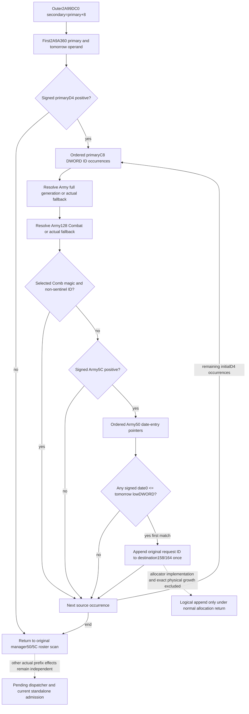
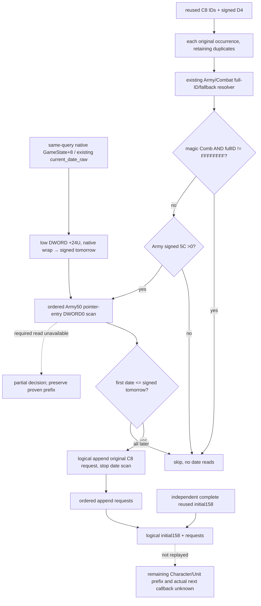

# Army pre-date tomorrow-context preparation — CK3 1.20.0.3

Source-only closure on2026-10-06 / W41, based on Root published04369827.
Exact CK3 1.20.0.3 / Steam25652598 / EXE SHA
`94b55397abb687a3dcd436805a5d885e6be90fa6c693feb44a9e3bbeeade02a6`
is reused. The source-first plan is frozen in
`Z:/ck3_mod_rewrite_process_assets/g2-background-20261006/pre-date-tomorrow-context-preparation/`.
The original source-closure package added no observer, mutator call, policy,
test, build or live action. The subsequent implementation candidate is recorded
below; its first checks remain pending Root integration.

The held outer`2A99DC0` first invokes`2A9A360(primary,tomorrow-date)` at
`2A99E91`, **before** loading its original primary+50/+5C Army occurrence
roster. Its callback receiver is secondary=primary+8;2A9A360 receives primary,
not secondary. [Current standalone admission](army-daily-assault-roster-admission-12003.md)
and [pending-list dispatcher](army-pre-date-roster-pending-update-12003.md)
qualify their own later stages with fixed current context. Neither replays
this preceding preparation or proves actual tomorrow's initial state.

## Held complete body and exact stage order

Entry and setter owners supplied existing cache locators before any body work.
No new EXE bytes were read. Reused files are under
`Z:/ck3_mod_rewrite_process_assets/g2-resume-20261004/army-monthly-update-order-v61/source-clock-new-spans/`:

| Held receipt | Complete reused extent |
| --- | --- |
| `army-pre-first-dated-callee.json` | RVA2A9A360,39B, SHA `cd4f51a7fc8c52e5ee8372b7bd331e5b17a4362b058165aa6ab7075c9381b924` |
| `army-pre-first-dated-continuation.json` / `.asm.txt` | RVA2A9A387,521B, SHA `310a7bb0cce00224820f201e84eb1007cb5588245be4ed62652a1669ed3ea936`; chained unwind returns to the entry record. It includes the tail at2A9A583, RET2A9A58C and three padding bytes. |

The combined held span is560B,557B through RET plus3B padding. A short first
pdata fragment is not the complete function. The outer1438B body and its
selected568B dispatcher reuse already have independent closure; they were not
recaptured or rehashed here.

1. At2A9A36A, sign-extend primary+**D4** and fix that source occurrence count.
   Count<=0 returns immediately. Otherwise initialize the occurrence index0;
   source IDs are DWORDs in primary+**C8**, independent of original roster50/5C.
2. Resolve each requested full Army ID through registry`5D1DE48`: low24 index
   below registry+2C, stride16 slot pointer+8 from registry+20, nonnull pointer
   and selected Army+10 equal to the full request. Failure selects actual
   fallback`5D1DE50`. There is no extra Army magic rejection after fallback.
3. Resolve selected Army+**128** Combat through registry`5D1DE70`, fullID+8,
   fallback`5D1DE18`. Only selected magic+0C=`436F6D62` (`Comb`) **and**
   selected ID+8 !=`FFFFFFFF` skip this occurrence. Fallback is an actual
   selected object whose fields matter, not an automatic missing/skip result.
4. Otherwise sign-extend selected Army+**5C**. Count<=0 skips. Army+**50** is
   an eight-byte **pointer** array here, unlike the manager's DWORD ID roster.
   Dereference each entry pointer and compare its first signed DWORD with the
   low signed DWORD of the supplied tomorrow-date operand. First
   `entry_date <= tomorrow_date` selects one append; if all dates are later,
   skip. The body does not identify the date-entry object's wider lifecycle.
5. At2A9A46E, append the **original source request ID**, not selected Army+10,
   to destination DATA primary+**158**, count+**164**. It appends once per
   qualifying source occurrence, even when several dates qualify. Native
   occurrence order and duplicate IDs remain intact. The capacity+160 and
   allocator+168 are physical vector fields described below.
6. Increment source index and repeat against the initial fixed D4 count.
   Return before the outer original50/5C roster scan, pending mutator,
   remaining Character/Unit prefix and standalone2A99B40 admission.

## Direct side effects and distinct collections

This body does not clear sourceC8/D4, decrement its count, mutate the date-entry
objects, write the Combat/Army identity, or alter the manager's original50/5C
roster. Its direct logical side effect is the destination158 ordered
append. In particular, destination158 is **not** round21's removal vector at
primary+68, and not its pending map atprimary+130. Their identities must remain
separate until their actual consumers are composed.

This gives a useful local composition result: with fixed same-capture
nonphysical context and normal allocator return, this prefix alone preserves
the removal68/74, pending130 and original roster50/5C operands used by the two
existing entrances. Compose its ordered destination158 requests separately;
do not invent changed removal/pending values merely because an earlier call
exists. This invariant does not cover the later Character/Unit prefix or make
today's observations an actual tomorrow capture.

With destination count!=capacity, the direct arm writes one DWORD and increments
count. Equality alone selects the growth arm, not an invented >= predicate.
That arm calls existing allocator virtual slot+8 with four-byte alignment,
writes the new request, copies existing count DWORDs, calls slot+10 on old DATA,
and installs new DATA/capacity/count. Registry pointers are reloaded after these
calls. The held instructions derive capacity with float32 literal at49F6400;
this package does not capture the literal or inspect allocator/growth bodies.
Normal allocation return is an explicit logical-projection assumption, not a
claim about physical capacity, addresses or allocator outcomes. No named direct
gameplay callee is missing: the only calls in this complete body are those two
indirect allocator operations, which are outside the requested audit scope.

## Minimum constructible readonly observation packet

Reuse the existing Army/Combat generation resolvers and owner-bound Strength
query when Root commissions a collector. Read operands; **never invoke2A9A360**
from a readonly bridge. Store actual source occurrences and selected fallback
fields, rather than replacing failures with sentinel guesses.

| Family | Exact minimum input and purpose |
| --- | --- |
| Bound stage context | Existing exact-build/owner/snapshot identity, primary receiver identity, explicit supplied tomorrow-date low signed DWORD. Do not substitute a later post-date snapshot or infer this operand by adding24 to today's exported raw date. |
| Source occurrence list | Actual signed primaryD4 and complete ordered primaryC8 full DWORD IDs, including duplicates. Empty/nonpositive native source-count arm does not demand row resolvers. |
| Per-occurrence selected Army | Original requested full ID/index, actual generation/fallback selection and selected Army+10. Capture Combat request128; selected ID is retained separately because the appended value is the original request. |
| Combat branch | Actual selected Combat magic0C and fullID8, including fallback. A valid Comb/non-sentinel arm requires no Army date vector. |
| Date branch | Only if Combat does not skip: signed Army5C; if positive, ordered pointer50 entries and their signed DWORD0 dates. Preserve observed pointer/read availability and complete native count; missing demanded entry data is partial, not “no due date.” |
| Optional full logical state transform | Actual initial destination158 ordered IDs/count164, independent of sourceC8 and removal68. Append-request decisions can be emitted without inventing this initial queue; a complete resulting logical queue additionally requires it. |

The smallest useful pure entrance is **observed-current dated-append stage**
with an explicit tomorrow operand and fixed same-capture nonphysical context.
Emit each occurrence's branch reason, first matching date ordinal if any, and
ordered append request `(source_ordinal, original_full_id)`. If the initial
destination is observed, concatenate requests in order and apply native32-bit
count increments. No extra deduplication or selected-ID substitution is valid.

For example, original IDs `[A,A]` resolving twice to the same fallback with
invalid selected Combat and one due date produce two append requests for A.
An occurrence with three due dates produces only one append. A valid selected
Combat produces none and demands no date-entry rows. These are source-derived
examples, not tests or actual tomorrow predictions.

This packet closes a concrete observation dependency preceding the existing
standalone admission/pending entrances. It does not yet replay the later
Character/Unit callbacks, identify destination158's wider consumer, change
removal68 into destination158, or qualify the whole original pre-date stream.
Current observations are not relabeled as future state. Readiness is
**research/source-closed logical dated-append preparation and implementable
minimum observer plan**; native collector, pure qualification, actual mutation,
full daily/monthly and live remain incomplete.

Source ledger, raw-input schema and Oct6/W41 fields are in the external packet's
`SOURCE-LEDGER.json`, `MINIMAL-RAW-INPUTS.json` and `REPORT-FIELDS.json`.
New frozen EXE/code/metadata capture0, closed-body recapture0, tests/builds0,
game/process/Steam/UI/SDK/pipe/userdata operations0. The exclusive C sparse
checkout changes only this topic; Root owns adoption, shared reports and push.
## 2026-10-06 same-query tomorrow operand and minimum implementation contract

The held outer `army-pre-stage-entry.asm.txt` (the already recorded 1438-byte
receipt, with no new capture/hash) closes the caller operand. At `2A99DE3` it
loads the `5C68C50` GameState pointer; `2A99DF1` copies its QWORD at `+8` to the
local date. `2A99DFC` computes `LEA EAX,[RDX+18h]`, and `2A99DFF` replaces the
local low DWORD. `2A99E86` passes that local date pointer to `2A9A360`.
The later calendar-field writes do not change this low DWORD. Therefore the
actual comparison operand is `int32(uint32(GameState+8 low32)+24U)`, with native
32-bit wrap, rather than a date reconstructed from exported year/month/day.

The existing `ArmySupplyTimingSnapshot.current_date_raw` reads this exact
`GameState+8` native value on the paused strength query. The new observer must
reuse that same-query field when it is present (including a partial timing row
whose unrelated bucket scan failed). If no timing field was collected, it can
read the same native `GameState+8` through the existing read-memory helper.
The observer publishes the native raw clock, the signed tomorrow low DWORD,
and their source together. A clock read failure remains independently partial;
it cannot prevent the source-count `<=0`, valid-Combat, or date-count `<=0`
branches from being decided without any date comparison.

The implementation family is `current_pre_date_dated_append_inputs_v1`.
Its read-only collector reuses the existing Army/Combat full-generation
resolver and `monthly_first_removal_cleanup_inputs_v1`'s already captured
ordered `c8` and `158` lists where present; only the corresponding signed raw
counts are additionally read. A supplied partial reused list stays partial.
The source order and duplicate original request IDs survive every conversion.
Initial `158` contents have an independent readiness flag and never gate the
ordered append-request calculation.

For each source occurrence, the selected Combat's actual magic/full ID are
read first. Valid `Comb` skips all Army date-count/pointer/entry reads. Otherwise
the signed Army `5C` count is read; a nonpositive count skips the date array.
Positive counts demand the native `Army+50` pointer array in order and stop at
the first readable date DWORD `<= tomorrow_low` (signed), without reading its
tail. No append decision is guessed past an unread required entry.

The pure value publishes the complete append-request stream or its proven
continuous prefix, independent later decisions, and a complete resulting
logical `158` list only when both all decisions and initial `158` are complete.
It preserves original requests on fallback and repeated requests. It makes
zero native calls/writes and models no allocator, physical growth or wider
date-entry lifecycle. `50/5C`, `68/74`, and pending `130` remain preserved by
this prefix alone. This does not replay the remaining Character/Unit prefix,
prove an actual next callback, or make a full daily-assault forecast ready.

The owned implementation candidate contains a DTO/serializer, header-only
collector, strict transport, pure value, a new production Strength/native-wire
fixture, and one new nonempty complete-service compound. Proposed shared hooks
and CMake target are external only in
`Z:/ck3_mod_rewrite_process_assets/g2-background-20261006/pre-date-dated-append/`;
Root must merge them into coherent current source before the **first** new
checks. The compound uses distinct C8 dated IDs and current primary50 roster
IDs. Its nonempty pending/current admission/current placement results remain
independent current entrances; it does not label current admission as a replay
after pending writes or after the remaining unknown Character/Unit prefix.

The new native target is `xar_bridge_pre_date_dated_append_12003_test`.
The new Python method is
`PreDateDatedAppendServiceTests.test_nonempty_dated_append_same_query_current_pending_admission_and_placement`.
The fixture also exercises partial initial158, unread required dates, and a
missing clock with independently valid Combat/nonpositive-count skips. It emits
small production Strength rows for the same new compound to consume.
Python syntax and source diff checks are the only checks performed by this
lane. Native build/CTest and complete-service execution are still pending;
this candidate has no fixture-live, production-live or full-callback claim.
