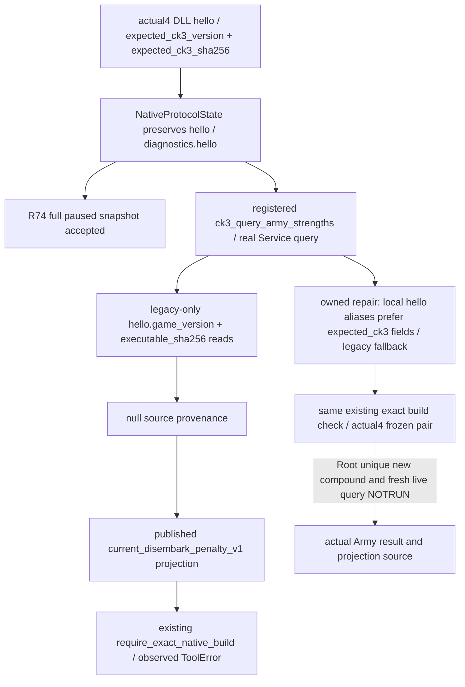

# Army private query hello identity migration - R74

This is an observed production metadata binding failure, not a new native input or counter-policy. Source is frozen runtime24b `1e2eb75646b22bb4c95397e4a35f88bb99baa0af`, owned repair tree `C:/codex-ck3-background/parallel-integrations-20261007/commander-army-strength-r74-source-repair`. The retained R74 ordinary Robert29829 context is H9638/date53288448. Root owns the actual game, retained SDK and subsequent execution; this source package performs no game, SDK, process or MCP call.

The saved response `Z:/ck3_mod_rewrite_process_assets/g2-background-20261007/upstream-build-migration/managed-full-h9638-startup24crestore01/operator/gameplay-responses/003-runtime24c-army-full-calendar-readonly.json` records `ck3_query_army_strengths(army_ids=[218104048], expected_revision=3)` failing with `native source does not match a frozen exact build`. Preserve that RED. The existing successful `001-restored-h9638-paused-snapshot.json` in the same directory has snapshot `native:2`, public revision3/native revision2, paused=true/date53288448. Only its small source/hello metadata was used; no save body or large retained driver/history was read.

Its top-level `source` is the transport string `injected-dll-named-pipe`. The actual identity is `diagnostics.hello.expected_ck3_version=1.20.0.4` and `expected_ck3_sha256=98702F88A547CDE2EAF29A85F93B85F68EE4CF8148336A4F7AFAEB75319DD518`, with adapter `ck3-1.20.0.4-msvc-x64`, ready status and `ck3_build_match=true`. Driver ingestion and diagnostics retain the native hello unchanged. Neither the Driver constructor nor the MCP loader takes an old version/SHA argument; an old constructor default is not the cause.

The concrete source path is `bridge/mcp_server.py:2632` to `Service.query_army_strengths`. Service executes the existing native query at original `service.py:4568`, then obtains diagnostics.hello at :4591. Its result source at :4637 and projection provenance, including :4714, read only `game_version`/`executable_sha256`. A published current-disembark leaf enters `army_current_disembark_penalty_contract.py:54`, which calls `require_exact_native_build` without wrapping that ValueError. `version_identity.py:52` emits the unique observed literal when both supplied values are null. The exact actual4 version/SHA pair is already in that module at :33-37, so no allowlist change is needed.

The minimal repair copies only this query's local hello mapping and supplies those two legacy output aliases from `expected_ck3_version` / `expected_ck3_sha256`, with the existing legacy fields as fallback. This matches the established field preference in `nonwar_private_build.private_native_build_identity` at :39-42. All existing source/provenance reads in this one query then receive the real frozen4 pair; the original snapshot/hello and native row payload are untouched. Exact-build checks remain intact, no4 hash is relabeled as3, and no source check is removed or widened. MCP arguments, DTO schema, native layout and native code are unchanged.

The unique new regression is authored against the saved actual001 metadata and original R74 arguments. It uses a declared synthetic readonly DTO Driver, the real registered MCP route, production Service and published disembark projection with the actual strict identity checker. It does not call an old test or native producer and does not claim its synthetic row is a retained R74 native Army wire. Root alone executes that new single-method compound once; its first receipt and any subsequent real query stay separate from the preserved003 RED. At source delivery both are NOTRUN.

Python Service code must be loaded by the retained SDK before a new query can use the fix; a source edit does not replace an already loaded method. Root may load the candidate through its existing managed SDK continuation while retaining the same game/DLL and original state. There is no native translation unit, DLL, EXE, detour or game-restart requirement from this delta. A new successful actual query is still needed before claiming the R74 capability fault is resolved live. Existing formal commander offline GREEN1+3 and native whole producer evidence are not replayed here.
