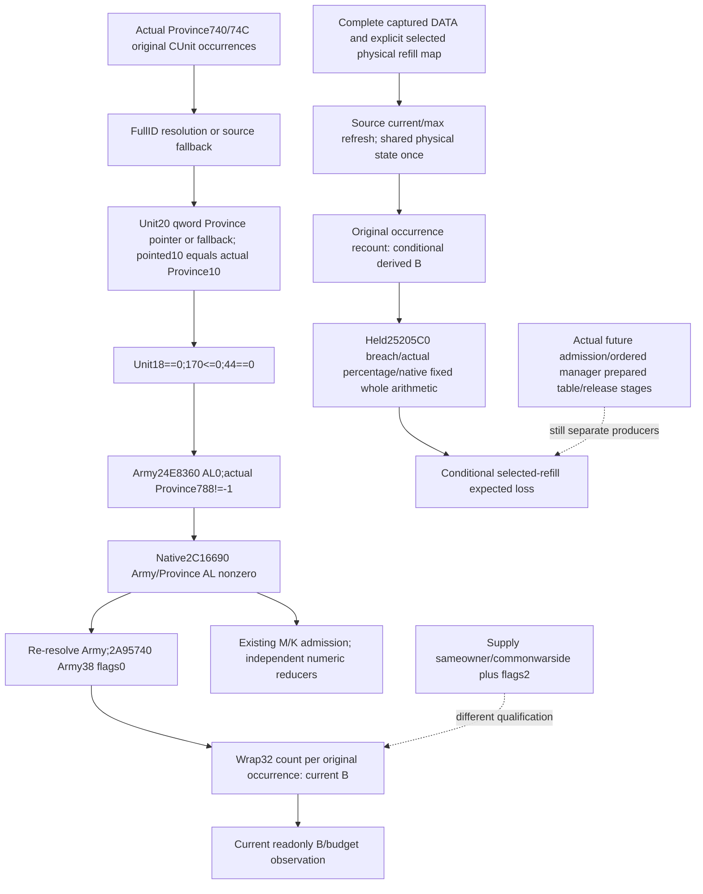

# Province eligible besieging current and post-refill assault budget — 1.20.0.3

2026-10-06 / W41. Exact CK3 1.20.0.3 / Steam25652598 / held EXE SHA `94b55397abb687a3dcd436805a5d885e6be90fa6c693feb44a9e3bbeeade02a6`. Scope was sealed before source work in `Z:/ck3_mod_rewrite_process_assets/g2-background-round15-20261006/assault-eligible-current/SOURCE-FIRST-PLAN.md`. This first delivery is source and implementation plan only; no new test, native build, SDK/pipe/game/Steam/UI/process/profile/save/runtime operation or live day. The [actual manager stage](army-monthly-manager-prepared-stage-inputs-12003.md) calls the daily prepared-assault consumer after optional monthly refill and before the monthly bucket. That consumer's `25205C0` budget depends on the current `247F1D0(Province)` result, which cannot be backdated from an earlier scalar.

## Exact B getter and occurrence contract

The necessary direct body `[247F1D0,247F364)` is404B, SHA `e82208c52be2ff4592a030f5b4384b3c3d9e3cfed34d778b70ce7a80ab15bf95`. Existing reviewed Province ABI supplied the entry signature only; the held M/K projection ended at this entry and the current-tick source referenced its call without the body. The old episode03 D: proof locator is unavailable. The completed cache search preceded the one bounded frozen-body read. Exact pdata/unwind fragments and read ledger are sealed in `SOURCE-0247F1D0.json`; actual I/O692B is404B code plus288B metadata, without new PE mapping, full EXE scan/hash or rereads of manager/25205C0.

`247F1D0` initializes signed32 B=0. Province+74C count≤0 immediately returns that zero. Otherwise it captures original count and traverses Province+740 DWORD CUnit FullID occurrences in stored order, preserving repetitions. Each occurrence:

1. Resolve CUnit via storage `5D1E380`, masked24-bit index and fullID at+10; unresolved uses native fallback `5D1E378`.
2. Load **qword Province pointer** from CUnit+20; if null, use Province fallback `5D1E390`. Compare that resolved Province's DWORD+10 with the actual caller Province+10. Do not compare low32 bits of the pointer with a ProvinceID.
3. Require raw CUnit DWORD+18=0, signed DWORD+170≤0 and DWORD+44=0. Resolve CArmy from CUnit+178 through `5D1DE48`/fallback `5D1DE50`.
4. Require `24E8360(CArmy)` AL=0, actual Province+788!=-1 and `2C16690(CArmy,actualProvince)` AL!=0. The complete native Province relation predicate is the existing [siege membership source](siege-efficiency-inputs-12003.md), not a guessed owner or lead-Army test.
5. Resolve that CUnit's Army again after the predicate, form its **Army+38 descriptor** and call `2A95740(descriptor,flags0)`. Add its EAX to B with signed32 wrap. There is no positive-current filter or final clamp in this getter.

The outer admission is the same source-defined admission used by M/K. The consumed numeric reducer differs: B sums whole current with flags0; M uses effective siege work times normalized current; K reads qualified type tiers. Current B includes every valid ArRg count admitted by flags0, without the supply eligibility or preferred tier tests. Both Province and Army/ArRg occurrences remain repeated contributions even when they share physical DATA. No lead-army equality or merge requirement is added.

The supply collector consumes the same resident Province list but admits same-owner/common-war-side contributors and counts flags2 supply-eligible current. That does **not** prove the B admission, even when its count happens to agree. A supply-qualified row cannot stand in for a siege-qualified row or vice versa.

## Necessary existing membership correction

`ReadSiegeProvinceUnitOccurrences` in `ck3_12002_province.cpp` currently compares `Read<int32_t>(unit,0x20)` against Province+10. Its source-defined operand is the qword Province pointer above. A real pointer whose low32 is not the ProvinceID is therefore incorrectly excluded by this current observer, independently of its native M/K scalar getters. The incorrect observer can report false/[] for actual qualifying membership; its historical owned-memory fixture is not evidence for the corrected pointer layout. Existing native B/M/K scalar getter correctness is not reopened.

The direct production call is `ReadObjectiveProvince` after its rich active-Siege resolution, and that DTO feeds occupation/objective/local-siege wire through the existing normalizer. The minimal correction changes only this helper's Province operand: load qword Unit+20, apply the exact `5D1E390` null fallback, then compare the pointed Province+10. If the required pointer/fallback cannot be read, keep membership unavailable. Preserve other qualification/list/null/repeat behavior. Old owned-memory fixture inputs that stored an ID at Unit+20 must be changed to a real Province pointer with+10 ID; old tests are not rerun in this lane. One new fixture will qualify the corrected production path.

## Smallest useful same-query B collector and conditional consumer

The existing ArmyStrength row already resolves its actual current Province pointer and publishes supply contributors and complete DATA/current/max math. The existing occupation membership identity list is insufficient for post-refill B: it belongs to a separate capture/scope, does not publish each flags0 numeric current or full associated DATA, and presently has the pointer gate error. Add a separate optional **`current_province_besieging_contributors_v1`** family to the same ArmyStrength capture; retain the existing supply family.

| Family value | Exact producer / purpose |
| --- | --- |
| Actual current Province/active Siege identity and original resident count | Existing validated ArmyStrength current-Province context, Province+10/+788 and generation-resolved Siege+8/+200. Preserve no-Siege separately from failed resolution. |
| Signed native B scalar | Existing readonly `247F1D0(actualProvince)`; preserve signed wrap, real0 and unavailable independently of contributor readiness. |
| Original CUnit occurrences | Stored index/rawID, resolved or native fallback identity, actual current-Province pointer/fallback basis and the raw gates; current exact24E8360 and2C16690 bools. Resolve each necessary receiver from the actual source route. |
| Per-admitted Army count and ArRg occurrences | Readonly `2A95740(Army+38,flags0)`, raw/resolved Army ID and its original ArRg list. Publish signed current/max and existing complete DATA for every valid admitted ArRg, including DATA character override. No supply/tier filter. |
| Current assault context | Same actual Siege Province/breach, source-loaded casualty table length and indexed signed Q100000 percentage; existing native25205C0 current whole return. This is an independent current expected-loss scalar, not an assertion that the assault stage executes. |

A new pure consumer keeps current observed B and conditional derived B separate. Reuse the existing source-closed associated-refill physical output and `project_observed_raised_regiment_refresh` for its DATA sums. For an explicit selected physical replay, carry the complete evolving physical map into every admitted ArRg refresh, retaining DATA aliases and repeated Province/ArRg counts. Merge unchanged captured physical chunks as the stated fixed-context input, rather than dropping rows outside the selected persistent scope. Recount each Army flags0 and Province B in original occurrence order with signed32 wrap. Do not apply a second refill ADD when two occurrences share physical state.

Conditional assault expected loss uses that derived B and the actual captured breach/loaded percentage with the already held25205C0 signed native fixed/whole arithmetic. B≤0, no valid Province, or breach−1 outside the loaded table are source zero paths and do not demand an unused table entry. Current predicate/context is explicitly fixed; actual post-refill admission, actual prepared table, full native ordered refill and full daily assault manager execution are not implied. The independently useful outputs are observed current eligible B/contributors and an explicit selected-refill conditional B/budget with actual/fullmonthlyfalse and actual post-stage null.

## Source-first tree and qualification recipe

First commit only this source/topic and external QUERY-PLAN. Coordinator review precedes implementation. The necessary new native fixture covers the production membership helper with a real non-ID-low32 Province pointer, match/mismatch and required null/fallback paths, together with the new B collector, flags0 versus supply flags2, duplicates and shared DATA. Coordinator compiles the full DLL/new target, runs its first new CTest and authorizes first consumption of its newly serialized wire. One new production Python compound covers nonzero refill, changed B/expected-loss, repeated occurrences/shared physical ADD once, and partial/source-zero branches. No old component tests/wires receive another run or credit. The next prepared-table placement2AA2030/release9D11F0 remains outside this numerical leaf.

## Implemented candidate and first new production qualification — 2026-10-06

The implementation adds `current_province_besieging_contributors_v1` to the existing readonly ArmyStrength capture. It publishes native current B and current assault expected loss independently from the original resident occurrences, flags0 Army/ArRg counts and complete DATA. Native source fallbacks, the second Army resolution after qualification, signed counts, real zero and unavailable values remain distinct. The B capture precedes `current_land_resupply`; it does not overlap the scoped ordered-core end-of-DATA hook. The production membership helper now loads the actual Unit+20 qword Province pointer, applies the source Province fallback and compares pointed Province+10. Its historical fixture input was corrected to a pointer without executing that old fixture.

`GameplayBridgeService.query_army_strengths` normalizes the optional family and publishes `same_input_conditional_post_refill_besieging_current_v1`, aligned with selected Army rows. It reuses the already computed selected refill assembly's explicit final physical output. `project_post_refill_besieging_current_v1(army, selected_physical_chunks=...)` merges unchanged admitted B DATA physical slots, overlays that output once by persistent ID/physical chunk index, refreshes each complete ArRg DATA and recounts flags0 Army/Province occurrences with wrap32. It performs zero refill ADDs. Repeated DATA, ArRg and resident occurrences retain their native numerical effects; unchanged chunks outside the selected physical scope remain in the stated input map. An unavailable modeled physical slot replaces its original value with unknown. `None` means the required explicit replay was not supplied; `[]` means an explicit unchanged map. The same API can consume a separately qualified ordered-core final physical map in a later integration, without executing selected-once ADD again.

The first new production service compound passed once: B754→874 and conditional assault expected loss75→87, while the distinct supply flags2 usage changed320→360. It covered shared physical state, repeated Province/ArRg/DATA contributions, unchanged nonselected physical chunks, selected overlays once, partial DATA, legitimate source-zero branches and signed arithmetic. The original GREEN run remains frozen and was not rerun. A necessary targeted integration read then found the actual native early-unavailable DTO branch: resident count is null and default ProvinceID−1 is unreadable metadata. The new normalizer/kernel now preserve that unknown branch instead of throwing on a numeric comparison or claiming a source-zero result. Only its new focused production method ran once after the minimal correction; both receipts and exact source snapshots are retained externally.

The native candidate is not yet qualified. Coordinator owns full DLL compilation, the first new `xar_ck3_12003_current_province_besieging_contributors` CTest and first consumption of its five new actual serializer wires. The Release fixture uses explicit throwing checks and the external recipe supplies /UNDEBUG and /W4 /WX. Its cases cover production pointer match/mismatch, matching/null-missing fallback, stable same-query capture, B versus supply flags, repeated full DATA, partial associated DATA, legitimate empty count and additive older-producer absence. Historical membership qualification does not qualify this corrected layout. No old component test or wire was rerun.

This is source-closed current observation candidate plus bounded pure conditional computation. Captured eligibility, Province/Siege identity, breach and loaded percentage remain explicit premises; the computed values are not a new paused observation. `actual_replenishment`, `actual_loss`, `actual_effects`, full regular refill, full daily assault and full monthly readiness remain false, with actual post-stage values null. The prepared-assault roster/table placement2AA2030 and release9D11F0 are concrete later inputs; no complete daily assault-manager or full monthly execution is claimed. This implementation added zero frozen EXE bytes, native builds/CTest/wire reads and game/SDK/pipe/Steam/UI/process/profile/save/runtime operations.

## First compiled native and five-wire qualification — 2026-10-06 13:02 +08

Coordinator qualified the intended full DLL and both new targets at immutable source `62f3965520c3d849ceabea624f3979cbf032eed0`, `C:/codex-ck3-background/ordered-core-assault-batch/g90-fix02`. The first strict01 build at066cfaa0 was RED122.061945s because the separate scoped-core fixture omitted its integer-array serializer argument. That attempt was retained and ran no CTest/wire consumer; this B collector/fixture had no reported compilation failure. The necessary strict02 correction passed native compilation121.900624s. The first two new CTests passed2/2, elapsed0.2911189s, completed2026-10-06T05:02:24.223369Z. The B target is `xar_ck3_12003_current_province_besieging_contributors`; no historical membership fixture was rerun.

The authorized consumer then ran exactly once against that immutable production source tree and five newly compiled production serializer wires. It passed5/5 from13:02:55.581869 through13:02:58.396322+08, elapsed2.8192919s. `pointer-match-aliases` and `matching-province-fallback` both retained observed current B352/current expected loss8 and produced conditional B381/expected loss9. Both used the production selected-refill union's explicit physical output; the consumer's fallback physical construction was unused. The required missing Province fallback and missing associated DATA cases preserved valued current B while conditional B/loss remained partial. `empty-zero` kept native and conditional real zero ready. Original resident repetitions, complete DATA aliases, captured fallback witnesses and actual/full-monthly boundaries survived the production normalizer/service/kernel path.

The immutable CTest receipt is `C:/codex-ck3-background/ordered-core-assault-batch/strict02/FIRST-TWO-READONLY-CTESTS.json`, SHA `17e50aeae9b2daf3ca28dd2511f312857ee09fb24c36e6c8953d8cb1b3bbe963`. The first-consumption receipt is `Z:/ck3_mod_rewrite_process_assets/g2-background-round15-20261006/assault-eligible-current/native-first-five-qualification-01/CONSUMER-FIRST-RECEIPT.json`, SHA `15f5df69bedf0b084f744897d6f22e91476c3a2cdce29d142577581dfca9b0f4`. It pins all five actual native JSONs, the production source modules, consumer and actual service outputs. Zero original Python methods, old wires/tests, native builds, new EXE bytes or runtime operations were executed by this consumer.

The corrected pointer observer, typed B-family capture and conditional B/expected-loss consumer are now **bounded static-ready**, qualified by source and owned-memory production native/consumer fixtures. This is no game paused artifact, fixture-live, production-live primitive or complete monthly loop. Actual after remains null and actual replenishment/loss/effects/full monthly remain false. The independently useful next integration is a qualified scoped ordered-core final physical map→B→assault expected-loss join, without a selected-once ADD replay. Prepared-table placement2AA2030 is separately owned by the coordinator's entry-stage researcher; release9D11F0 remains a later source entry. No duplicate reads of those branches were added here.
