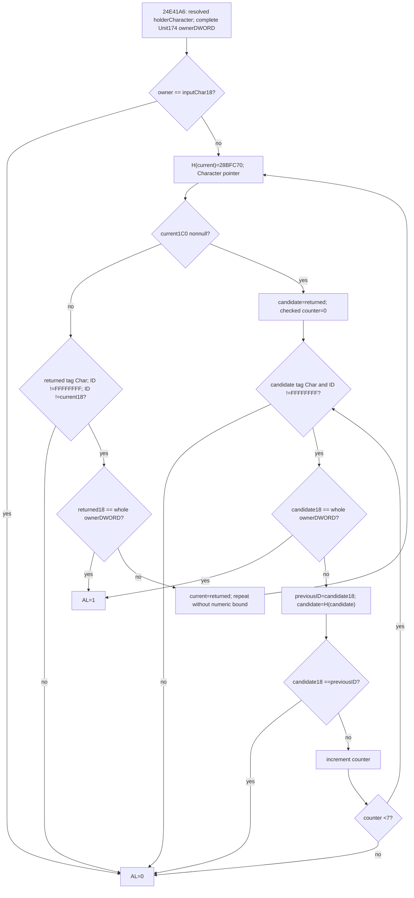

# Army20 shared-tail owner Character chain — CK3 1.20.0.3

2026-10-06 / ISO 2026-W41. **Research; source-only.** This closes the actual unequal-holder call `24E41A6 → 28B2820(holderCharacter*, complete selectedUnit174 ownerDWORD)` in the [Army20 shared tail](army-refresh-tail-and-condition-verdict-inputs-12003.md). It reuses CK3 **1.20.0.3 Crozier / Steam25652598**, EXE SHA `94B55397ABB687A3DCD436805A5D885E6BE90FA6C693FEB44A9E3BBEEADE02A6`. No new hash, runtime query, observer, gameplay action, build or test is performed. The independent [current Army30 observer](army-current-condition30-observer-12003.md) remains a separate implementation/qualification package.

## Exact source and cost

Root reviewed the finite metadata request, then the exact body request before each capture. Pdata index139725 gives **`[28B2820,28B28C0)`**, 160 bytes, unwind `5109D5C`. Twelve uncached aligned pdata points cost **144 new metadata bytes**; the selected four-byte header `010f0600` was already held and reused. Version1/flags0 has no CHAININFO. The body was captured once and decoded continuously: **160 actual unique code bytes, 160 credited instruction bytes, duplicate0, uncredited0**. No neighbor, unwind slot, handler, chain or transitive EXE byte was read.

The sole direct helper is `28BFC70`, already sealed in [immediate_liege_self_12003_abi.json](../../ck3_autonomous_player/native_bridge/research/immediate_liege_self_12003_abi.json): complete118-byte getter, reused pin `d7675380a1279ba5242feb3bb6053302519af85c32e56e2338ea6015e76f545c`. A scoped cached lookup followed the [selected Character canonical topic](battle-knight-effectiveness-context-12003.md) to that metadata. Its retained hex was decoded without accessing the EXE. No new helper extent or binary capture is needed.

This increment costs **304 new unique EXE bytes =160 code+144 metadata**. The prior wrapper/tail package remains **1288 actual code /1282 credited /236 metadata /6 uncredited padding**, including its preserved decoder RED. Combined source cost is **1448 actual code /1442 credited /380 metadata /6 uncredited padding =1828 actual unique EXE bytes**, duplicate0. The separate metadata-request preparation attempt had a Python syntax RED before execution, **0 EXE bytes**, retained as harness preparation rather than capability failure. No validation case was run or credited.

## Actual full-DWORD relation predicate

`28B2820` copies EDX into EBX without masking, so every owner bit is retained. Equality to the starting Character's raw `+18` returns **false**. This is a strict selected-chain membership test; it does not include its starting Character. The actual tail calls this function only after its own holder-ID inequality, while the earlier tail equality branch returns1 itself.

Let `H(C)` be the actual `28BFC70` selected Character getter. The initial loop calls `H(current)` at `28B2843`, then checks `QWORD[current+1C0]`. With that pointer zero, it requires returned Character tag `+1C ==43686172`, full ID `+18 !=FFFFFFFF`, and returned ID different from the current ID. A failed check returnsfalse. A complete-ID match to owner returnstrue; otherwise the returned Character becomes `current`, and the loop repeats. **There is no numeric iteration limit on this zero-component branch.** Source has a local same-ID stop, not a generic cycle-detection guard.

Once the current Character has nonnull `+1C0`, the function enters a different loop. It checks at most **seven selected candidate Characters**. Each candidate must have the Character tag and ID other thanFFFFFFFF; a full owner-ID match returnstrue. If unmatched, it calls `H(candidate)` at `28B288B` and compares the newly returned raw ID against the preceding candidate ID **before** a new tag check. Same ID returnsfalse. After the seventh unmatched candidate it performs this final helper call/comparison, increments the counter to7, and returnsfalse without testing the eighth candidate for owner membership. Thus this branch has one initial helper call and up to seven advance calls; it cannot be modeled as seven calls or eight checked candidates.

The inspected body makes no persistent data write; its stores save/restore stack registers. It calls only the cached selector, which has no call or persistent write. This source closure names the actual chain test and source order. It does not infer an interaction command, all historical ownership relationships, Army21's own wrapper, or a completed future refresh.

## Reused selector and demanded raw inputs

`28BFC70` reads both `Character+1C0` and `+1B8` before its branch. A nonnull `+1C0` reads `carrier+1C0 → relation+28` and returns that Character only when its tag isChar and its fullID is notFFFFFFFF; otherwise it returns the original Character. The getter has no extra null check on the landed relation chain. The native valid-object assumptions remain source facts; an observer's genuinely unread pointer must be nullable/unavailable, not fabricated as self.

For null `+1C0`, null `+1B8` or null Character store `5C67568` uses actual fallback `5C67570`. With courtier and store present, it reads employer fullDWORD at `courtier+C8`, uses low24 index only for the unsigned capacity check at store+2C, accesses rows+20/stride16/+8, and requires indexed pointer nonnull with complete `Character+18 ==employerDWORD`. Lookup failure selects the actual fallback. This getter does not check the employer Character tag; `28B2820` applies its own demanded tag check, or its earlier repeat-ID stop. No added positive-ID, high-bit, generation0 or fallback-ID gate belongs in this route.

| Consumer branch | Minimum raw inputs and order |
|---|---|
| Initial strict equality | Actual input Character `+18`, complete ownerDWORD |
| Every selector call | Actual current Character `+1C0` and `+1B8`; landed relation pointers/tag/fullID or unlanded employer DB/fallback route |
| Zero-component continuation | Current `+1C0`, returned tag/fullID, current fullID, whole ownerDWORD; preserve native occurrence order |
| Component-present candidate | Returned tag/fullID and whole ownerDWORD; seven checked candidates maximum |
| Candidate advance | Actual selector output raw fullID, preceding candidate raw fullID; repeat-ID comparison precedes next candidate validation |
| Return | Exact nativebool/rawAL0or1 and source return reason; missing read is distinct from availablefalse |

The source [Army20 prefix and tail](army-refresh-tail-and-condition-verdict-inputs-12003.md) remains the caller input tree: Army1D4, signedArmy1E0 or carrier headerBC, repeated Unit full-generation/fallback selections, Province tag, Title holder or tier1 parent holder, Character full-generation/fallback, and complete final Unit174 ownerDWORD. The direct holder==owner branch still returns1, so the strict helper's input-equalityfalse must not replace the whole tail result.

## Minimum future same-query observer handoff

Use the existing same-query post-admission ordered raw roster and selected physical Army source, with the established source resolver and physical-identity match. Preserve duplicates and exact fullDWORD references. The future independent Army20 family should publish the actual current branch inputs and current raw0/1 result, keeping observed cacheArmy20 separate. It should borrow existing Unit/Province/Title/Character DB bindings and the source-closed selected Character getter, retaining each real registry/fallback classification rather than adding an ID admission rule.

At the new relation seam, retain `holder_character_full_id_u32`, `unit_owner_174_raw_u32`, nullable `native_current_owner_chain_passed`, and an ordered chain-input array. Each actual selector occurrence records source/returned physical identity tokens, source carrier/courtier branch, employer full reference when demanded, registry/fallback selection, returned raw tag/fullID, and native branch/check index. Record which of the seven candidates was checked, the final advance ID when present, and the exact stop reason; do not conflate that final advance with an eighth checked candidate. A nativefalse is an observed value. Unread materialization/selector/operand yields nullable reason and no derived result.

The implemented current Army30 condition family is independent. This document does not authorize or add a new provider, pure model, shared hook, schema, strategy or test. Root must review the full proposed Army20 DTO/API and actual branch plan before implementation. Future current-query values will not prove changed-stage operands after earlier numeric/Army20 stores, repeated refresh execution, complete callback/daily/monthly, game-day advance, or live operation.

## Artifacts and readiness

External source packet: `C:/codex-ck3-background/packets/army-current-condition30-implementation-20261006/separate-28b2820-metadata-plan/`. Exact receipts are `metadata-attempt01/28B2820-METADATA-ONLY-RECEIPT.json`, `body-attempt01/EXACT-028B2820-BODY-RECEIPT.json`, and `HELD-028BFC70-CACHE-REUSE-RECEIPT.json`; the body, contiguous assembly and branch/input ledger are retained there. Root owns shared Oct6/W41 reports, integration, formal qualification and publication.

Result: the actual Army20 tail's final Character/owner predicate and its sole selector are **source-closed**. Readiness remains **research**: no new observer/value is published and there is no new static-ready/live credit. The concrete next implementation dependency is the complete current Army20 family combining its already closed prefix/tail with this exact relation input seam. Army21's own entrance and future ordered refresh remain separate source dependencies.
