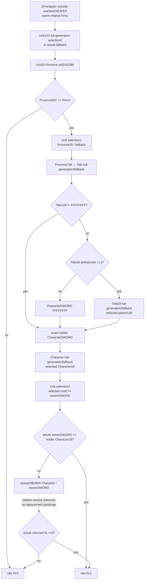
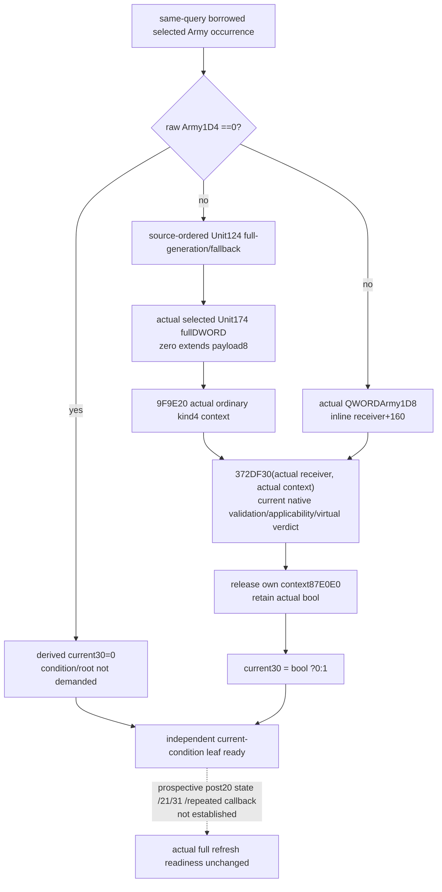

# Army refresh20 tail and30 current condition inputs — CK3 1.20.0.3

This source-only continuation of [the two byte wrappers](army-refresh-two-byte-flags-12003.md) closes the exact **479 B `24E3FE0` tail body** reached by Army20, and proposes a complete current-query observer for Army30's actual `QWORD[Army+1D8]+160` condition. The tail normalizes AL to0/1; one actual relation call remains explicitly unexpanded. The30 proposal covers both zero and demanded-condition branches using the existing exact.3 Character-root/evaluation APIs. No observer/model implementation, build, test, native execution or live read occurred. Status is **research / source and implementation handoff**, not static-ready.

Source baseline is `e7dba3ce71f5c0b7921b1b278e662599fe609f89`, itself based on `97192b2054beac4971f0e827abdc9d353ab4756a`. Exact game identity remains CK3 **1.20.0.3 Crozier / Steam25652598**, held EXE SHA `94B55397ABB687A3DCD436805A5D885E6BE90FA6C693FEB44A9E3BBEEADE02A6`, reused without hashing. All new artifacts are under `Z:/ck3_mod_rewrite_process_assets/g2-background-20261006/army-refresh-two-byte-flags-source/next-tail-and-condition-verdict-plan/`. `SOURCE-FIRST-NEXT-DEPENDENCY-PLAN.json` was sealed before this work.

## Finite cache and capture stages

The peer confirmed no newer exact `24E3FE0` body/metadata locator beyond the existing scoped-negative `DIRECT-NAMED-CALLEE-CACHE-LOCATORS.json`. Four named retained point caches were merged without EXE reads. The nearest cached records128841 and128901 bounded **59 remaining records128842..128900**. The Root-reviewed metadata-only request allowed at most six uncached aligned12-byte pdata points and a selected4-byte unwind header, **76 B maximum**. No broad cache search, PE/header/table/section scan or body extent inference from the caller was used.

Actual lookup used **four points48 B + header4 B =52 metadata B**. Record128852 has raw `e03f4e02bf414e02f0941005`, exact extent **`[24E3FE0,24E41BF)` /479 B**, unwind RVA51094F0. Header `01060200` is version1, flags0, prolog6, slots2 and noCHAININFO. Root then separately reviewed `PHASE-TWO-EXACT-TAIL-BODY-SELECTION-REQUEST.json` and authorized that exact479-byte body once. Its contiguous decode covers479 instruction bytes through the two real returns. No slots, handler, chains, neighbor, hash or transitive body was read.

Receipts are `phase-one-tail-metadata-attempt01/PHASE-ONE-TAIL-METADATA-RECEIPT.json` and `phase-two-tail-body-attempt01/PHASE-TWO-TAIL-BODY-RECEIPT.json`; source is `phase-two-tail-body-attempt01/SOURCE-024E3FE0.{bin,json,asm.txt}`. New actual/unique source cost is **479 code +52 metadata =531 B**, duplicate0. The previous **809 actual code /803 credited instructions /184 metadata /6 uncredited padding** remain unchanged. Combined stages total **1,288 actual code /1,282 credited instructions /236 metadata /1,524 actual frozen-file I/O B**, duplicate0. Preserve the previous no-pdata locator fact and original decoder harness RED separately; this attempt has no new RED.

## Actual shared tail receiver and branches

`2C4B902` restores the original Army to RCX and jumps to `24E3FE0`. The tail saves that RCX Army in RBX. It reads no prior numeric24/28 or Army20/30 cache field directly. Its one direct call is at `24E41A6`; until that call there are no direct persistent stores or external calls. This body also supplies a named dependency for later Army21; the caller's complete21 wrapper is not claimed here.

1. Load Unit store slot **5D1E380** into R10 and actual fallback **5D1E378** into R8. Resolve Army DWORD`+124` via low24/unsigned capacity`+2C`, slots`+20`, stride10, object pointer`+8`, whole UnitID equality at selected Unit`+10`. Store-null goes directly to fallback without demanding Army124. There is no additional sentinel or positive-ID gate.
2. Read selected Unit QWORD`+20`. Null selects actual Province fallback **5D1E390**. Compare selected Province DWORD`+85C` to **`0x50726F76` /Prov**. Mismatch returns AL0 at `24E41AF`; title/holder/owner/relation fields are undemanded.
3. The source repeats the same Unit selection using the held R10/R8 store/fallback, reads that selected Unit20 Province, and applies the same actual Province fallback on null. It loads Title fallback **5D1DAE0** and store **5D1DAF8**. A nonnull Title store demands selected Province DWORD`+738`; low24/capacity/slots/full Title`+10` equality resolves it. Otherwise use the actual Title fallback; do not supply a fabricated empty Title.
4. Read selected Title DWORD`+128`. If not `0xFFFFFFFF`, retain that exact holder CharacterDWORD. Otherwise read actual Title QWORD`+48`, then definition DWORD`+64`. Exactly1 follows selected Title DWORD`+E8` through the same held Title store/full-generation route, or actual Title fallback, and reads the effective selected Title128. Any other definition64 leaves holderDWORD=`0xFFFFFFFF`. The code has no null-definition shortcut.
5. Resolve that exact holderDWORD through Character store **5C67568** with whole CharacterID`+18` equality, or actual fallback **5C67570**. This path adds no positive-ID requirement; fullID0 and the actual `0xFFFFFFFF` input retain their native routing.
6. A third Unit selection uses the held Unit store/fallback and current Army124. Read selected Unit DWORD`+174` as ownerDWORD. Compare it directly with selected holder Character DWORD`+18`. Equality returns AL1 at `24E41B7`, without demanding the relation helper.
7. Only inequality calls **`28B2820(selectedHolderCharacter, ownerDWORD)`** at `24E41A6`, Windows x64 RCX Character pointer /EDX complete ownerDWORD. Returned ALnonzero returns1; zero returns0. The helper's business relation and transitive source are **unclosed**. No name-based alliance/liege/hostility substitution is made.

The three Unit resolution occurrences and their actual branch order remain in the input ledger. The source loads global Unit store/fallback once, so they are held across the repeated selections; preserve each selected/fallback association. The selected Title holder chain is source-proved raw data, not a Province73C shortcut. The existing [exact.3 landed-title scope](ck3-1.20.0.3-event-scope-landed-title.md) independently supplies the Title database identity; the [resupply admission topic](army-land-resupply-admission-12003.md) already references this same `28B2820` as an unexpanded helper. The new source/docs lookup found no expanded exact.3 body; this is a scoped result and not universal absence.

## Army30 complete current-query condition observer proposal

The [closed `2C4AB70` wrapper](army-refresh-two-byte-flags-12003.md) independently proves Army1D4zero→AL0. Otherwise it selects Unit124/full-generation/fallback, loads that selected Unit174 ownerDWORD, constructs kind4/subtype0/zero-extended payload8, and calls **`372DF30(QWORD[Army+1D8]+160, context)`**. Its normal return is inverse of the actual returned bool. Actual receiver/root are essential; neither Rule43's receiver nor a rules singleton/EF0/slot24 is used.

Existing exact.3 code supplies the required ordinary context/evaluation seam:

| Existing source/API | Reusable operation and boundary |
| --- | --- |
| `src/ck3_12003_task_position_inputs.cpp:102–125,319–328` and corresponding header | Existing `ConstructActorScope = void*(*)(void*,const int32_t*)` binds9F9E20; existing `Destroy = void(*)(void*)` binds87E0E0. Its scope owns aligned0x168 bytes, uses the actual returned context pointer and releases its own temporary context. No saved scopes are needed here. |
| `src/ck3_12003_pilgrimage_candidate_factory.cpp:46–74,198–206` and corresponding header | Independent exact.3 use of the same owner-fullDWORD constructor/destructor and ordinary `Predicate = bool(*)(const void*,void*)` bound372DF30. Reuse only these narrow signatures/lifecycle, not pilgrimage candidates, formatting/evaluators/named-scope inputs. |
| [Character-root validator](battle-person-rule43-character-root-validator-12003.md) | Held9F9E20 body213 B constructs kind4/subtype0/zero-extended fullDWORD payload8. Held372DF30 and372E020 preserve that actual root. The current kind4 descriptor performs native Character validation/fallback; do not pre-reject raw0/negative/int32-high-bit IDs. |
| [Condition evaluator shell](battle-person-rule43-real-admission-12003.md) | Current root validation, actual applicability and actual receiver virtual+C8 are evaluated by the native372DF30 call, with its current mode slot5D1DADC. No empty-count/manual Boolean shortcut replaces this evaluation. Rule43's own trigger/vtable/verdict remain unrelated. |

Proposed bindings add only exact.3 `construct_actor_scope`, `destroy_scope`, `evaluate_condition` and Unit store/fallback to the existing readonly post-admission refresh helper. Proposed API: **`ReadArmyCurrentCondition30Inputs12003(bindings, borrowed_actual_army)`**, returning an owned DTO, called within the existing native query's owning callback. It does not execute `24DF3C0`, `2C4AB70`, refresh stores, calendar updates or gameplay actions. The actual native evaluation is future implementation, not an operation performed in this source package. Context/evaluation APIs are reused by value/signature; their broad existing activity/task provider is not a dependency.

Proposed per-occurrence DTO **`ArmyCurrentCondition30InputsV1`** attaches to each existing `ArmyPostAdmissionRefreshOccurrenceV1` and contains:

| Field group | Exact meaning |
| --- | --- |
| Independent status/readiness/reason and `army_1d4_raw_u8` | Zero1D4 closes30 output0 with condition/root fields marked `not_demanded`. A failed raw read stays nullable/unavailable, not a false result. |
| `unit_resolution`, optional `army_124_raw_u32`, `unit_owner_174_raw_u32` | Preserve whole generation, actual fallback classification, native no-ID-read store-null branch, and source fullID0. Borrow the selected object's lifetime only inside this callback. Existing operand-resolution DTO shape/memory reader can be reused; its generic eager-required-ID helper cannot replace this source's branch order. Optional selected identity metadata does not become a new prerequisite for the native-demanded owner174 read. |
| `condition_owner_identity`, `inline_condition_identity` | Current QWORDArmy1D8 pointed object and its inline+160 receiver, represented with the existing occurrence identity convention. No trigger pointer-list, Rule43 proxy or serialized owning pointer. Null/unreadable demanded owner yields an ordinary unavailable reason; it is not interpreted as true/false. |
| `root_kind`, `root_subtype`, `root_payload_u64`, `root_construction` | Source kind4/subtype0; payload zero-extends the complete selected Unit174 DWORD. Construction provenance=`9F9E20_normal_return`; do not fabricate token4..7. |
| `native_current_condition_passed` | Nullable actual372DF30 bool using that receiver/root in this query. A native false includes actual root-validation/applicability rejection. It is a valid observed verdict, not an unresolved-owner error invented by this consumer. Missing binding/construction/evaluation stays unavailable with a reason. |
| `derived_current_30_raw_u8` / `current_condition_30_inputs_ready` | Zero1D4→0; otherwise actual false→1 and actual true→0. All demanded nonzero branches are supported. Separate from existing observed cache `actual_army_30_raw_u8`. |

Enclosing existing `native_index`, full requested Army reference, original Army selection identity/fallback, manager/roster and query snapshot revision/date provide association. Preserve duplicate occurrences and source order. Proposed minimal hook is inside `ck3_12003_post_admission_refresh.hpp` after selecting each borrowed Army; inline DTO/serializer are disjoint new files. Root owns integration/CMake/shared hooks. Existing army.cpp1218–1226 samples post-admission inputs once from the same current query and distributes that owned DTO to rows; this avoids a second MCP query or synthetic history.

This observer publishes a **current-frame** operand and its current-state inverse. It does not pretend to sample a historical stack context or predict a later changed state. Numeric24/28 remain independently owned; neither wrapper reads them directly, but the condition's transitive reads could depend on a future post20 world state. Therefore current-verdict readiness does not raise `actual_refresh_execution_ready`, `actual_next_occurrence_ready`, full callback/daily/monthly readiness, or establish unchanged inputs after earlier hypothetical stores. The ordinary bool is sufficient for the current condition decision without expanding every loaded trigger or allocator. No new global gate, policy or security audit is proposed.

## Next concrete dependency and delivery

The tail's sole actual source frontier is **`28B2820(Character*, complete ownerDWORD)`** on inequality. Only the named source/docs lookup and a held-cache locator request to the resupply owner were performed; no callee read is authorized by the479-byte parent capture. A newer held body/metadata locator should be reused first. If absent, the next work is a finite metadata-only request using the retained point caches, followed by a separately reviewed exact named extent. A pure model can already close invalid-Province and equal-ID branches; it cannot invent the inequality verdict. Future actual same-query native helper sampling can be considered separately once Root reviews this source/input tree.

The proposed30 observer is directly implementable with the existing exact.3 ordinary context/evaluator APIs; Root must review this tree/DTO before code. This package changes only its own topic and external plan/evidence files. Shared daily/weekly fields are supplied externally for Root, with actual Oct6 timestamps, research readiness, unchanged live credit, preserved RED, and source costs. Native/build/tests/local game/process/Steam/SDK/UI/pipe/live operations and Git push are all0.
