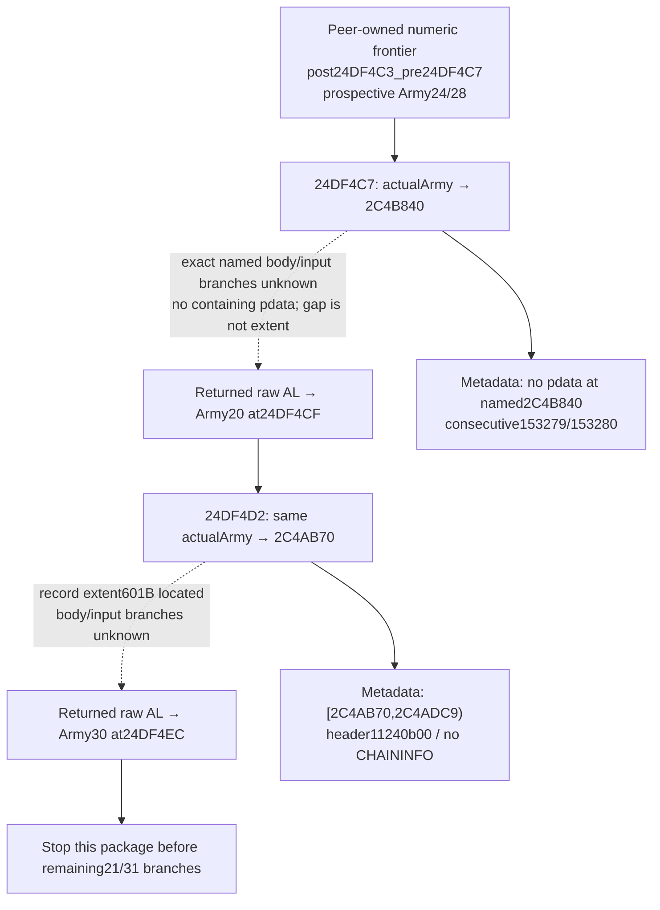
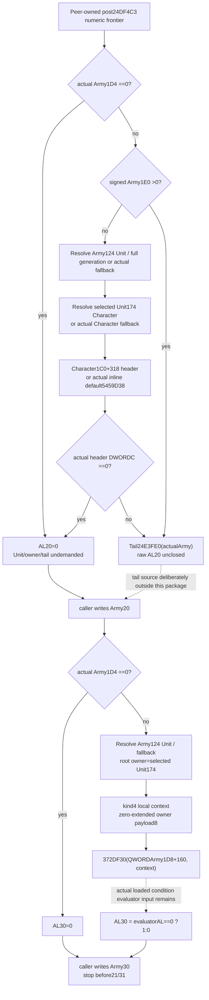

# Army refresh byte outputs 20/30 — CK3 1.20.0.3

This source-only continuation selects exactly two actual outputs after the independently owned [24/28 numeric refresh frontier](army-pre-date-character-prefix-and-post-admission-callback-12003.md): `Army+20 ← AL` from `2C4B840` and `Army+30 ← AL` from `2C4AB70`. Their exact wrapper inputs and return branches are now source-closed below: `Army1D4=0` independently produces both zero bytes; other20 paths can produce zero or reach the exact unexpanded tail `24E3FE0`, while other30 paths return the inverse of a distinct actual loaded condition. Status remains **research / exact wrapper source**, with no reader, model, test or live claim. Business meanings are not inferred from names.

Plan was sealed before new reads at `Z:/ck3_mod_rewrite_process_assets/g2-background-20261006/army-refresh-two-byte-flags-source/SOURCE-FIRST-PLAN.json`. Source lane is a fresh docs-only sparse checkout at `97192b2054beac4971f0e827abdc9d353ab4756a`. Exact build is CK3 **1.20.0.3 / Steam 25652598**; the held EXE SHA `94B55397ABB687A3DCD436805A5D885E6BE90FA6C693FEB44A9E3BBEEADE02A6` is reused without hashing the executable.

## Actual selected caller order

The peer-owned complete `24DF3C0` source first writes wrap-i32 `Army+24` and wrap-i64 `Army+28`. Its precise numerical frontier is `post24DF4C3_pre24DF4C7`. The following two operations use the same actual Army receiver, in order:

| Output | Source call | Direct store | Present source boundary |
| --- | --- | --- | --- |
| Raw byte `Army+20` | `24DF4C7 → 2C4B840(actualArmy)` | `24DF4CF`, low returned `AL` | Logical wrapper `[2C4B840,2C4B90A)`, normal RET or tail `24E3FE0` |
| Raw byte `Army+30` | `24DF4D2 → 2C4AB70(actualArmy)` | `24DF4EC`, low returned `AL` | Source `[2C4AB70,2C4ADC9)`, normal return0 or inverse actual condition |

The source proves byte stores without business names. The30 wrapper's normal return is normalized0/1; an unexpanded20 tail retains its raw returned AL rather than an invented Boolean. Existing observed cache bytes do not substitute for the callees' actual operands at this ordered stage. The caller's later `Army+21/+31` outputs and third named `24E3FE0` remain outside this package. No third-target binary read was performed.

## Cache reuse and exact metadata result

The existing scoped cache-negative receipt is `pre-date-character-prefix-post-admission-source/phase-two-24df3c0-body/DIRECT-NAMED-CALLEE-CACHE-LOCATORS.json`. Its owner confirmed no complete held body locator for either selected function in the three named cache roots and exact-name canonical lookup. This is a scoped locator result, not a claim of universal cache absence; no broad search was repeated.

All new reads used the held `army-monthly-update-order-v61/source-clock-new-spans/PE-MAP.json` and cached point records from `daily-assault-future-placement/NARROW-METADATA-CACHE.json` and the peer's `phase-one-24df3c0-metadata/NEW-METADATA-POINTS.json`. No PE headers, section contents or old point ranges were read again. Only aligned twelve-byte binary-search points inside the held exception table and the selected four-byte unwind header were allowed.

The first lookup for `2C4B840` found **no containing pdata record**. Consecutive records **153279** and **153280** give the exact metadata gap: predecessor ends at `2C4B840`; successor begins at `2C4B910`. The **208-byte gap is not a proven function extent** and was not captured as code. The attempt is retained as `phase-one-metadata-attempt01/PHASE-ONE-EXACT-TWO-EXTENTS-RECEIPT.json`, status `PHASE_ONE_METADATA_RED_PRESERVED`, plus `EXACT-NO-PDATA-GAP.json`. It read **15 fresh twelve-byte points = 180 B**, zero headers and zero code. This is a concrete missing unwind locator, not proof that the named direct callee is absent.

The independent second lookup reused the first attempt's exact point **153278**, pdata RVA `5F840E8` / file offset `5E1B2E8`. Raw record `70abc402c9adc402bc512b05` names **`[2C4AB70,2C4ADC9)` / 601 B**, unwind RVA `52B51BC`. Only its four-byte header at file offset `52B3FBC` was newly read: `11240b00`, version1, flags2, prolog36, eleven slots, no CHAININFO. No unwind slots, handler or tails were read. The second receipt is `phase-one-metadata-attempt02/PHASE-ONE-EXACT-TWO-EXTENTS-RECEIPT.json`; its new cost is **4 B**, with the selected pdata point reused.

Total actual/unique new cost is **184 metadata B / 16 ranges**, **zero duplicate reads**, **zero code B**, **zero hashes**, **zero third-target reads**, and zero tests/native builds/runtime operations. Both attempts and their new point caches are preserved independently.

## Metadata-stage request, subsequently authorized

Root received both results and the actual184-byte metadata cost before any body read. The second target has a concrete601-byte named record extent for one authorized capture and instruction decode. The first target requires a separately authorized small instruction slice beginning at the actual direct-call entry `2C4B840`, not the whole208-byte gap. A proposed first16-byte entry slice can expose an actual return/branch boundary; additional bytes would be limited to a demonstrated unfinished instruction or reached branch, after reporting that concrete need. Neither request authorizes neighbors, another callee, an allocator or a broad catalogue.

Root subsequently authorized the exact601-byte second body once and the first16-byte named entry seed followed only by instruction-demanded unread bytes/basic blocks inside the held gap. The source-first plan is `phase-two-named-bodies-attempt01/PHASE-TWO-SOURCE-FIRST-PLAN.json`. The source trees below precede any observer/model design or implementation. Shared reports/CMake/publication remain Root-owned.

## Actual20 wrapper operands and branch order

The corrected no-pdata wrapper is continuously decoded at **`[2C4B840,2C4B90A)` / 202 instruction B**, ending at normal `RET2C4B909` or the actual tail `JMP2C4B902 → 24E3FE0`. It preserves the original Army pointer in RDX and restores that same pointer to RCX for the tail receiver. Additional registers consumed by the unexpanded tail are not guessed. It contains no direct call and no store to Army, Unit, Character or manager state.

1. Read raw byte **Army`+1D4`**. Zero branches directly to `XOR AL,AL; RET`, so byte20 is0 without demanding1E0, Unit, owner or header.
2. Nonzero demands signed QWORD **Army`+1E0`**. A positive value jumps directly to `24E3FE0(actualArmy)`. Unit and owner/header are undemanded; that tail's raw AL is still a named source dependency.
3. Nonpositive1E0 resolves raw **Army`+124`** through Unit store QWORD slot **5D1E380**, low24 index, unsigned capacity`+2C`, pointer slots`+20` stride10, and whole requested DWORD equality at selected Unit`+10`. Store-null, out-of-capacity, slot-null or generation mismatch selects the actual fallback pointer from **5D1E378**. The native store-null branch does not read rawArmy124.
4. The selected Unit's **DWORD`+174`** is the requested owner Character. Resolve it through Character store **5C67568**, fullID equality at object`+18`, or actual fallback **5C67570**. A null Character store directly selects fallback without demanding Unit174 in this source branch. Preserve these selected fallback objects and their demanded contents; do not turn failed matching into a supplied false.
5. Read selected Character QWORD **`+1C0`**. Nonnull selects the inline header at component **`+318`**. Null selects the actual inline default at module RVA **5459D38**; its actual DWORD`+C` is required, not an inferred empty header.
6. Read selected header **DWORD`+C`**. Exactly zero returns AL0. Any nonzero raw DWORD, including a negative signed count, reaches **`24E3FE0(actualArmy)`** and returns that tail's AL. No header DATA or entries are read by this wrapper.

Neither lookup adds a separate sentinel/positive-ID or Unit/Character magic gate after fallback. The actual selected/fallback object's demanded contents remain operands, and fullID0 is not rewritten to missing. This source closes two useful zero branches independently: rawArmy1D4zero, or nonzero1D4/nonpositive1E0 with actual selected headerCzero. A positive1E0 or nonzero header does not establish ALtrue; it only reaches the exact tail. This package does not capture or execute that third function.

## Actual30 wrapper operands and loaded condition

The exact601-byte body **`[2C4AB70,2C4ADC9)`** decodes continuously through `RET2C4ADC8`.

1. Raw **Army`+1D4`=0** returns AL0 immediately, before Unit/owner/context/evaluation demands.
2. Otherwise resolve Army`+124` through Unit store **5D1E380/5D1E378** using the same full-generation route. The selected actual Unit's **DWORD`+174`** is loaded into EBX, zero-extending the whole owner DWORD into RBX. Character storage is not resolved inline in this wrapper.
3. The ordinary local context sets **WORD0=4**, subtype WORD2=0, and **QWORD payload`+8` = zero-extended selected Unit174**. Token bytes`+4..+7` have no fabricated value. Temporary context construction `8895D0` and its temporary-vector cleanup are held boundaries; no constructor or allocator expansion is needed to identify these directly assigned root fields.
4. Load QWORD **Army`+1D8`**, then address the **inline condition at that actual pointed object`+160`**. `2C4AC93` calls **`372DF30(condition,&ownerCharacterContext)`**. It is neither a rules singleton/EF0 selector nor Rule43/slot24. The actual loaded condition/trigger and this Unit-owner root must remain separately attributed.
5. `TEST AL,AL; SETE SIL` at `2C4AC98/9A` saves **1 when the evaluator returned zero, else0**. Normal temporary cleanup follows; `MOVZX EAX,SIL` at `2C4ADA8` supplies the return. Thus byte30 is the **inverse actual loaded-condition result**, normalized0/1, on this demanded branch.

The already closed generic [Character-root validator](battle-person-rule43-character-root-validator-12003.md) and [condition evaluator shell](battle-person-rule43-real-admission-12003.md) describe this kind4 representation, current loaded descriptor/root validation, applicability and virtual evaluation seams. They do not transfer Rule43's verdict or loaded trigger to the different `Army1D8+160` condition. Actual loaded receiver/trigger contents and demanded selected owner Character identity remain the next same-query input dependency. Stock data, an empty trigger count or another rule's returned bool cannot replace this condition.

The visible Army-specific source reads in this wrapper are1D4,124,1D8. Direct writes target the local stack/context/temporary collections. Generic evaluator and cleanup callback transitive footprints are not claimed closed; no allocator/destructor audit was started. The explicit normal return calculation remains inverse of the actual evaluator's saved result.

## Minimum branch-local input handoff, pending Root review

The scope is the same actual Army occurrence at the post-numeric/pre-first-flag frontier. Retain source occurrence/index, raw request and selected Army identity/fallback association from the existing query. Proposed20/30 values remain separate from actual observed cache bytes and whole callback/next repeated-occurrence claims.

| Demand | Minimum raw inputs / independent result |
| --- | --- |
| Either wrapper entry | Actual byteArmy1D4. Zero independently closes both raw outputs0. |
| 20, nonzero1D4 | Signed QWORDArmy1E0. Positive reaches tail with no Unit/owner/header demand. |
| 20, nonpositive1E0 | Branch-ordered Unit124 lookup and actual selected/fallback Unit; then owner174 Character lookup and actual selected/fallback Character1C0; selected component/default header DWORDC only. Zero closes20=0; nonzero reaches tail. |
| 20, actual tail reached | Exact `24E3FE0` source/current branch inputs are a finite shared dependency with the peer's later21 path; no arbitrary true/false replacement and no capture here. |
| 30, nonzero1D4 | Unit124 lookup, selected/fallback Unit174; actual Army1D8 pointed object and inline condition160; directly produced kind4/zero-extended owner root provenance. |
| 30, actual condition demanded | Current loaded condition/root-validation/applicability/final-evaluator inputs or independently sampled actual verdict from this receiver/root. Invert only that actual verdict, not another rule or cache. |

Neither wrapper directly reads refreshed24/28 or the caller's just-written20. That direct-field intersection is useful, but the unresolved tail/evaluator transitive inputs are not a whole-call no-mutation or no-dependency proof. Preserve every repeated occurrence and actual stage association. This source package introduces no DTO, model, runtime observer or tests; Root reviews the source/input tree before any implementation.

## Capture costs and retained decoder failure

The second body was read once for601 B. The first authorized16-byte seed required further actual branch/instruction bytes. In the initial capture, the decoder accidentally concatenated cached bytes across the still-unread seven-byte block `[2C4B8F2,2C4B8F9)`, creating overlapping false instructions and reaching six padding bytes before the next function. Its reported219 instruction B are **invalid and superseded**, not source credit. The original `phase-two-named-bodies-attempt01/PHASE-TWO-BODY-RECEIPT.json` and asm/json remain preserved as a **decoder harness RED**; its original capture status does not establish semantic correctness.

The correction recovered the exact201 already-read first-target physical bytes from the held contiguous prefix178 B, unambiguous actual suffix17 B and captured padding6 B; address-set equality and seed equality were verified without rereading EXE bytes. The actual decoded `JE2C4B8E8 → 2C4B8F2` demanded exactly seven previously unread bytes, captured under the existing finite source authority. Corrected continuous202-byte source and normal return/tail now reside at `phase-two-decode-correction-attempt02/SOURCE-02C4B840.{bin,json,asm.txt}` with `DECODE-CORRECTION-RECEIPT.json`.

Final source cost is **809 actual/unique code B =601 second +208 first**, versus **803 credited instruction B =601+202**. The extra **six first-target padding B are explicitly uncredited**; the first gap was physically touched through this decoder defect, not credited as a208-byte function. No neighboring function bytes at2C4B910 or any third callee were read. Metadata remains **184 actual/unique B**, so total actual frozen-file I/O is **993 B**, with **zero duplicate reads**. EXE/body hashes, unwind codes/handlers, tests/native builds and local game/process/SDK/Steam/UI/pipe operations are0. The original no-pdata metadata RED remains a locator fact, not a capability failure; the separate decoder RED is retained honestly.

Current readiness is **source-closed two wrappers / branch-local input handoff for review**. The independent zero outcomes and30 inverse relation are closed; full demanded20 tail value and current30 loaded-condition verdict remain concrete dependencies. Neither native-qualified/static-ready observation nor production-live/full repeated-occurrence behavior is claimed. External input ledger, capture receipts and Oct6/W41 fields accompany this own-topic commit; Root owns shared integration and publication.
