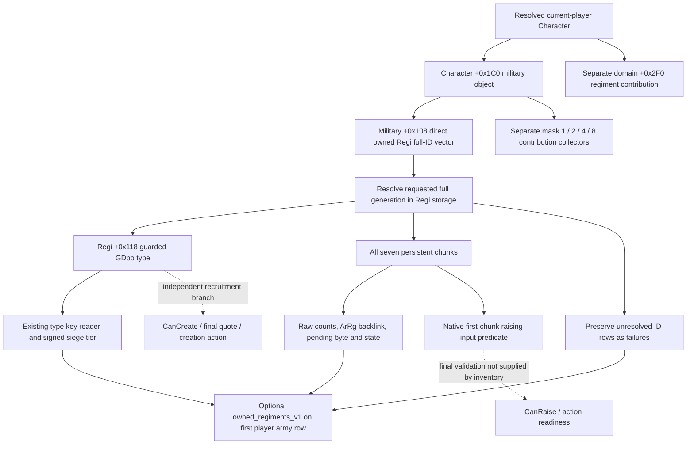

# Army regiment composition and direct owned inventory — CK3 1.20.0.3

Current raised army composition and the player's persistent owned-regiment inventory are separate observations. A raised roster without an observed positive siege tier does not establish that the player owns no siege engine. The contactless owned observer enumerates the complete direct military `+0x108` vector before any native raising filters, then publishes each persistent Regi's type and seven chunks through the existing `ck3_query_army_strengths` player row.

Exact build: **CK3 1.20.0.3 / Steam 25652598**, EXE SHA-256 **`94b55397abb687a3dcd436805a5d885e6be90fa6c693feb44a9e3bbeeade02a6`**. Source research used frozen g71 `cd0acf19`; implementation starts from g72 and the qualified regular-catalog postimage adopted as **`03aec588`**. The existing `.3` binding supplies the owned hook and the already resolved current-player Character. The `.2` observer remains unbound; no new MCP or private enable flag is introduced.

## Source chain and field contract

The ordinary default-raise callback `0x298C230` calls manager `0x2A9B5A0`, whose unconditional `0x2A934F0` category passes the actual Character's military `+0x108` vector into `0x2A92FF0`. The latter consumes full persistent Regi IDs and seven chunks. These are source proofs; the read-only observer does not invoke raising or construction functions.

| Source | Exact receipt |
|---|---|
| `0x298C230..0x298C2C0`, 144 B | `bbf9254b000506b9b599bd3b8cf8289e3106642b49185a63d4e9547aba6a5311` |
| `0x2A9B5A0..0x2A9BE52`, 2226 B | `b3d15f87c0b1d77c409ae5575b606abeedad088bd065cd39fd9c51c4b4d411f3` |
| `0x2A934F0..0x2A9369E`, 430 B | `5647b35b2b6c4fa6bdd499f80dc3c8f793ad473f62d954019f29c260df88d027` |
| `0x2A92FF0..0x2A9331C`, 812 B | `4770aac9c8c62d487809a06b6302f70b6308f2dc0cfacf73ba97a23517788ea4` |
| Persistent type copied to raised type, `0x2633E30..0x2633EE8`, 184 B | `5a578e9457009808e1faa3fcf2e0648243a705c79bc53887f87283bc4de7ac12` |

The complete cached function manifest and corrected contribution tree are in `Z:/ck3_mod_rewrite_process_assets/g2-resume-20261005/army-regiment-composition-v71/owned-unraised-source/ROOT-DELIVERY.json`, `GETTER-MAP.md` and `NATIVE-INPUT-TREE.md`. Twelve necessary functions were closed from 21 once-captured runtime spans; no whole-EXE scan, repeated body capture or native mutator execution was used.

| Input | Meaning |
|---|---|
| Character `+0x1C0`, military `+0x108` | Direct owned vector: data `+0`, signed count `+0x0C`, stride 4 full Regi IDs |
| Persistent storage `image+0x5D1EB68` | 24-bit index; entries `+0x20`, capacity `+0x2C`, stride 16, object pointer `+8`; requested full ID equals Regi `+0x10`, magic `+0x14 = 0x52656769` |
| Regi `+0x118` | GDbo type pointer; type `+0x38 = 0x4744624F`; reuse the live type/key reader rather than create another MSVC string parser |
| Type string base `+0x18`, tier `+0x2A0` | Existing string length/capacity at relative `+0x10/+0x18`; signed native siege tier, including legal zero |
| Regi `+0x12C/+0x128` | Observed owner Character full ID / native capacity input; capacity is distinct from vector count and fixed chunk count |
| Regi `+0x18 + i*0x24`, `i=0..6` | Seven chunks: maximum `+0`, current `+4`, persistent Regi backlink `+8`, native chunk index `+0x0C`, ArRg full-ID backlink `+0x10`, pending/selection byte `+0x14`, raw int32 state `+0x18` |

`army_regiment_id` identifies ArRg, never CArmy or public CUnit. Native backlink `-1` is observed absence; zero IDs and soldier/tier zero are retained. `state_raw` has a proven int32 width, with no enum claimed. The native first-chunk predicate is `pending == 0 && ArRgID == -1 && (current > 0 || maximum == 0)`. It is an observed raising input, not final `CanRaise`, and does not filter the read-only inventory.

Military `+0x1E0` domain IDs and resolved domain `+0x2F0` Regi lists are separate from this direct owned vector. The `0x2C175D0 -> 0x2C16E70` mask `0xF` path gathers contributions; masks 4/8 resolve linked objects and recurse through another Character. Neither those vectors nor the current CArmy roster substitute for personal direct owned inventory.

## Read-only publication and qualification

New `owned_regiments.hpp/.cpp` implement `ReadPlayerOwnedRegimentsV1`; the independent serializer and Python normalizer carry it through the existing army-strength query. Shared mounting has one owner: it factors the existing GDbo/key/tier helper without changing its body, collects once from the current actor, and attaches optional `owned_regiments_v1` to the first stored player row. Enemy rows do not receive this player-owned inventory.

Available empty inventory is `source_count=0`, `collection_complete=true`, `regiments=[]`. An unread collection has `regiments=null`; a failed row retains its source full ID with unread chunks. `collection_complete` describes enumeration of the direct vector, independent of row failures. Nested owned failure leaves the separately observed army strength and raised composition intact.

The owned addition is **static-ready after the sole new production-chain fixture**, which passes real owned reader -> shared type helper -> emitted serializer -> native driver/service -> registered `ck3_query_army_strengths`. Its engine has current zero and positive maximum, yet remains in the full owned inventory; another record demonstrates legal tier zero and an ArRg backlink. Both retain all seven chunks. Qualification and the 13-source-path union are indexed by `Z:/ck3_mod_rewrite_process_assets/g2-resume-20261005/owned-regiments-observer-v72/ROOT-QUALIFIED-DELIVERY.json`. Root's full build and actual paused owned-inventory query remain required for live credit.

## Cached R40 raised composition

The earlier raised observer is **production-live primitive** with Root's existing g72 deployment identity receipt. R40 MAIN21717 closed GREEN, paused date **53260776**, snapshot `native:3`, native revision 3/public revision 2/query sequence 1. The sole original `004-ck3_query_army_strengths.json` was read once from `Z:/ck3_mod_rewrite_process_assets/g2-resume-20261003/runtime-preparation/v67/root-results/actual-main-readback-01/`; SHA-256 **`c1509513b33912d8a36a694c89fc74530db52329f884e38676a5f5b81e94dd36`**. Emitted version/SHA nulls remain null; external frozen deployment identity belongs to Root.

All **104** raised-regiment rows returned the new group: **36 observed tier-zero**, **1 tier-two**, **67 absent type**, **0 read failures**. Player main `301989997` has 39 rows (13 zero, 26 absent), guard `184549452` has 24 (18 zero, 6 absent); neither currently raised player army has an observed positive tier. Enemy `268435597` has 41 rows; its sole positive record is ArRg **167772930**, key **`mangonel`**, **20/20**, tier **2**. This does not prove that the player owns no unraised siege engine, nor derive actual-province highest eligible tier K.

Full health/composition cache, inventory and day/week fields are indexed by `Z:/ck3_mod_rewrite_process_assets/g2-resume-20261005/army-regiment-composition-v71/actual-r40/ROOT-ACTUAL-DELIVERY.json`. This source/implementation package adds **0 game actions and 0 days**; owned live values, `CanRaise`, `CanCreate`, final purchase quote, actual siege benefit and complete OODA are not credited here. Fort factors and eligible province M/K remain in [siege-efficiency-inputs-12003.md](siege-efficiency-inputs-12003.md).

## R41 / v68 paused acceptance — 2026-10-05

The acceptance cutoff is the zero-day normal SAVE **h8578**, raw date **53262000**, cumulative **4903** saved days. Root's g73 / `454e` deployment, 572-TU / 64-job build and official CI `37249487804` passed. SDK56730 closed GREEN; the actual query is paused, snapshot `native:3`, native revision 3/public revision 2/query sequence 1. Emitted game version and EXE SHA remain null; the existing frozen deployment/runtime receipt supplies their external provenance without filling those nulls.

The actor **29829** direct A108 census is **available and complete**, source count **2**, with **14 observed chunks and zero record/type failures**. Regi **17003** has key `pikemen_unit`, tier **0**, capacity raw **200**, chunk 0 **179/200**, ArRg backlink **117442521**; Regi **17004** has key `armored_footmen`, tier **0**, capacity raw **100**, chunk 0 **92/100**, backlink **100666683**. Slots 1..6 in each retain `0/0`, backlink `-1`, pending/state zero. No positive-tier engine was observed in this complete direct vector. The optional object is carried by public CUnit **184549452** / CArmy **167772208**; its carrier does not assign these owned Regi to that army. Main row **301989997** omits the object rather than reporting empty inventory.

This direct owned type/tier/chunk observer is **production-live primitive**. Domain contributions, all-source ownership unions, final CanRaise, creation action, siege benefit and complete OODA remain separate. Formal regular CanCreate/price observations are owned by the recruitment source package; they are not inferred from this census.

The same raised scope has three rows: main **3116/3874**, guard **3000/3000**, enemy **2670/4702**. Guard movement is available, state **7**, first-edge progress **90000/Q100000 = 90%** and first-edge remaining duration **300000/Q100000 = 3 days**; main state **3** is `not_applicable`, with progress and remaining null. Route count was not published; first-edge duration is not whole-route arrival. The later R41 eight-day frame, including guard at province1038, is outside this cutoff and is not retrofilled into the original 004 observation.

The sole original `runtime-preparation/v68/root-results/actual-main-readback-01/004-ck3_query_army_strengths.json` is **699973 B**, SHA-256 **`0d0ff3a92ed849ae85a4b1b8cfe5b0df6aef5b3b1deb6442eec1263fa08e7865`**, read once. Complete caches, runtime identity, normal SAVE provenance and scoped owned inventory are indexed by `Z:/ck3_mod_rewrite_process_assets/g2-resume-20261005/owned-regiments-observer-v72/actual-v68-r41-01/ACTUAL-SOURCE-OWNER-RECEIPT.json`. Health/movement cache SHA is `93a85f29828e590b7baf57c70cfec41cc46a2170844a4694f305cee857573370`; its retained locator HARNESS-RED and necessary cached retry did not turn this domain RED. This acceptance adds **0 actions and 0 game days**.

## R41 / v69 independent Create50 inventory readback — 2026-10-05

MAIN74274 closed with aggregate exit 1. Its independently paused strength queries 004 and 008 were GREEN with `partial` scope: native revision **3**, public revision **2**, raw date **53262288**, query sequences **1 → 2**. Emitted game version and EXE SHA remain null. The middle Create50 result was reported by Root as `native_regular_maa_create_mailbox_submit_unavailable`; the action owner consumes and diagnoses 006 separately. This inventory comparison does not infer execution from that RED.

The actual actor **29829** direct A108 inventory is **available and complete** in both frames: source count **2**, failures **0**, Regi **17003** `pikemen_unit`, tier **0**, capacity raw **200**, and **17004** `armored_footmen`, tier **0**, capacity raw **100**. All record fields and all **14 chunks** are unchanged. Chunk 0 remains **178/200** with ArRg backlink **117442521** and **92/100** with backlink **100666683** respectively; pending/state are zero. Added/removed/changed IDs are **0/0/0**, and positive-tier records are **0**. No new owned engine was observed during this before/after window; creation or siege benefit receives no credit from this observation.

All four published army rows are unchanged. The first stored player row **285212713** carries the valid actor inventory but has no resolved CArmy: resolution is `available`, `ready`, `reference_absent`, raw reference **-1**, and CArmy is null. Its absent roster and movement are not an empty army; the owned ArRg backlinks do not associate these Regi with 285212713. The other three army rows are available. Guard **184549452** retains raw state **4**, first-edge progress **47333/Q100000 = 47.333%**, and first-edge remaining duration **526667/Q100000 = 5.26667 days**; this is not whole-route arrival.

Each original was read once: 004 is **726343 B**, SHA-256 `927743c869378b529c756220dcbb19788b0e9b7029fd3b1735ecdc393b9d0c99`; 008 is **726343 B**, SHA-256 `d1e1016e3f687bfe8079269220b3a799ace38f601e69490d47d56d5bbb1f4c97`. Complete cache and comparison receipts are indexed by `Z:/ck3_mod_rewrite_process_assets/g2-resume-20261005/owned-regiments-observer-v72/actual-v69-create50-comparison/ROOT-ACTUAL-COMPARISON-DELIVERY.json`. The cached health helper's stdin-EOF HARNESS-RED and necessary corrective cached read are retained separately from domain results. The direct inventory remains **production-live primitive**; the normal creation loop is not completed by these readbacks. This observer adds **0 actions and 0 game days**, and does not backfill earlier v68 or later frames, cash, or SAVE evidence.

## R43 / v70 normal mangonel creation: independent owned material readback — 2026-10-05

SDK65051 closed GREEN for the two strength queries and intervening normal Create50. Both paused strength scopes are **available**, with three public armies **184549452**, **301989997**, **268435597** and raw date **53262864**. BEFORE is native revision **3** / public revision **2** / sequence **1**; AFTER is native **4** / public **3** / sequence **2**. Emitted game version and EXE SHA remain null; Root's g75 EFE deployment, mailbox fix `90f61443` and exact-build receipt are separate external provenance. No earlier inventory frame is substituted for this fresh BEFORE.

The actor **29829** direct A108 census is **available and complete**, with source count **2 → 3**, failures **0**, and positive-tier records **0 → 1**. The new persistent FullRegi ID is **50347099**, owner **29829**, canonical key **`mangonel`**, signed siege tier **2**, native capacity raw **10**. All **7 chunks** are observed: chunk 0 has current **5**, maximum **10**, ArRg backlink **-1**, pending raw **0** / false, state raw **0**; chunks 1..6 retain current/maximum **0/0**, backlink **-1**, pending/state zero. Previous Regi **17003** and **17004**, including every record and chunk field, are unchanged; removed IDs are zero. This is independent observation of newly created owned material, not inference from queue admission or cash.

The owned object is carried by public guard **184549452** / CArmy **167772208**; this does not assign the new Regi to that army. The three raised ArRg rosters have no added or removed IDs, and soldiers remain guard **3000/3000**, main **3085/3874**, enemy **2670/4702**. Guard and main have raw state **3** and movement `not_applicable`, with progress/remaining null. Enemy raw state **7** retains first-edge progress **51721/Q100000** and remaining **732285/Q100000 days**. The two published JSON differences are exactly the owned source count and new record on the guard carrier row; every other published field is unchanged. Guard/main/enemy remain at provinces **3711/470/738**, with attached combat null. Native/public revision changes alone do not establish creation.

The action owner independently observed normal `CCreateMAARegimentCommand`, type **50**, owner **29829**, native CanCreate and submission accepted, with its command pointer consumed; the wrapper initially reported `queued_pending` and no material/payment credit. Its once-consumed fresh BEFORE regular catalog confirms `50 / mangonel`, quantity **10**, inputs ready and CanCreate true, final Gold quote raw **5940000/Q100000 = 59.4**. Root's separate TOP readback then observed Gold **702.53129 → 643.13129**, a **59.4** deduction, and normal SAVE **h8694**, **98452477 B**, SHA-256 `33ca14435c7b4402b3173ae4a0d50c4f75f51d96ece17773fe85b5c691797eef`. Together with the new direct owned ID, these support the bounded normal creation loop in the recruitment owner's package. This direct inventory reader remains **production-live primitive**; current **5/10** and native capacity **10** are preserved without conversion to troop counts. Final CanRaise, army delivery, province eligibility K and siege benefit remain separate observations.

Original 004 is **699513 B**, SHA-256 `8d48a5898150bcb47951a52b82a03ddc9bdf9a56018bc4568c91e47a4e235abe`; 008 is **706429 B**, SHA-256 `381a14d3783465cec9c76de98255d69d98ec73185714bb99a65569f3b20d605a`. Each was decoded once, and the owned and health lanes each consumed the complete new cache once. The report helper's GBK stdout Unicode HARNESS-RED is retained separately; its reports were completed from already consumed facts without rereading either original or full cache. Complete owned/chunk, health/movement and report receipts are indexed by `Z:/ck3_mod_rewrite_process_assets/g2-resume-20261005/owned-regiments-observer-v72/actual-v70-r43-create50-comparison/ROOT-ACTUAL-COMPARISON-DELIVERY.json`. This observer adds **0 actions and 0 game days** and does not read 006, TOP, earlier frames, shared source or the SDK.

## R43 / v70 raised mangonel: pending cutoff and next-day physical match — 2026-10-05

The post-raise cutoff is paused raw **53262864**, native revision **11** / public **2** / query sequence **3**. Complete actor **29829** direct inventory contains **50347099 / mangonel / tier 2**, capacity raw **10**; chunk 0 is **5/10**, pending raw **1**, state **0**, ArRg backlink **-1**. New public CUnit **268435481** / CArmy **218103809** exists at province **2619**, with empty roster and **0/0** strength. Gathering reports available/ready and **0 days**; raw unit state **5** and movement `not_applicable` do not turn that empty army into delivered cargo. The sole original is **735359 B**, SHA-256 `2f172aa118eaa7a754f105db3696cf2d102fa8fa5d021702c16dc610a2a3a9c0`; complete receipts are indexed by `actual-v70-r43-post-raise-01/ROOT-DELIVERY.json` in the same external observer package.

After **one ordinary saved day**, the fresh cutoff is raw **53262888**, native **19** / public **2** / sequence **4**, paused, all four army rows available. Regi **50347099**, native chunk ordinal **0**, now has positive **5/10**, pending raw **0**, state **0**, and ArRg backlink **184549917**. The same frame's new CUnit **268435481** / CArmy **218103809** roster contains exactly ArRg **184549917**, canonical key **mangonel**, tier **2**, current/maximum **5/10**. This matching full ArRg ID and physical row independently confirm the owned engine is now in that army. Its total **6/11**, two rows, include a separate type-absent **117440515 / 1/1**. Reverse persistent Regi ID/native ordinal are not published on raised rows; that precise reverse DATA proof remains outside the exposed schema and does not invalidate the observed physical match.

The new army remains at **2619**, no attached combat, raw state **1**, `not_gathering`/ready true with gathering days null, and movement `not_applicable`; nativeCanMove is not published. Existing `ck3_execute_step` preview step `preview-move-army-268435481-to-470` and `ck3_move_army(army_id=268435481,target_province_id=470)` use a fresh public revision and Root's chosen destination. Route preview and gathering readiness do not supply a nativeCanMove boolean. The army's supply is **300/300**, monthly **+20**, attrition **0**. Other armies retain guard **3000/3000**, main **3084/3873**, enemy **2670/4702**. Arrival, province siege eligibility K and siege benefit require later fresh observation; the later move action is owned by the reinforcement package.

This new original is **743431 B**, SHA-256 `441794975af279cd1816b863d0606adc1fa1c52111f9410ab21457c7af7e7d94`, read once. Root separately binds ordinary day **4940 / res1787 / Oct5 +282** and this query's normal SAVE **h8705**, **98360966 B**, SHA-256 `5c8eaa267eaac15e56c7d7fb536b0b36836ac94f96f870d944ac21c23129e17e`; ordinary-day **h8703** and prior purchase SAVE are not substituted for it. Emitted version/EXE SHA remain null in both frames. Each of three useful lanes consumed only its new full cache once; no new tests, original rereads, SDK or window calls occurred. `actual-v70-r43-after-gather-day01/ROOT-DELIVERY.json` indexes complete owned/chunk/physical, new-CUnit/gather/movement and health receipts. This closes the material observation needed by the reinforcement owner's bounded raise/delivery loop, without claiming the later march or siege effect.
