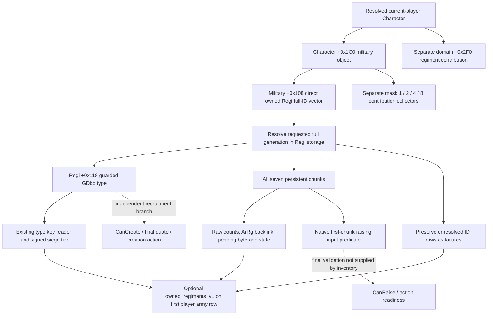

# Army regiment composition and direct owned inventory — CK3 1.20.0.3

Current raised army composition and the player's persistent owned-regiment inventory are separate observations. A raised roster without an observed positive siege tier does not establish that the player owns no siege engine. The contactless owned observer enumerates the complete direct military `+0x108` vector before any native raising filters, then publishes each persistent Regi's type and seven chunks through the existing `ck3_query_army_strengths` player row.

Exact build: **CK3 1.20.0.3 / Steam 25652598**, EXE SHA-256 **`94b55397abb687a3dcd436805a5d885e6be90fa6c693feb44a9e3bbeeade02a6`**. Source research used frozen g71 `cd0acf19`; implementation starts from g72 and the qualified regular-catalog postimage adopted as **`03aec588`**. The existing `.3` binding supplies the owned hook and the already resolved current-player Character. The `.2` observer remains unbound; no new MCP or private enable flag is introduced.

## Source chain and field contract

The ordinary default-raise callback `0x298C230` calls manager `0x2A9B5A0`, whose unconditional `0x2A934F0` category passes the actual Character's military `+0x108` vector into `0x2A92FF0`. The latter consumes full persistent Regi IDs and seven chunks. These are source proofs; the read-only observer does not invoke raising or construction functions.

| Source | Exact receipt |
|---|---|
| `0x298C230..0x298C2C0`, 144 B | `bbf9254b000506b9b599bd3b8cf8289e3106642b49185a63d4e9547aba6a5311` |
| `0x2A9B5A0..0x2A9BE52`, 2226 B | `b3d15f87c0b1d77c409ae5575b606abeedad088bd065cd39fd9c51c4b4d411f3` |
| `0x2A934F0..0x2A9369E`, 430 B | `5647b35b2b6c4fa6bdd499f80dc3c8f793ad473f62d954019f29c260df88d027` |
| `0x2A92FF0..0x2A9331C`, 812 B | `4770aac9c8c62d487809a06b6302f70b6308f2dc0cfacf73ba97a23517788ea4` |
| Persistent type copied to raised type, `0x2633E30..0x2633EE8`, 184 B | `5a578e9457009808e1faa3fcf2e0648243a705c79bc53887f87283bc4de7ac12` |

The complete cached function manifest and corrected contribution tree are in `Z:/ck3_mod_rewrite_process_assets/g2-resume-20261005/army-regiment-composition-v71/owned-unraised-source/ROOT-DELIVERY.json`, `GETTER-MAP.md` and `NATIVE-INPUT-TREE.md`. Twelve necessary functions were closed from 21 once-captured runtime spans; no whole-EXE scan, repeated body capture or native mutator execution was used.

| Input | Meaning |
|---|---|
| Character `+0x1C0`, military `+0x108` | Direct owned vector: data `+0`, signed count `+0x0C`, stride 4 full Regi IDs |
| Persistent storage `image+0x5D1EB68` | 24-bit index; entries `+0x20`, capacity `+0x2C`, stride 16, object pointer `+8`; requested full ID equals Regi `+0x10`, magic `+0x14 = 0x52656769` |
| Regi `+0x118` | GDbo type pointer; type `+0x38 = 0x4744624F`; reuse the live type/key reader rather than create another MSVC string parser |
| Type string base `+0x18`, tier `+0x2A0` | Existing string length/capacity at relative `+0x10/+0x18`; signed native siege tier, including legal zero |
| Regi `+0x12C/+0x128` | Observed owner Character full ID / native capacity input; capacity is distinct from vector count and fixed chunk count |
| Regi `+0x18 + i*0x24`, `i=0..6` | Seven chunks: maximum `+0`, current `+4`, persistent Regi backlink `+8`, native chunk index `+0x0C`, ArRg full-ID backlink `+0x10`, pending/selection byte `+0x14`, raw int32 state `+0x18` |

`army_regiment_id` identifies ArRg, never CArmy or public CUnit. Native backlink `-1` is observed absence; zero IDs and soldier/tier zero are retained. `state_raw` has a proven int32 width, with no enum claimed. The native first-chunk predicate is `pending == 0 && ArRgID == -1 && (current > 0 || maximum == 0)`. It is an observed raising input, not final `CanRaise`, and does not filter the read-only inventory.

Military `+0x1E0` domain IDs and resolved domain `+0x2F0` Regi lists are separate from this direct owned vector. The `0x2C175D0 -> 0x2C16E70` mask `0xF` path gathers contributions; masks 4/8 resolve linked objects and recurse through another Character. Neither those vectors nor the current CArmy roster substitute for personal direct owned inventory.

## Read-only publication and qualification

New `owned_regiments.hpp/.cpp` implement `ReadPlayerOwnedRegimentsV1`; the independent serializer and Python normalizer carry it through the existing army-strength query. Shared mounting has one owner: it factors the existing GDbo/key/tier helper without changing its body, collects once from the current actor, and attaches optional `owned_regiments_v1` to the first stored player row. Enemy rows do not receive this player-owned inventory.

Available empty inventory is `source_count=0`, `collection_complete=true`, `regiments=[]`. An unread collection has `regiments=null`; a failed row retains its source full ID with unread chunks. `collection_complete` describes enumeration of the direct vector, independent of row failures. Nested owned failure leaves the separately observed army strength and raised composition intact.

The owned addition is **static-ready after the sole new production-chain fixture**, which passes real owned reader -> shared type helper -> emitted serializer -> native driver/service -> registered `ck3_query_army_strengths`. Its engine has current zero and positive maximum, yet remains in the full owned inventory; another record demonstrates legal tier zero and an ArRg backlink. Both retain all seven chunks. Qualification and the 13-source-path union are indexed by `Z:/ck3_mod_rewrite_process_assets/g2-resume-20261005/owned-regiments-observer-v72/ROOT-QUALIFIED-DELIVERY.json`. Root's full build and actual paused owned-inventory query remain required for live credit.

## Cached R40 raised composition

The earlier raised observer is **production-live primitive** with Root's existing g72 deployment identity receipt. R40 MAIN21717 closed GREEN, paused date **53260776**, snapshot `native:3`, native revision 3/public revision 2/query sequence 1. The sole original `004-ck3_query_army_strengths.json` was read once from `Z:/ck3_mod_rewrite_process_assets/g2-resume-20261003/runtime-preparation/v67/root-results/actual-main-readback-01/`; SHA-256 **`c1509513b33912d8a36a694c89fc74530db52329f884e38676a5f5b81e94dd36`**. Emitted version/SHA nulls remain null; external frozen deployment identity belongs to Root.

All **104** raised-regiment rows returned the new group: **36 observed tier-zero**, **1 tier-two**, **67 absent type**, **0 read failures**. Player main `301989997` has 39 rows (13 zero, 26 absent), guard `184549452` has 24 (18 zero, 6 absent); neither currently raised player army has an observed positive tier. Enemy `268435597` has 41 rows; its sole positive record is ArRg **167772930**, key **`mangonel`**, **20/20**, tier **2**. This does not prove that the player owns no unraised siege engine, nor derive actual-province highest eligible tier K.

Full health/composition cache, inventory and day/week fields are indexed by `Z:/ck3_mod_rewrite_process_assets/g2-resume-20261005/army-regiment-composition-v71/actual-r40/ROOT-ACTUAL-DELIVERY.json`. This source/implementation package adds **0 game actions and 0 days**; owned live values, `CanRaise`, `CanCreate`, final purchase quote, actual siege benefit and complete OODA are not credited here. Fort factors and eligible province M/K remain in [siege-efficiency-inputs-12003.md](siege-efficiency-inputs-12003.md).
