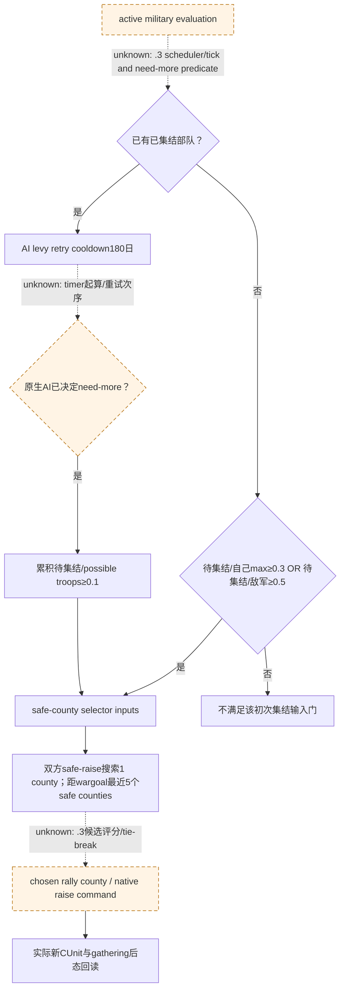
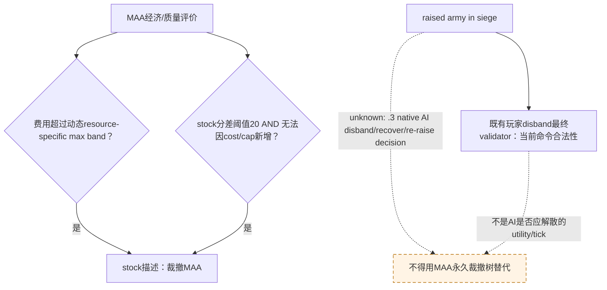
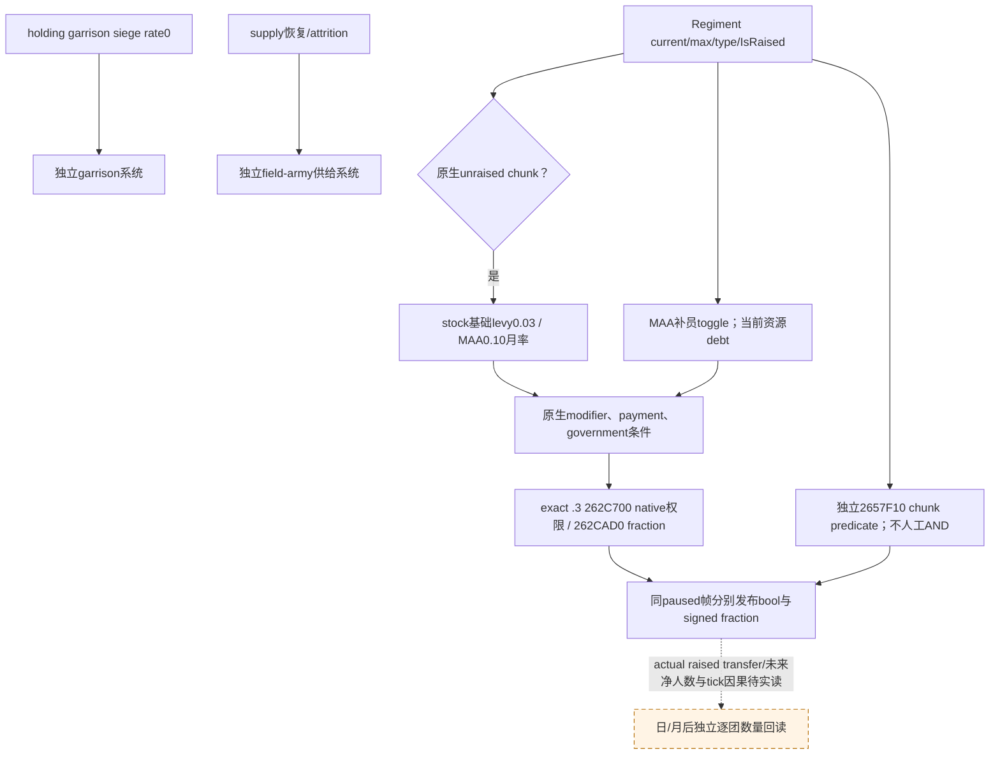
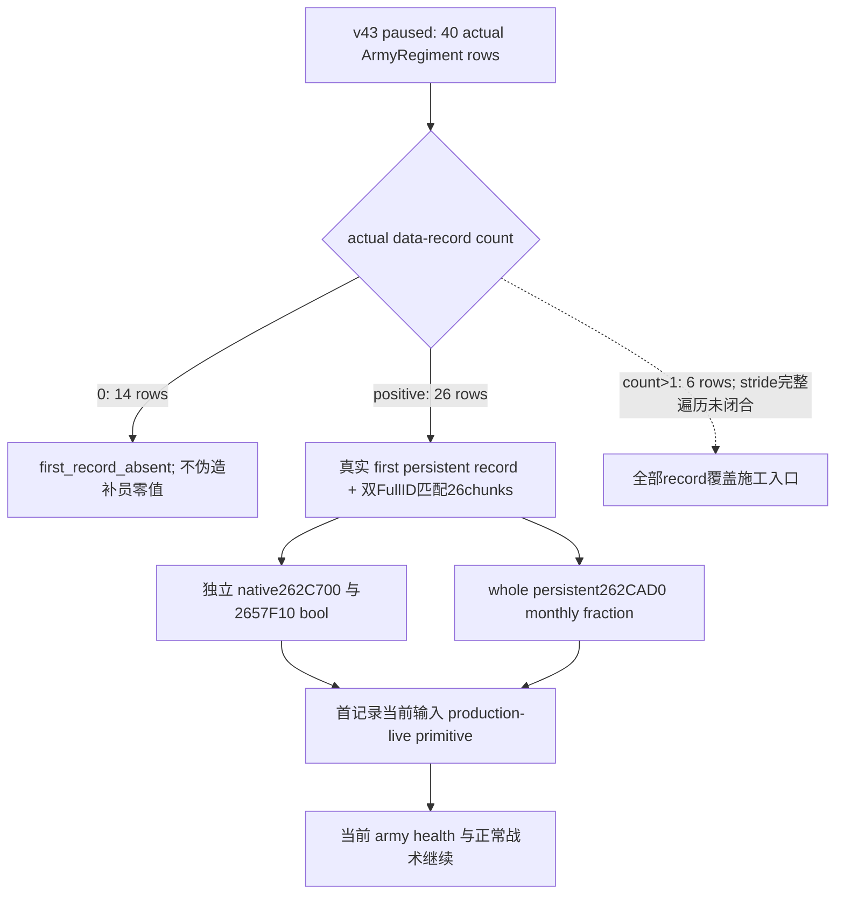
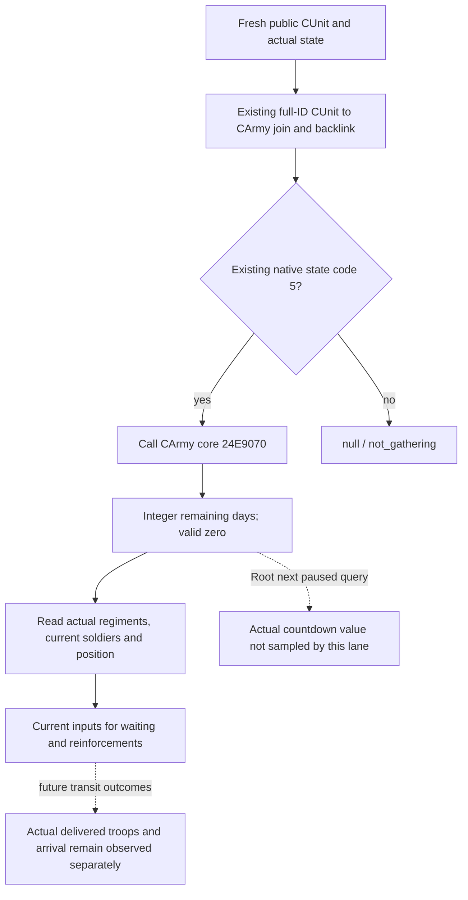

# CK3 1.20.0.3：已集结围城部队补员与再动员的原生输入树

2026-10-03 file-only 研究。当前安装原版为 `Z:/SteamLibrary/steamapps/common/Crusader Kings III/game`，CK3 1.20.0.3 / Steam25652598；exact EXE SHA-256 `94B55397ABB687A3DCD436805A5D885E6BE90FA6C693FEB44A9E3BBEEADE02A6` 已由本包只读文件核对。源码首次读取 HEAD5cbc0ee17f3d6cd2065c1a482607ef6975eef447，后续读取为3cf7f7475c0474f12a08c28fb17b45a990cda2c6；Root同时发布，消费文件分别冻结SHA，不把移动HEAD说成单一未变源码快照。

分派的当前实机基线为 Robert29829 / episode `native-29829-2bc2d599f7f9`，CUnit83886367 → CArmy50331794 在2604围城，2290人，原生ETA109，三场主防御战争。Root随后提供fresh h5030/date53238336 strength：current/max2290/2461、40CArmyRegiments、supply100、base power7482900000Q100000。已集结缺额171不是未集结reserve。本包未查询进程、SDK、pipe、窗口或存档，这些数值属于协调者提供的实际文件基线；没有新增游戏日或收益。

本包所有 `stock-lane/`、`abi-lane/` 和JSON相对证据名均相对外置artifact根 `Z:/ck3_mod_rewrite_process_assets/g2-resume-20261003/army-reinforcement-raise/native-replenishment/`，不是仓库专题的相对路径。

## 当前能得出的结论

原版AI允许在已经拥有军队时再尝试集结levy。`RAISE_LEVIES_COOLDOWN=180` 是 AI 重试时间参数，`RAISE_ADDITIONAL_TROOPS_RATIO=0.1` 在 AI 已决定需要更多军队之后控制 reserve 累积；它们不是玩家 CRaiseTroopsCommand 的全局禁令。无已集结部队时才适用初次集结门：待集结数量达到自己最大兵力0.3，或敌军兵力0.5。完整硬编码 need-more判定、tick起点、精确重试顺序尚未闭合。

当前bridge能读取已集结CArmyRegiment current/maximum，因此能观察缺员；这不能给出未集结reserve、可补员性或未来补员数。现有 `battle_reinforcement` 查询观察战场coordinator分配与join，并非兵团招募补员。不能把已有军队的 `maximum-current` 当作能立即新集结的士兵数。

当前MCP默认集结公告还要求无可控军队，是我方公开step投影条件。因为Robert已有83886367，不能通过解散当前围城军来满足这一条件，再把它声称为原版AI再动员策略。补集结的施工入口是原生未集结reserve/当前CanRaise查询与已有CRaiseTroopsCommand最终validator，保留当前围城ArmyID。

## 原生AI再集结输入树

精确原版来源 `common/defines/ai/00_ai.txt:508–538,1548–1576`。



原文包含拼写 `rasied`，语义仍明确为already raised后need-more。行政军队另有 `CHECK_ADMIN_ARMIES_COOLDOWN=360`（514–518）；不能把它外推为普通Robert的征召兵冷却。

## 裁撤兵士团与解散已集结军队必须分别研究

原版 `common/script_values/00_ai_values.txt:1779–1795` 明确规定 gold MAA维护费超过 `ai_men_at_arms_expense_gold_max` 后AI会裁撤MAA，默认比例0.6；1796以后的时代、头衔、指令、政府分支动态调整，因此0.6不是当前Robert最终阈值。其它prestige/herd/treasury/barter分支独立求值。

`common/defines/ai/00_ai.txt:683–689` 的 `REGIMENT_OBSOLETION_SCORE_DIFFERENCE=20` 只有在旧兵团比最好可招募兵团低该分差，并且因成本或上限无法再招募时，才描述其裁撤输入。624–665同时给出toughness10、attack10、pursuit3、screen1、siege1000、同类subregiment减20和角色/兵种稳定随机0..20%评分扰动。这是投资/永久裁撤MAA，不是临时解散正在围城的Army83886367。



已有当前bridge `ck3_12002_military.cpp:127,453–481` 绑定 disband最终validator RVA0x296A620，完整CUnit generation/controllable核对后构造原生命令；`.3` adapter使用精确SHA和已冻结迁移bundle。这仅说明玩家typed命令合法性路径存在，不证明Robert现在可以解散、不证明原生AI会解散，也不改变当前围城策略。

## exact .3 二进制名称锚点

本包 `exact-ai-raise-name-xrefs.json` 保留EXE SHA、字符串RVA、rip-relative LEA xref、64字节原文与SHA。名称锚点：RAISE_LEVIES_COOLDOWN0x45AE030、MIN_RATIO_SELF0x45ADFF0、MIN_RATIO_ENEMY0x45AE010、ADDITIONAL_RATIO0x45ADFA8、DEFENDER_SAFE_DISTANCE0x45AF270、ATTACKER_SAFE_DISTANCE0x45AF298、NUM_SAFE_COUNTIES0x45AF220。

这些 xrefs 目前只定位名称注册/元数据访问，**不能当作AI实际tick调用链**。本包不把1.19.0.6的旧RVA移植到1.20.0.3，也不重跑已GREEN的battlecoordinator bind5D20550。

## 补员观测与施工入口

### 当前stock已确认的补员条件与域

| 原生输入 | exact stock证据 | 结论边界 |
|---|---|---|
| levy基础月补员0.03、MAA基础月补员0.1 | `common/defines/00_defines.txt:636–637` | 原文明确unraised chunks，不能说当前围城军每月自动补3%/10%。 |
| MAA补员开关/费用 | `gui/window_military.gui:485–493` | IsMilitaryReinforcementsEnabled与GetMilitaryReinforcementCostTooltip是独立查询入口；非conditional_maa_refill政府才显示该checkbox。 |
| understrength "Reinforcing" 标签 | `gui/window_menatarms.gui:318–324` | 只判未满员且非conditional_maa_refill，没有检查开关、付款或地域，不能充当最终可补员性。 |
| MAA金币负债停止补员 | `localization/english/game_concepts_l_english.yml:1523` | stock规则已确认，当前Robert实际gold/debt另读。 |
| levy负债修正 | `common/modifiers/00_basic_modifiers.txt:378–391` | debt0/1分别−0.1/−0.2；不是MAA停止补员的同一布尔条件。 |
| 围城中补员率0 | `localization/english/game_concepts_l_english.yml:679–681` | 语境限定holding garrison，不能外推为正在围城的field army不补员。 |
| 友好领地补员修正 | `common/lifestyle_perks/00_martial_2_authority_tree_perks.txt:127–140` | Prepared Conscription给非landless-adventurer友好地域levy补员修正1；不能推断Robert拥有perk或当前2604实际友好。 |
| supply恢复 | `localization/english/game_concepts_l_english.yml:1171,1176` | 低于当地limit且处友好地域恢复供给；不是兵团补员条件，敌占与合法holder须分开。 |
| levy gather移动速率 | `common/defines/00_defines.txt:583` | 未集结levy gather40distance/day，新增reserve不等于立即抵达当前军。 |
| stand-down返乡延迟 | `localization/english/gui/rally_point_window_l_english.yml:20–21` | 近期解散兵返乡会延缓再集结，未闭合固定公式。 |

完整17文件pins和剩余例外保存在 `stock-lane/ROOT-DELIVERY.json`；原文取证在 `stock-lane/EVIDENCE.md`。



### exact .3 getter施工字段（静态闭合，不是实机值）

`abi-lane/military-reinforcement-tooltip.json` 冻结原生tooltip0x12FF1B0..0x12FF883，SHA `0a2b5abe963c869cbbd337752f24d01ce0de46e5fb131b5b462d858defa4083a`。该路径从MilitaryView+0x218 FullCharacterID正常解析CCharacter，再读+0x1C0军事组件byte+0x4A9；0x12FF237–260选择TT_REINFORCING_MAA_YES/NOT，0x12FF78C–7A1选择CLICK_STOP/START。因此MAA自动补员开关可以从当前角色军事组件直接只读，不依赖实际MilitaryView对象。开关不是全套CanReplenish；missing component不能当作实际false。

| getter/对象 | 已闭合静态语义 | 施工注意 |
|---|---|---|
| CRegiment，magic0x52656769 | 七个0x24-byte chunk从+0x18开始、total maximum+0x128 | 原版GUI Regiment receiver，独立于field army regiment。 |
| CArmyRegiment，magic0x41725267 | 现有strength current/max+0x38/+0x3C | 不是新补员getter的CRegiment receiver，禁止直接共用指针。 |
| 0x262CAD0(CRegiment* RCX,int64_t* RDX)→RAX=out | signed *out monthly fraction Q100000 | 完整分支bytes由abi-lane冻结；不拿基础0.03/0.1替代当前原生结果，不说它是army净补人数/月。 |
| 0x262BC90(CRegiment* RCX)→EAX int32 | 满员时间路径使用上述monthly fraction，单位月；fraction0时native时间也0 | 不能把零时间说成已经满员或保证即刻满员；实际逐月人数另验。 |
| bool0x262C700(CRegiment* RCX,Chunk* RDX)→AL | 补员许可读取toggle、government/resources/army状态；部分native分支调用bool0x2657F10(Chunk* RCX)→AL | type+0x118对象!=ObDG分支0x262C763直接true；**不能手工与2657F10做AND**。分别发布两个原生bool与fraction，保留native分支语义。 |
| bool0x2657F10(Chunk* RCX)→AL | 该独立chunk predicate按current<max、province、army flags/retreat/native0x24ACAC0判定 | 不是262C700所有分支必经门；两项bool不合成一个伪native最终许可。 |
| persistent CRegiment storage | exact .3 slot0x5D1EB68，fallback0x5D1EB58 | 不复用field ArmyRegiment storage0x5D1F340；fullID+0x10/generation roundtrip分别验证。 |
| CArmyRegiment→CRegiment | native0xD14960中0xD14A7C先由5D1F340解析actualArRg；若+0x2C count非零，D14AE8读RAX=[RCX+0x20]，D14AEC取R9D=[RAX+8] persistentFullID | +0x20指首DATA RECORD，**不是pointer array**。record stride/layout未闭合，不遍历猜stride；首record对应persistent七chunks，再按chunk+0x10 actualArRg回链核对。 |
| Chunk字段 | max+0/current+4/persistentFullID+8/actualArRgFullID+0x10/unraised-count排除byte+0x14/state+0x18 | 两种FullID不可互换；许可与未集结count使用的原生条件分别处理。 |
| int32 0x262B860(CRegiment* RCX)→EAX | native unraised count，GUI scalar wrapper0x262D2E0调用；基于七chunks扣除blocked/assigned/dead容量，clamp≥0 | 资格为byte+0x14==0、actualArRgID+0x10==-1、current+4>0，非max-current军缺额。所有levy/MAA owner roster闭合另见reserve-lane，不能用MAA-only冒充allreserve。 |

0x262B860..0x262B8F4 exact函数148字节 SHA `6111e34ed91cbd7eecc5bc53209d3c5d2a23238a2c0ae074ca15ae1a2903a293`，原文在 `stock-lane/reserve-lane/regiment-count-functions.json`。它以persistent+0x128起始总maximum，七chunks中未符合native资格的项扣max，符合项扣max-current，最终返回非负可用活兵；不把未来可能补员计入当下可集结兵。

0x262CF40与0x262BC90已核清同一persistent receiver的+0x128确为maximum；0x262C700中title lookup结果对象的同+0x128是owner CharacterID。相同数字offset跨对象没有统一语义。

**现已封闭10个原生函数：** `abi-lane/ROOT-DELIVERY.json`、`abi-lane/native-abi.json`（SHA `8b2848041af660d158ccea8fe51119d355d2f3a5785df9e3235357eb0c1f4fad`）、`abi-lane/EVIDENCE.md`（SHA `a7b20401150a89e8db2dfb03f9dfba2f0a26f3a02fb66638206d102e7c6b0715`）给出每个完整函数的ABI、bytes/SHA、pDATA或明确leaf ret边界；source3cf7f74到封包0fd88714间消费源码文件逐字节不变。当前仅为研究与静态ABI闭合，未新增字段fixture或live验收。

实际MAA GUI caller0xD15F96–0xD15FB6和levy caller0xD16288–0xD162AA仅把persistent本体和首chunk+0x18交给262C700；true才计算262CAD0，否则显示rate operand0。它们没有额外与2657F10相AND。当前新查询逐actual-matched chunk分别发布两bool与wholepersistent fraction，保持first-record-per-army-regiment覆盖声明，不冒充遍历未闭合stride的全部data records。

Persistent补员owner可能是玩家军队所含的vassal/titleholder；CUnit当前owner仍绑定Robert，但不能强制每个persistent Regiment owner也等于Robert，否则会错失真实levy来源。已有CUnit+0x178→CArmy、CArmy+0x124→同public CUnit、CArmyRegiment+0x140→该CArmy和chunk双向FullID分别绑定原生对象。

并行stock-lane与abi-lane结果在同目录回链。原生需要同一当前帧的未集结人数、levy current/max、兵团raised/满员状态、补员开关和真实最终补员条件。ArmyComposition.GetUnraisedNumberOfSoldiers、GetCurrentNumberOfLevies、GetMaxNumberOfLevies，以及MilitaryView.IsMilitaryReinforcementsEnabled是当前stock GUI命名入口。未集结reserve由本工作包parent追，补员getter证据即时交给Root/army_supply_attrition及其fixture lane合入同一军力查询；不存在第二套重复reader/wire/normalizer修改。

正常围城日级军力下降并不单独说明未补员、损耗率或补员disabled；需同时读取current/max/类型、supply/attrition和native补员最终输入。Root/army_supply_attrition拥有现有军力reader/wire/normalizer修改，本包只提供原生字段和ABI证据，避免重复投影。

本包readiness为research；精确源码/stock/二进制研究不增加Robert production-live、补集结、兵力恢复、围城收复、战争胜利、保存日或G2信用。未闭合getter按具体xrefs继续施工，不以unknown终止当前战斗与围城主线。

## 2026-10-03 v43 当前 paused production 实读

前文离线 research/static-ready 与旧帧资格保留为各自施工阶段和冻结日期的历史事实；本节只提升本次 v43 实际已读字段，不回填旧帧 live。

Root 新 runtime `g45/v43` 冻结源码 `8e2cfbee4981af7f80398ec09129c1cf0f3dbe54`，CK3 exact `.3` 版本及 EXE SHA 保持本页上述绑定；唯一 Robert29829 普通战役 `native-29829-2bc2d599f7f9` 继续，game PID14124 处于后台暂停。本次只消费既有生产查询文件，不启动 SDK、不运行夹具、不操作窗口、不新增游戏日。

生产叶 [016-ck3_query_army_strengths.json](Z:/ck3_mod_rewrite_process_assets/g2-resume-20261003/runtime-preparation/v43/actual-sway-new-fields-and-counter-scope-v43-01/016-ck3_query_army_strengths.json) 为 **GREEN**，SHA-256 `1f1f863e3ad77ad2ea59ad344ec1a5ae8c6178309e1e839a7c1514a04a913577`；date53240136、public revision2/native3、snapshot `native:3`、paused=true。既有 consumer 一次消费生成 [CURRENT-HEALTH.json](Z:/ck3_mod_rewrite_process_assets/g2-resume-20261003/army-supply-attrition/actual-current-health-v43/CURRENT-HEALTH.json)。同 SDK30708 已正常关闭，整批 exit1 的原因是独立 defaultRaise012 RED，不能把本叶 GREEN 写成整批 GREEN。查询叶内 version/EXE SHA 为 null，版本绑定来自 Root 已冻结的 runtime，未伪造叶内身份字段。

当前玩家 CUnit83886367 → CArmy50331794，40 ArmyRegiments，current/max2248/2461；Root 同暂停帧正常保存 h5377，save SHA-256 `1b24b41318a27a75d4148ec58d9dcad93d74ec1be4f7e31b4eec30ed6ca998e6`。本 lane 不增加该正常保存的日信用，不以暂停帧兵数差构造伤亡。

首记录投影实际包含40个 ArmyRegiment rows：26 available、14 unavailable，14个原因均为 `army_regiment_first_record_absent` 且 actual native record count 为0。这是该回链入口在这些 row 的真实无首记录，不合成 hidden source、零补员率或全军不可补员结论。

26个 available rows 匹配26个 persistent inline chunks；`native_can_replenish` 分别 true14/false12，独立 `native_chunk_can_replenish` 分别 true6/false20。实际结果再次说明不能用人工 AND 替换两项原生返回值。persistent whole-Regiment monthly fraction raw/Q100000 含3075、10000、4200、3825、3000、4125、5700、3150、4575、3675；完整频次在 receipt。它们不是当前 ArmyRegiment 或整军净补兵人数/月。

真实 native data-record count 分布为0×14、1×20、2×2、3×2、4×1、5×1，六个 row 多于一条 record。已读首记录/双 FullID 匹配 chunk 原生当前许可与 fraction 提升为 **limited production-live primitive**；全部 record 覆盖与整军净补兵预测仍未完成。需要完整覆盖时，具体施工入口是 native `0xD14960` 下 actual ArmyRegiment+0x20 data-record 基址/+0x2C count 的 stride与完整遍历、persistent解析及 chunk双向回链；现有首记录路径和已读原生 getter 直接复用，不再研究同一 getter。此质量差距不阻断当前以 supply/capacity/attrition 和已有军力进行普通移动/围城解围。



没有声明补员动作、完整未集结reserve、全军净月补员、战斗胜利或新游戏日。当前 SDK 的 defaultRaise012 RED 由其 owner 处理，与本叶首记录真实已读区分记录。当前补给三数值 actual 见 [容量/损耗专题](army-current-supply-capacity-attrition-12003.md) 的同日追加。

Root 本次协调收口的累计保存日为3992，自然继承0；本健康查询与文件整合新增0日。该计日来自 Root 总账，不由补给、兵数或月贡献推算；2248/2461 的差额不作为24小时损耗或战斗伤亡。

## Exact .3 gathering remaining days: 2026-10-03 numeric closure

This increment closes the previously name-only `Army.GetGatheringDaysLeft` entrance. Status is **research / exact static ABI closed**; source projection and production observation are owned by the coordinator. It does not claim a new live sample. Read-only source is frozen `Z:/g47`, HEAD `7a0bef46588292d26c74716a39fe02b348d3ee65`; exact build is CK3 **1.20.0.3**, Steam **25652598**, EXE SHA-256 `94B55397ABB687A3DCD436805A5D885E6BE90FA6C693FEB44A9E3BBEEADE02A6`.

The bridge-callable leaf is **RVA `0x24E9070`**, signature **`std::int32_t (*)(const void* actual_carmy)`** on Windows x64: **RCX = actual CArmy**, **EAX = signed int32 game days, scale 1**. There is no hidden output pointer or fixed-point result. The entire leaf is **`[0x24E9070,0x24E90E9)`**, **121 bytes**, SHA-256 **`8ea314c82d44c11c275c31d0f4394521efe1da910bd29d53d87d0398d75881fd`**. It performs no calls or stores. The full span ends in RET followed by seven INT3 bytes; the next function starts at `0x24E90F0`. Two independent lanes recovered identical full bytes and return/date arithmetic.

| Evidence | Exact closure |
| --- | --- |
| Name and registration | String `GetGatheringDaysLeft` at `0x4736AE8`; MOVUPS name copy at `0x4EA703`; `0x4EA77E` loads callback `0x24EA330`, registration call `0x4EA789`. Full initializer `[0x4EA690,0x4EA809)`, 377 B, SHA `be4263ce77e88e6d969ac78f8f8962c6cf463f1de38ffb7dc01a5b858e33992d`. |
| GUI callback | `[0x24EA330,0x24EA368)`, 56 B, SHA `86f34e580feee5ef5cfa00b60eea1c6105b849ee471614da4636b36584fbeecf`. Calls the core at `0x24EA342`; writes integer expression output and returns bool AL. Use the numeric core for the bridge. |
| Independent receiver caller | Native state formatter `[0xD19270,0xD19A04)`, SHA `ba35034a660cecc0d0cc2775d1454596abb2c74d9ce039414897910aae1e15f3`. State 5 branch `0xD19437` reads CUnit `+0x178`, resolves CArmy through store `0x5D1DE48` and object full ID `+0x10`; call `0xD19477` invokes the same core with actual CArmy in RCX. EAX goes to an integer formatter. |

The core reads the current native raw date through global slot **`0x5C68C50`**, gathering record pointer array **CArmy `+0x50`**, and signed record count **`+0x5C`**. For each record, its first signed raw date participates in a maximum initially seeded with the current date. Its precise result is:

```text
D(raw) = trunc_toward_zero((int32(raw) - 0x29C55C0) / 24)
days_left = max(0, D(max(current_raw_date, record_raw_dates)) - D(current_raw_date))
```

The signed division-by-24 multiply/shift/sign correction occurs separately for the two dates. A day boundary can therefore produce a positive result when fewer than 24 raw time units remain. The production reader should invoke the native core rather than reproduce this arithmetic or infer remaining time from movement ETA, progress fraction, the 40.0 gathering speed, or the AI's 180-day raise cooldown.

Reuse the existing strength-reader receiver during its paused owning-thread sample: public **CUnit full ID** through store `0x5D1E380` and object `+0x10`; internal CArmy full ID at **CUnit `+0x178`** through store `0x5D1DE48` and object `+0x10`; existing **CArmy `+0x124` == public CUnit ID** branch. Bind the core in the current exact `.3` adapter and invoke it inside that branch. The callback does not receive a CUnit, GUI context, or temporary composition object. No additional army magic or military-action gate is required.

The core has **no gathering-state test**. The native state formatter applies it in **state 5**, so the same strength query should publish a signed integer for a resolved state-5 army, including **valid zero**. Other states publish **null / `not_gathering`**; a failed binding or receiver read remains a separate unavailable status. Zero is neither a read failure nor proof that troops already attached or reached the capital.



Root's supplied raise frame contains public CUnit `167772189` -> CArmy `83886088`, province `2618`, state 5, regiments/current/max all **0**. This lane did not refresh that frame or read its countdown. The callable closure removes the numeric-field construction gap; Root owns the next actual query and normal-day observation. Reserve 123 remains a separate unraised quantity.

Evidence package: `Z:/ck3_mod_rewrite_process_assets/g2-resume-20261003/army-reinforcement-raise/runtime-v45-gathering-observation/native-days/ROOT-DELIVERY.json`, including `getter-lane/EVIDENCE.md`, complete body/caller pins, `abi-lane/RECEIVER-INTEGRATION.md`, and day/week fields. No SDK, game/window interaction, shared source mutation, Git, old fixtures, native invocation, repeated raise, or build was performed by these research lanes.

## 2026-10-04: gathering remaining days reaches production-live primitive

Runtime **v46** actual016 accepted the strength query with status **available** (Root-reported `public2/native3/native:3`). New public CUnit **167772189**, native CArmy **83886088**, returned **7 game days**, status **available**, ready **true**, while current/max soldiers and regiment count remained **0/0/0**. The same paused actual014 placed it at province **2618**, native state **5 / gathering**, not in combat. This establishes a **production-live primitive** for the numeric remaining-days observation; it does not establish a complete reinforcement loop or turn unraised reserve 123 into present combat strength.

Old public CUnit **83886367**, native CArmy **50331794**, returned days **null**, status **not_gathering**, ready **true**, with **2259/2460** soldiers and **39** regiments. Actual014 placed it at **2616**, state **7 / moving**, not in combat, with the nine-hop route **[8754,2613,8752,2628,2626,2627,2633,2634,2640]**. This frame demonstrates successful non-gathering applicability reporting separately from a failed read. Valid gathering zero remains supported by the earlier static fixture/native formula; this frame observed **7**, not an actual zero-day countdown.

Actual018 completed normal SAVE for the same **Robert 29829**, session **native-29829-2bc2d599f7f9**, at **h5509 / raw date53240928**, **91443885 bytes**, SHA-256 **7ded957a3c703ceb5bd5bd3515444c5c04d01de0594da1812a2ba99440fabafb**. There was **no day advance**. The run's overall result remains **RED**; its cause is retained by the parent from cached evidence. That run-level result does not change the independently observed gathering primitive. These facts were supplied by the sole actual consumer; this lane did not reopen artifacts, invoke SDK, build, test, edit shared files, run Git, or use a window. Next reinforcement decisions can consume the observed 7 days together with actual current troops and positions; delivered troops and arrival still require subsequent actual observation.

## 2026-10-04: bounded raise/gather loop reaches production-live loop

Runtime **v46** fresh query **004**, sequence **3**, accepted/status **available**, Root-reported `public2/native37/native:37`, at raw date **53241096**, returned new public CUnit **167772189** / CArmy **83886088** with actual **123/123 soldiers**, **1 regiment**, gathering days **null / not_gathering / ready true**. The same-frame result placed it at **2618**, state **1 / regular**, empty route, not in combat. New supply was **100/100**, current attrition **0**, monthly supply change **+20**. The 123 soldiers can now receive actual delivered-troop credit from this frame; this is not a deduction from the previous unraised reserve. Arrival at the capital or combat is not demonstrated.

Old public CUnit **83886367** / CArmy **50331794** was retained at **8754**, state **7 / moving**, not in combat, with eight remaining hops **[2613,8752,2628,2626,2627,2633,2634,2640]**, **2259/2460 soldiers**, **39 regiments**, supply **120/300**, current attrition **0**, and monthly supply change **0**. The result was **GREEN**, with **none failed**. Normal SAVE **006** retained the same **Robert 29829 / episode2bc**, **h5534 / raw date53241096**, **91825231 bytes**, SHA-256 **22e9028da99a4f77ba5b5485b912065f38aa9761fc9100a1adf63d4dd238f028**. Root reported SDK **99980**, normal closed exit **0 / GREEN**.

The bounded sequence is now a **production-live loop**: one default-raise action created the new zero-strength ID, one initial normal day exposed the actual 7-day countdown, Root advanced seven normal days, and the fresh frame confirmed positive soldiers, gathering completion, and the retained old army. Initial raise was **raw date53240904 / h5496**; the countdown phase was **raw date53240928 / h5509**; completion at **53241096** is **8 game days from raise**. Credit applies only to this raise/gather loop; full war and autoplay remain incomplete. Root owns the Oct4 seven-day advance and sole consumption of the three current files. This documentation lane used only supplied facts, with no artifact/source reread, SDK, advance, test, build, shared edit, Git, or window use.

### 2026-10-04 v47：合并后保留军的实际兵力与现任指挥官

这次独立消费只读取 `actual-merge-local-reinforcements-01/007-ck3_query_army_strengths.json` 和 `009-ck3_query_army_commander_candidates_v1.json`，各一次。两条查询同为 public revision `3` / native revision `13` / snapshot `native:13`，日期 raw `53241096`；007 query sequence 为 `3`，009 为 `2`。玩家为 Robert `29829`。Root 提供的运行时标识为 `v47 / g51 / source1c / R24`，游戏 PID `32372`；SDK `37552` 正常关闭、exit `0`、批次全部 GREEN。运行时和关闭信息来自 Root 的实际报告，本消费者没有读取环境、result、checkpoint 或合并成员查询。

| 公开 CUnit / 原生 CArmy | 实际当前 / 最大兵力 | 团数 | 实际补给 / 上限 | 月度补给变化 | 当前损耗 | 集结剩余天数 / 状态 / ready |
| --- | --- | --- | --- | --- | --- | --- |
| `167772189 / 83886088`，保留军 D | `1770 / 1770` | `7` | `99.999 / 100` | `+20` | `0` | `null / not_gathering / true` |
| `83886367 / 50331794`，原军 | `2259 / 2460` | `39` | `120 / 300` | `0` | `0` | `null / not_gathering / true` |

D 的兵力 `1770` 是 007 当前 native getter 的结果，可以计入实际兵力；此前雇佣军 `1647` 和地方征召军 `123` 的相加不作为本次信用依据。D 的补给原值为 `9999900`、scale `100000`，必须保留为 `99.999`；上限原值 `10000000`，月度变化原值 `2000000`，当前损耗原值 `0`，同用 scale `100000`。AI base power 原值为 `4840400000` / scale `100000`；它不是胜率。

009 的 `current_commander` 独立对象为 `status=available, character_id=34867, unavailable_reason=null`。同一原生 CArmy 的 `current_movement_speed.current_commander_character_id` 也为 `34867`，该上下文可观察；D 位于 `2618`，状态 `regular / 1`，路径为空，未战斗、未撤退。当前指挥官对应候选行可观察，`available=true`、`final_eligibility_observable=true`、`can_assign=false`；这不会改变其已经被选中的当前事实。该 false 的原因没有在本包中读取，不补造解释。已读 quality 为 native AI base quality `28`、generic advantage points `28`、siege phase time modifier raw `-10000`；本包不另推该 raw 的缩放。

本次两条查询各自达到 `production-live primitive`。合并动作和成员关系由 `war_goal` 的唯一消费者记录；完整合并闭环须由 Root 将它的动作／成员证据与本包的独立实际兵力、指挥官观测结合。补给加权截断及指挥官继承的原生数学由军队供给工作包维护，本包只向它提供这份同帧 decoded summary，不让它二读 raw，也不从公共总人数强推未发布的原生权重。未宣称战斗、抵达目标或完整战争完成。

外部 receipt：`Z:/ck3_mod_rewrite_process_assets/g2-resume-20261003/army-reinforcement-raise/runtime-v47-postmerge-strength-commander-consumption/ROOT-DELIVERY.json`，SHA-256 `08f9260d550af7bd64cd6a064dfd099eb204feb08d653e13530f1d5a031da103`。输入完整 SHA、两个 query 的参数和当前指挥官对象保留在 receipt 及同目录 raw cache；Oct4／2026-W40 报告片段在 `report-lane/`。本消费者 SDK、推进、重复查询、测试、Git、共享写入、窗口和构建均为 `0`。
