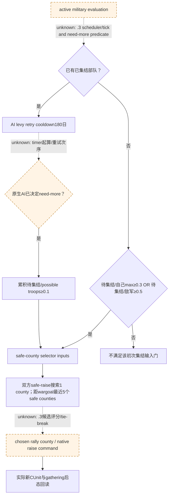
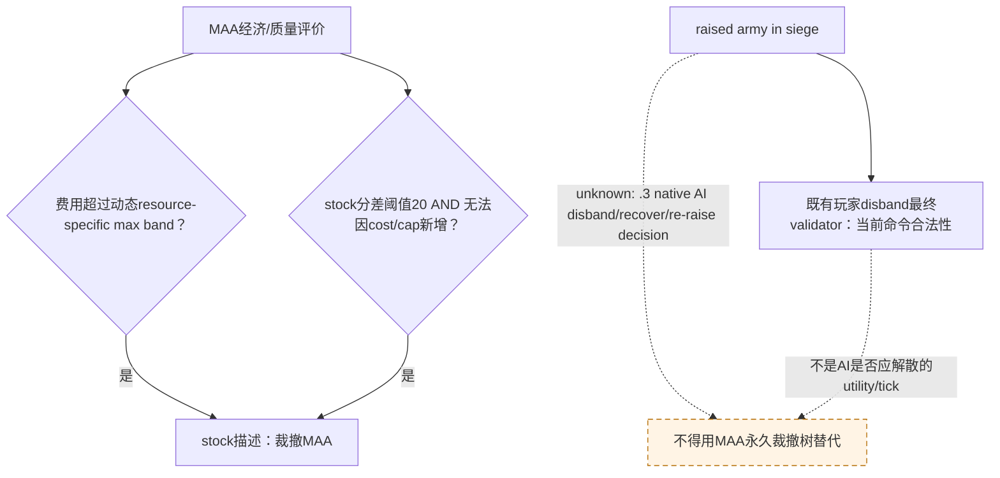
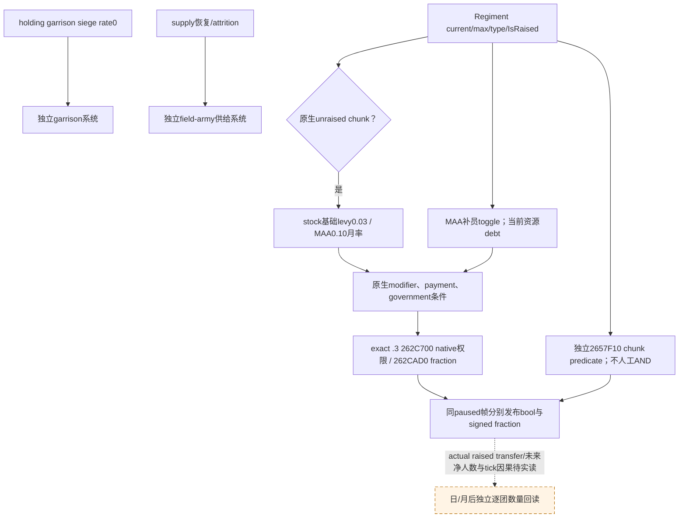

# CK3 1.20.0.3：已集结围城部队补员与再动员的原生输入树

2026-10-03 file-only 研究。当前安装原版为 `Z:/SteamLibrary/steamapps/common/Crusader Kings III/game`，CK3 1.20.0.3 / Steam25652598；exact EXE SHA-256 `94B55397ABB687A3DCD436805A5D885E6BE90FA6C693FEB44A9E3BBEEADE02A6` 已由本包只读文件核对。源码首次读取 HEAD5cbc0ee17f3d6cd2065c1a482607ef6975eef447，后续读取为3cf7f7475c0474f12a08c28fb17b45a990cda2c6；Root同时发布，消费文件分别冻结SHA，不把移动HEAD说成单一未变源码快照。

分派的当前实机基线为 Robert29829 / episode `native-29829-2bc2d599f7f9`，CUnit83886367 → CArmy50331794 在2604围城，2290人，原生ETA109，三场主防御战争。Root随后提供fresh h5030/date53238336 strength：current/max2290/2461、40CArmyRegiments、supply100、base power7482900000Q100000。已集结缺额171不是未集结reserve。本包未查询进程、SDK、pipe、窗口或存档，这些数值属于协调者提供的实际文件基线；没有新增游戏日或收益。

本包所有 `stock-lane/`、`abi-lane/` 和JSON相对证据名均相对外置artifact根 `Z:/ck3_mod_rewrite_process_assets/g2-resume-20261003/army-reinforcement-raise/native-replenishment/`，不是仓库专题的相对路径。

## 当前能得出的结论

原版AI允许在已经拥有军队时再尝试集结levy。`RAISE_LEVIES_COOLDOWN=180` 是 AI 重试时间参数，`RAISE_ADDITIONAL_TROOPS_RATIO=0.1` 在 AI 已决定需要更多军队之后控制 reserve 累积；它们不是玩家 CRaiseTroopsCommand 的全局禁令。无已集结部队时才适用初次集结门：待集结数量达到自己最大兵力0.3，或敌军兵力0.5。完整硬编码 need-more判定、tick起点、精确重试顺序尚未闭合。

当前bridge能读取已集结CArmyRegiment current/maximum，因此能观察缺员；这不能给出未集结reserve、可补员性或未来补员数。现有 `battle_reinforcement` 查询观察战场coordinator分配与join，并非兵团招募补员。不能把已有军队的 `maximum-current` 当作能立即新集结的士兵数。

当前MCP默认集结公告还要求无可控军队，是我方公开step投影条件。因为Robert已有83886367，不能通过解散当前围城军来满足这一条件，再把它声称为原版AI再动员策略。补集结的施工入口是原生未集结reserve/当前CanRaise查询与已有CRaiseTroopsCommand最终validator，保留当前围城ArmyID。

## 原生AI再集结输入树

精确原版来源 `common/defines/ai/00_ai.txt:508–538,1548–1576`。

原文包含拼写 `rasied`，语义仍明确为already raised后need-more。行政军队另有 `CHECK_ADMIN_ARMIES_COOLDOWN=360`（514–518）；不能把它外推为普通Robert的征召兵冷却。

## 裁撤兵士团与解散已集结军队必须分别研究

原版 `common/script_values/00_ai_values.txt:1779–1795` 明确规定 gold MAA维护费超过 `ai_men_at_arms_expense_gold_max` 后AI会裁撤MAA，默认比例0.6；1796以后的时代、头衔、指令、政府分支动态调整，因此0.6不是当前Robert最终阈值。其它prestige/herd/treasury/barter分支独立求值。

`common/defines/ai/00_ai.txt:683–689` 的 `REGIMENT_OBSOLETION_SCORE_DIFFERENCE=20` 只有在旧兵团比最好可招募兵团低该分差，并且因成本或上限无法再招募时，才描述其裁撤输入。624–665同时给出toughness10、attack10、pursuit3、screen1、siege1000、同类subregiment减20和角色/兵种稳定随机0..20%评分扰动。这是投资/永久裁撤MAA，不是临时解散正在围城的Army83886367。

已有当前bridge `ck3_12002_military.cpp:127,453–481` 绑定 disband最终validator RVA0x296A620，完整CUnit generation/controllable核对后构造原生命令；`.3` adapter使用精确SHA和已冻结迁移bundle。这仅说明玩家typed命令合法性路径存在，不证明Robert现在可以解散、不证明原生AI会解散，也不改变当前围城策略。

## exact .3 二进制名称锚点

本包 `exact-ai-raise-name-xrefs.json` 保留EXE SHA、字符串RVA、rip-relative LEA xref、64字节原文与SHA。名称锚点：RAISE_LEVIES_COOLDOWN0x45AE030、MIN_RATIO_SELF0x45ADFF0、MIN_RATIO_ENEMY0x45AE010、ADDITIONAL_RATIO0x45ADFA8、DEFENDER_SAFE_DISTANCE0x45AF270、ATTACKER_SAFE_DISTANCE0x45AF298、NUM_SAFE_COUNTIES0x45AF220。

这些 xrefs 目前只定位名称注册/元数据访问，**不能当作AI实际tick调用链**。本包不把1.19.0.6的旧RVA移植到1.20.0.3，也不重跑已GREEN的battlecoordinator bind5D20550。

## 补员观测与施工入口

### 当前stock已确认的补员条件与域

| 原生输入 | exact stock证据 | 结论边界 |
|---|---|---|
| levy基础月补员0.03、MAA基础月补员0.1 | `common/defines/00_defines.txt:636–637` | 原文明确unraised chunks，不能说当前围城军每月自动补3%/10%。 |
| MAA补员开关/费用 | `gui/window_military.gui:485–493` | IsMilitaryReinforcementsEnabled与GetMilitaryReinforcementCostTooltip是独立查询入口；非conditional_maa_refill政府才显示该checkbox。 |
| understrength "Reinforcing" 标签 | `gui/window_menatarms.gui:318–324` | 只判未满员且非conditional_maa_refill，没有检查开关、付款或地域，不能充当最终可补员性。 |
| MAA金币负债停止补员 | `localization/english/game_concepts_l_english.yml:1523` | stock规则已确认，当前Robert实际gold/debt另读。 |
| levy负债修正 | `common/modifiers/00_basic_modifiers.txt:378–391` | debt0/1分别−0.1/−0.2；不是MAA停止补员的同一布尔条件。 |
| 围城中补员率0 | `localization/english/game_concepts_l_english.yml:679–681` | 语境限定holding garrison，不能外推为正在围城的field army不补员。 |
| 友好领地补员修正 | `common/lifestyle_perks/00_martial_2_authority_tree_perks.txt:127–140` | Prepared Conscription给非landless-adventurer友好地域levy补员修正1；不能推断Robert拥有perk或当前2604实际友好。 |
| supply恢复 | `localization/english/game_concepts_l_english.yml:1171,1176` | 低于当地limit且处友好地域恢复供给；不是兵团补员条件，敌占与合法holder须分开。 |
| levy gather移动速率 | `common/defines/00_defines.txt:583` | 未集结levy gather40distance/day，新增reserve不等于立即抵达当前军。 |
| stand-down返乡延迟 | `localization/english/gui/rally_point_window_l_english.yml:20–21` | 近期解散兵返乡会延缓再集结，未闭合固定公式。 |

完整17文件pins和剩余例外保存在 `stock-lane/ROOT-DELIVERY.json`；原文取证在 `stock-lane/EVIDENCE.md`。

### exact .3 getter施工字段（静态闭合，不是实机值）

`abi-lane/military-reinforcement-tooltip.json` 冻结原生tooltip0x12FF1B0..0x12FF883，SHA `0a2b5abe963c869cbbd337752f24d01ce0de46e5fb131b5b462d858defa4083a`。该路径从MilitaryView+0x218 FullCharacterID正常解析CCharacter，再读+0x1C0军事组件byte+0x4A9；0x12FF237–260选择TT_REINFORCING_MAA_YES/NOT，0x12FF78C–7A1选择CLICK_STOP/START。因此MAA自动补员开关可以从当前角色军事组件直接只读，不依赖实际MilitaryView对象。开关不是全套CanReplenish；missing component不能当作实际false。

| getter/对象 | 已闭合静态语义 | 施工注意 |
|---|---|---|
| CRegiment，magic0x52656769 | 七个0x24-byte chunk从+0x18开始、total maximum+0x128 | 原版GUI Regiment receiver，独立于field army regiment。 |
| CArmyRegiment，magic0x41725267 | 现有strength current/max+0x38/+0x3C | 不是新补员getter的CRegiment receiver，禁止直接共用指针。 |
| 0x262CAD0(CRegiment* RCX,int64_t* RDX)→RAX=out | signed *out monthly fraction Q100000 | 完整分支bytes由abi-lane冻结；不拿基础0.03/0.1替代当前原生结果，不说它是army净补人数/月。 |
| 0x262BC90(CRegiment* RCX)→EAX int32 | 满员时间路径使用上述monthly fraction，单位月；fraction0时native时间也0 | 不能把零时间说成已经满员或保证即刻满员；实际逐月人数另验。 |
| bool0x262C700(CRegiment* RCX,Chunk* RDX)→AL | 补员许可读取toggle、government/resources/army状态；部分native分支调用bool0x2657F10(Chunk* RCX)→AL | type+0x118对象!=ObDG分支0x262C763直接true；**不能手工与2657F10做AND**。分别发布两个原生bool与fraction，保留native分支语义。 |
| bool0x2657F10(Chunk* RCX)→AL | 该独立chunk predicate按current<max、province、army flags/retreat/native0x24ACAC0判定 | 不是262C700所有分支必经门；两项bool不合成一个伪native最终许可。 |
| persistent CRegiment storage | exact .3 slot0x5D1EB68，fallback0x5D1EB58 | 不复用field ArmyRegiment storage0x5D1F340；fullID+0x10/generation roundtrip分别验证。 |
| CArmyRegiment→CRegiment | native0xD14960中0xD14A7C先由5D1F340解析actualArRg；若+0x2C count非零，D14AE8读RAX=[RCX+0x20]，D14AEC取R9D=[RAX+8] persistentFullID | +0x20指首DATA RECORD，**不是pointer array**。record stride/layout未闭合，不遍历猜stride；首record对应persistent七chunks，再按chunk+0x10 actualArRg回链核对。 |
| Chunk字段 | max+0/current+4/persistentFullID+8/actualArRgFullID+0x10/unraised-count排除byte+0x14/state+0x18 | 两种FullID不可互换；许可与未集结count使用的原生条件分别处理。 |
| int32 0x262B860(CRegiment* RCX)→EAX | native unraised count，GUI scalar wrapper0x262D2E0调用；基于七chunks扣除blocked/assigned/dead容量，clamp≥0 | 资格为byte+0x14==0、actualArRgID+0x10==-1、current+4>0，非max-current军缺额。所有levy/MAA owner roster闭合另见reserve-lane，不能用MAA-only冒充allreserve。 |

0x262B860..0x262B8F4 exact函数148字节 SHA `6111e34ed91cbd7eecc5bc53209d3c5d2a23238a2c0ae074ca15ae1a2903a293`，原文在 `stock-lane/reserve-lane/regiment-count-functions.json`。它以persistent+0x128起始总maximum，七chunks中未符合native资格的项扣max，符合项扣max-current，最终返回非负可用活兵；不把未来可能补员计入当下可集结兵。

0x262CF40与0x262BC90已核清同一persistent receiver的+0x128确为maximum；0x262C700中title lookup结果对象的同+0x128是owner CharacterID。相同数字offset跨对象没有统一语义。

**现已封闭10个原生函数：** `abi-lane/ROOT-DELIVERY.json`、`abi-lane/native-abi.json`（SHA `8b2848041af660d158ccea8fe51119d355d2f3a5785df9e3235357eb0c1f4fad`）、`abi-lane/EVIDENCE.md`（SHA `a7b20401150a89e8db2dfb03f9dfba2f0a26f3a02fb66638206d102e7c6b0715`）给出每个完整函数的ABI、bytes/SHA、pDATA或明确leaf ret边界；source3cf7f74到封包0fd88714间消费源码文件逐字节不变。当前仅为研究与静态ABI闭合，未新增字段fixture或live验收。

实际MAA GUI caller0xD15F96–0xD15FB6和levy caller0xD16288–0xD162AA仅把persistent本体和首chunk+0x18交给262C700；true才计算262CAD0，否则显示rate operand0。它们没有额外与2657F10相AND。当前新查询逐actual-matched chunk分别发布两bool与wholepersistent fraction，保持first-record-per-army-regiment覆盖声明，不冒充遍历未闭合stride的全部data records。

Persistent补员owner可能是玩家军队所含的vassal/titleholder；CUnit当前owner仍绑定Robert，但不能强制每个persistent Regiment owner也等于Robert，否则会错失真实levy来源。已有CUnit+0x178→CArmy、CArmy+0x124→同public CUnit、CArmyRegiment+0x140→该CArmy和chunk双向FullID分别绑定原生对象。

并行stock-lane与abi-lane结果在同目录回链。原生需要同一当前帧的未集结人数、levy current/max、兵团raised/满员状态、补员开关和真实最终补员条件。ArmyComposition.GetUnraisedNumberOfSoldiers、GetCurrentNumberOfLevies、GetMaxNumberOfLevies，以及MilitaryView.IsMilitaryReinforcementsEnabled是当前stock GUI命名入口。未集结reserve由本工作包parent追，补员getter证据即时交给Root/army_supply_attrition及其fixture lane合入同一军力查询；不存在第二套重复reader/wire/normalizer修改。

正常围城日级军力下降并不单独说明未补员、损耗率或补员disabled；需同时读取current/max/类型、supply/attrition和native补员最终输入。Root/army_supply_attrition拥有现有军力reader/wire/normalizer修改，本包只提供原生字段和ABI证据，避免重复投影。

本包readiness为research；精确源码/stock/二进制研究不增加Robert production-live、补集结、兵力恢复、围城收复、战争胜利、保存日或G2信用。未闭合getter按具体xrefs继续施工，不以unknown终止当前战斗与围城主线。
