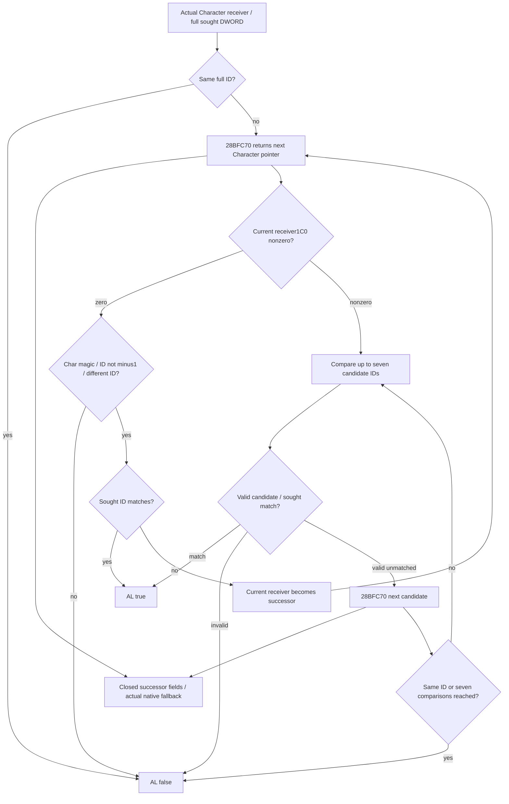
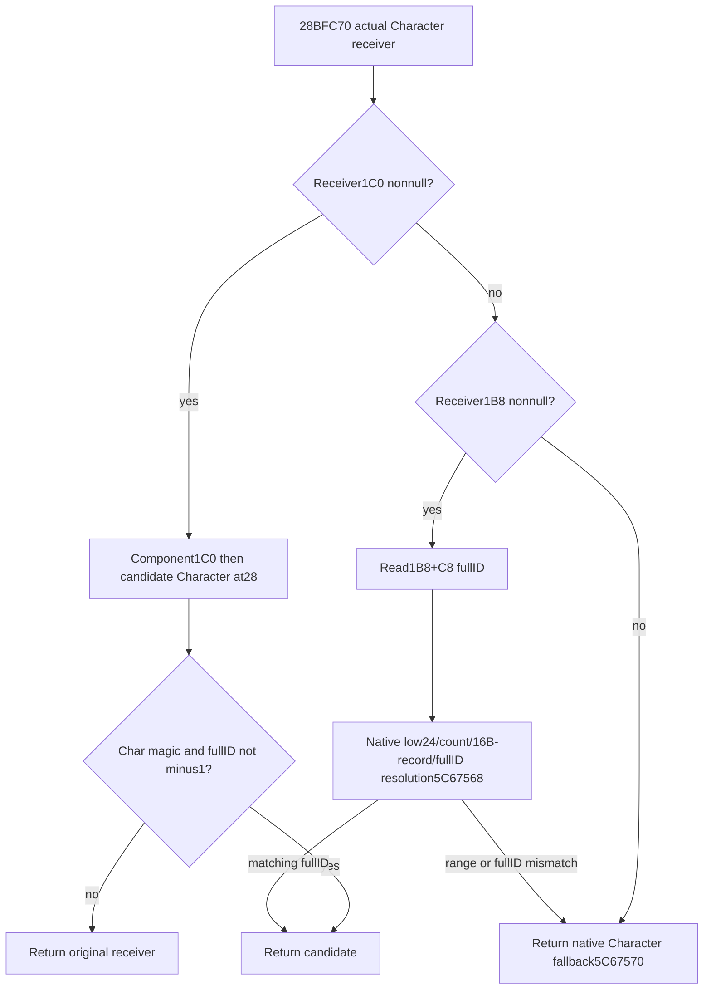
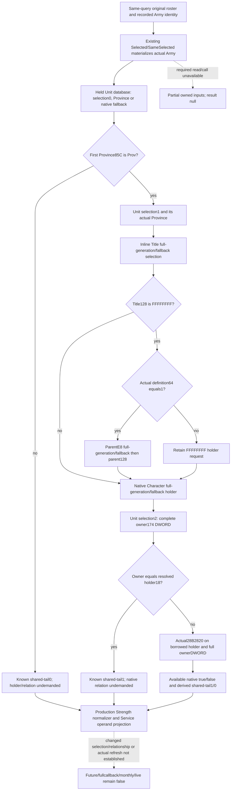

# Selected-title holder and Unit owner predicate, CK3 1.20.0.3

2026-10-06 /2026-W41. This source-first continuation reuses the closed `28B2820` callee for an independent selected-title holder/Unit owner operand query. Current implementation is an **unqualified candidate**; the existing current Army20/21 queries already publish their complete current getters. The new operand does not replace complete [land resupply admission](army-land-resupply-admission-12003.md) or its War-side participant scan. Exact build1.20.0.3/Steam25652598/EXE SHA `94b55397abb687a3dcd436805a5d885e6be90fa6c693feb44a9e3bbeeade02a6` is reused without hashing the frozen EXE again. Local CK3/Steam/process/SDK/pipe/UI access is0. The capture chronology below preserves540B of actual duplicate source I/O; the correction and implementation plan identify the canonical source reuse.

## Source plan and exact closure

The held `2C09810` calls at `2C0997E` and `2C099A4` establish Character receiver in RCX, sought full Character DWORD in EDX and AL boolean result. The separate actual Army20/shared21 source owner also identified the real `24E3FE0` inequality edge to the same callee with **selected-title holder Character pointer and selected Unit+174 owner DWORD**. That caller's actual selection/consumer context remains owned by its source provider; the current Province/occupation holder chosen by `247D030` must not be substituted without equality proof.

Root authorized a cached-first named-function locator with at most20×12B metadata and one actual containing body≤8192B. The pre-capture plan reused `source-clock-new-spans/PE-MAP.json`, the daily-assault raw pdata cache and named holy-war raw point caches. No PE headers or whole section/table were reread. Cached indices137495/145134 bounded7638 candidate entries; the actual capture used12 new probes144B and one body160B, **304 new frozen-EXE bytes total**.

`28B2820` is the actual runtime-function begin. Complete body is `[28B2820,28B28C0)`,160B/51 decoded instructions, body SHA `2f1f7d84d8e4fa059b679046a96a616c8adafdd5cc76d846a5a2574c6b4abf4c`. Metadata index139725, RVA5F5C59C/file5DF379C, raw `20288b02c0288b025c9d1005`, tuple `[28B2820,28B28C0,5109D5C]`; unwind pointer was not read. Body file offset28B1C20.

The function returns false when soughtID equals receiver+18. It obtains a successor Character pointer through the actual direct callee **`28BFC70`**. If current receiver+1C0 iszero, the successor must have Character magic43686172, fullID!=-1 and a different fullID from current receiver; soughtID match returns true, otherwise the successor becomes current receiver and traversal repeats. This branch has no local numeric counter and can transition into the nonzero+1C0 branch.

For current receiver+1C0 nonzero, the separate branch compares at most seven candidate IDs. Invalid Character magic or fullID−1 returnsfalse; soughtID match returnstrue. A successor with the same ID as the preceding candidate returnsfalse; other successors repeat while the local counter<7. Direct stores are saved registers/stack only. The `28BFC70` implementation is closed below and by the existing canonical source; no liege/alliance/hostility/faith business label is inferred from the outer loop.

## Minimum same-query work and current boundary

The independent draft proposes one optional Strength leaf `current_selected_title_holder_owner_relation_v1`, source `native_selected_title_holder_owner_relation_28b2820`, for the actual selected-title holder/selected Unit owner context. Preserve actual holder source/resolved full IDs and native fallback provenance, full owner DWORD bits, available native false, legal0 and unavailable current reads. The second argument is a DWORD, so no owner Character-pointer lookup is invented merely to pass it. Native pointer+pointer `2C09D30`/IsHoldingDefender is a different entrance.

The leaf must connect to the actual Army20/shared21 consumer's demanded inequality branch in the same capture; it is not a metadata-only completion. Reuse for a conditional branch requires unchanged actual selection/holder/Unit owner and relationship context. It does not grant whole land resupply admission, changed future relationships, full monthly rate/dispatch or actual after-stage readiness. No provider, counter-model, fixture, test or implementation has been executed at this source-first stage.

### Actual successor getter closure

The necessary actual deciding getter `28BFC70` is now closed under Root's bounded finite-callee continuation authorization. Its fresh cached bracket `[139884,140360)` needed9 new probes108B. Adjacent metadata indices139993 `[28BFC20,28BFC67,511CFE8]` and139994 `[28BFD60,28BFD97,51094F0]` prove the target has **no containing exception-table extent**. That actual locator RED/miss is preserved; no pdata function boundary was fabricated and the initial containing-body read count remains0.

The proven direct-call entry was then read as two explicitly planned reachable instruction windows: `[28BFC70,28BFCB0)`64B, followed only for actual branch/fallthrough frontiers by `[28BFCB0,28BFCF0)`64B. Entry-reachable CFG closes at `[28BFC70,28BFCE6)`,118B/31 instructions; this is a logical reachable-code span, not a formal pdata extent. Logical body SHA `d7675380a1279ba5242feb3bb6053302519af85c32e56e2338ea6015e76f545c`. Ten trailing captured bytes remain unclaimed/uninterpreted. There are no CALLs, memory stores or remaining code frontiers.

The getter loads receiver+1C0 and receiver+1B8. Nonnull1C0 follows `[(receiver+1C0)+1C0]+28` to a candidate Character; valid Char magic and fullID!=-1 return that pointer, invalid candidate returns the original receiver. Zero1C0 with nonnull1B8 reads the full CharacterID at1B8+C8, resolves slot5C67568 by low24/count+2C/data+20/16B-record pointer+8/fullID+18, and returns a matching actual pointer. Null1B8/out-of-range/mismatch return the native fallback pointer at5C67570. No new fallback or ID policy is imposed. Business labels for the relation/components remain unnamed.

Total actual frozen-EXE cost is **540B**: target12metadata144B+160B body, successor9metadata108B+128B direct reachable windows. No generic/unrelated function, PE header, whole table/section or EXE hash was read. The outer Mermaid's formerly unexpanded getter node is now satisfied by this closed getter; no deciding-code frontier remains for this predicate. The actual selected-title holder query-context/provider connection and real compiled observer qualification remain the next work.

External packet `Z:/ck3_mod_rewrite_process_assets/g2-background-round20-20261006/holder-owner-relation-28B2820/` holds preplans, raw metadata/body/ASM/receipts, exact source Mermaid and DTO/FIRST draft. `locator-plan/CAPTURE-RESULT.json` records the initial304B; successor `CAPTURE-RESULT.json` preserves the108B locator miss, and `entry-window-64/CONTINUATION64-READ-RECEIPT.json` plus `GETTER-SOURCE-CLOSURE.md` record the128B direct-window/118B reachable getter closure. `DAY-WEEK-FINAL-DELIVERY.json` binds actual Oct6/W41 fields. Readiness remains **research: exact readonly predicate/getter source closed**, with actual query-context/consumer implementation and compiled qualification still pending. No field is declared live/static-ready by a draft. Old tests/wires, native build/CTest, whole EXE/hash/section scans and local game operations remain0.

## Existing source reuse correction and independent operand plan

The later published base `bcdbc27e972df477cc9b01f167c066a691c23a7b` already contains the [owner Character chain](army-refresh-owner-character-chain-12003.md), including both exact bodies, and the qualified [current Army20](army-current-flag20-observer-12003.md) and [current Army21](army-current-flag21-observer-12003.md) getters. The earlier scoped cache miss covered older named resupply/refill packets, not that later source packet. The actual 540 bytes captured above are retained as **duplicate source I/O**, with no new source-closure credit. Implementation reuses those canonical sources; it requires0 additional EXE bytes. Current20/21 completion is already established and is not claimed again here.

Root approved an independent operand observer after the actual production seam was identified. Existing20/21 collectors call whole native getters but do not publish selected Title holder/whole Unit owner operands. The new `current_selected_title_holder_owner_relation_v1` will expose that actual same-query selection and its native inequality predicate. This is useful as a frozen-selection conditional input when a modeled outer prefix newly demands the shared tail. It does not make a changed relationship, changed Province/Title/Unit selection, repeated refresh or full monthly callback ready.

The collector borrows the current postadmission roster and materializes each original Army with existing `Selected`/`SameSelected`. It preserves raw fullDWORDs, native indices and duplicate occurrences. It loads actual Unit store/fallback once, then retains all **three** Unit selections in source order: first Province/tag, second Province/Title, final Unit174 owner. Store-null skips the corresponding request-ID read; inner selection must not use the generic eager-required-ID resolver. First Province magic other than `Prov` yields a known shared-tail0 with subsequent fields undemanded. No current validated Province or Province73C occupation holder substitutes for these selections.

The inline Title route uses actual slots5D1DAF8/5D1DAE0, requested Province738 and full Title10 match. Only Title128=`FFFFFFFF` demands definition64, and only definition64=1 demands parentE8/parent128. The retained `FFFFFFFF` holder reference still follows native Character registry/fallback selection. Final Unit174 equals selected Character18 yields shared-tail1 without calling28B2820; inequality calls the actual readonly28B2820 and normalizes its Boolean to shared-tail0/1. The local actual Character pointer is borrowed only for that call; serialized outputs contain owned IDs and identity tokens.

Nine new owned files provide DTO, inline serializer, header-only native collector/binder, dedicated strict contract, pure operand projector, compiled-wire loader, one compiled-dependent Service compound, genuine whole-query native fixture and this topic. Root owns additive ArmyBindings/Strength/serializer/normalizer/Service/CMake hooks. The native fixture must use `ReadArmyStrengthsForScope` and `AppendArmyStrengthV1`; no leaf transplantation into a fabricated row or second query is accepted. No test/build/wire/dispatch is run in this candidate before Root's next formal qualification. The source plan precedes code; actual current flags, land admission, and other qualified cases are not rerun.

## Candidate delivery and sole qualification entrance

Candidate delivery completed at **2026-10-06T23:04:58+08:00**, tree `C:/codex-ck3-background/holder-owner-relation-source`. Python four-file consumer commit is `37a734b2bbff9d228a994995a46b45e438302338`; readonly DTO/collector/serializer and source-reuse correction are `c4c14b8bb767ab5850705b0f8681a40a01216bb7`; the sole new whole-query fixture is `5164ea47b331df16d77ba8b62646085f69418f43`. Root shared hooks and formal qualification remain pending. Implementation adds0 EXE bytes; the source capture ledger retains540 duplicate I/O bytes and0 new closure credit.

The native API is `CurrentSelectedTitleHolderOwnerRelationBindings12003`, `BindCurrentSelectedTitleHolderOwnerRelation12003`, `ReadCurrentSelectedTitleHolderOwnerRelation12003(bindings,const ArmyCurrentPostAdmissionRefreshInputsV1&)`, owned `ArmyCurrentSelectedTitleHolderOwnerRelationV1`, and `AppendArmyCurrentSelectedTitleHolderOwnerRelationV1`. The pure Service result is a current selected-context shared-tail operand, not a20/21 cache writer. Early invalid Province gives0, direct equal gives1 with native relation undemanded/null, actual inequality false gives0, actual inequality true gives1, and missing demanded callable preserves the IDs while leaving the result null.

Requested target/CTest is `xar_bridge_ck3_12003_selected_title_holder_owner_relation_test`, PRIVATE runtime linkage; `--wire-dir <dir>` emits one `ck3_12003_selected_title_holder_owner_relation_wire.json`. Its ten complete native samples retain two duplicate original occurrences each, current20/max40/power4000000, actual holder-pointer/full-u32 owner callback checks, held Unit store/fallback once per occurrence, all three source selections, and unchanged world bytes. They cover invalid first Province, equal IDs, native false with owner0, native true with holder0, high-bit/full generation, generation mismatch/native fallbacks, missing Title holder with tier1 parent, missing holder with other tier, null inner stores/undemanded IDs, and missing callable. All are **unexecuted**; the actual replacement callback/world are synthetic, not a native predicate against live CK3 objects.

The sole compiled-dependent consumer is `ArmyCurrentSelectedTitleHolderOwnerRelationService12003Tests.test_first_compiled_selected_title_holder_owner_relation_through_service_normalizer_and_current_projection`; required environment `XAR_ARMY_SELECTED_TITLE_HOLDER_OWNER_RELATION_WIRE`, optional output `XAR_ARMY_SELECTED_TITLE_HOLDER_OWNER_RELATION_CASE_OUTPUT`. It loads only the ten genuine whole-query native rows, consumes them unchanged through the production Service and strict Strength normalizer, and verifies the pure projection/provenance. Root must first freeze/compile the coherent shared-hook tree and run only the new native CTest. Python imports/tests/dispatches, native builds/CTest/compiled consumers, local game/Steam/process/SDK/pipe/UI operations, and child push are all0 at delivery.

## Concrete query integration candidate

The shared hooks are now implemented in the isolated `C:/codex-ck3-background/holder-owner-relation-source` tree, based on coherent core `e03d6d9e9ec8dcebf09b9de07d66ce9f4ac6aa43`. `ArmyStrengthSnapshot` and `ArmyBindings` append the new optional DTO and binding at their tails, retaining prior aggregate positions. The exact .3 adapter binds the existing source-closed `BindCurrentSelectedTitleHolderOwnerRelation12003`. `ReadArmyStrengthsForScope` captures the new family once after the same-query postadmission capture and copies the owned result into each real Strength scope row. `AppendArmyStrengthV1` serializes that optional observation; older producers may omit it.

The existing `query-army-strengths-v1` route now consumes the family through its strict optional whole-row normalizer and returns per-selected-row pure projections with the same snapshot provenance used by current20/21. The integration adds no endpoint or action. It does not change the old flag schemas, numeric/native/global readiness or future/full-monthly readiness. The published operands belong to the actual frozen selected Title holder and final selected Unit owner, and an unavailable demanded input remains distinct from native false or 0.

`cmake/current_selected_title_holder_owner_relation_12003.cmake` is included by the native CMake project. It defines only the new genuine whole-query target and CTest, PRIVATE-linked to `xar_ck3_12002_runtime`, retaining the neighboring `/W4 /WX /UNDEBUG` convention. The source recipe emits the ten complete samples with `--wire-dir <directory>`, at `selected-title-holder-owner-relation-wire/ck3_12003_selected_title_holder_owner_relation_wire.json`. It is ready for Root's next coherent formal freeze; no configure/build/test has been run by this integration lane.

Both tracked core Python modules and the sole new test/builder have been materialized from their existing HEAD contents; their semantics are unchanged. Source and fixture callbacks remain as described above. The concrete connection is **implemented but unqualified**: the new CMake/native CTest and compiled Service FIRST are still **NOT RUN**, and no static-ready or live credit is granted until those explicit qualifications. The external integration delivery records the final source commit, API/CLI, actual source-only review, Oct6/W41 fields and zero new EXE/game/SDK operations.

External `ROOT-DELIVERY.json`, `ROOT-TARGET-USAGE.md`, `OCT6-W41-FIELDS.json` and `observer-draft/PYTHON-SHARED-HOOK-RECIPE.json` provide the exact nine files, shared hook recipe, first-only qualification entrance, actual cost, preserved locator/Git-message/whitespace harness events, and remaining readiness limits. No shared daily/weekly file is edited by this child. Readiness remains **research / unqualified implementation candidate**; limited static-ready credit requires Root's first formal compiled qualification. Changed selection or relationship, actual refresh/cache writes/next occurrence, full callback/daily/monthly and live remainfalse.
