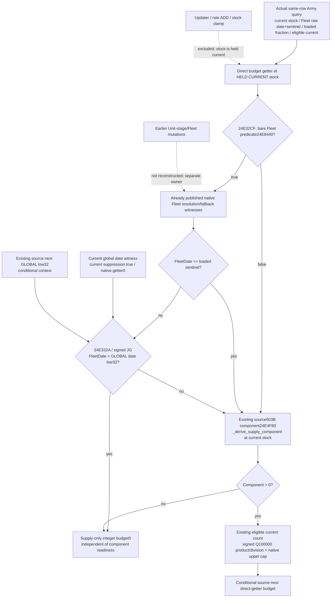

# Source-derived next Fleet supply budget in CK3 1.20.0.4

The selected observer is a readonly **direct-getter held-stock primitive**. It replaces only the supply budget getter's global date operand with the existing source-derived next global low32, while holding the current captured stock and non-date operands fixed. Source closure is complete; the new whole producer, Service branch and consumer are **SOURCE_PREPARED / NOTRUN**. Root26 write-join and earlier GREEN artifacts are reused without replay.



Exact Root identity is CK3 1.20.0.4, Steam25734779, SHA `98702f88a547cde2eaf29a85f93b85f68ee4cf8148336a4f7afaeb75319dd518`. The retained complete budget source is `24E32C0..24E3405` (325B =166B prefix+159B suffix). It calls bare Fleet predicate `24E8440`, resolves Fleet using `5D1F9B8`/fallback `5D1F9A8`, reads Fleet+20 at `24E3318`, compares loaded sentinel `5C83A68`, loads global GameState slot `5C68C50` at `24E3323`, and executes signed `JG` at `24E332D` after comparing against GameState+8 low32. It does **not** read updater's passed-date pointer.

```text
suppressed = bareFleetApplicable
             && signed32(FleetDay) != signed32(loadedSentinel)
             && signed32(FleetDay) > signed32(globalDateLow32)
```

The source-next context uses original `source_derived_next_daily_supply_frame_inputs_v1.source_derived_next_date_raw_i32`. Copying current monthly suppressionbool would miss the equality boundary. Fleet **rate** date admission is a separate source node and cannot supply this signed budget comparison. Full future CDate64 and schedule phase readiness are not prerequisites for this low32 direct primitive.

All raw inputs already exist: `current_fleet_supply_tick_inputs_v1` has the bare predicate/date/sentinel/Fleet/subject witnesses; `monthly_loss_budget_inputs_v1` has loaded levels/fractions and commander inputs; `loss_application_inputs_v1` has eligible current soldiers and native current budget; the row holds current stock. The selected Service projection is `project_source_derived_next_fleet_supply_budget_v1`, published through `GameplayBridgeService.query_army_strengths` on the existing registered `ck3_query_army_strengths` route as `source_derived_next_fleet_supply_budget_v1`. It reuses the existing exact `_derive_supply_component`/integer calculation. New getter, raw DTO, binding and production native changes are all zero.

The new independent native target `xar_ck3_12004_source_derived_next_fleet_supply_budget_whole_test --wire-dir <fresh>` uses real `ReadArmyStrengthsForScope12004` → existing collectors → `AppendArmyStrengthV1` → actual4 `Render12004BuildIdentity`. It captures currentGlobal53288448, sourceNextGlobal53288472, FleetDay53288472, sentinel−1, bareFleet=true, current suppression=true and native current budget0. Held stock remains123450000; whole-stock quantity is1234; levels[2000,1000,0] select index1/fraction12500; invalid commander returns that raw base; eligible current100 produces trunc(100×12500/100000)=12, capped by100. Conditional next signed equality opens the component path, so the Service yields12. The native fixture never assigns12 or a derived future family.

The fixture retains unrelated Fleet terrain-rate payload unavailable while actually reading its needed raw date/sentinel/IDs. Monthly component family and loss-application observations are available. Native current monthly rate0/aggregate attrition0 remain current observations. One duplicated RegimentID appears twice in the original roster; filtered count getters expose flags0/1/2/3 as100/0/100/0. Callback ABI/count/order and every fixture-owned input byte are asserted unchanged.

Fixture memory, callbacks, loaded tables, calendar table bytes and current paused transport are synthetic. No native executable callback or game is contacted. The existing full-date builder also emits its qualified source-derived CDate using synthetic table bytes; that field is not required by this budget observer. Preserve all actual-future-frame/callback, earlier-stage reconstruction, future stock/strength, full-daily and full-monthly flags false. This direct budget primitive does not claim post-updater stock, casualty application or a complete daily/monthly transition.

Source receipt/field ledger, exact wire protocol, sole consumer and Root argv are recorded in `Z:/ck3_mod_rewrite_process_assets/g2-parallel-20261007/army-future-supply-numerics-12004/source-node`. Source helper closures are retained from:
- `support-first01/support_24E32E0-DETAIL.json` (166B);
- `support-suffix02/suffix_24E32E0-DETAIL.json` (159B);
- `support-suffix02/component_24E4FA0_full-DETAIL.json` (503B);
under `g2-background-20261007/upstream-build-migration/army-family-12004/commander-supply`.

The sole new consumer is `SourceDerivedNextFleetSupplyBudgetWholeService12004Tests.test_source_next_global_date_budget_reaches_same_army_service` in `tests/test_source_derived_next_fleet_supply_budget_whole_service_12004.py`. It sends one original whole through the actual registered Army tool, NativeHeadlessGameplayDriver and Service, correlating only the outer request id. Parent source-only AST/diff receipts and English commit are recorded in the external package. Native/Service execution, production imports, builds, game/SDK/process access and EXE/binary-cache/hash reads remain zero. Root owns the first new target/sole consumer execution; earlier GREEN targets are not replayed.
