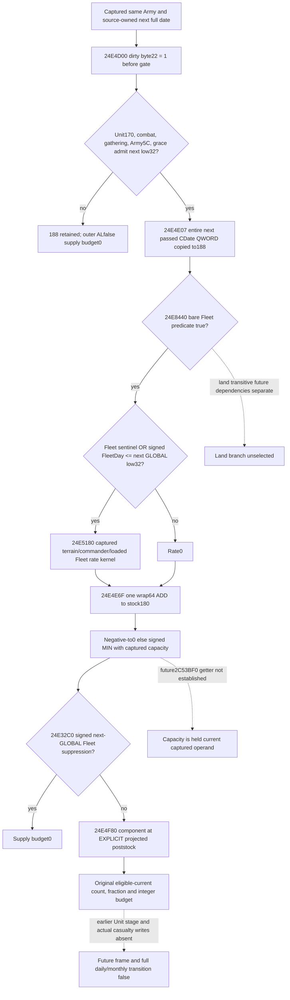

# Source-derived next Fleet stock and supply budget, CK3 1.20.0.4

2026-10-08 / W41. This source-ready extension adds a Fleet-only ordered conditional program to the existing Army Strength query: source-next admission and date writes, Fleet rate recomputation, one stock ADD/clamp at captured capacity, then supply integer budget at explicit projected stock. It uses already published inputs, with no new native getter, binding or DTO. Native fixture and sole consumer are **NOTRUN** at this child delivery.

Build1.20.0.4 / Steam25734779 / SHA98702f88a547cde2eaf29a85f93b85f68ee4cf8148336a4f7afaeb75319dd518 are reused Root freeze facts. The source base is99c65edf845e369a58673a7dbca95954f92739ae; no Git/hash/EXE recheck occurred.

## Native order and selected branch

The actual outer callback24E3410 calls updater at24E3430 and tests its AL before budget24E343E. The complete updater24E4CF0 writes22 before gates, copies the entire admitted passed date to188, invokes rate24E5180, performs one stock ADD, then calls capacity2C53BF0 and clamps. Anchor190 remains unchanged. These closed463/1580-byte source facts are reused from the earlier write topic without rereading them.

The actual4 complete rate [24E5180,24E5FDA),3674B is held in commander-supply/support-first01/support_24E51A0-DETAIL.json. It directly reads Army120/124/12C/38/44, with no Army22/188/180 read. Stack[RBP+188] and related detail temporaries are not CArmy fields. The complete bare Fleet leaf24E8440,256B in support-suffix02/leaf_24E8460-DETAIL.json has no calls: it resolves Fleet/Unit fullIDs and compares owner contexts, with no22/188/180/global clock access. Captured terrain and commander modifier inputs remain explicit same-context premises.

Rate admission at24E53C5 is **signed JLE** comparing resolved Fleet+20 with GLOBAL GameState+8 low32 after sentinel equality. Budget suppression at24E332D is the complementary signed JG, also independently reading GLOBAL+8. The updater's passed date controls grace and188; the source-next leaf supplies the conditional next GLOBAL value. Today's observed rate0 and suppressiontrue stay current observations.

The Fleet fixed divisor is signed64 MAX(loaded floor,wrap64(100000+fixed commander1A9)). It is unrelated to GameState+9C native day-index. No direct native day-index read occurs in the complete selected Fleet rate/predicate path. The already qualified sourceNextD395353 selects schedule phase13; currentD+1 is not used. The divisor-zero Fleet branch zero-extends EDIFFFFFFFF to positive4294967295; that does not change date signedness.

Capacity is the published **captured current** current_supply_capacity_raw. Its native getter is called after ADD, but this package does not prove every transitive future capacity dependency or claim an actual future getter observation. Land Province1AB, owner/commander usage/limit, resupply and local-component adjustment remain a separate concrete dependency ledger; no blind current-land-rate reuse is enabled.

## New whole scene and numerical value

The fresh scene has current raw date53288448, independent synthetic storedD12, source-next low53288472/D395353 and fullCDate304845178016701976 from the existing production builder. Current grace elapsed2 equals loaded grace2 and rejects; next elapsed3 admits. Original Army22 is0, old188 is21528124856 and anchor190 is38707994064.

Fleet date53288472 suppresses today's rate and budget to observed0. On the source-next equality it admits rate. The fully ready current Fleet payload has terrain magic4744624F, ordinal1B0 raw0, native fallback commander fixed1A9 raw0, loaded loss100000, floor100000 and max loss500000. The qualified rate kernel gives −100000. Original stock100000000 stays unchanged in the whole row; the conditional once-only ADD yields99900000, and held capacity200000000 leaves it unchanged. Whole stock999 selects loaded state2/fraction25000 instead of held stock1000/state1/fraction12500. Eligible current count100 yields projected budget25, versus the separate held-stock conditional budget12.

This is a conditional numerical program. Earlier Unit/Fleet changes, actual future callback/frame, post-stage getter execution, physical casualty application and full daily/monthly supply transitions remain false.

## True whole producer and sole Service entrance

The new target `xar_ck3_12004_source_derived_next_stock_supply_budget_whole_test` takes `--wire-dir <fresh-dir>` and emits `01-source-derived-next-stock-supply-budget.json`, `01-source-derived-next-stock-supply-budget-native-context.json` and PRODUCER-RECEIPT.json. The fixture calls actual ReadArmyStrengthsForScope12004 once, actual AppendArmyStrengthV1 once and the actual4 build-identity renderer. No family or derived numerical leaf is hand-assigned. Synthetic native callback outputs represent only captured current inputs. Heap-owned input objects and their before-copy are asserted unchanged; callbacks validate exact receiver/output/ordinal/detail ABI, counts and20-event order.

The consumer sole method is SourceDerivedNextStockSupplyBudgetWholeService12004Tests.test_source_next_stock_budget_reaches_same_army_service. It consumes the fresh complete whole through existing registered ck3_query_army_strengths, real GameplayBridgeService.query_army_strengths and NativeHeadlessGameplayDriver, one request. Synthetic paused current hello/frame comes only from the sidecar; no heartbeat or future frame is invented. Only outer transport correlation is rebound. Full original whole/context bytes and current scalars remain unchanged.

The external protocol, source-use ledger, exact recipe and Oct8/W41 cost fields are at Z:/ck3_mod_rewrite_process_assets/g2-parallel-20261007/army-next-stock-loss-budget-12004/. All64-bit metadata values use decimal strings; compiled JSON uses exact signed64 integer serialization. The parent delivery records the source commit, one AST-only syntax pass and one staged diff check. New EXE/hash/game/SDK/process/input/build/import/test/native-run operations are zero. This package does not replay prior GREEN families.
