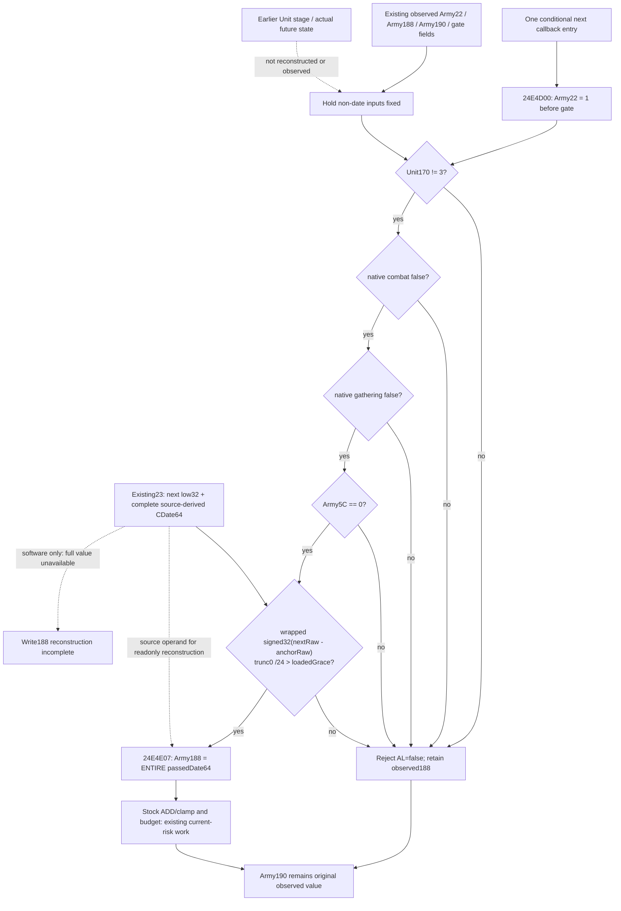

# Source-derived next updater writes in CK3 1.20.0.4

This topic records a readonly same-Army-query write join. Native source is closed; the newly prepared one-scene whole fixture and Service consumer remain **NOTRUN**. Exact Root build: CK3 1.20.0.4 / Steam25734779 / SHA `98702f88a547cde2eaf29a85f93b85f68ee4cf8148336a4f7afaeb75319dd518`.

Source facts are from complete actual4 updater `24E4CF0..24E4EBF` (463B) and outer callback `24E3410..24E3A3C` (1580B). The outer directly calls updater at `24E3430`, tests AL and calls budget getter `24E32C0` only if admitted. No earlier reset occurs in the outer prefix. The native byte22 write precedes every eligibility test; admitted full-QWORD188 write precedes rate and stock update. The updater does not write anchor190.

The gate rejects Unit170=3, native combat, native gathering, nonzero Army5C, or signed elapsed <= signed loaded grace. Low32 subtraction wraps as DWORD before signed truncation toward zero by24. Native helpers `24AC3C0` and `24AC140` and loaded grace `5C69AA0` are already bound/published. Reconstructing the entire +188 copy requires `source_derived_next_daily_supply_frame_inputs_v1.source_derived_next_date_storage_raw64`, with `source_derived_full_cdate64_ready`; the next low32 alone does not establish it. This readiness flag belongs to the readonly projection and is not a native eligibility predicate.

Raw gap is zero. `monthly_caller_effect_inputs_v1` supplies observed byte22/current full caller date; `army_update_clock_v1` supplies observed188/190/grace; `monthly_loss_budget_inputs_v1` supplies the four typed gate fields. This join does not require unrelated overall budget/caller readiness and does not duplicate stock ADD/clamp, budget or physical loss. `project_source_derived_next_updater_writes_v1` attaches through `GameplayBridgeService.query_army_strengths` as `source_derived_next_updater_writes_v1` on the existing registered `ck3_query_army_strengths` route. The current +188/current-clock equality is a value witness, not callback or write credit; retain it for the next actual date readback.

One new independent target `xar_ck3_12004_source_derived_next_updater_writes_whole_test --wire-dir <fresh-dir>` invokes actual `ReadArmyStrengthsForScope12004` → common collectors and existing native full-date builder → `AppendArmyStrengthV1` → `Render12004BuildIdentity`. It never assigns a future DTO/frame. Fixture inputs: currentRaw53288448, independent synthetic D12, grace anchor53288400, grace2, byte22=0, old188full21528124856. Current elapsed2 rejects; nextRaw53288472 gives3 and admits. The existing builder reads synthetic readonly calendar table bytes day19/month7 at index58 and returns full next64=304845178016701976. Unneeded budget/caller providers remain absent and their original partial status survives. Whole callback ABI/count/order and every owned input byte are asserted unchanged.

The native row stays an original current observation. The Service result is a conditional source-derived write result. Actual future frame/callback, earlier Unit mutations, future stock/strength, full daily transition and full monthly readiness remain false. Selected pointer occurrences are opportunities; do not multiply stock effects or assert actual future execution. Fixture tables, callbacks and paused transport are synthetic; G2 runtime state and actual loaded table values were not read.

External source closure, instruction/field ledger, exact protocol, Root recipe and cost fields: `Z:/ck3_mod_rewrite_process_assets/g2-parallel-20261007/army-future-supply-effects-12004/`. Source-only AST parsing passed for the new projection, sole consumer and modified Service. Native/Service execution, builds, production imports, game/SDK/process access and EXE/binary-cache/hash reads remain zero. Root owns the first fixture qualification and actual next-day stock/date observation.
