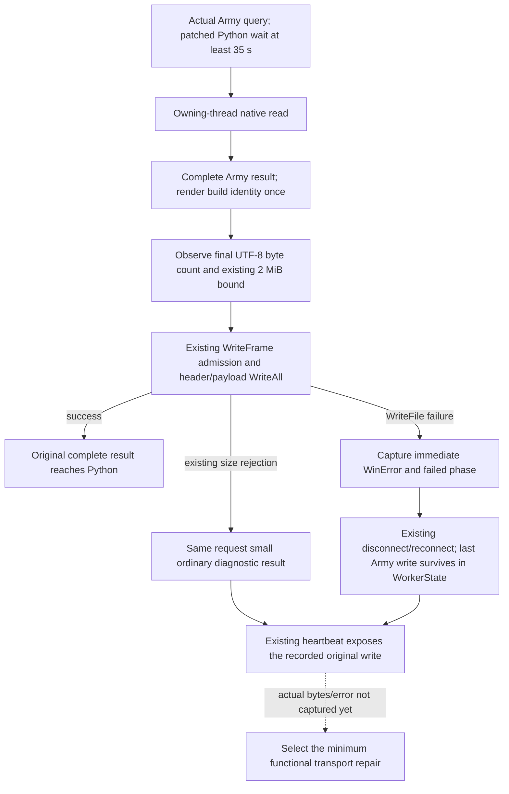

# R0049 Army strength result write disconnect — exact 1.20.0.3

2026-10-06 source-first plan. Exact executable identity remains the held
1.20.0.3 / Steam build 25652598 / EXE SHA-256
`94b55397abb687a3dcd436805a5d885e6be90fa6c693feb44a9e3bbeeade02a6`;
this package performs no new executable capture or hashing.

## Actual fault and corrected boundary

The original R0049 Army query returned a missing-command-result error after
11.110078 s. The separately qualified Python overlay
`3fe0dddf1351776cae7fda93827d4a5c2ae5081a` has the Army-only 35 s wait floor,
yet its actual retry for Armies `218104048` and `134218098` returned the same
error after 11.629072 s. Its actual argv, working directory and entrypoint
`sys.path[0]` select the patched source03 tree. The corrected new offline
compound passed four subscenes; the original final-frame-count RED is retained.

The existing diagnostic query subsequently observed the same CK3 PID `92056`,
connection generation `3 -> 4`, and mailbox published/completed/executed `4`,
failure `0`, exception code `0`, ready, paused, raw date `53288232`.
This establishes an intervening connection lifecycle change; it does not
establish the contents or success of the lost Army result. The result wait
also wakes on `not connected`; its missing-frame branch currently uses the
same timeout text for that early return. No 10 s idle/read/write timer exists
in the exact Python read loop or native protocol writer inspected here.

Artifacts are under
`Z:/ck3_mod_rewrite_process_assets/g2-background-20261006/managed-runtime-resume-r0049/`:
original `gameplay-responses/003-current-own-army-inputs.json`, and
`python-deadline-hot-upgrade/fixture-repair01/gameplay-responses/`
`002-fresh-both-army-deadline-retry.json` plus
`003-after-retry-bridge-diagnostics.json`. The owned external diagnosis packet is
`Z:/ck3_mod_rewrite_process_assets/g2-background-20261006/r0049-army-query-timeout-diagnosis/`.

## Exact production output seam

Qualified native source is `333bb98fd5ea4ef6481f89eabe9916e8914a955b`.
Its `bridge.cpp` Army dispatch calls `ReadArmyStrengths`, builds a complete
`ArmyStrengthsResultFrame`, renders Crozier build identity, and assigns
`WriteFrame`'s bool to `connected`. `protocol.cpp` rejects an invalid handle,
empty payload or payload above `kMaximumFrameBytes = 2097152`; its `WriteAll`
also returns false on `WriteFile` failure or a successful zero-byte write.
The Python header bound and both pipe buffers use that same 2 MiB bound.
There is no measured Army output size or write error in the supplied owner,
SDK or game logs. Existing `payload_bytes` diagnostics cover snapshot
publication, while the Army reader diagnostic covers its native
reader/submit/wait/reclaim stages. Neither closes this result-write gap.

## Minimal approved observer plan before implementation

Root owns all edits to `protocol.hpp`, `protocol.cpp` and `bridge.cpp`.
The existing `WriteFrame` keeps its first two parameters and gains an optional
`FrameWriteDiagnostic* = nullptr`. Old callers retain their behavior.
The new DTO carries `uint64_t payload_bytes`, `uint64_t limit_bytes`, a symbol
for `not_started/handle/empty/size_limit/header/payload/complete`, `bool success`,
and an optional `uint32_t windows_error`. The error is captured immediately
after an actual failed `WriteFile`. A successful zero-byte write has no
invented WinError; admission failures likewise do not read stale LastError.

The owned Army helper takes the already-rendered payload, existing query
sequence and a caller-owned diagnostic slot. Root stores this slot in the
existing `WorkerState`, invokes the helper only at the Army result output,
and adds its serialization to the existing heartbeat. It persists across the
existing connection loop. No new MCP tool, state lifetime, concurrent
publication mechanism or frame-size bound is introduced.

If the existing size admission rejects this Army payload, Root uses the same
request ID and existing `CommandResultFrame` to return a small error containing
the observed bytes and bound. This plain fallback write must preserve the
original rejected-write diagnostic. That diagnostic delivery alone does not
restore Army observation. Actual bytes/error select the next functional
repair: a legal complete response must reach the existing consumer. Any
necessary capacity adjustment or removal of measured redundant global inputs
is a subsequent evidence-based package; the current 2 MiB limit stays intact.

One new native fixture will exercise the actual `WriteFrame` and owned Army
helper with an ordinary complete result, an over-limit result followed by a
same-request small diagnostic, and a real anonymous-pipe broken-reader failure.
It checks final-byte accounting, nullable immediate WinError and preservation
of the original failure across the fallback. Root alone compiles and executes
the unique new target; no old qualified test is replayed.

## Readiness

The 35 s Python repair is qualified offline. The complete Army observation
remains production RED; no collector crash or over-limit root cause is
asserted. The output observer/helper is a source-first plan until Root's
coherent native compilation, first new fixture and actual paused result-write
receipt. No game, SDK, process, window or Steam operation is performed here.

The four exclusive candidate files are now authored: the protocol diagnostic
value header, Army output helper, unique three-scene native fixture and this
topic. The target is
`xar_bridge_army_strength_result_write_diagnostic_v1_test`; its sole CTest name
is `xar_bridge_army_strength_result_write_diagnostic_v1`. It compiles only its
new fixture and `src/protocol.cpp`, with the existing include directory and
strict C++20 settings. It has no game/runtime flags or source-reading setup.
Root integration must provide the approved optional protocol parameter before
compilation. Compilation and FIRST execution remain **NOT RUN** by the author.

## g103 first native execution and fixture-only correction

Root's fresh g103 compilation at `df87fd85` was GREEN. The original two-CTest
receipt is retained at
`C:/codex-ck3-background/current21-result-write-batch/strict01/FIRST-TWO-CTESTS.txt`.
The independent current21 CTest passed. The Army write fixture's ordinary
complete-result scene passed with `payload_bytes=466`, and its size-limit scene
passed with `payload_bytes=2097153`, `limit_bytes=2097152`; these are offline
fixture values. Its third scene failed the assertion
`actual immediate WinError and header phase retained` because the fixture
required `ERROR_BROKEN_PIPE` (109) for an anonymous pipe. That receipt does not
print the actual captured error, so no replacement numeric value is asserted.
The integrated production writer captures `GetLastError()` immediately after
failed `WriteFile`; no production defect is identified by this fixture RED.

The minimal fixture-only correction obtains its expected error from an actual
direct four-byte `WriteFile` to the same closed-reader pipe, preserving
`GetLastError()` immediately. It then prints that direct error and the helper's
saved diagnostic before assertions, compares the saved error to the actual
probe error, and verifies its preservation across a later `SetLastError`.
The existing header-phase, byte-count and failure checks remain in place.
No protocol, helper, DTO or frame-size bound is changed.

The new `--scene broken_reader` argument executes only the failed third scene.
Default invocation still runs the same first two scenes followed by the
corrected third scene; the Root repair qualification uses the explicit
failed-scene invocation and does not replay either passed scene. Root rebuilds
only `xar_bridge_army_strength_result_write_diagnostic_v1_test`, leaving the
qualified runtime production objects unchanged. The correction is authored
only: no author compile, test or game/SDK action was performed. The actual
campaign's Army output bytes/error and complete observation recovery remain
unqualified.

## Necessary failed-scene qualification GREEN

Root adopted the fixture correction as `6db95477` and froze corrected source
`4134743831d398465953234c7d7b34fbd973f900`. The authority is
`C:/codex-ck3-background/current21-result-write-batch/fixture-repair01/`
`NECESSARY-FAILED-SCENE-RECEIPT.json`, with `broken-reader-only.log`.
On 2026-10-06 at 12:52:29.434718 UTC, the fixture-only compilation started;
it completed GREEN in 4.7596019 s with exactly the corrected fixture source,
reusing the original g103 `protocol.cpp.obj`. The production source remains
`df87fd8562120b901413793ded4680b7b4dabd8e`; no production runtime was rebuilt
and the original cache was not changed.

Only `--scene broken_reader` ran, starting at 12:52:34.195077 UTC, and passed
with exit 0 in 0.0975969 s. The actual direct WriteFile failed with WinError
**232**, matching the helper's retained error **232**, stage `header`, success
false, payload bytes `466`, and existing limit `2097152`. The later
`SetLastError` preservation assertion also passed. The original 109 expectation
was a fixture assumption, not a production error-capture defect. The original
FIRST-TWO-CTESTS RED remains retained; neither of its first two passed scenes
was repeated. No old test or game action was performed for this correction.

Together these separate receipts qualify the three offline writer scenes;
they are not one newly replayed full CTest run. The output observer is now
qualified offline, while the actual campaign Army result size/write error and
complete Army observation recovery still require Root's live evidence. No
small error result or fixture byte count establishes functional recovery.
