# Lossless ArmyManager query bundle

Status: **authored source / FIRST NOT RUN**. This is the Native63 candidate,
based on Native62 C++ source `73e2ea7c` and its required Python source-stage
fix `b35015a680e747e0ad356fb7e1c643d12164a547`, with441 Runtime /741 production owners.
No build, test, live query, throughput benchmark or new G2 credit is claimed.

The ordinary Army query returned87,146,185 bytes in106.574511 seconds. A
separate retained response18 contained43,960,122 compact selected-result
bytes, of which43,920,242 were two Army rows. Its six complete manager-wide
input families accounted for37,453,850 bytes across those two rows. The
[retained thin measurements](D:/codex-ck3-background-spill/r85-native60-army-loss-analysis/ARMY18-ACTUAL-PAYLOAD-CONTRIBUTORS.json)
are reused; the large responses were not parsed again for this change.

These are global roster inputs. Their native occurrence order, repeats,
pending-table records and independently recomputed readiness remain complete.
The collector captures each family once outside its selected Army loop, then
copies the same value into every row. The new representation stores that
complete value once on the wire. It does not select a smaller roster.

## Wire contract

The optional result member `army_manager_inputs_shared_v1` has exactly three
members:

| Member | Meaning |
| --- | --- |
| `schema_version` | Integer1. |
| `army_ids` | The full ordered public Army IDs of all rows in this result. |
| `fields` | A nonempty subset of the six original field names, with their complete original values. |

The six names are:

- `current_daily_assault_roster_admission_v1`
- `current_pre_date_pending_update_inputs_v1`
- `current_post_admission_refresh_inputs_v1`
- `current_selected_title_holder_owner_relation_v1`
- `current_army_combat_roles_phase_inputs_v1`
- `current_army_flag31_inputs_v1`

Rows covered by the bundle omit these fields; all other row / result members
remain in their current locations. Field absence and a present null value are
different and preserved. The bundle is emitted only for at least two rows
whose six field values and presence agree, with at least one present field.
Empty, single-row, absent-only and divergent inputs retain the full inline
representation.

For an auto-turn response, the bundle belongs to the nested `result` object,
alongside `army_strengths`. Independent derived projections are not shared or
collapsed, and each Army retains its original row position and full identity.

## Consumer usage

Use the [wire helper](../../ck3_autonomous_player/src/xar_autoplayer/bridge/army_strengths_manager_shared_wire.py)
to recover the previous full Army result before accessing these six fields:

```python
from xar_autoplayer.bridge.army_strengths_manager_shared_wire import (
    expand_army_strengths_manager_inputs,
)

full_result = expand_army_strengths_manager_inputs(structured_result)
# For ck3_auto_turn: pass structured_result["result"] instead.
full_armies = full_result["army_strengths"]
```

The public helper defaults to detached expanded values, so each Army's fields
can be consumed independently. `detached=False` is reserved for the immediate
NativeDriver normalization path, where the existing strict per-row
normalizers already make independent copies. Legacy full inline results are
accepted. Expansion restores values before the existing full-ID scope,
occurrence-order and readiness checks; it does not replace those checks.

```mermaid
flowchart LR
    Capture[Complete paused manager capture] --> Rows[Existing full native Army rows]
    Rows --> Native[One shared native wire bundle]
    Native --> Expand[Lossless Python expansion]
    Expand --> Normalize[Unchanged per-Army normalization]
    Normalize --> Policy[Existing cache / Service / planner / ledger]
    Policy --> MCP[Shared bundle at MCP materialization]
    MCP --> External[Public expansion helper]
```



The registered direct Army query and `ck3_execute_step` use the common Army
result builder. Actual ordinary `ck3_auto_turn` uses the matching auto-turn
builder for its selected Army query. Compaction happens after Service and
planner work; their full internal results and history evidence are retained.
Raw native command evidence retains the actual new wire packet.

## Native ABI and scope

The [query serializer](../../ck3_autonomous_player/native_bridge/include/xar_bridge/army_strengths_manager_shared_wire_v1.hpp)
is a view over completed query values. It reuses the existing six typed leaf
serializers. Common GameDTO and `ArmyStrengthSnapshot` layout do not change.
The original five-argument `AppendArmyStrengthV1` formatter remains available
and emits the same full inline fields. A separate mode-taking entry is used
only by the compact query writer, preserving Bridge-only row extensions.

The incremental production compile owner is Bridge. Runtime441, its retained
qualified archive, and the other740 production owners are unchanged by this
candidate. The sole new native whole fixture is separate from production
owners. The Native62 Person feature is inherited from the base and is not
reimplemented or requalified by this package.

## Expected effect and qualification boundary

For the retained two-row response, one six-family copy is18,726,925 bytes.
Hoisting two copies to one is expected to save approximately18.73 MB of value
data, less the small bundle metadata:43.96→about25.23 MB, approximately42.6%
of the compact selected result. The same duplicate values are removed from
native serialization / pipe transport and final MCP structured content.
This is a source / retained-data estimate, not an executed benchmark. The
outer87 MB response and its extra serialization were not newly attributed;
the measured response18 text block was only1108 characters.

The one new whole producer and registered-consumer compound are authored for
Root's first execution. They compare expanded shared / legacy output from
the same real production collector path, preserve raw full IDs, repeated
occurrences and incomplete inputs, and cover direct, execute-step and actual
auto-turn MCP routes. Their local world, native callbacks and deterministic
planner input are synthetic. No actual CK3 frame or performance result is
implied until Root records the build, first qualification and later live
observation separately.
