# Lossless ArmyManager query bundle

Status: **static-ready; Native63 offline whole-producer and registered-MCP
qualification GREEN**. Root sealed the canonical receipt at
2026-10-10 04:53:10 +08:00. Native63 has not been deployed into CK3; actual
Army query latency and live response size remain unmeasured, with no new G2
credit or production-live claim.

The base is Native62 C++ `73e2ea7c` plus its required Python source-stage fix
`b35015a680e747e0ad356fb7e1c643d12164a547`, with441 Runtime /741 production owners.
Qualification retains distinct source pins:

| Boundary | Actual source |
| --- | --- |
| Production Bridge compile and DLL link, attempt01 | `e7d1f9e770409635580f04d49287136c6822f825` |
| Corrected whole native fixture, attempt02 | `aa0f085576890f1c9f20e9700c98fa0f114f02b2` |
| Final registered consumer, attempt05 | `17f1baffc80f6ed4be24dc47fd64dd1f1f1769dd` |

The [sealed canonical receipt](Z:/ck3_mod_rewrite_process_assets/g2-background-20261007/upstream-build-migration/entry-live-fix63/ROOT-PARENT-RUNTIME-INCREMENTAL-DLL.json)
records that lineage. The production DLL remains the original attempt01 DLL;
qualification repairs changed the synthetic fixture and consumer harness only.

The ordinary Army query returned87,146,185 bytes in106.574511 seconds. A
separate retained response18 contained43,960,122 compact selected-result
bytes, of which43,920,242 were two Army rows. Its six complete manager-wide
input families accounted for37,453,850 bytes across those two rows. The
[retained thin measurements](D:/codex-ck3-background-spill/r85-native60-army-loss-analysis/ARMY18-ACTUAL-PAYLOAD-CONTRIBUTORS.json)
are reused; the large responses were not parsed again for this change.

These are global roster inputs. Their native occurrence order, repeats,
pending-table records and independently recomputed readiness remain complete.
The collector captures each family once outside its selected Army loop, then
copies the same value into every row. The new representation stores that
complete value once on the wire. It does not select a smaller roster.

## Wire contract

The optional result member `army_manager_inputs_shared_v1` has exactly three
members:

| Member | Meaning |
| --- | --- |
| `schema_version` | Integer1. |
| `army_ids` | The full ordered public Army IDs of all rows in this result. |
| `fields` | A nonempty subset of the six original field names, with their complete original values. |

The six names are:

- `current_daily_assault_roster_admission_v1`
- `current_pre_date_pending_update_inputs_v1`
- `current_post_admission_refresh_inputs_v1`
- `current_selected_title_holder_owner_relation_v1`
- `current_army_combat_roles_phase_inputs_v1`
- `current_army_flag31_inputs_v1`

Rows covered by the bundle omit these fields; all other row / result members
remain in their current locations. Field absence and a present null value are
different and preserved. The bundle is emitted only for at least two rows
whose six field values and presence agree, with at least one present field.
Empty, single-row, absent-only and divergent inputs retain the full inline
representation.

For an auto-turn response, the bundle belongs to the nested `result` object,
alongside `army_strengths`. Independent derived projections are not shared or
collapsed, and each Army retains its original row position and full identity.

## Consumer usage

Use the [wire helper](../../ck3_autonomous_player/src/xar_autoplayer/bridge/army_strengths_manager_shared_wire.py)
to recover the previous full Army result before accessing these six fields:

```python
from xar_autoplayer.bridge.army_strengths_manager_shared_wire import (
    expand_army_strengths_manager_inputs,
)

full_result = expand_army_strengths_manager_inputs(structured_result)
# For ck3_auto_turn: pass structured_result["result"] instead.
full_armies = full_result["army_strengths"]
```

The public helper defaults to detached expanded values, so each Army's fields
can be consumed independently. `detached=False` is reserved for the immediate
NativeDriver normalization path, where the existing strict per-row
normalizers already make independent copies. Legacy full inline results are
accepted. Expansion restores values before the existing full-ID scope,
occurrence-order and readiness checks; it does not replace those checks.

```mermaid
flowchart LR
    Capture[Complete paused manager capture] --> Rows[Existing full native Army rows]
    Rows --> Native[One shared native wire bundle]
    Native --> Expand[Lossless Python expansion]
    Expand --> Normalize[Unchanged per-Army normalization]
    Normalize --> Policy[Existing cache / Service / planner / ledger]
    Policy --> MCP[Shared bundle at MCP materialization]
    MCP --> External[Public expansion helper]
```



The registered direct Army query and `ck3_execute_step` use the common Army
result builder. Actual ordinary `ck3_auto_turn` uses the matching auto-turn
builder for its selected Army query. Compaction happens after Service and
planner work; their full internal results and history evidence are retained.
Raw native command evidence retains the actual new wire packet.

## Native ABI and scope

The [query serializer](../../ck3_autonomous_player/native_bridge/include/xar_bridge/army_strengths_manager_shared_wire_v1.hpp)
is a view over completed query values. It reuses the existing six typed leaf
serializers. Common GameDTO and `ArmyStrengthSnapshot` layout do not change.
The original five-argument `AppendArmyStrengthV1` formatter remains available
and emits the same full inline fields. A separate mode-taking entry is used
only by the compact query writer, preserving Bridge-only row extensions.

The incremental production compile owner is Bridge. Runtime441, its retained
qualified archive, and the other740 production owners are unchanged by this
increment. The sole new native whole fixture is separate from production
owners. The Native62 Person feature is inherited from the base and is not
reimplemented or requalified by this package.

## Expected effect and actual qualification

For the retained two-row response, one six-family copy is18,726,925 bytes.
Hoisting two copies to one is expected to save approximately18.73 MB of value
data, less the small bundle metadata:43.96→about25.23 MB, approximately42.6%
of the compact selected result. The same duplicate values are removed from
native serialization / pipe transport and final MCP structured content.
This is a source / retained-data estimate, not an executed benchmark. The
outer87 MB response and its extra serialization were not newly attributed;
the measured response18 text block was only1108 characters.

The corrected native whole producer emitted14 original packets in attempt02:
legacy/shared pairs for available, partial, unavailable, single-row,
absent-only, unequal-value and unequal-presence scenes. It calls the real
production collector against a synthetic memory world and native getter
callbacks. Typed public CUnit, CArmy and current regiment handles keep their
own nonnegative int32 contracts; raw high-bit Character/Combat references and
the unrelated pending-table key remain in the fixture. Full roster order,
repeats and the physical pending image are retained. No game frame is sampled.

The [actual05 result](D:/codex-ck3-background-spill/g2-native63-build01/attempt05/ROOT-NATIVE63-RESULT.json)
is GREEN. Its sole consumer stage took21.586915 seconds, reusing36 complete
successful registered-call receipts from attempt03 and executing only the6
missing calls for the final presence-divergence scene. The coverage is
7 scenes ×2 original native representations ×3 real registered MCP routes
=42 passed calls. This includes `ck3_query_army_strengths`,
`ck3_execute_step` and actual ordinary `ck3_auto_turn`. One of the6 calls
necessarily retried a prior MCP return whose harness assertions had failed;
it was not credited as an earlier passed receipt. No native producer, compile,
DLL link or archive operation was repeated for attempts03–05.

Expanded shared/legacy final results and readiness entries compare equal.
Driver normalization/cache retain full rows; Service and planner projections
remain independent. Native and final MCP compaction byte checks pass for the
eligible scenes. The synthetic available native result is222,739→112,501
compact bytes; it does not establish the size of the real campaign query.
The21.586915-second consumer duration is an offline test-stage duration,
not a CK3 Army-query latency measurement.

All failed attempts remain unchanged and linked by the actual result:

| Attempt | Retained outcome |
| --- | --- |
| 01 | Native compile/link/producer GREEN; consumer RED at a synthetic CArmy ID with bit31 set. The fixture also corrected current regiment IDs to satisfy the unchanged aggregate contract; production contracts were retained. |
| 02 | Corrected native14 packets GREEN; consumer RED because AnyIO reused a worker with the previous profiler/Driver closure. One completed legacy call had no retained full MCP return. |
| 03 |36 complete successful call receipts and6 scene pairs retained; final presence-divergence scene RED because an alias assertion indexed a legitimately absent row1 field. |
| 04 | Harness reuse assertion compared projected Service/MCP rows to raw Driver rows; RED before any new call or receipt reuse. |
| 05 |36 retained original03 full returns plus6 new calls qualify all42; canonical seal GREEN. |

The profiler repair installs/restores its observer on existing worker threads.
Each completed registered call now immediately saves its full return and
receipt. The final presence check applies alias assertions only where both
rows contain the dict field; complete semantic comparisons still verify
absence. Saved Service/MCP results retain their projections and are compared
at the same layer. These are harness repairs, not capability or readiness
changes.

At sealing time Root's SDK237 hot02 check still used the same live Native60
game instance. Native63 deployment, the ordinary Army `auto_turn` observation
and its real byte/latency measurements remain the next verification boundary.
