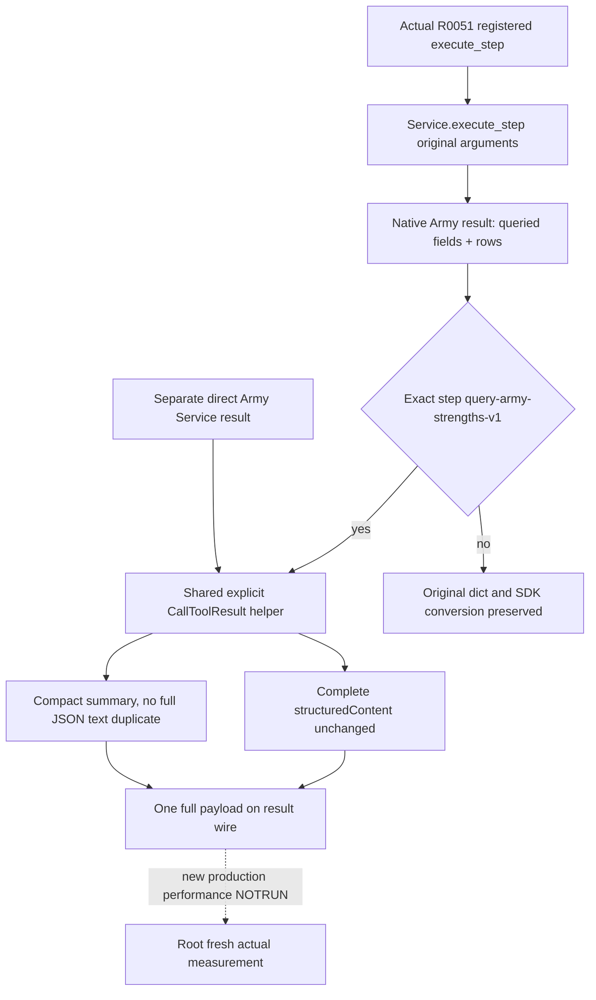

# Army-strength MCP result serialization performance

October7 / ISO2026-W41. This packet addresses a measured Army query transport cost. The initial read-only baseline was g105 `97a2a77da0359ceb1215e1ee8ce57831cda5f531`; the historical d8 candidate only wrapped the direct Army tool. This follow-on corrects that scope by covering the actual registered execute-step entry. Exact game identity remains CK3 1.20.0.3 Crozier / Steam25652598 / recorded EXE SHA `94B55397ABB687A3DCD436805A5D885E6BE90FA6C693FEB44A9E3BBEEADE02A6`. No game, gameplay SDK, requery, project import, test execution, build, giant wire read or hash occurred in this lane.

## Actual evidence and corrected entry

Root measured R0051 native Army007 at35,683,420 B and its registered SDK response at140,369,382 B, taking approximately49.83 seconds. The actual request was **registered `ck3_execute_step(step="query-army-strengths-v1")`**. These are Root-supplied actual measurements; this lane did not reopen either large wire.

The later [Army026 compact receipt](Z:/ck3_mod_rewrite_process_assets/g2-background-20261006/managed-runtime-next-g104-h9596/ROOT-ACTUAL-ARMY-AFTER-MOVE026-COMPACT.json) records a GREEN query after movement:135,422,159 B and198.265585 seconds, public revision4/native3, acceptedtrue/statusavailable. Root confirmed that this also used the registered execute-step entry. Its two requested armies retain distinct values: public218104048/native67109093 has39 regiments and1,833/2,367 soldiers; public134218098/native167772499 has8 regiments and348/536 soldiers. The receipt does not isolate elapsed time to serialization.

The original d8 source candidate wrapped `ck3_query_army_strengths`, the separate direct Army tool. That change did not cover Army007/026's actual entry. Its source/test packet remains historical evidence of the narrower direct-tool implementation; it does not establish a production improvement for these calls. The earlier attribution of direct Service projection expansion to their actual multiminute cost is withdrawn. No historical response, attempt or packet is overwritten.

## Actual production shape and SDK duplication

Registered `ck3_execute_step` forwards its original step, expected_revision and expected_h2743_frame to `GameplayBridgeService.execute_step`. For this Army step, Service returns the driver's native-query result. The source-confirmed top-level fields are step, accepted, status, query_sequence, army_strengths, backend_id, queried_snapshot_id, queried_revision and queried_native_revision. This shape does not require the direct tool's source, army_ids, scope_army_ids or Service projection lists.

Installed MCP2.0.0 `server/mcpserver/utilities/func_metadata.py:110` proves the transport duplication shared by both tool entries. Ordinary dict results go through `_convert_to_content`, which emits complete JSON with indent2 as TextContent, and then output validation emits complete structured_content. The outer result contains a full JSON text copy and the full structured object. JSON-encoding the outer response additionally escapes embedded quotes/newlines.

The same SDK's lines126–130 pass an explicit `CallToolResult` through while validating any existing generic output schema. The follow-on registered execute hook keeps the original decorator, parameter schema and dict output annotation. It invokes Service once, then wraps only exact step `query-army-strengths-v1` with `build_army_strengths_mcp_result(payload)`. Other steps still return their original dict and retain the SDK's original conversion. The direct Army wrapper remains in place.

The helper preserves the entire original payload as structured_content. Content is a compact scalar summary. For a direct source dict, summary revision/native_revision come from it. Otherwise they come from queried_revision/queried_native_revision. Explicit army_ids are preserved; when absent, summary IDs come from the ordered row army_id values. Those summary fields are not added to the structured payload. No native query, native serializer, Service calculation or observation is changed.



## One compound, now covering the actual entry

The existing owned file `tests/unit/test_army_strengths_mcp_result_serialization_performance.py` retains the same sole method: `ArmyStrengthsMcpResultSerializationPerformanceTests.test_first_registered_army_result_preserves_all_observations_without_duplicate_json`. It adds no second test case and imports no old current31 or2ea test.

Its explicitly synthetic result data contains two observation rows with4,096 source-ordered occurrences each, including repeated high IDs, zero, false, null and sentinel values. The direct result has its original source/request/projection fields. The execute Army result has exactly the actual nine-key shape, intentionally omitting source and army_ids. Both are supplied by patched Service methods; neither is a genuine native producer or production artifact.

The method uses actual `create_server`/registered SDK paths for execute Army and direct Army. Two temporary plain-dict tools on the same MCPServer provide the SDK's original conversion for each matching shape. It verifies complete structured equality, preserved input/output schemas and every original argument, one Service call per registered route, duplicate occurrence order and untouched missing execute keys. A non-Army execute-step call must retain full ordinary-dict TextContent and structured semantics.

Each large comparison serializes its old and new CallToolResult JSON once with identical alias/None settings. Old wire must exceed256 KiB; new wire must be at most60%of old, and summary text must remain below4096 B without the large occurrence/projection lists. One optional fresh case-output records both measured byte pairs, call counts and preservation facts once. This is a meaningful serialization regression, not a production latency forecast.

## Qualification and remaining work

The follow-on is research / implementation candidate. Its extended sole compound remains **NOTRUN** in this lane. Any prior d8 qualification belongs to its direct-only scope; it cannot grant this new execute-step coverage. Actual Army007/026 remain recorded production facts, with no claimed byte/time reduction from the follow-on.

Root owns the first extended compound and a separately authorized fresh actual query. A passing synthetic compound qualifies lossless envelope reduction for the adopted source. A fresh actual response is required to measure production bytes and latency. Native result size, driver parsing and other runtime work can still contribute cost. Capability, game-day and live readiness credit do not increase here.

The sole first command from the adopted source root is unchanged:

```text
Z:/ck3_mod_rewrite/tools/.venv/Scripts/python.exe -B -X utf8 ck3_autonomous_player/tests/unit/test_army_strengths_mcp_result_serialization_performance.py ArmyStrengthsMcpResultSerializationPerformanceTests.test_first_registered_army_result_preserves_all_observations_without_duplicate_json -v
```

Set `XAR_ARMY_RESULT_PERFORMANCE_CASE_OUTPUT` to a fresh external JSON path for both measured pairs. Follow-on plan, Oct7/W41 fields and delivery live under `Z:/ck3_mod_rewrite_process_assets/g2-parallel-20261007/army007-query-performance/FOLLOWON-EXECUTE-STEP/fixture-doc-lane/`. The initial packet remains archived. Parent owns actual hooks, commit and report integration.
