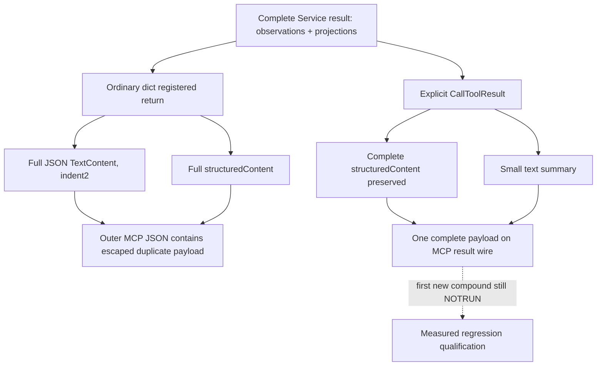

# Army-strength MCP result serialization performance

October7 / ISO2026-W41. This packet addresses a measured Army query transport cost. Source baseline is g105 `97a2a77da0359ceb1215e1ee8ce57831cda5f531`; exact game identity remains CK3 1.20.0.3 Crozier / Steam25652598 / recorded EXE SHA `94B55397ABB687A3DCD436805A5D885E6BE90FA6C693FEB44A9E3BBEEADE02A6`. This lane reads frozen source and small receipts only. It performs no game, gameplay SDK, query retry, old test, import of project code, build, EXE read or hash.

## Actual evidence

Root measured native Army007 at35,683,420 B and its registered SDK response at140,369,382 B, taking approximately49.83 seconds. These values are Root-supplied actual measurements; this lane did not reopen either large wire.

The later [Army026 compact receipt](Z:/ck3_mod_rewrite_process_assets/g2-background-20261006/managed-runtime-next-g104-h9596/ROOT-ACTUAL-ARMY-AFTER-MOVE026-COMPACT.json) records a GREEN query after movement:135,422,159 B and198.265585 seconds, public revision4/native3, acceptedtrue/statusavailable. Its two requested armies retain distinct values: public218104048/native67109093 has39 regiments and1,833/2,367 soldiers; public134218098/native167772499 has8 regiments and348/536 soldiers. Their power/supply/attrition fields remain observations. This evidence does not isolate all elapsed time to serialization.

No native producer data is dropped or reclassified to reduce transport size. The complete Service result includes raw observations and derived projections. Reducing repeated outer JSON copies leaves those fields available.

## Exact source path

The frozen g105 registered `ck3_query_army_strengths` at `bridge/mcp_server.py:2570` returns `GameplayBridgeService.query_army_strengths`'s plain dict. The Service result expands the accepted native result with the requested rows, provenance, scope and many projections. This lane does not change those calculations.

Installed MCP2.0.0 `server/mcpserver/utilities/func_metadata.py:110` gives the concrete transport cause. Ordinary dict returns first go through `_convert_to_content`, which JSON-encodes the complete return with indent2, and then pass output validation to generate complete structured_content. The result therefore carries the whole payload twice: once as a JSON text string and once as a structured object. When an outer response is JSON-encoded, the text's embedded quotes/newlines also require escaping.

At lines126–130 the same SDK passes an explicit `CallToolResult` through unchanged, preserving any declared output-schema validation. This is the precise available seam for the transport lane: keep the complete Service dict in structuredContent and supply a small text summary in content. The transport helper is `build_army_strengths_mcp_result(payload)` in `bridge/army_strengths_mcp_result.py`. Parent has connected the registered hook with `Annotated[CallToolResult, dict[str, object]]`, preserving the previous generic output schema. This lane owns the single regression and this topic.



## One meaningful first regression

The owned new file is `tests/unit/test_army_strengths_mcp_result_serialization_performance.py`. It contains one compound method, `ArmyStrengthsMcpResultSerializationPerformanceTests.test_first_registered_army_result_preserves_all_observations_without_duplicate_json`. The helper and summary fields were frozen before the test was authored.

The fixture is an explicitly synthetic complete Service result envelope with two rich observation rows and4,096 source-ordered occurrences per row, including repeated full IDs. It is a transport regression; it is not a genuine native producer wire and does not reuse old current31 or2ea tests. A patched Service method supplies this single synthetic result through the production registered tool. A second temporary plain-dict tool on the same actual MCPServer supplies the actual SDK's original conversion for comparison. No old giant response is loaded.

The oracle checks the full structured payload with deep equality, preserving all observed and projected fields, duplicate occurrence order, distinct requested/native IDs, zero, false, null and raw integer values. The new content must contain only the small transport summary, with no second complete payload. The benchmark uses each actual CallToolResult JSON serialization once, with identical alias/None settings, and compares UTF-8 byte counts. The planned threshold is new<=60%of old for a meaningful payload of at least256 KiB. A fresh optional case-output records bytes, ratio and invocation/serialization counts once; it does not add synthetic counters to game observations.

## Qualification and limits

Current status is research / source-backed implementation candidate. Transport helper, actual registered hook and sole regression source have been authored; the compound is not executed or qualified here. FIRST remains NOTRUN for Root. A passing synthetic first regression will qualify preservation and envelope reduction for that source; it will not prove a smaller native payload or lower production end-to-end latency.

Native normalization/projection work and remaining native-result size can still contribute substantial cost. Actual Army026 remains GREEN as recorded; it is not replayed as a performance test. A subsequent fresh actual query, owned solely by Root, is the evidence needed to attribute production byte/time changes. Existing current31 and other capability/live readiness remain unchanged.

The sole first command from the adopted source root is:

```text
Z:/ck3_mod_rewrite/tools/.venv/Scripts/python.exe -B -X utf8 ck3_autonomous_player/tests/unit/test_army_strengths_mcp_result_serialization_performance.py ArmyStrengthsMcpResultSerializationPerformanceTests.test_first_registered_army_result_preserves_all_observations_without_duplicate_json -v
```

Set optional `XAR_ARMY_RESULT_PERFORMANCE_CASE_OUTPUT` to a fresh external JSON path to preserve byte counts. FIRST remains0 in this lane.

The external fixture plan and Oct7/W41 fields are under `Z:/ck3_mod_rewrite_process_assets/g2-parallel-20261007/army007-query-performance/fixture-doc-lane/`. Parent owns shared hooks, one final diff/commit and report integration.
