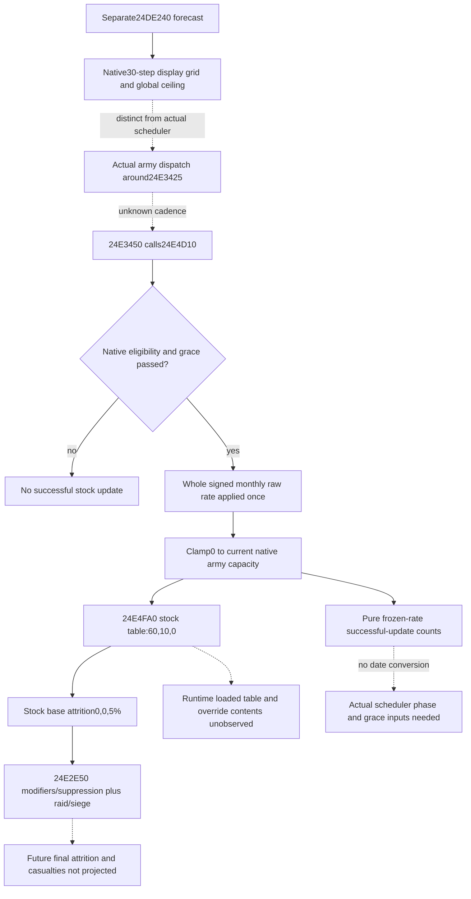

# Army supply depletion and stock-state diagnosis — 1.20.0.3

This offline tree precedes the pure diagnostic implementation. Frozen game: CK3 1.20.0.3 / Steam25652598, EXE SHA256 `94B55397ABB687A3DCD436805A5D885E6BE90FA6C693FEB44A9E3BBEEADE02A6`. Research reuses the archived native slices; it performs no game, pipe, SDK, window or new EXE scan. Existing observations are documented in [army-current-supply-capacity-attrition-12003.md](army-current-supply-capacity-attrition-12003.md).

`0x24E4D10` applies the whole signed Q100000 rate from `0x24E51A0` once on a successful update, then clamps stock to `[0, current capacity from 0x2C53C10]`. It does not divide that rate by30 or multiply by elapsed days. Before updating, its selected eligibility path requires `trunc0((date.low32 - Army+0x190)/24)` to exceed a loaded grace value at `0x5C69AA0`; rejected paths skip the update. The direct caller is `0x24E3450`. Its enclosing actual scheduler around `0x24E3425`, grace-anchor producer and loaded grace value remain specific research entries. Successful update counts therefore cannot be called elapsed days or calendar months.

The separate native display forecast `0x24DE240` computes an ordinal from `(date.low32 - 0x029C55C0)/24`, aligns it with the full CArmy ID modulo30, then steps its display counter by30. Its forecast clamps stock to a loaded **global ceiling** at `0x5C68C70`; the actual updater uses the army's **current capacity**. Neither the display grid nor its ceiling is substituted into this diagnostic's actual-capacity recurrence, and no future dates are emitted.

Installed stock defines contain `SUPPLY_STATE_LEVELS={60,10,0}` and `SUPPLY_STATE_ATTRITION={0,0,0.05}`. Exact `0x24E4FA0` truncates signed raw stock/100000 toward zero and selects the first descending level satisfied; when none matches it uses the last level. Thresholds are absolute supplies rather than a proportion of capacity. Runtime-loaded table contents and constructor/override wiring were not inspected in this offline package, so the pure model labels this mapping as the **stock-data scenario**.

| Nonnegative stock raw, scale100000 | Stock-defined state | Base attrition raw, scale100000 |
| --- | --- | --- |
| ≥6000000 | 0 | 0 |
| 1000000–5999999 | 1 | 0 |
| 0–999999 | 2 | 5000 |

Strictly below10 supplies enters the 5% **base** state. Exact10 remains zero-base; zero has no additional state beyond that same5% base. The final `0x24E2E50` getter is distinct: commander/context modifiers, fleet/grace and eligible-regiment suppression affect the supply component, while raid and active siege add their own stock-defined1% contributions. It does not expose a casualty count. The symbolic modifier receiver and complete fleet helper stay explicit research entries. The pure module retains the observed current attrition separately and never produces future final attrition or casualties.

Root's current supplied inputs are raw stocks9999850/cap10000000 and30000000/cap30000000, each signed rate−454545 and observed current attrition0. Existing P472 limit4025 versus combined6681 motivates this diagnosis; it does not itself establish a future rate or casualty outcome. Holding those rates, capacities and eligibility fixed gives:

| Starting supplies / capacity | Updates below60 | Updates strictly below10 | Updates to clamped0 |
| --- | --- | --- | --- |
| 99.9985 /100 | 9 | 20 | 22 |
| 300 /300 | 53 | 64 | 67 |

At update66, the second army retains raw30 (0.00030 supplies); update67 first clamps it to0. All counts refer to successful native supply-rate applications. Province/aggregate, capacity, commander, eligibility or rate changes alter the scenario. Current zero attrition is not a promise of future zero loss. This is an offline pure diagnostic, not a movement/split policy or an additional gate.

Source trees and archived hashes are sealed in `Z:/ck3_mod_rewrite_process_assets/g2-resume-20261003/army-supply-attrition/depletion-diagnostics-offline/{monthly-clock,attrition-state}/ROOT-DELIVERY.json`. Updater bytes SHA `a6214a58f3b8a1ff58fff6148ecf121688ccdaf1a5317f0865991a5367d183f4`; forecast bytes SHA `6208e1d758b3775c08105b224498c6d8bfb596b68a06995b63a1ba312419cb58`; attrition getter bytes SHA `76946ec914fbfda6b4007c0f3566e8223f0bd7a88cbe574e9b39a2745acf6233`. Compiled table slots: levels pointer/count `0x5456498/0x54564A4`; base-attrition pointer/count `0x5451308/0x5451314`. Future exact-date construction should close the actual scheduler/phase and current grace inputs; future live table qualification can read these already identified slots. Neither is claimed implemented here.
