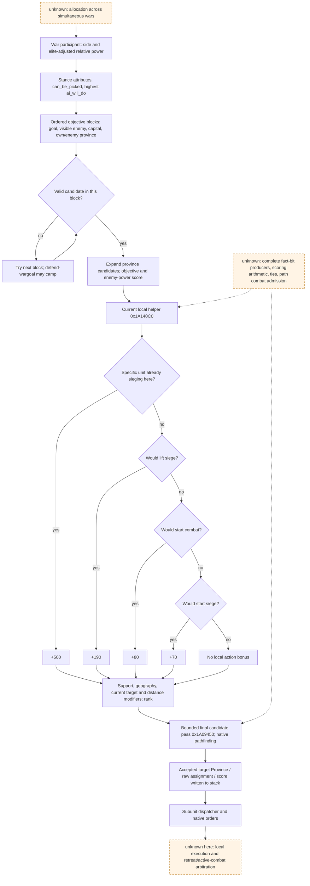

# CK3 1.20.0.3: native army target scoring for battle, relief and siege

2026-10-03, file-only research. Status: **research, with the listed current-build static branches closed**. This package did not connect to CK3, read its process, issue commands or advance time. It does not add a gameplay loop or live capability credit. The older [army controller](army-controller.md) remains a 1.19.0.6 historical source; its addresses and live rows are not current-build evidence.

The frozen installed build is **CK3 1.20.0.3 / Steam 25652598**, EXE SHA-256 `94b55397abb687a3dcd436805a5d885e6be90fa6c693feb44a9e3bbeeade02a6`. Current evidence was extracted from `Z:/SteamLibrary/steamapps/common/Crusader Kings III/`, rather than the repository's older game reference. The external research package is `Z:/ck3_mod_rewrite_process_assets/g2-resume-20261003/war-native-target-ai/`. `current-stock-manifest.json`, `strings-result.json`, the bounded `.asm.txt` files, and `native-evidence.json` preserve source identities, current registrations, instruction anchors and the reviewed boundaries.

## The native result relevant to this paused war

Native target selection builds **province candidates**, scores them, and then tests selected candidates with pathfinding. It does not assign an unconditional global order of battle, relief and siege. In the current local score helper the action bonus is an **ordered exclusive branch**: already sieging with this unit `+500`; otherwise lifting a siege `+190`; otherwise starting combat `+80`; otherwise starting a siege `+70`. A relief candidate does not receive all three of `190+80+70`. Separate objective priority, support, geography, target continuity, enemy power, route and other modifiers still affect selection.

Current stock defensive stances give the war-goal provinces priority `500`; visible enemy-unit provinces in the war-goal or primary-defender area `250`; other enemy-unit provinces `200` in the offensive and defensive defender stances. Defensive stance also gives `defend_wargoal_province=100`; the later fallback block uses `5`. Desperate defender has the focused `250` enemy-unit areas without the generic `200` block. These are native source priorities, not a finished utility score for Robert's two simultaneous wars.

## Current source contract

| Source / layer | Current identity | What it establishes |
|---|---|---|
| `game/common/ai_war_stances/_ai_war_stances.info` | SHA `0f01aaab6922fdca19b87a4421768f83b0c75534a128a73af8cecadd52f6205e` | side and relative elite-adjusted power select applicable stances; attribute filter precedes `can_be_picked`; highest `ai_will_do` stance; ordered objective blocks; visible enemy-unit provinces; defend-goal fallback may camp without starting a siege/combat |
| `game/common/ai_war_stances/00_ai_war_stances.txt` | SHA `4f5aa322c4d7272338f4c7b111b7462d4a1fec886e93e7178084d318ceb8e294` | current default objective priorities and area restrictions |
| `game/common/defines/ai/00_ai.txt` | SHA `3af5d4100789bad56570e05c5852f35783605813957de7a5129d23142a116120` | current scoring/period/path/prediction parameters and native developer descriptions |
| Current EXE registrations and consumers | pinned `.3` SHA above | exact current slots, consumers, branch ordering, candidate pass, assignment writes and countdown fields below |

The source describes relative power and native combat prediction; neither is a UI soldier ratio or a statistical battle win probability. The native `OurPower`/`EnemyPower` aggregation used in target scoring is still separate from the publicly observed sum of regiment base power.

## Current executable call and data chain

All addresses are RVAs relative to `ck3.exe`, **only for the pinned 1.20.0.3 EXE**. PE exception entries can split one logical function; these spans are reviewed instruction regions, not a claim that every unwind fragment is a complete function.

| Current chain | Reviewed current evidence |
|---|---|
| Coordinator constructor `0x19FC7B0` | writes coordinator magic `0x41495743` at `+0x14`, current vtable `0x45AB0B8`, initial normal combat threshold `+0x88`, zero countdowns `+0x94/+0x98/+0x9C` and lopsided byte `+0xA0` |
| Coordinator update fragment `0x19FF515..0x19FF740` | decrements stance `+0x94`, split/merge `+0x98`; target `+0x9C` decrement is skipped while `+0xB0>0` or `+0xC0>0`; expiry, bit 1 of `+0x68`, or stack-validity path can request a target refresh |
| Update continuation `0x19FF740..0x19FF9DC` | `0x19FF746 → 0x1A04930` stance update; `0x19FF764 → 0x1A028C0` split/merge; `0x19FF788 → 0x1A04F40` target refresh; resets countdowns from current registered slots |
| Stance update `0x1A04930` | normal/desperate threshold selected from slots `0x5C68650/0x5C686F0`, written to coordinator `+0x88`; stance pointer written to `+0x70`; smaller/larger cached power ratio compared at `0x1A04C88`, `setl` at `0x1A04C97`, then `+0xA0` |
| Target refresh `0x1A04F40` | `0x1A05000 → 0x1A05200`; later valid selected results write stack target Province pointer `+0x60`, raw assignment `+0x78`, score `+0x74` at `0x1A050F5..0x1A050FD` |
| Candidate orchestration `0x1A05200` | objective expansion `0x1A057DD → 0x1A06080`; local scores `0x1A0584E → 0x1A140C0`; per-candidate/per-stack score pass `0x1A05A62 → 0x1A070F0`; sorted candidate pass then `0x1A05B4A → 0x1A09450` |
| Local score `0x1A140C0` | support bonuses plus ordered local objective branch; registered values and matching `DEBUG_TOOLTIP_WAR_COORDINATOR_*` names both bind the interpretation |
| Candidate/stack score `0x1A070F0` | adds the registered current-target and farther-away values at `0x1A07F30` and `0x1A0805B`; latter follows a province-distance comparison at `0x1A0804D..0x1A08055` |
| Final candidate pass `0x1A09450` | quota comparison `0x1A095F2` against `MIN_GOALS_PER_STACK`; generation-valid first unit resolves current Province; non-current candidate enters native path request `0x1A09786 → 0x1AC8EE0`; marks accepted candidate / stack at `0x1A097ED..0x1A097F7` |
| Subunit dispatch `0x1A1CB00` | current coordinator invokes it at `0x19FF810`; it reads unit route/retreat and target/assignment state. Full local execution arbitration remains outside this package |

The parameter name `MIN_GOALS_PER_STACK=10` and its current source comment establish a bounded final-evaluation design. The current loop increments a per-stack counter, compares its previous value to the define and skips on `jg`; a value equal to the define is not rejected by that instruction alone. This package does **not** claim an independently proved exact total of ten path requests across all early exits and preselected goals. The functional input for our planner is to rank first and stop once one suitable exact route is found, rather than final-pathfinding every possible province.

## Registered current constants and exact local branch

| Parameter | Current value | Current global slot / relevant consumer |
|---|---:|---|
| `UPDATE_WAR_STANCE_TICK` | 30 | `0x5C68644`, reset `0x19FF74B` |
| `UPDATE_TARGETS_TICK` / `UPDATE_TARGETS_TICK_LOPSIDED` | 7 / 14 | `0x5C68640/0x5C68634`, target reset `0x19FF78D..0x19FF7A1` |
| `LOPSIDED_WAR_RATIO_THRESHOLD` | 0.33 | `0x5C686F8`, compare then strict signed `setl` at `0x1A04C88..0x1A04C97`; zero cached power takes true branch |
| `COMBAT_RATIO_THRESHOLD` / desperate | 0.5 / 0.4 | `0x5C68650/0x5C686F0`, cached selection `0x1A049C6..0x1A049DB`; full province-admission consumer not closed here |
| `MIN_GOALS_PER_STACK` | 10 | `0x5C68674`, final pass `0x1A095F2` |
| `IDEAL_ENEMY_POWER_TO_TARGET` | 0.5 | `0x5C686C0`, current fixed-point curve `0x1A0909E..0x1A0944F` |
| `TARGET_SCORE_IS_SIEGING` | 500 | `0x5C68734`, `0x1A14275` |
| `TARGET_SCORE_WOULD_LIFT_SIEGE` | 190 | `0x5C68728`, `0x1A14290` |
| `TARGET_SCORE_WOULD_START_COMBAT` | 80 | `0x5C6872C`, `0x1A142AA` |
| `TARGET_SCORE_WOULD_START_SIEGE` | 70 | `0x5C68720`, `0x1A142C6` |
| `TARGET_SCORE_CURRENT` / farther away | 100 / -100 | `0x5C686D8/0x5C686D0`, `0x1A07F30/0x1A0805B` |

In local helper `0x1A140C0`, the already-sieging condition combines candidate fact bit `0x10`, helper `0x1A15660(candidate+0x0B)`, the supplied specific subunit and its resolved Province equality. The lift-siege test uses the signed candidate fact byte at `+0x0C` (`0x80`). Starting combat uses the `0x20` fact after helper `0x19EF6B0` filters its cached condition. Starting siege uses `0x40`. The local consumer and debug names are closed; all producers of these fact bits and the complete meaning of other candidate flags remain unknown.

Enemy-unit scoring uses the native source curve: ideal enemy power is half our power; below ideal the multiplier rises from `0.5` to `1`; above ideal it falls toward zero, with clamp `[0,1]`. `HOSTILE_UNIT_PRIORITY_MULTIPLIER=0.5` is a separate current source input. This is a target score curve, not the combat admission threshold and not a battle simulation. Current source also has `CHASE_MIN_SIZE=500`, speed difference `0.2`, primary-enemy score floor `0.75`, primary-enemy attrition-size factor `2`, same-county `+150`, neighbour-county `+100`, and same-province `+25`; full current EXE ordering for these auxiliary inputs is not closed by this package.

## Native tree

The graph is generated from `army-target-triage-12003.plan.json` in the external package and published as `army-target-triage-12003.graph.md`; it distinguishes current static source / machine branches from unknown edges. Its reviewed native structure is:

## Robert's supplied paused frame: input ledger and next reads

The root supplied actor `29829`, raw date `53236608`, episode `native-29829-2bc2d599f7f9`: defensive War `16777231` vs `30097`, goal `2610`, player score `-39`; defensive War `129` vs `32750`, goal `2640`, score `0`; player Army `83886367@2614`; hostile `50331920/83886484` sieging `2640`, `67109295` moving `3078→2640`, and `16777683` gathering `4573`. These are task input, **not a new live artifact acquired by this researcher**. Their own bound snapshot / receipt must accompany an action.

| Needed decision input | Existing current query / next read | Use and current boundary |
|---|---|---|
| Full identity, paused army state, complete participants and routes | full `ck3_take_snapshot()` plus `ck3_get_war_state()` slice | establish current army, all enemy/ally membership, full routes, retreat/combat/movement state; do not apply target selection to an already active battle or route without observing that state |
| Player and hostile strength / current effective state | existing exact army-strength query for player `83886367` and all four hostile IDs, plus current supply query | operational screening and observation, including besiegers and incoming `67109295`; regiment base power does not replace native combat prediction or the target curve's unknown aggregation |
| Goal `2610` and attacked goal `2640` actual state | `active_wars[].objective_province_states[]` from a paused rich snapshot | occupation observable / side, active SiegeID, `besieging_army_id`, garrison, besieging strength, work/progress/days_left; absence of a row or `null` does not establish no siege |
| Exact travel and final entry | existing exact move preview for the selected candidate, first `2640` relief or `2610` recovery as warranted by the observed objective rows | ETA and actual route determine whether relief can arrive while the siege exists; then existing contact/prediction/simulation input for all armies that can be present at contact |
| Same-frame battle feasibility | current native encounter / simulation query with ordered participant IDs, target Province, actual final entry and reinforcement horizon | distinguish a relief move that starts battle from an unopposed recovery siege. No native score constant establishes that Robert can defeat the two besiegers plus moving reinforcements |
| War-score loss source | existing readonly war termination-options query for each war, using the same public revision | native occupation/battle/ticking/prisoner components determine whether `-39` actually represents recoverable occupied territory; total score alone does not identify a local battle or exact urgency |

No new provider is required by the known frame alone: both candidates are war-goal provinces, and the current source already projects rich siege/occupation state for objective provinces. First read these existing fields. A concrete missing current objective/siege row would justify a narrow readonly Province observation; its known construction entry is Province `+0x788 → full SiegeID → storage 0x5D1EC88`, existing current `ReadObjectiveProvince` and native siege getters in [episode03 progress](episode03-siege-progress-1.20.0.3.md). Ordinary siege daily speed is not required for this triage when native `days_left` is available. Do not build a new daily-speed or generic AI-coordinator query just to reproduce a score which the minimum playable policy does not need.

## Minimal counter-policy input after the native tree

This is a replaceable **own-policy proposal**, not native AI behaviour or an executed action. It ranks a small number of visible candidates, requests exact routes in that order, and stops at the first feasible candidate. Native target scoring supports treating relief and recovery as distinct province outcomes and screening enemy strength before final route work.

1. Observe whether the current player army is idle, moving, besieging, retreating or in combat; an active battle uses the existing battle controller. Preserve a valid ongoing own siege unless a specific observed relief opportunity warrants breaking it.
2. Read the two objective rows and current native war-score components. Treat `2640` as relief only while it has a hostile active siege on friendly land. Treat `2610` as recovery only if actual hostile occupation is observed. The score `-39` does not decide this classification.
3. For imminent loss of the attacked goal, evaluate the `2640` relief candidate with exact ETA, besiegers and the incoming `67109295` army. If timing and same-frame encounter assessment permit this visible relief, submit one move and use the existing movement/contact/battle postcondition loop. If it is infeasible, evaluate observed `2610` recovery or another already-observed safe goal, instead of repeatedly querying the same rejected relief.
4. Record the observed target arrival, local battle outcome or occupation change. An accepted move / ACK does not count as relief, siege victory or war victory.

Quality gap and replacement entry: this minimum does not reproduce native war-plan allocation, all geographical/support modifiers, native target fact cache, tie-breaks or target power aggregation. Its first production outcome should guide whether any of those missing inputs are needed. Root owns current gameplay, SDK/provider integration, progress-report merge, Git commit and push.

### v47 双向真实会合预览与主军返2618接续（0新日）

Root SDK83853已正常关闭、全部GREEN。Python g52/892378b5修正当前可控军队驻省的既有目标广告，native仍g51/1c67491f、PID32372/R24。只消费005/007两个已完成preview，cap003由war_goal owner消费。

同一暂停帧 raw53241096/native19/public2/generation9：主军83886367从8754到2618的真实route为`[2632,2617,2618]`；167772189从2618到8754反向route为`[2617,2632,8754]`。两个preview均accepted/available，均未发布ETA。三跳不能折算为三日，也不能沿用此前赴2640的ETA。

Root明确选择主军赴小军驻省2618会合，驻2618军队无需新移动。下一步仅一次主军move→独立实际route→正常SAVE，然后用外部counter helper最多10个显式单日循环。route endpoint为2618，独立occupation watch仍为首都2640；relief角色遇首次真实首都失陷保存交接，之后Root可依据原生counter树显式选择recapture，不需重新请求战争授权。任意当前己方CUnit实际接战交接真实subject到既有battle helper。

随后Root SDK45817已全部GREEN并正常关闭：004仅一次`move-army-83886367-to-2618`，005独立war ownroute，007正确完整6-hostile route-contact-horizon，008独立最终快照，009正常SAVE。最终同raw53241096/native22/public3：83886367仍在8754/moving7，target2618真实可见，complete_nonempty/sourcecount3且route`[2632,2617,2618]`；167772189在2618/regular1/空route，无combat/retreat。本次形成有限production-live loop，仅限选择既有原生真实候选→一次实际移动→独立准确目标/路线→正常保存；到达、会合、合并、解围和胜利尚无信用。

新正常pair：h5567/raw53241096/91826221B/SHA`3c7de8467e1d058893a3c5e8a7d4844b835182fdb4b95576c078e43f5ffe5d3a`。native仍g51/1c67491f，Python仅g52/892378b5，无新native重建。Root wrapper58000已开始最多10个显式24h观察循环，route endpoint2618、occupation watch2640、relief角色；此receipt未读运行中output，不能预记10天完成。当前日账仍4032/恢复879/Oct3冻结777/Oct4实际7。
