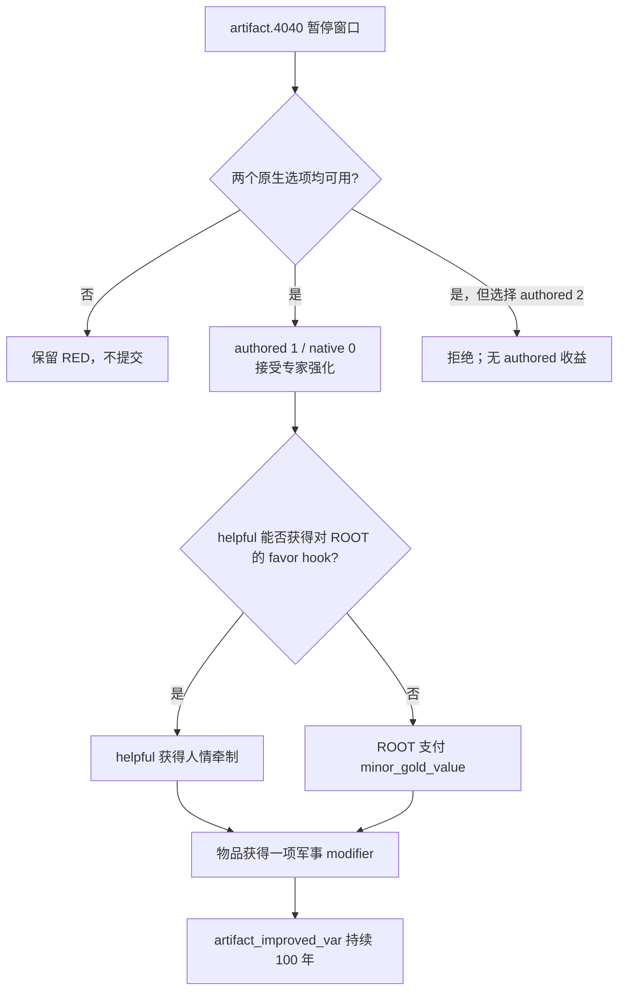

# CK3 1.19.0.6 `artifact.4040` 专家强化宝物决策树

## 状态与证据边界

- [static-confirmed] 本专题绑定 CK3 `1.19.0.6`、Steam build `23530548` 与 `ck3.exe` SHA-256
  `2D00FF3101EF70B566F2FCBAE292F09263199C80E9DC8F139B82D7D96F83DB86`。
- [paused live RED] R416 attempt 04 在 PID `174656` / generation `1` 的真实暂停帧命中 instance `1081`：
  `date_raw=53832072`、root/player `32904`、`this_artifact:artifact` raw `31`、`helpful:character`
  raw `4` / ID `79104`；native `0/1` 均 shown/enabled，尚未提交选择。
- [production-live primitive] 可移植合同选择 authored `1` / native `0`。R416 retry 05 已在相同 PID / generation
  提交该选项，instance `1081 -> null`、snapshot `native:626 -> native:627`、revision `627 -> 628`，
  `postcondition_verified=true`。选择前 RED 继续保留。

## 原版入口与约束

`artifact.4040` 是通用 `on_yearly_events` 的 weight `80` 候选。该年度组自身有 `25%` 事件机会，且仍与当时
所有其它合法候选竞争，不能把 `80` 当成固定年概率。事件声明 30 年 cooldown，不是 daily poll。

触发时，ROOT 必须拥有一件 armor 或 primary armament；该物品既不能有 `cursed_artifact_var`，也不能有
`artifact_improved_var`。宫廷、宾客或骑士中还必须有至少一名战场专家：勇武达到 20，或具有原版列出的高阶
军事教育、剑圣、狂战士、瓦兰吉、地形专家、劫掠者等特质。`immediate` 随机保存一件合法物品为
`this_artifact`，再优先从廷臣/宾客、否则从骑士中保存一名合法非玩家角色为 `helpful`。

## 决策树

接受路线总会从下列原版优先链增加一项词条：劫掠速度、重骑兵坚韧、重步兵坚韧、骑士战斗力或勇武。
如果前面的专长条件不成立或相应低阶词条已经存在，逻辑继续落入后面的 prowess/重步兵分支，因此不会出现
“支付代价但不强化”的空路径。100 年变量防止同一物品被近期重复强化。

## 我方最小策略

选择 authored `1` / native `0`。它是唯一有正收益的终止路线，且代价明确封顶为 `helpful` 持有的一枚 favor
hook 或一笔 `minor_gold_value`；authored `2` 没有补偿。此选择不需要读取 faith、doctrine 或其它已暂缓宗教域。

提交前仍须重新查询并绑定同一 event instance、revision、root、两个 saved scope、native index 与 enabled 状态；
任何漂移都继续保留 RED。动作 ACK 本身不能替代旧 instance 消失或前进的后置条件。

## exact-build 来源

- `events/artifacts/artifact_events.txt:3046-3292`，SHA-256
  `32D30D9E2BCCB953B8760A5129754155BDBEC829D696BCB5ADDA43393B8B82A7`。
- `common/on_action/yearly_on_actions.txt:3275`，SHA-256
  `0FC85A284224A68D1CA0A4EF071D4F4A4F49896753AEC463975A12EE4E1116FA`。
- 英文 localization SHA-256
  `49D9F28ECE0AFF971474A47CE6D71B65E1575FBD23F1D4D22C3B512651D9D10B`；简中 localization SHA-256
  `479FF00978C954D2B0CDC8D33776B49007FAB8EA46C613C51024D4B47B0BF9CC`。
- R416 attempt 04 RED：
  `_runtime/p1-terminal-resume-r416-20260911/live-artifacts/terminal-stages-red-attempt-04.json`，SHA-256
  `CFD57E5C381D35EE6E1DE166D9FF656A1E6D6F4FC7D3194BCC74393EB3B4EE6A`。
- R416 retry 05 动作与 advance 证据位于随后保留的 RED：
  `_runtime/p1-terminal-resume-r416-20260911/live-artifacts/terminal-stages-red-attempt-05.json`，SHA-256
  `0BFAB9EF8D38AE9C74F783FE3E4B3672222E5289F760D21074BD04D5683692AA`。
