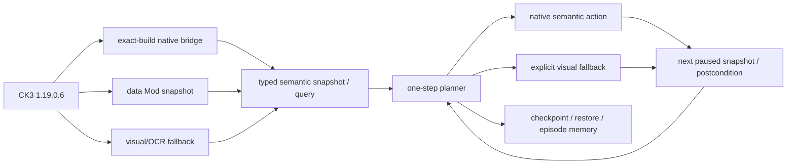

# CK3 全游戏自治能力路线图

## 目标、边界与当前结论

本路线图服务于一个单一目标：在 CK3 `1.19.0.6` exact build 上构建能够长期、聪明且无需人工接管地完成
“观察 → 决策 → 操作 → 验证”循环的玩家智能体。最终能力面必须覆盖当前 playset 中全部策略性玩法与玩家可执行的
gameplay 能力，
不能把“会跑一个罗贝尔开局脚本”“能提交若干命令”或“单元测试覆盖很多”写成全游戏自治。

本页绑定：

- CK3 版本：`1.19.0.6`；
- `Crusader Kings III/binaries/ck3.exe` SHA-256：
  `2D00FF3101EF70B566F2FCBAE292F09263199C80E9DC8F139B82D7D96F83DB86`；
- 盘点日期：2026-08-28；
- 本轮 P1 施工起始代码基线：`2d93a54`；
- 当前持续实机 checkpoint：日期 `53213688`，SHA-256
  `B60348DA223585995B5E1CF1A022180D0F3D89CAD6E4094F66DA107C608324F1`。

现状可以概括为：

1. exact-build native bridge 已经具备可靠的时间、事件编号、玩家身份、婚姻关系、战争、军队、路线、围城、
   存档与一代结算等窄状态面，也有一组对应命令；
2. planner 已经能在一个既有战争 checkpoint 中持续做路线预览、敌军路线审计、一日接触窗口、行军、围城观察、
   定期存档与冷恢复；
3. 2026-08-26 累计 `210/210` 回合成功、78 个可见 gameplay 回合、推进 75 游戏日且每轮清理成立；
4. 2026-08-26 已完成 actual-contact prediction → CombatID/真实双方顺序 → actual-side combat-v3 → 战中存档/冷恢复，
   并从 checkpoint `9104CCB8...CC63` 完成 ongoing battle-control 的 maneuver 1 → main 0/1/2 与真实
   current/soft/hard ledger delta；主动撤退只读投影又从 elapsed day 0/14 的 `too_early` 推进到 day 15/16 的
   native/legal true；`battle_identity_live_ready=true`、`battle_hold_ready=true`、
   `planner_battle_hold_live_ready=true`、`retreat_legality_scope_live_ready=true`、`battle_retreat_ready=true`；full-side
   与 owner-subset retreat 均已实见真实后置状态，paused reinforcement assignment query 也已 production-live；passive terminal/warscore
   journals 与 paused successor query 又在第 33 日真实 normal terminal 中闭合旧 CombatID/Province removal、单场战分与玩家 retreat，
   `battle_normal_terminal_query_ready=true`，artifact SHA `61D0D912...56FDB1`；
5. P1 整体仍在进行中：`join_existing`/multiple-compatible、assigned reinforcement timeline/join、
   Monte Carlo、no-normal/residual/assignment-reopened terminal fixtures 与主动接战策略仍不可用；terminal normal live 已完成，
   normal/no-normal、cleanup、rescan 和 AI re-entry exact-build 静态树已闭合，不能再用 ResultID 缺失猜 terminal kind；
6. 最新正式一代 run 又推进 38 日后暴露 CFleet carrier 被误投影为独立 ArmySnapshot：该 row 与 embarked 主体连续
   59 日逐省同步，却触发 186 次失败 preview。CUnit raw kind、CFleet→CArmy→canonical CUnit 与原生 move/contact gate
   已 static-confirmed；canonical tactical reader 过滤和首次拒绝即停止扫描已 static-ready，cold replay pending；
7. 战争以外的大部分 CK3 决策域尚无原生 AI 树、原生观测或通用动作，视觉实现也主要是固定 1066 罗贝尔路线。

安全工作不单列为路线图。只有已经在生产路径产生可复现玩法故障的问题才进入相应能力包，并只修到恢复实际使用；
理论安全、取证扩张和与玩法无关的协议加固不得挤占下列功能施工。

宗教/信仰域自 2026-08-26 起由项目所有者明确暂缓，原因是 CK3 近期版本将对该系统做大规模重构。项目所有者随后给出两项
窄例外：**战争场景允许圣战，婚姻场景允许不得不考虑信仰时做最小调用**。因此 war OODA 可以研究和实现圣战/大圣战所必需
的最小观测、原生合法性、目标、费用、参战、军队行动和结束语义；marriage OODA 可以调用候选筛选、合法性、接受度、费用和
结果所必需的最小原生信仰判定。两者均优先复用原生最终结果/原因，faith/religion 只作为 opaque identity 或直接影响当前圣战/
婚姻的最小输入。除这两项窄例外外，在项目所有者明确通知“可以开始宗教相关内容”以前，不得深入逆向 faith/doctrine/tenet/
fervor、宗教改革、改宗或通用宗教 AI，不得新增相应 bridge、策略或实机矩阵；holy order 也继续暂缓。文化、创新、法律、政府
和非宗教决议仍按原路线施工；暂缓不是将宗教域冒充完成，最终总验收仍须在解除暂缓后补齐。

本次盘点以这些实现入口为准，后续 capability 变化必须同步更新本页：

- exact adapter capability descriptor：
  [`ck3_11906_adapter.cpp`](../../ck3_autonomous_player/native_bridge/src/ck3_11906_adapter.cpp)；
- native snapshot/query/action contract：
  [`game_contract.hpp`](../../ck3_autonomous_player/native_bridge/include/xar_bridge/game_contract.hpp)；
- Python generation-bound action 展开与 checkpoint/session：
  [`native_driver.py`](../../ck3_autonomous_player/src/xar_autoplayer/bridge/native_driver.py)；
- public MCP tools：
  [`mcp_server.py`](../../ck3_autonomous_player/src/xar_autoplayer/bridge/mcp_server.py)；
- one-step planner：
  [`strategy.py`](../../ck3_autonomous_player/src/xar_autoplayer/strategy.py)；
- managed production long run：
  [`native_auto_run.py`](../../ck3_autonomous_player/src/xar_autoplayer/native_auto_run.py)；
- native evidence matrix 与实机记录：
  [`native_bridge/research/README.md`](../../ck3_autonomous_player/native_bridge/research/README.md) 和
  [`testing-workflow.md`](../testing-workflow.md)。

## “完成一个能力域”的统一定义

每个玩法域只有同时通过以下五道门，才可标为完成。任一层缺失都必须保留为 partial 或 unavailable。

| 层 | 完成条件 |
|---|---|
| 原生 AI 树 | 先冻结 exact build，读取原版数据和 EXE 调用链；专题文档同时有证据正文与 Mermaid 决策图；每条边标记 `static-confirmed`、`live-confirmed`、`inference` 或虚线 `unknown`。 |
| 观测 | 决策所需输入由 typed native query/state 返回，并在 paused live snapshot 中验证对象 identity、generation 与真实值；长期为 `null`、OCR 猜值、命令 ACK 或 schema 字段名都不算完成。 |
| 动作 | 玩家可执行的对应操作拥有 generation-bound/native semantic command、前置验证与下一帧后置条件；只有确无稳定 native 入口时才保留明确的视觉 fallback。 |
| 策略 | planner 会比较多个合法候选，消费原生 AI 树揭示的输入，并结合我方长期目标、机会成本和不确定性作选择；固定第一项、固定坐标或单一剧本序列不算智能策略。 |
| 验证 | production、非 debug 实机完成至少一次该域的完整“观察 → 决策 → 操作 → 后置状态”闭环；高风险或持续性域还须跨 checkpoint 冷恢复并在长跑中复现。 |

跨域的最终验收还要求：

- 中断优先级正确：事件、外交请求、死亡、战争与时间推进不会互相漏掉；
- 决策有持久目标与预算，经济、军事、继承、关系和风险不会各自局部最优却全局失败；
- 一个自然产生的完整统治者生命周期可无人工输入结束并结算；
- 另有普通 CK3 campaign policy 能跨继承继续，而不是永久硬编码
  `continue_as_heir_after_death=false`；一代制只是本 mod 的一种策略模式；
- 每个启用 DLC/政府形态的支持状态都由 feature manifest 明列，未安装或未逆向的系统不得被“base game 已覆盖”吞掉。
- campaign setup 也是能力：bookmark/ruler/game rules/难度与长期 policy 必须可枚举、选择并在进入地图后验证，
  不能永远把固定罗贝尔 seed 当作通用开局。

## 当前架构与真实能力面

### Native snapshot 与只读查询

下表只描述当前 production surface，不把未实机的实现写成 live 能力。

| 状态域 | 当前可读内容 | 当前证据与缺口 |
|---|---|---|
| 会话与时间 | `date_raw`、速度、暂停、local player、`map_ready` | exact-build live-confirmed；可在最小化窗口推进和重新暂停。 |
| 玩家角色 | CharacterID、存活、配偶/婚约 CharacterID 列表 | native 实现；只覆盖身份与关系结果，不含属性、资源、头衔、继承、健康、压力、教育、生活方式或意见。 |
| 事件 | 当前 instance/ authored 数量；exact current-window query 发布 materialized shown/enabled、rendered/native index、name/reason、fallback/cancel 与有损 typed indicators | instance/数量/提交已有 live；Attempt4 又以 generic 非宗教 fixture 闭合 seed/checkpoint/fresh-cold current-window query、canonical key、presentation/cancel 与 empty-indicator surface；后继 fixture 实读 `trait/add brave`、`stress/increase` 与 `death/played_character` backing rows。`ActiveEvent+0x00` root token、`+0x18/+0x24` named vector 与 type `4` CharacterID payload identity 已 static-ready，但尚未接 wire/live，所有非 Character payload 继续 unavailable。planner 有 query 时不再由 authored 数量合成 enabled 选项；stock、其余 indicator 分支/视觉图标、selection lifecycle、full effect/scopes 未闭合，`semantic_decision_ready=false`，多个合法选项时明确停住而非默认第一项。 |
| 角色互动 | instance、stable key/hash、五 roles、generic target type key、send options、routing、deadline、auto-accept 与四路 legality | 普通 white-peace recipient pending 已跨 checkpoint production live 双查询；同 revision 的 subtype + WarID + primary-side 绑定也已 production-live。exact `pay_ransom_interaction` 又完成 cold restore→typed query→native reject→旧 full ID 消失→时间推进/checkpoint 的 production-live loop；它仍是 non-optimal reject-first，不是赎金语义完成。generic recipient notification 的固定 ACK 仅为非宗教 fixture-live。victory/defeat、special outcome terms、structured terms/effect、typed target payload、`spar`/unique-accept、自然 stock notification 与 intermediary live 仍缺，故 semantic decision 仍为 false。 |
| 婚姻 | 当前配偶/婚约；合法 arrange-marriage CharacterID 候选 | 只知道“可提交”，不知道年龄、属性、继承、联盟、声望、遗传、接受度或近亲风险；策略选择最小/首个候选。 |
| 宣战候选 | target、CB key/index、configuration、claimant、target titles | C++ core 与 typed contract 已有；完整 bridge/live 宣战闭环仍未收口。 |
| 战争入口评估 | actor/target 原生 strategic power、network contribution、ratio、distance | application-main typed result 已在当前合法 `claim_cb` target production-live；它不是战斗胜率或战争效用。完整 forecast/cost/exit 缺失时 planner 以 `NO_DECLARE` 继续时间而不宣战。 |
| 战争总览 | WarID、攻守、主对手、leader、目标 titles/provinces、相对战分、敌我/盟军 | 多项 live-confirmed；没有完整参战承诺、补给、财政、全部 score 成因与战争全局机会成本。 |
| 目标与围城 | 占领、fort、garrison、besieger、进度、days left、breach、assault 状态/日进度/伤亡 | 基础围城 live-confirmed；assault 动作与完整 outcome 仍需实机矩阵。 |
| 军队与路线 | canonical tactical ArmyID、owner、province、route、move target、state、combat/retreat、controllable | 大部分 live-confirmed。raw-kind `0` direct-CArmy-linked 与 raw-kind `1` CFleet carrier 的 exact gate 已 static-confirmed，reader 过滤 static-ready/live replay pending。没有补给/损耗、兵种组成常驻快照、军队 commander policy、通用 embark/raid、站位或多 war assignment。 |
| 路线接触 | subject/全部 active-war hostile 的 exact arrival timeline；下一日 vertex/opposing-edge 冲突 | production live accepted；当前 fixture 的 ETA `53178264` 与首个真实 contact 帧相等。 |
| 军力 | current/max soldiers、原生 AI base power 聚合 | 三个 ArmyID paused live accepted；明确不是胜率。 |
| 假设接战 v2 | regiment effective stats/counter、knights、commander、terrain、crossing、holding、width | native query 已实现，paused live acceptance pending。 |
| 实际接触 | current/ongoing CombatID、actual Province、两侧原生 stored-order ArmyIDs | create-new contact 与战中 cold restore production live accepted；join-existing/multiple-compatible 分支矩阵仍待实机。 |
| 战斗 v3 | v2 base + 132/132 phase input refs/derivations | combined-defensive production paused live accepted，actual sides 与 cold restore 后均可复查；phase transition/original trace 未闭合，`monte_carlo_ready=false`。 |
| 战中控制 v1 | ongoing CombatID/Province/phase/day/winner/finalized、ordered sides/armies、retained levy/MAA entries、current/soft/hard 与 owner hard ledger、commander/roll/width/advantage/strength | [live-confirmed] checkpoint `9104CCB8...CC63` 冷恢复后从 maneuver 1 推到 main 2；稳定 double query，main 1/2 有真实 ledger delta，artifact SHA `A0FC6BB7268E38026CC8EED6D6388BFD675AD5DCFB60A1A65FE1C1B64E816AC6`。side tick-start cache 合法 stale，由 match booleans 区分，不再导致 unavailable。动态 join/leave 与增援同日顺序仍缺；normal terminal 另由 dedicated query 闭合。 |
| 主动撤退控制 | selected identity、CombatID/Province/side、full-side/owner-subset affected order、三项 flag、native legality/四类 reason；planner-selected target 的 exact route preview、一次性 battle-bound token、player move command 与按完整旧 CombatID 的 lifecycle query | legality progression [live-confirmed] day 0/14 false→day 15/16 true，SHA `FB521B39...BCF40`；full-side route/state 与 `main/12 → pursuit/0` 已 live，SHA `21D58737...784FA`；owner-subset 又只移除 CUnit `357`、保留 `33554657` 与原 CombatID，SHA `7780B619...01F9`。`battle_retreat_ready=true`；generic war AI policy/cadence/destination score 保持 `unknown`。 |
| 增援分配 v1 | AI CUnit→coordinator→subunit→parent identity、asking/assigned、request power、assignment Province、native stored order、route/ETA 与 present-time CombatID projection | [live-confirmed partial] CUnit `357` 的 paused stable query 已 live；owner-subset retreat 后又实见 mismatch→独立 CArmy/stack membership reopen（SHA `4AFE99B8...EE248`）。当前两军夹具令留战 parent 退化为 singleton，原生连续 30 日清 asking，故 assigned+aligned ETA/rejoin 需三同侧 CUnit 夹具，`battle_reinforcement_ready=false`。 |
| 战斗终局 v1 | passive terminal/warscore journals；prior CombatID、old Province/result removal、typed current subject 与 residual/retreat/assignment successor | [live-confirmed normal] `CombatID=335544325` 第 33 日 `normal_result`，old ID 全局/Province 双删除、battle row `2135850` Q100000、玩家 `subject_retreating`；artifact SHA `61D0D912...56FDB1`。query/service/MCP production-live；no-normal/residual/assignment-reopened 尚缺，故 aggregate `battle_terminal_ready=false`。 |
| 战争终止 | 三种 outcome 的 legality/AI acceptance/final response、score/duration/CB；claim-CB disposition | 当前 primary-attacker `claim_cb` 已完成 options→v1 claim terms→white-peace submit→AI 异步应用→WarID 消失→解散→保存/冷恢复的 production-live loop。其它 CB/角色、surrender、完整 exit terms v2 与实际 delta 仍未闭合。 |
| 一代结算 | final score、record、blessing/refusal、contract progress、commit serial | 最小化窗口死亡 snapshot 已 live-confirmed；自然死亡完整 episode 终验仍待完成。 |

### Native 动作与 MCP surface

exact adapter 当前声明 56 个状态/命令 capability。Python 层会按当前 snapshot 展开 generation-bound literal，不能把
DLL template 本身当成随时可执行动作。

已存在的动作族：

- 暂停、恢复、速度 1–5、有限时间 `life-advance`；
- 选择事件选项、接受/拒绝当前角色互动；对 `auto_accept_notification` 仅允许 generation-bound fixed ACK；
- 保存 checkpoint、冷恢复 checkpoint、结束一代、从 immutable seed 开下一代 episode；
- 查询/提交婚姻；
- 查询宣战候选与战力，提交宣战；
- 默认集结、路线 preview、移动、半分军、合并、解散；
- Start/Stop Assault、enforce demands；
- 查询 route contact、army strength、combat v2/v3、ongoing battle-control snapshot、termination options/claim terms。

重要限制：

- `offer-white-peace-N` 只对当前 GEN-004 primary-attacker `claim_cb` 最窄 counter-policy 解冻并 production-live；
  `surrender-war-N`、其它 CB/角色、人质组合与通用 structured exit/campaign policy 仍冻结；
- combat v2/v3 可返回输入，不等于已有胜率，也没有授权主动接战；
- MCP 提供 typed snapshot、planner、auto-turn、save/restore、event、marriage、declaration、army move、assault、
  disband、enforce、combat query 与 termination query；split/merge、route preview/contact 等仍主要经
  `ck3_execute_step` + capability literal 使用，后续应补成 first-class typed tools；
- 纯 native 模式没有事件文本，视觉 fallback 也不能在窗口最小化时偷偷参与。

### 当前 planner 覆盖

当前 `one-life-turn-v1` 的真实策略能力是：

- 先建立 checkpoint；死亡时结算并写少量跨局 achievement memory；
- 活跃事件优先处理；支持 current-window query 的 backend 先恢复严格同帧 materialized options，仅在恰好一个 shown+enabled row 时按 authored native index 做 forced presentation choice。零个或多个候选因 effect preview/semantic policy 未就绪而停住，不再默认第一项；不支持新 query 的旧 backend 保留兼容路径；
- 当前角色无配偶时查询婚姻并提交第一个合法候选，等待 spouse/betrothed 后置关系；
- 宣战前会读取原生 strategic power 并比较目标；participant ETA、combat forecast、campaign cost、exit outcome 与校准效用缺失时
  选择可审计的 `NO_DECLARE → life-advance`，绝不调用可见的 declare literal，也不再因此停住整代；
- 对已经存在的战争可集结、比较 objectives/enemy endpoints、preview 路线、审计所有军队 route、执行 route-contact
  horizon、移动、追击、围城、按一日预算 Start/Stop Assault，并处理 split/merge 恢复；
- 当前 planner 的 in-combat continuing branch 已实现并由单元测试证明 query battle-control→bounded one-day advance→同一
  CombatID/revision-aware requery；它会拒绝只靠 ACK/日期推进冒充战斗变化，也能区分离场、CombatID 替换和 pursuit 后 join 重开。
  ongoing ledger 的生产查询与这条 planner-integrated 状态机都已 live：两轮日期 `53178264→53178288→53178312`、
  maneuver day `1→2→3`，transition 均为 `same_combat_advanced`，`planner_battle_hold_live_ready=true`。
  planner 尚未能比较真实 battle forecast、reinforcement
  assignment、主动撤退目的地/命令或 terminal transition；
- 防御战会查询 termination evidence，但 surrender/white peace 尚不进入生产 planner；
- 视觉 fallback 的经济、内阁、婚姻、继承和巴勒莫战争是 1066 罗贝尔固定场景，不是通用 CK3 policy；
- 跨局记忆目前只有巴勒莫胜利、军队解散、丹麦婚约、partition risk 等少量布尔结果，尚无可学习的世界模型或策略校准。

### 实机验收边界

已闭合的关键实机能力：

- production/non-debug/single-mod 的启动、最小化 native 会话、暂停/时间推进、numeric event、选项提交、存档物化；
- checkpoint 冷恢复的日期、角色与 history anchor；
- [fixture-scoped] 非宗教 notification ACK：seed/cold PID `85336/30592`，full ID `738197506`（slot `2`、generation
  `44`）在 date `53175816` 跨 checkpoint；cold public/native revision `4/3` 的 query sequence `1/2` 共享 context
  SHA `951C01496BF832CFDDC620A44AC7BCB81C550FFD7E3352DDD77292D9C1154175`，严格
  query/query/ack 后 revision `5`/native `4` 的 pending 为 null。source unchanged、managed/nonce cleanup 全绿；artifact
  SHA `E696C54F4A761C5BE29D00E7AA62C5529185F7D35F8F2D790BB2830CDBCB1308`。这是 fixture-definition playset +
  production native bridge，不是 stock/production-only；consumer/DLL 冻结在 `70bf8e6`，不证明 current HEAD 的
  structured costs 或 special-war query 已 live。
- 已有战争中的军队位置/路线、route preview、move、split/merge、围城进度与部分 termination query；
- route-contact 修复后累计 `210/210` 成功回合、75 游戏日、无 recovery，定期与最终 checkpoint 均物化且每轮 cleanup proven。
- ongoing battle-control 从 cold checkpoint `9104CCB8...CC63` 复现初始 maneuver 1，并经 bounded advance 观测
  main 0/1/2；main 1/2 的 current/soft/hard ledger 实际变化、每帧 stable double query 与 managed cleanup 均成立，
  artifact SHA `A0FC6BB7268E38026CC8EED6D6388BFD675AD5DCFB60A1A65FE1C1B64E816AC6`。
- 同一 checkpoint 的 active-retreat 只读投影经 16 次 bounded advance 复现 elapsed day 0–14 `too_early`、day 15/16
  native/legal true；full-side scope、flags、identity、每帧 double query 与 managed cleanup 均成立，progression artifact SHA
  `FB521B39AD5529434596212DB9ADC1EA27D4C270D28D13575B9A2D80913BCF40`。这不是撤退动作证据。
- production planner 在隔离 clone 中连续两轮执行 battle query→one-day advance→same-CombatID requery，日期和 maneuver day
  各严格增加一日；source save 前后 SHA 不变、cleanup/clone removal 成立，artifact SHA
  `96CE25384517F0060A58623958DE071F43C3C2F7B68AEB6E668473E986C1DD57`。
- full-side retreat 在 day15 对 target `2579` 完成 exact preview/token/order；更新 paused snapshot 中 CUnit `83886341`
  为 `retreating=true` 且 target/route=`2579`，artifact SHA
  `A57FF20DCAD39DF79DAB6A9418054C36B0F5489C5D8B5E9E880CE899AE89DF9C`。新增 full-CombatID query 的完整动作重跑又读到
  `CombatID=335544325` 从 main/12 进入 pursuit/0、winner=defender，双方 stored-order IDs 不变；artifact SHA
  `21D58737126CA4ED8B0B49DB7749EA4701F3BA6F94A8B8493698F8737E5784FA`，source save SHA 不变且 cleanup proven。
- 一代正式 run `20260827T201247Z-one-generation-c1cdfbc7` 从共享 hostile timeline 修复后又推进 38 日；其
  report/first-blocker SHA 为 `C011A2B...226 / 1BF4F666...A87`。CUnit `150995278` 与 embarked `33554818`
  在 59 日内逐省同步、随后前者触发 186 次失败 preview；这项真实 B1 已把 tactical identity 施工收窄到 raw-kind/CFleet
  过滤，尚待从最新 checkpoint cold replay 升级为 production-live。

尚未闭合：

- 从和平状态由 planner 自主选择并宣告一场有效用依据的战争，再一直打到胜/和/降并处理战后；
- 一次不可避免接敌的“预测 → 接战/绕行/增援/撤退 → 实际战斗结果”闭环；
- 盟友召集/加入、多个战争、补给/损耗、海运、佣兵、raid 与圣战/大圣战完整战争 OODA；骑士团仍按宗教 owner-deferred 边界暂缓；
- 通用事件、经济、内阁、生活方式、继承、婚姻、外交、封臣、派系、谋略、文化、活动/旅行等长期自治；婚姻只调用必要的最小信仰判定，除圣战/婚姻两项例外外宗教域暂缓；
- 自然死亡完整终验，以及普通 campaign 跨继承继续。

## 原生 AI 文档覆盖账本

已有较深入的 native tree/evidence：

- [war-declaration.md](war-declaration.md)：宣战候选与原生评分树；
- [army-controller.md](army-controller.md)：stance、目标评分、分派与追击/围城/撤退边界；
- [combat-prediction.md](combat-prediction.md)：原生确定性战力预测与阈值；
- [battle-simulation.md](battle-simulation.md)：真实 battle tick、damage/casualty/pursuit/PRNG；
- [combat-phase-events.md](combat-phase-events.md) 与
  [combat-phase-event-trace.md](combat-phase-event-trace.md)：phase event 与 trace；
- [war-termination.md](war-termination.md)：胜利、白和、投降提出/接受树；
- [events-and-interactions.md](events-and-interactions.md)、[event-window-context.md](event-window-context.md)、
  [interaction-notification-ack.md](interaction-notification-ack.md) 与
  [interaction-structured-terms.md](interaction-structured-terms.md)：通用事件 selector、窗口 option 物化、人物互动
  candidate/acceptance、notification ACK 与 structured-terms exact seam；
  [pending-interaction-special-war-binding.md](pending-interaction-special-war-binding.md) 另行闭合三种普通 war-exit
  subtype 到 active WarID 的静态绑定；ordinary white-peace 的 production reader/live fixture 已闭合，victory/defeat
  与完整 preview/terms 仍待闭合；
- [prewar-encounter-inputs.md](prewar-encounter-inputs.md)：宣战前 participant/route/encounter 输入；
- [army-contact-resolution.md](army-contact-resolution.md)：normal daily arrival/contact queue、Province full-CUnitID
  数值序、已有战斗优先与 participant/攻守构造的静态决策树；live actual-contact scope 与 non-daily placement 仍待施工。

已有实现/我方策略说明但不能代替完整原生 AI 树：

- [combat-simulation-inputs.md](combat-simulation-inputs.md)、
  [combat-simulator-core.md](combat-simulator-core.md)、
  [main-thread-query-mailbox.md](main-thread-query-mailbox.md)；
- [player-counterpolicy.md](player-counterpolicy.md)、
  [player-war-entry-policy.md](player-war-entry-policy.md)、
  [player-war-exit-policy.md](player-war-exit-policy.md)。

仍缺独立原生 AI 决策树的主要域：

- 婚姻、联盟、教育、继承和王朝；
- 资源预算、domain/building、council、control/development 与生活方式；
- MAA、骑士、commanders、集结/补给/损耗/海运/raid 的长期军备树；
- 外交关系、封臣管理、契约、派系、头衔授予/撤销；
- schemes、hooks、secrets、prisoners/crime；
- health/stress、decisions、culture、innovations、laws/government；faith 专题保持 owner-deferred，信仰只在圣战与婚姻域做最小调用；
- activities/travel、royal court、artifacts、accolades 与 enabled-DLC 专题。

任何针对这些域的 planner 施工，都必须先创建相应专题并按本目录 README 工作流维护证据与 Mermaid 图。

## 价值与依赖排序

排序规则固定为：先解除当前真实 run 的阻点，再闭合会反复中断所有玩法的能力，然后构建和平期经济/角色基础，最后扩展
更多制度与 DLC 域。每个包都应以一个可见 OODA 里程碑收口；不得连续交付多个只有 schema 或 offline fixture 的“能力”。

### F0：全能力 manifest、世界发现与开局（与 P0 并行维护）

- 原生 AI 树：从当前 playset 的 `game/common` 数据库、GUI reflection 与 RTTI 建立机器可读 capability ledger；对原生 AI
  没有对应决策的 bookmark/game-rule/player-ruler 选择，明确标为 `not-applicable` 并给出证据，不能伪造一棵 AI 树。
- 观测：[campaign-root-context.md](campaign-root-context.md) 已发布地图内 actual player、主头衔/tier、capital、liege chain、
  effective government 与完整 selected setting-token vector 的只读 bridge/MCP，并在 independent/vassal 两个角色 checkpoint 上
  完成 production 双查询与冷恢复（SHA `DA5EB7F0...02CDDC`、`677C4FF9...B279F9`）；下一步补非-duchy、非-feudal、landless/
  legal-absent live 矩阵。[loaded-feature-manifest.md](loaded-feature-manifest.md) 已发布 read-only bridge/MCP：闭合当前进程
  44-bit effective gameplay feature registry、script-visible `has_dlc` set 与独立 `CDLCManager`/store entitlement service，并在
  production paused 同帧双查询得到完整 44 rows/29 runtime keys（artifact SHA `2B1C8CA4...C2F2D`）。entitlement
  readiness/provenance 未闭合前继续 typed unavailable，不能把 installed DLC descriptor 当成当前进程 truth；仍待
  installed-but-disabled/offline-store/cold-restore 反例矩阵。随后补通用 character/title/province/realm 搜索与关系图；上层策略不应
  为每个剧本重复发明世界发现逻辑。
- 动作：枚举并选择 bookmark/ruler/game rules，进入地图后以 native state 验证实际 player、日期、rules 与 enabled features。
- 策略：依据测试目标或长期 policy 选择开局；固定罗贝尔只保留为 regression fixture，不再等同默认智能决策。
- 验证：至少两个不同 rank/realm 的开局从配置选择到 paused map 全链成立；capability ledger 能解释当前所有 action/domain 是
  `supported`、`pending`、`not_present` 或 `not_applicable`。

### P0：实际接敌 scope 与同日顺序（2026-08-26 production milestone 完成）

- 原生 AI 树：完成 [army-contact-resolution.md](army-contact-resolution.md)，闭合 arrival/contact tick、已有战斗加入、
  首个敌对代表、Province `CUnit` stored order 与 coalition 构造；未闭合分支保持虚线。
- 观测：新增 paused、只读、same-revision actual-contact query，返回 ordered attacker/defender ArmyID partitions、目标 Province、
  contact time、已有 CombatID（若真实存在）及 participant source；使真实场景的 `actual_contact_scope_ready=true`。
- 动作：本包优先复用现有 move/route/一日 advance；若 contact 已不可避免，动作面必须至少能保持/改道，并为 P1 的
  retreat/reinforce 留出 exact command 入口。
- 策略：route horizon 发现同日 contact 时不再无限 hold；把真实 ordered sides 传给 combat v3，或在输入尚不完整时选择
  能证实的无接触路线。
- 验证：从当前 checkpoint 在暂停帧查询真实 contact candidate，推进到接敌前后，验证预测 participant 与下一帧
  `in_combat`/CombatID 一致；保存并冷恢复。只读 ACK 不算验收。

完成证据：route ETA `53178264` 与真实 contact 帧一致；`CombatID=335544325`，attacker `[83886341]`，
defender stored order `[357,33554657]`，战中 checkpoint 冷恢复后六项 identity 全相等。仍需：让另一支军队在稍后 tick
加入同一 CombatID、制造 Province 多个 compatible combats，以及把 route conflict → actual scope → combat-v3 接入生产策略；
这些属于紧随其后的 P1 reinforcement/controller 扩展矩阵，不再阻塞 P0 identity milestone。本次还实证发现动作枚举包含敌军
当前位置但不包含敌军 `move_target_province_id`；固定这一候选缺口并纳入 tactical target enumeration 是 P1 的直接施工项。

### P1：可行动的真实战斗预测与 battle controller（进行中；ongoing frame/hold 与 retreat legality/scope 已完成）

- 原生 AI 树：以 [battle-controller.md](battle-controller.md) 为入口；actual CCombat 稳定 side/entry/current-soft-hard 帧已闭合，
  [active-combat-retreat.md](active-combat-retreat.md) 已闭合四项 legality、full-side/owner-subset apply 与三条 mission-owned
  movement caller，并证明它们不能冒充通用败退 policy；generic war AI 的 odds→choice caller、cadence 和 destination scorer 仍以
  虚线 `unknown` 保留。当前功能施工不等待未知 scorer，而以 exact single-target move preview 实现我方目标选择与动作。
- 观测：[ongoing-battle-frame.md](ongoing-battle-frame.md) 已 production-live：checkpoint `9104CCB8...CC63` 冷恢复，
  maneuver 1、main 0/1/2、stable double query、main 1/2 ledger delta 与 managed cleanup 全部成立；artifact SHA
  `A0FC6BB7268E38026CC8EED6D6388BFD675AD5DCFB60A1A65FE1C1B64E816AC6`。tick-start cache stale 是合法观测，
  不再是 unavailable。主动撤退 scope/legality 又在 17 帧实机 progression 中通过 day 14→15 严格边界；full-CombatID
  transition query 已实机闭合 full-side 与 owner-subset；reinforcement assignment query 也已实见 asking 状态、AI parent
  stored order、route 与 active CombatID。terminal/warscore journals 和 successor query 又已闭合 normal terminal、old-ID removal 与
  玩家 retreat。当前缺 assigned+aligned ETA、动态 join/leave、no-normal/residual/re-entry 分支、phase-event loaded
  playset/effect feedback/original trace。
- 动作：现有 exact `PreviewMoveArmy` 已同 CombatID/revision/side/scope/route 绑定为短命 token，并以 player
  `SubmitMoveArmy(kind=1)` 完成 full-side 军队语义实机；禁止直接调用 retreat mutation helper，也不能用 move ACK 冒充完整成功。
  full-side winner/phase/side order 与 owner-subset 留战语义均已由旧 CombatID 查询闭合；下一步补改派增援、保持接战/脱离所需动作与后置条件。
- 策略：输出有校准边界的胜率/损失分布；比较接战、绕行、等待增援、撤退和牺牲阻滞，考虑 commander/knight 风险、
  stack wipe 与战争目标价值。
- 验证：至少覆盖优势接战、劣势绕行、战中增援、主动撤退四类 production 场景；预测、动作和真实 battle result 对账，
  并从 battle 中间 checkpoint 恢复继续。

施工优先顺序固定为：ongoing battle frame/planner hold（**已完成**）→ active-retreat legality/scope + single-target token/command +
full-side/owner-subset postcondition（**已完成**）→ reinforcement assignment query（**已完成，只读 unassigned 分支**）→
terminal entry journal/query + normal cleanup/retreat（**已完成**）→ assigned ETA/join → no-normal/residual/assignment-reopened → forecast。
terminal 原生树与 live 边界见 [battle-terminal-and-reentry.md](battle-terminal-and-reentry.md)。不得因为只读投影已 live
就跳过撤退/增援直接编写概率策略；
`battle_retreat_ready=true`，但 `battle_reinforcement_ready=false`、`battle_terminal_ready=false`，所以 P1 整体仍在进行中。

### P2：把当前战争打到合法终局

- 原生 AI 树：CUnit/CFleet/canonical movement subject gate 已闭合；继续补齐 army-controller 的
  supply/attrition/embark policy/merge/rally/assault 决策，并完成 termination 的 terms、
  acceptance 与何时退出树。
- 观测：ordinary white-peace 的 pending subtype + WarID + primary-side 绑定已 production-live；这不闭合
  victory/defeat、special outcome terms、structured terms 或 semantic decision。继续补完整 score breakdown/ticking、所有
  objective 状态、occupation owner、补给/损耗、war participants、盟友到达、财政续航与 structured exit terms；
  claim 以外 CB 也必须 feature-gated 明列。
- 动作：实机验收 raise、assault start/stop、disband、enforce；恢复 white peace/surrender 的 Python/MCP surface；补 call ally、
  rally selection、embark 与需要的 army reassignment。
- 策略：在攻城、追击、守目标、回补给、合并/分军、雇佣援军和退出之间做 campaign-level expected utility；多 army 不只跟随
  单个 strongest stack。
- 验证：从当前 active-war checkpoint 无人工输入到 victory/white peace/surrender 之一，核对领土/资源/停战后置状态，解散军队、
  保存、冷恢复；再从和平 seed 自主宣战并重复一次，才算完整战争闭环。

### P3：事件、通知与角色互动语义

- 原生 AI 树：`events-and-interactions.md` 已闭合 stock option selector、`ai_chance`/`ai_will_select` 优先级与人物互动
  通用路由/legality 主干；继续扩充 stock event chain、interaction acceptance/terms/effects 的未闭合分支，并始终区分 AI
  权重与玩家效用。
- 观测：current-window v1 已发布每项 materialized shown/enabled、rendered/native index、resolved name/reason 与
  fallback/cancel；Attempt4 已对 generic 非宗教 fixture 闭合 canonical identity、presentation/cancel 与 empty-indicator
  surface 的 seed/checkpoint/fresh-cold live，后继 fixture 又实读了 trait-add、stress-increase 与 death backing rows。继续补
  stock、其余 indicator 分支/视觉图标、selection lifecycle、event chain、scope actors、主要效果 preview 与资源/关系/健康风险。
  互动发布 type、条款、sender/recipient、acceptance 和 deadline。不能只返回 option
  count，也不能把当前 unavailable effect preview 当作完成。
- 动作：保留 index submit，但绑定同一 event/interaction identity；覆盖多页事件、letter、toast、自动接受与需答复请求。
- 策略：依据当前长期计划为每个选项评分，处理不确定效果、角色关系与后续链；禁止默认第一项或一律接受互动。
- 验证：production 长跑中连续处理至少 50 个不同 key、包含链式事件与外交 deadline，零漏答、零固定首项，并核对关键资源/关系后置状态。

### P4：和平期资源、domain 与军备基础

- 原生 AI 树：分别建立 `economy-and-buildings.md`、`council-and-development.md`、`military-preparation.md`，覆盖预算桶、
  建筑 ROI、control/development、council task、MAA/knight/commander、raise/maintenance 与 reserve。
- 观测：gold/prestige/piety/legitimacy/renown、income/expense breakdown、domain holdings/buildings/slots/construction、control/development、
  councilors/tasks、levy/MAA/reinforcement、knights/commanders 与 mercenary 市场。piety 只作为通用资源余额；holy-order 市场按
  宗教 owner-deferred 边界暂缓。
- 动作：建造/升级/取消、council assign/task/target、lifestyle/focus/perk、招募/升级/解散 MAA、knight/commander 管理与雇佣兵；骑士团动作按宗教 owner-deferred 边界暂缓。
- 策略：维护应急与战争 runway，按边际收益、时间和暴露风险选择建设/军备/发展；和平期不再只是 `life-advance` 等事件。
- 验证：至少 10 年 production 自治，完成多轮建设、council 重派与军备调整，财政不因 planner 自己的选择破产；随后用已建军备完成一战。

### P5：智能宣战、联盟与多战争调度

- 原生 AI 树：扩充 war-declaration/prewar 树的财政、CB cost、ally willingness、participant join ETA、multi-war 与 truce 分支；圣战/大圣战只梳理战争 OODA 必需的原生分支和最小宗教输入。
- 观测：所有合法 CB 的成本/收益、目标 title 价值、双方可动员 reserve、盟友/宗主可召性与接受度、其它战争占用、truce/faction/
  succession 风险及 participant arrival bounds。
- 动作：declare、call ally/house member、offer/join war、hire/raise/assign、拒绝不值当的盟友战争；所有请求均有后置 participant 验证。
- 策略：完整 war-entry expected utility，比较多个目标、CB 与暂不宣战，纳入战争时间、伤亡、财政、机会成本、退出选项与目标战略价值。
- 验证：从至少五个实时 legal candidates 中选择一个，也能选择“现在不打”；覆盖进攻战、防御战、盟友召唤与同时两战。

### P6：家庭、婚姻、教育、继承与王朝

- 原生 AI 树：新建 `marriage-and-alliance.md`、`education-and-guardians.md`、`succession-and-title-planning.md`，梳理候选评分、
  生育/遗传、联盟、继承、title grant 与 disinherit 等原生树；仅在婚姻合法性或接受度确实依赖信仰时记录最小原生调用和结果原因。
- 观测：完整家族/继承序列、titles/laws、claim、年龄/属性/traits/health/fertility、联盟价值、婚姻接受度、教育 focus/guardian、
  partition loss 与可行修复动作；faith/religion 保持 opaque identity，必要时附原生 marriage legality/acceptance 结果，不展开通用教义树。
- 动作：求婚/订婚/离婚、guardian/education、指定或影响继承、title grant、create/destroy/usurp、disinherit/restore（按合法资源与策略）。
- 策略：婚姻不再选首个合法 CharacterID；按当前继承、联盟、遗传、声望、近亲和长期 title plan 联合评分，并为 ruler death 提前布局。
- 验证：生产场景中完成配偶/子女婚姻、教育和 partition 缓解；一代死亡后后置 title distribution 与预测一致。普通 campaign 模式再继续继承人。

### P7：外交、封臣、契约与派系

- 原生 AI 树：新建 `diplomacy-and-vassals.md`、`factions-and-rebellions.md`，覆盖 sway/gift/alliance、vassal contract、grant/revoke、
  faction join/leave/ultimatum 与 tyrant/risk gates。
- 观测：opinion breakdown、relations、alliances、truce、hooks、vassal taxes/levies/contracts、powerful-vassal/council、faction members/power/
  discontent、realm stability。
- 动作：外交互动、gift/sway/befriend、contract change、grant/revoke/transfer、council appeasement、faction response、negotiate/repress rebellion。
- 策略：以最低长期成本维持统治，同时利用关系网络扩张；比较让步、分化、结盟、威慑和战争，不能只在 ultimatum 后被动处理。
- 验证：处理一个真实强派系和一组合同/头衔调整，派系 power/意见/财政后置状态符合计划；覆盖避免战争与镇压两条路线。

### P8：谋略、秘密、囚犯、犯罪、健康与压力

- 原生 AI 树：新建 `schemes-and-secrets.md`、`prisoners-and-crime.md`、`health-and-stress.md`，闭合 scheme selection/agent、
  expose/blackmail、imprison/ransom/punish、treatment/stress coping。
- 观测：scheme progress/secrecy/agents、hooks/secrets、crime/tyranny、prisoners/ransom、health modifiers、disease、stress与死亡风险。
- 动作：scheme start/stop/agent、find secrets/blackmail/expose、imprison/release/ransom/execute、physician/treatment、stress decisions。
- 策略：把谋略收益与暴露、关系、继承、战争和角色风险联合计算；健康策略服务于继承与当前目标，不盲目延寿或减压。
- 验证：至少一条 hostile/personal scheme、一轮囚犯处置、一段疾病/高压力场景均由 native state 驱动并核对结果。

### P9：法律、政府、文化、创新与决议；信仰暂缓（圣战/婚姻归各自域窄例外）

- 原生 AI 树：当前建立 `laws-and-government.md`、`culture-and-innovations.md`、`decisions.md`，覆盖 authority/law、
  culture fascination/tradition/hybrid/diverge 和 major decision 触发/权重；`faith-and-religion.md` 及 convert/reform 树等所有
  宗教专用深入研究等待项目所有者明确解除暂缓；圣战/大圣战的最小战争树只在 P1/P2/P5 与特殊战争能力项处理，婚姻所需最小判定只在 P6 处理，均不扩入通用信仰模型。
- 观测：当前覆盖 government、laws、authority、succession law、culture/traditions/acceptance、innovations、所有非宗教 decision
  eligibility/cost/effect；faith 仅保留通用兼容所需 opaque identity，不展开 doctrines/tenets/fervor。
- 动作：当前覆盖 change law/authority、culture action、fascination、take non-religious decision；convert/reform/convert county 等
  宗教专用动作等待解除暂缓。
- 策略：把合法性、封臣反应、财政、军事与长期目标纳入制度选择；决议按时间窗口与机会成本排序。
- 验证：暂缓期间至少覆盖一次 law/authority 变更、culture 项目与一个非宗教 major decision；除圣战与婚姻两项窄例外外，宗教场景不运行，也不计完成。
  解除暂缓后再补 faith 项目并跨年观察预期长期效果。

### P10：活动、旅行、宫廷、宝物、勋号与 DLC feature packs

- 原生 AI 树：按 enabled feature 建立 `activities-and-travel.md`、`royal-court-and-artifacts.md`、`accolades.md`，并为
  administrative、clan、tribal、nomad、landless/adventurer 等政府/身份，以及 regency/diarchy、plague、legend 等
  enabled 系统建立独立专题。
- 观测：activity candidates/invites/options、travel route/danger/entourage、court grandeur/positions、artifacts/claims、accolades、
  government-specific currencies/offices/actions。
- 动作：plan/join activity、travel route与 entourage、court position/grandeur、artifact equip/repair/claim、accolade management 及各政府专属动作。
- 策略：评估时间离位、旅行风险、资源、关系和长期收益；按 feature availability 组合而非写死某 DLC。
- 验证：每个 enabled feature 至少一个 production OODA 场景；未启用系统在 manifest 中明确 `not_present`，不能算失败也不能算已支持。

### P11：长期世界模型、目标调度与整局验收

- 原生 AI 树：建立 `grand-strategy-and-goal-selection.md`，梳理原生 AI 的 goal/stance/recalculation cadence，明确哪些是原生事实、
  哪些是我方更高层 policy。
- 观测：把上述域汇总为稳定 world state、变化事件与历史趋势；同一事实只有一个 canonical source，支持多 war、多角色、多目标依赖。
- 动作：所有域统一走 semantic action registry，并能取消/替换长期 intent；checkpoint/restore 后重建 intent，不重复不可逆动作。
- 策略：层次化规划（生存/继承 → 战争与稳定 → 经济增长 → 王朝/制度长期目标），具备预算、deadline、反事实比较、探索与结果校准；
  cross-run memory 保存可验证 outcome，而不是少量剧本布尔值。
- 验证：至少完成以下矩阵，且全程无需人工点击：
  1. 当前 mod 的完整自然统治者生命周期至结算；
  2. 普通 campaign 跨一次继承继续；
  3. 伯爵/公爵/国王三种规模；
  4. 进攻战、防御战、内战/派系与盟友战争；
  5. 十年以上和平发展与随后战争；
  6. 至少两种政府以及当前 playset 中每个 enabled DLC feature 的代表场景；
  7. checkpoint 冷恢复后继续相同高层计划并达到可见里程碑。

## 全游戏能力域完成清单

下表用于防止施工长期只围绕战争。`当前` 取值：`live-loop`（已有实机闭环）、`live-primitive`（只有实机原语）、
`implemented`（实现/fixture 为主）、`research`（只有研究）、`visual-narrow`（固定视觉剧本）或 `absent`。

| 顺序 | 能力域 | 当前 | 本域最终完成场景 |
|---:|---|---|---|
| 0 | actual contact / route timing | create-new + cold restore `live-loop`；join/multi 分支与策略接线 pending | 预测 ordered participants 与真实接战帧一致。 |
| 1 | combat / reinforcement / retreat | ongoing identity/ledger + planner hold + full-side/owner-subset retreat + normal terminal `live-loop`；reinforcement assignment query live，assigned+ETA/join、forecast、terminal 余下三分支与总 controller pending，P1 进行中 | 四类战斗策略与真实结果闭环。 |
| 2 | active war / siege / termination | `live-loop` 部分；当前 `claim_cb` 已 white peace→WarID 消失→解散→保存/冷恢复；victory/defeat、其它 CB 与完整 outcome terms 未闭合 | 任意 checkpoint 自主打到合法终局并处理战后。 |
| 3 | events / notifications / interactions | exact `pay_ransom` reject 为 `live-loop`；typed pending/ordinary white-peace binding 为 `live-primitive`，notification ACK/current-window 为 fixture-live；semantic decision 未闭合 | 50-key 长跑中语义选择且无漏答。 |
| 4 | economy / domain / buildings | `visual-narrow` | 十年通用财政与建设循环。 |
| 5 | council / lifestyle / development / control | `visual-narrow` | 多 council task 与 perk 路线按 realm 目标动态调整。 |
| 6 | army composition / supply / mercenary；holy order 暂缓 | 常规军备 `research`/partial input；holy order `owner-deferred` | 先完成非宗教和平备战、动员、补给、战争、复员闭环。 |
| 7 | war entry / CB / ally / multi-war / holy war | tree + native power production-live；不完整证据下 `NO_DECLARE` continuation live，智能宣战仍 blocked | 能比较普通与圣战候选并自主选择宣战或不战；宗教输入保持战争所需最小集。 |
| 8 | marriage / alliance | ID-only `implemented` | 多候选联合评分并验证关系/联盟结果；如合法性或接受度依赖信仰，只调用原生最小判定。 |
| 9 | children / education / dynasty | `visual-narrow` | 多子女教育与王朝资源规划。 |
| 10 | succession / titles / laws | `visual-narrow` | 预测并缓解 partition，普通 campaign 跨继承。 |
| 11 | diplomacy / relations | interaction ID-only `implemented` | 通用外交组合改善可测关系/战略位置。 |
| 12 | vassals / contracts / factions / rebellions | `absent` | 预防并处理强派系，两种结果路线。 |
| 13 | schemes / hooks / secrets | `absent` | hostile/personal scheme 与风险反馈闭环。 |
| 14 | prisoners / crime / tyranny | inbound `pay_ransom` exact reject `live-loop`；通用囚犯/犯罪/tyranny policy 仍 `absent` | 囚犯与犯罪处置符合稳定/财政目标。 |
| 15 | health / stress / fertility | `absent` | 疾病、高压和继承风险联合管理。 |
| 16 | culture / innovations；faith 暂缓 | culture/innovations `absent`；faith `owner-deferred` | 先闭合文化/创新长期项目；圣战归战争域窄例外，收到明确许可后再做宗教完整 OODA。 |
| 17 | decisions / laws / government | decision OCR read-only `visual-narrow` | 动态选择并执行 major decision/法律。 |
| 18 | activities / travel | `absent` | 规划、旅行、事件与返程完整闭环。 |
| 19 | royal court / positions / artifacts / accolades | combat accolade input only `research` | enabled feature 各一条 OODA。 |
| 20 | raids / embark / special wars / great holy wars | `absent`；圣战为战争域允许项 | 完成 feature-gated 特殊战争 OODA；圣战仅取原生合法性及战争执行所需最小宗教输入。 |
| 21 | save / restore / process ownership | `live-loop` | 长跑和域场景持续复用；只修实际故障。 |
| 22 | death settlement / next episode | primitive `live` | 自然死亡完整结算、下一 episode；另有跨继承 campaign。 |
| 23 | long-horizon goals / learning / memory | minimal booleans `implemented` | 多域层次规划与 outcome 校准通过整局矩阵。 |
| 24 | campaign setup / bookmark / ruler / game rules | fixed Robert `visual-narrow`；地图内 root context independent/vassal `live-primitive` | 从候选开局中按目标选择并验证地图初始状态。 |
| 25 | map/world search / title and character discovery | war-scoped partial | 通用查找角色、头衔、领地和战略邻域，供所有上层 planner 复用。 |

## 施工节奏与提交门

每个工作包按以下小循环持续推进，不等待“大版本”统一收尾：

1. 在对应 native-AI 专题冻结证据与 Mermaid 树；
2. 实现一个能解除当前决策阻点的最小只读状态/query；
3. 用 paused production snapshot 验收真实值；
4. 接入一个可见策略选择与 semantic action；
5. 验证下一帧 postcondition，并在需要时保存/冷恢复；
6. 当场更新专题、此路线图状态和 testing workflow；
7. commit + push，然后立即进入仍未完成的下一个最高优先级包。

允许定期提交，但不允许因为某个 query、fixture、单场 GREEN 或测试套件通过就停止。只有 P0–P11 与能力清单中当前 playset
适用的各域都达到五层完成定义，并通过整局矩阵，才可以声明“高智商全游戏智能体”已经实现。
