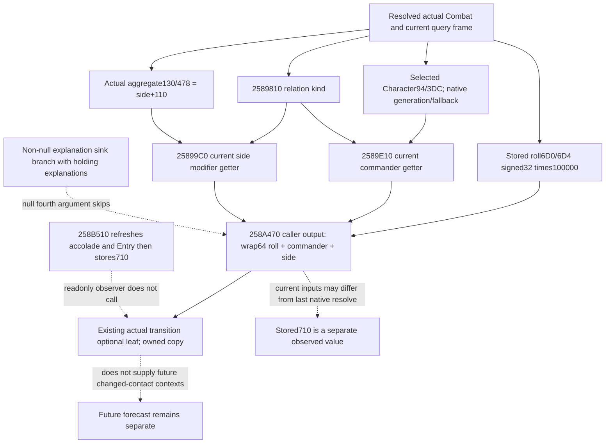

# Actual current side dynamic getter, CK3 1.20.0.3

This package closes one specific next actual input: `258A470`, not another constructor or a future contact. Exact identity is CK3 1.20.0.3 / Steam25652598 / EXE SHA256 `94b55397abb687a3dcd436805a5d885e6be90fa6c693feb44a9e3bbeeade02a6`. Source-only: no repository edits, build, test, game/SDK/pipe/UI/process/profile/save/cache operation.

The cached complete .2 body establishes the known span `258A470..258A6A0`. Existing reviewed .3 phase manifest and exact .3 `258B510` caller already bind the entry and null fourth argument. One necessary seek of the frozen installed .3 EXE read only that 560-byte span, plus368 bytes of PE section mapping headers. The entire body equals the cached .2 bytes, SHA256 `ae1ad782febee1ce96788004f8479736383923a2f46baa593d4df75f56a2cb52`. No other code, EXE scan or full EXE hash was read. `GETTER-258A470-560.json` contains all133 decoded instructions and the exact equality receipt.

The existing `ReadPhaseDynamic` ABI is `int64* (Combat*, int64* output, int32 side_index, void* explanation_sink)`. It is already used by `PhaseBindings.read_dynamic` on a query-owned hypothetical shell. The new actual observer must pass the resolved actual Combat, not that shell. The fourth argument is a pointer; it is not a bool, selector or roll override.

At `258A498..258A4A7`, the function sign-extends stored int32 `Combat+6D0+4*side`, multiplies by100000 and writes the caller's output. At `258A4AA..258A4AD`, a null explanation sink jumps directly to `258A5D9`. The skipped branch builds explanatory text, and for defender with retained holding optionally calls enum1EB/1D6 with an explanation output. Those results are not added to the numeric total here. They must not be used as another holding contribution in a mirror of the null-sink total.

The numeric path reads selected full CharacterID at `Combat+94+side*348`, corresponding to actual side+74. Native generation resolve uses storage `5C67568`, slot maskFFFFFF, bounds and full Character+18 equality; invalid/missing reference uses native canonical fallback pointer `5C67570`. Full ID0 is not categorically invalid. This is the stored selected Character, not a first Army owner, opposite primary or a new commander selection.

At `258A621..258A627`, it calls `2589810(Combat, side)` for the relation kind. At `258A62E..258A650`, it calls existing commander getter `2589E10(Combat, out, selectedCharacter, side, relation, null)` and adds its signed qword to the output. At `258A654..258A67D`, it calls existing side modifier getter `25899C0(Combat, out, Combat+130+side*348, side, relation, null)` and adds that qword. The aggregate pointer is actual side+110. It returns the original caller output pointer at `258A681`; additions use signed64 wrapped machine arithmetic, with no clamp in this getter.

Thus the null-sink getter's numeric formula is:

`side_current_total_raw = wrap64(roll_points*100000 + commander_current_raw + side_aggregate_current_raw)`.

All direct game-object accesses in this body are reads. Writes target caller output and local stack. The null branch avoids the explanation calls. The three direct numeric helpers reuse their existing reviewed getter contracts; no selector/populate/strength/accolade/final-stat refresh wrapper occurs in this body. This source package does not expand into a speculative audit of the established getters.

Cached exact .3 `258B510..258B5A5` separately refreshes both side accolade aggregates (`2650A80`) and Entry final stats (`2651070`), then calls `258A470` for side0/1 with null fourth argument and writes wrapped `storedBase + sideTotal0 - sideTotal1` to Combat+710. The readonly observer must call the getter directly and keep the actual stored aggregate as it currently exists. Calling `258B510`, native commander selection or refresh helpers would change the queried state.

The minimum next independent value is both current side totals. They require one already-known direct native getter binding, actual resolved Combat and a local output for each side. The getter consumes its own native selected/fallback and relation/aggregate inputs, so no new foreign ownership or synthetic participant reconstruction is needed. Stored base/total were closed by the preceding actual source ledger package. A qualified immutable consumer can compute current wrapped resolution from observed base and both observed current getter outputs, and report its relationship to the separately stored+710 without requiring equality. The result is a current-input diagnostic using the actual cached aggregate, not a refreshed native tick or a future battle forecast.

`QUERY-PLAN.json` freezes the required schema/qualification/fixture boundary. Existing `2589E10/25899C0/2589810` component bindings can support a later requested decomposition; the minimum side-total observation need not repeat them independently or depend on that wider publication.

## Implementation boundary planned 2026-10-06

Optional `actual_geography_v1.current_dynamic_advantage_v1` will carry actual
stored base and separately named stored resolved result, both signed Q100000,
and two native side-indexed rows. Each row reports observed signed32 current
roll/selected Character raw ID and independently nullable signed64 direct side
total with available/unavailable status/reason. The exact .3 enable path reuses
`ReadPhaseDynamic` and `kReadPhaseDynamicRva`; it calls with null fourth argument.
The existing foreign transition owns the read and owned control copies it.

Strict normalization and the frozen independent consumer will compute only the
wrapped current getter resolution from stored base and available side totals.
Stored+710 remains a separate value; equality is diagnostic data, not a gate.
No native refresh, historical constructor reconstruction or future forecast is
performed. One new Python case and one new native fixture command are planned;
passing stored4/current-context9 tests and consumers will not be repeated.
Source closing cost is exactly560 code bytes plus368 mapping-header bytes.
Implementation, native wire and live remain pending at this source-tree commit.
