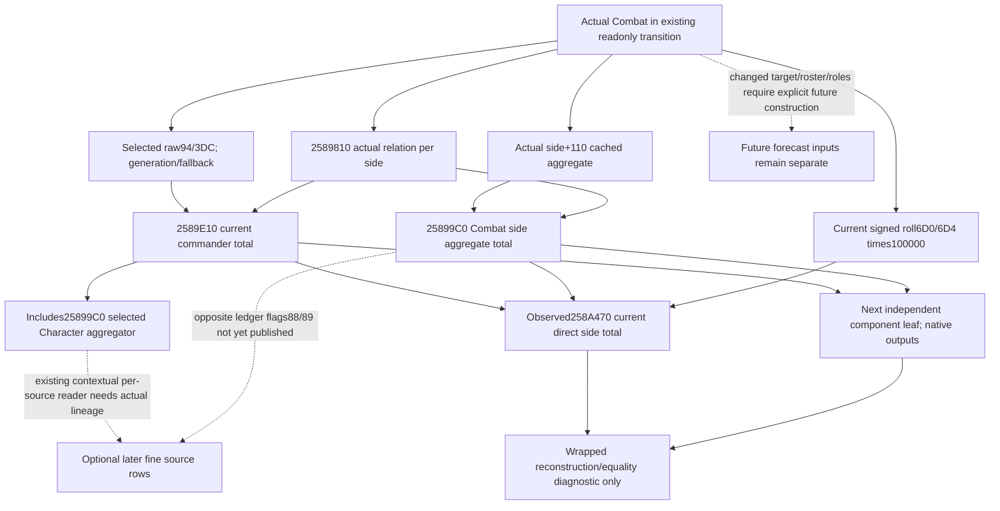

# Actual current dynamic component inputs, CK3 1.20.0.3

This is a source-only follow-up to the actual direct258A470 observer. Exact
build is 1.20.0.3 / Steam25652598 / EXE SHA256
`94b55397abb687a3dcd436805a5d885e6be90fa6c693feb44a9e3bbeeade02a6`.
No additional EXE bytes, tests, builds, SDK/pipe/game/UI/process/profile/save/cache
operation were needed. The preceding getter used560 code bytes plus368 mapping
bytes; this follow-up reuses cached exact .3 bodies and existing source only.

The first useful next value is direct current commander contribution versus
current Combat side aggregate contribution. Those two whole groups are already
read by258A470. Publishing their native outputs gives an independent explanation
of the current roll-inclusive side total without guessing a stock trait cause,
reconstructing the constructor, or broadening to a future battle forecast.

## Native tree and distinct aggregate contexts

258A470 calls relation2589810 with actual Combat/side, generation-resolves the
selected full reference94/3DC against Character storage5C67568 and canonical
fallback5C67570, then calls2589E10 with that exact Character, side, relation and
null explanation. Separately it calls25899C0 with actual Combat+130/+478, equal
to side+110, and adds both outputs to current roll times100000. Stored710 is
only an independently observed result of the last mutating native resolve.

The complete cached commander span2589E10..258A470 contains the primary
2589E10 function through258A1BC and a separate next function at258A1C0.
Only the primary body defines this commander's contribution. Its seven ordered
groups, each using signed Q100000, are:

| Native group | Input and exact callsite | Current observation seam |
|---|---|---|
| effective martial | signed Character+DC times100000 at2589E48..56 | existing contextual reader labels this field effective_martial; retain selected/fallback source |
| opposing primary context | opposing Combat+3D8 for side0, +90 for side1;2589020 at2589F37 | native group output, or existing typed Rite/religion source rows with actual identities |
| province culture context | Combat+6B8->province+848->raw32+388;25893F0 at2589F64 | actual internal province pointer and selected Character context, not requested hypothetical target |
| Army-gated cached1AE | selected aggregator cached1AE; Character+1B8->F4 Army reference, native fallback and24DFB70 | copied cache/raw lineage plus native predicate; a null Character link follows native NullArmy, not fabricated zero |
| primary identity1B1/1B0 | actual own primary90+side348 equals resolved selected Character+18 | same-frame actual equality;2C4D550 mode0/Q100000 at258A0D8 |
| gathering Rules+EF0 | current Combat+364+side348; selected Character flag1A5 absent; loaded effect+40 points | this is a current dynamic rule evaluation, separate from retained ledger row+8 |
| selected Character relation aggregate | selected Character aggregator28C3AE0;25899C0 at258A18E with original side/relation/null | same getter with Character aggregate, distinct from actual Combat side+110 |

The current gathering byte is actual side+344. It is neither an inferred Army
arrival nor a historical first-contact stage. Null explanation avoids text
allocation branches. The direct group getters write caller output; no command,
populate, commander selection, accolade refresh, Entry refresh or258B510 is
needed for their actual current outputs.

25899C0's complete cached .3 body is25899C0..2589E09,1097 bytes, SHA256
`f74ba788fd449afe95baaf07beb20f283ba680e42c24bb7530dd6829625d6ef4`.
Its ordered source slots are19B generic, side0/1 role19C/19D, terrain+774
uint16 modifier ID, target-definition+18 conditional19E, Combat+6FD
conditional1AD, opposite retained-effect nested19F, and relation1/2
conditional1A2/1A3. The same slots may evaluate on a Character aggregate or
actual Combat side aggregate; keep that source scope on every future row.

Nested25895A0 reads own cached19F and negates it. It sums only opposite side
retained16-byte rows whose loaded effect raw88 or89 is nonzero, taking amounts
from row+8 in native order. It multiplies that sum by the negated modifier with
the cached MAX/Q signed decomposition, truncation and wrapped arithmetic.
It does not use current effect+40 points for those stored amounts. Existing
stored source DTO keeps row+8 and key but lacks raw88/89 eligibility flags;
that is the concrete extra input if this nested group is later explained.
The now-observed opposite ledger is current retained data; it cannot recover
cross-side constructor clamp order or original effect values.

## Minimum observer plan

Extend the same optional actual current leaf with native relation, resolved
selected Character identity/fallback provenance, commander whole group and
Combat side aggregate whole group. Reuse `PhaseRelationKind`,
`PhaseCommanderDynamic` and `PhaseSideModifier` exact bound types/RVAs.
Preserve the current direct side total even if a separate component is null.
Use local qword outputs and null last arguments. Resolve selected reference as
258A470 does, allowing valid full reference0 and native canonical fallback;
do not reuse a resolver that rejects every id<=0. No selector or refresh runs.

The immutable consumer may report each group and
`wrap64(roll*100000 + commander + side_aggregate)` and whether it equals the
separately observed direct total. Equality is diagnostic data, not an ownership
or readiness condition. A legitimate component0 is available; a failed binding
must say2589810,2589E10 or25899C0 explicitly and keep its value null.

The existing source-level `ReadCommanderSources` and `ReadSideModifierSources`
are private phase.cpp helpers used on a query-owned shell after populate,
selection and resolve. Their typed row models are reusable, but their actual
input acquisition must be separated before applying them to a resolved Combat.
This source package authorizes no new native behavior by itself.

## Actual versus future input gap ledger

| Input | Current actual status | Future changed-contact requirement |
|---|---|---|
| direct total/base/stored710 | new observer implemented, central native/new-wire pending | cannot carry current group totals into a changed target or roster |
| selected identity, primary, relation | raw selected copied; other group lineage remains next publication | explicit future selected/primary/side contexts, not inferred original initiator |
| selected Character aggregate | native current total consumes it | exact selected Character stage/getter context for the future contact |
| Combat side+110 aggregate | cached aggregate consumed without refresh | build future aggregate from the requested roster/accolade inputs |
| province/terrain/definition | actual geometry published; deeper culture group follows Combat6B8 | use explicit future target and native constructor role/order |
| retained effect row+8 | observed ordered per-side current amounts and keys | original append order/values and clamp sequence are not recovered |
| nested opposite eligibility | cached getter source closed; raw88/89 not in current ledger DTO | explicit typed eligibility and future effect rows; never substitute current40 values |
| gathering/holding flags | current stored Combat bytes, distinct from constructor history | explicit construction-time predicates and source-bound current future input |

Human modifier names and upstream trait causes stay outside this useful first
component value. Complete historical constructor, refreshed native tick,
complete future advantage/forecast and live acceptance are not claimed.

## Implemented independent component boundary, 2026-10-06T01:31:59.674609+08:00

Optional `actual_geography_v1.current_dynamic_components_v1` now carries two
native side-indexed rows. Each copies signed current roll and raw selected
reference, then independently publishes selection identity/fallback lineage,
relation kind, commander whole contribution and Combat side aggregate whole
contribution. Units are signed Q100000 for contribution values; relation and
full references remain raw signed32. Exact .3 dedicated bindings reuse the
reviewed phase types/RVAs and canonical Character storage/fallback globals.
Valid fullID0 and zero relation/aggregate are available values. Wrong-generation
selected references use native fallback. Missing callback/output is null with
the specific RVA reason, without withholding the other independent source.

The reader and serializer live in exclusive headers; the existing foreign
transition collects the leaf and owned control copies it without a weaker
ownership gate. No refresh, selector, new public API or native command is added.
Strict normalization, frozen inputs and the existing service publish per-group
readiness plus a wrapped roll+commander+side-aggregate side total. An optional
same-frame direct258A470 total may be compared; missing/mismatching comparison
never blocks component readiness. Nested19F eligibility/fine source rows remain
explicit partial, and stored row+8 is never replaced by current effect40.

One necessary new Python case with four service subcases passed once, 0.021s
unittest /4.1981539s process, actual=0. It covers validID0/zero values,
explicit fallback, independent missing commander, owned parent readiness,
immutable copies and nullable/mismatched direct comparison. Prior direct4 wire
consumers and old tests were not rerun. Native target/CTest
`xar_ck3_12003_current_dynamic_components_test` runs only
`--current-dynamic-components-only` and prepares four fresh production wires.
Root central full bridge/new-target build and that unique new producer replay
are pending at this commit; no live or complete forecast qualification.
Source closing/read cost for this new component package is0 EXE bytes.
