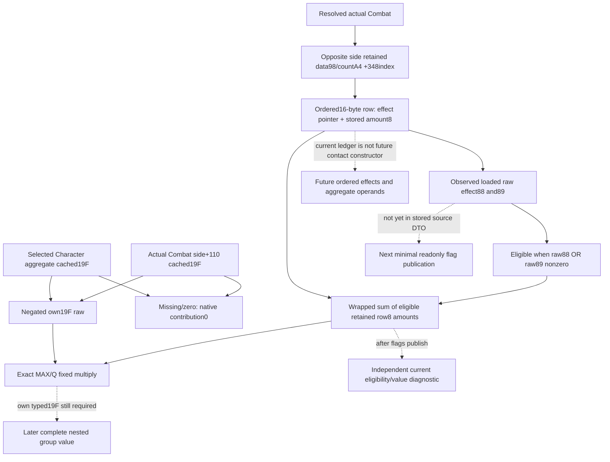

# Actual opposite effect eligibility for nested19F, CK3 1.20.0.3

Source-only follow-up to current direct and component outputs. Frozen identity:
1.20.0.3 / Steam25652598 / EXE SHA256
`94b55397abb687a3dcd436805a5d885e6be90fa6c693feb44a9e3bbeeade02a6`.
This package reuses the complete cached .3 function25895A0..2589809 and its
complete25899C0 caller. New EXE reads, builds, tests and game operations are0.

## Closed current input tree

The caller at2589D79..2589D9B passes the exact opposite Combat side:
side0 uses Combat+368,side1 uses Combat+20. The callee reads its effect data
at side+78 and count+84, equivalent to Combat+98/A4 plus opposite_index*348.
Records have stride16. Record+0 is the loaded CCombatEffect pointer and row+8
is the signed retained Q100000 contribution,already appended and scaled.

At2589663..2589675, a row is eligible exactly when loaded effect raw byte88
OR raw byte89 is nonzero. The two fields are uint8, not bools inferred from an
effect key or current points. Eligible row+8 amounts are summed with native
signed64 machine wrap in retained order. Unflagged rows contribute nothing.
The source does not substitute effect+40 points, multiply these retained
amounts by a current rule scale, or recover cross-side constructor clamp order.

The helper first looks up own aggregate cached uint16 modifier19F using keys
at aggregate+68,count+74 and values+ D0. Missing or zero is a legitimate
numeric zero and returns before opposite effect traversal. Otherwise it negates
that signed value with native wrap, sums the eligible opposite retained rows
and returns0 for a zero sum. Nonzero operands use the exact MAX/Q fixed
multiply branch at258968B..258972B, Q100000, truncation toward0 and wrapped
machine arithmetic. Its slow branch sorts signed max/min, divides max byQ,
multiplies quotient*min and wrapped remainder*min/Q, then wraps the addition.
The earlier generic MIN/Q helper is not an interchangeable contract.

With null explanation,2589733 skips text allocation and the function writes
only caller output. This tree does not propose a new direct nested function
binding: the minimum next value is explicit current eligible retained amounts.
The native argument registerR8 is not an input consumed by this closed body;
the actual callee operands are outputRCX,own aggregateRDX,opposite sideR9 and
the stack explanation pointer. No guessed selector or public getter ABI is
needed to publish the source fields.

There are two own aggregate scopes. Actual side+110 feeds25899C0 directly in
the roll-inclusive side total. Selected Character's28C3AE0 aggregate feeds a
second25899C0 inside commander2589E10. Both see the same opposite current
retained ledger but can have different19F values. A future row model must name
the aggregate source; a single total or current commander amount cannot reveal
either cached19F operand.

## Minimum next value and exact field plan

The existing actual `stored_advantage_sources_v1` already copies ordered row+8
and an independently nullable effect key. Add optional raw88/raw89 fields and
their own availability reason to those rows. Keep existing stored amounts and
ledger availability unchanged. Loaded key decode failure is independent of
flags: an effect with unavailable key may still supply two observed raw bytes
and an eligible amount. Missing effect pointer supplies null raw fields and a
specific source reason; never a fabricated unflagged0.

Strict normalization accepts legacy rows without the new optional fields and
requires new raw bytes to be uint8 integers,not Python bool. The immutable
current consumer can publish ordered eligible source rows and per-opposite-side
wrapped eligible contribution sums,independently of keys or a19F value. This
is a useful current explanation of which stored contributions the native
interaction sees. For own side0 consume observed side1 ledger and vice versa.
An empty available ledger has known sum0. Unobserved flags on a nonzero retained
amount leave that sum partial; no default0 is used for an unread field.

Only when an actual named aggregate19F operand or explicit typed caller operand
is available may the exact pure fixed product be computed. This package does
not derive it from a total or invent modifier amount/advantage. Independent
flag publication is not full nested group or complete future forecast.

## Concrete future changed-context operands

| Native consumption | Current actual fact | Required future typed input |
|---|---|---|
| opposite effect ledger row8 | ordered retained amount from this Combat | explicit future constructor append rows and amounts for the requested contact; not current effect40 |
| effect88/89 eligibility | current loaded effect pointer bytes,still next publication | observed relevant flags tied to each explicit future loaded effect identity |
| own Combat side+110 cached19F | consumed by direct side aggregate getter | future aggregate from requested Army/Entry/accolade roster and weights |
| selected Character aggregate19F | consumed inside commander total | selected Character's source-bound stage aggregate for that future context |
| relation/primary/gathering/province | same-frame actual component scopes | future role/selected/primary identities, relation, gathering and target before constructor/group evaluation |
| base/append clamp sequence | current stored base and separate resolved result | source-bound native append order and operands; per-side retained vectors do not reconstruct cross-side historical sequence |

Cached constructor/Entry trees already identify where those future inputs are
consumed. No historical initiator, previous loaded effect value, future
commander or future aggregate is inferred from the present slots. Source
ledger0/null is a legitimate observed value only when its branch/input is
actually observed. The work remains research until the minimal current flag
field is implemented and centrally validated. No production-live/game claim.

## Minimal current flag/value implementation, 2026-10-06T02:20:28.558500+08:00

Existing stored rows now add optional `effect_flags_v1` with observed raw
uint8 flag88/89 and their independent status/reason. The exact .3 collector
reads loaded nonnull effect pointers at88/89 independently of key decoding;
missing pointer gives null flags,without dropping the observed row+8 amount.
Exclusive reader/serializer headers contain the leaf. Fixture effect storage
was extended from48 to90 bytes because the new actual native fields are88/89;
this is required memory backing for those fields,not another producer model.

Strict normalization accepts older rows without the additive leaf and preserves
absence as unobserved flags. The frozen same-query consumer publishes native
ordered opposite rows,each eligible when either observed raw byte is nonzero,
and signed64 wrapped eligible retained sums. Available empty ledger gives0;
unknown membership of a nonzero amount leaves sum unavailable. Unknown
membership on a zero amount stays unknown while its numeric contribution is
exactly0: membership readiness and sum readiness are separate. Null key does
not block observed flags or numeric eligibility. No current40 value,per-side
sign flip,cross-side constructor clamp or missing19F amount is invented.

One necessary new Python case/four service subcases passed once,0.008s unittest,
1.7594671s process,actual=0,completed2026-10-06T02:17:56+08. It covers OR
membership/native order,raw uint8 values2/3/255,key-independent flags,
missing flag availability,empty opposite sum,owned parent gate,immutable copy
and legacy absence on a retained zero. No old stored/direct/components wire
consumer or old Python case was rerun.

New target/CTest `xar_ck3_12003_opposite_effect_eligibility_test` runs only
`--opposite-effect-eligibility-only` and emits four new production wires.
Root central build and that unique new producer replay are pending. This
independent current input value is static-ready; nested19F contribution still
requires an explicit observed own modifier and complete future/live remain
unqualified. Source cost for this flag extension is0 new EXE bytes.
