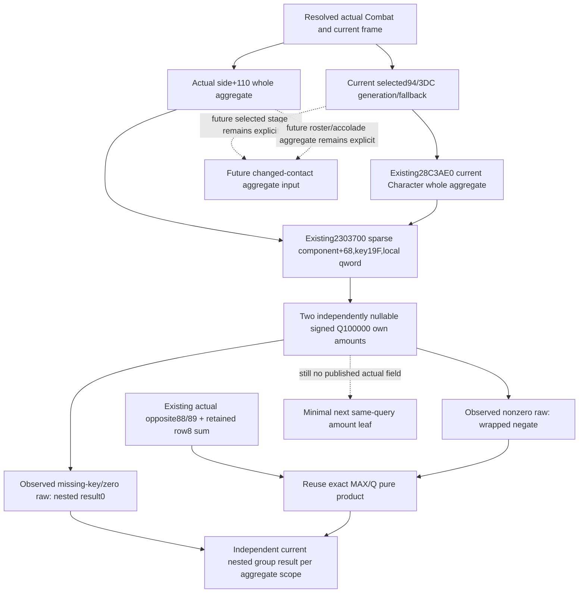

# Actual own nested19F amounts, CK3 1.20.0.3

Source-only next leaf after actual opposite88/89 eligibility. Exact identity:
1.20.0.3 / Steam25652598 / EXE SHA256
`94b55397abb687a3dcd436805a5d885e6be90fa6c693feb44a9e3bbeeade02a6`.
No new EXE bytes, test, build, producer replay or game/runtime operation.
All necessary numeric/source contracts already exist; the concrete remaining
gap is publication of current own19F amounts in two different aggregate scopes.

## Native input tree

Cached25895A0 first searches the supplied whole aggregate's sparse keys at68,
count74 and raw qword values atD0 for native uint16 ID19F. If the key is missing
or its raw value is0,the result is legitimate0 and it returns before reading
opposite rows. The raw amount is signed64 Q100000,not an effect point count or
a reconstructed commander residual. Nonzero raw is negated with machine wrap,
then multiplied by the wrapped opposite eligible retained contribution sum
using the already closed MAX/Q helper.

This exact lookup is already provided by `ReadCharacterModifier`:
`int64* (void* sparse_component, int64* output, int32 modifier_id)` at2303700.
Pass whole aggregate+68,caller local qword and19F; the native function consumes
the low uint16 argument. Component+0 points to ordered uint16 keys,+C is the
signed count,and component+68 holds value-array pointer. These are exactly
whole aggregate+68/+74/+D0. At2303788 it copies the cached qword. Missing
key at2303794 writes0; both branches return the caller output pointer. The
primary getter ends23037A2; the cached256-byte seek also contains padding and
the next flag getter at23037B0,which is not part of this amount function.
No refresh or scale multiplication occurs in this sparse getter.

There are two real caller scopes:

| Scope | Actual whole aggregate pointer | Proven consumer |
|---|---|---|
| Combat side | Combat+130+side348 = actual side+110 |258A470 calls25899C0; its nested25895A0 consumes own19F |
| selected Character |28C3AE0(exact generation-resolved selected/fallback Character) |2589E10 calls25899C0 at258A18E; nested25895A0 consumes own19F |

Use the already closed current component selection resolver: raw94/3DC,
storage5C67568,indexFFFFFF,full Character+18 equality and fallback5C67570.
Valid fullID0 is allowed. Keep actual resolved identity/fallback lineage.
The whole Character aggregate getter is existing
`GetCharacterModifierAggregator = void* (void*)`,bound28C3AE0 inCombatBindings.
Do not use a candidate,first Army owner,opposite primary or inferred future
selected Character. The two aggregates can have different19F amounts while
sharing this actual Combat's opposite retained ledger.

## Minimum same-query publication

Existing callback types/RVAs are closed. Add optional own19F rows beside
`current_dynamic_components_v1` with two named scopes per native side:
`combat_side_aggregate` and `selected_character_aggregate`. Each contains native
modifier_id19F,amount_raw signed64 nullable,status/reason and source scope.
The actual selected Character identity/fallback fields already exist; reuse
them instead of adding another identity resolver or synthetic participant.
Dedicated amount bindings may reuse exact .3 known addresses2303700/28C3AE0;
fixtures inject the same typed callbacks. No new MCP,world command or ownership
gate is needed. The existing foreign transition gathers the optional leaf and
owned control copies it. One missing scope never withholds the other amount.

Do not expose a guessed cache_present flag from a raw0 result: present-zero and
missing-key both deliberately yield0. A missing getter/aggregate/output gives
null with concrete2303700/28C3AE0 reason. A returned local pointer with0 is
available. No speculative enumeration of upstream trait causes is necessary.

The frozen consumer can first publish these amounts independently of opposite
flag readiness. For an observed own amount0,the native short-circuit gives a
known nested0 without requiring opposite88/89. For an observed nonzero own
amount,consume the separately observed current opposite eligible row8 sum;
unknown membership on a nonzero row remains a concrete input gap,not0. Do not
infer own19F from the commander/side total or substitute current effect40.

Root already has `knight_effectiveness_fixed_mul_12003` in the committed
`battle_first_contact_final_stat_refresh_12003.py`. Its signed MAX/Q/truncation/
wrap contract matches the cached nested258968B..258972B product. Reuse that
pure helper after binding observed operands; do not write another numeric
contract or retest old vectors. The current detached gbs5 baseline lacks that
new module,so implementation must start from Root's adopted module or restore
that exact committed dependency before its one necessary new focused case.

This package does not require another EXE seek or deeper getter research. Once
the smallest amount leaf is implemented,it can close current nested contribution
per named aggregate. Future target/roster/selected-stage construction still
requires explicit future aggregates/effects,not a relabeled current amount.
Full battle forecast,quality conclusion and live qualification remain separate.

## Minimal actual input and contribution implementation, 2026-10-06

The source tree and minimal query plan were frozen before code. Existing
same-query actual geography now has optional `current_own_nested_modifier_v1`:
two native side rows, Q100000, modifier_id415, actual selected raw/resolved ID
and fallback lineage, and independent `combat_side_aggregate` /
`selected_character_aggregate` amount/status/reason objects. Exclusive DTO,
reader and serializer headers contain the extension. Exact .3 admission binds
the existing2303700 and28C3AE0 ABI; the collector passes whole aggregate+68 to
the sparse getter with a local qword and19F. A returned0 is available,including
native missing-key zero; no cache-presence inference is made. Missing selected
storage/fallback or Character aggregate affects only the Character scope.
Combat side+110 remains independently useful. Owned control reuses its existing
actual geography copy and ownership gate.

Strict normalization copies signed64 values and explicit nullable status.
The immutable current model reuses the existing opposite eligibility/sum
model and Root-published `knight_effectiveness_fixed_mul_12003` from exact
commit `a684cab20a170702a3899854f11735ff4e9fe07e`; no second fixed multiply
implementation was added. Child dependency commit `28d13615` restores that
tracked module byte-for-byte solely for the detached lane. Root already has
the module and should adopt only this implementation commit.

Each named scope publishes its actual raw19F independently. Observed0 produces
a ready nested0 before requiring opposite membership or ledger availability.
Nonzero consumes the observed wrapped eligible opposite retained row8 sum,
wrapped negation and exact MAX/Q product. Missing operands remain explicit;
no total residual,current effect40,per-side sign flip or historical cross-side
clamp is used. This closes the current25895A0 numeric term per aggregate scope,
not the complete25899C0 group,full battle forecast or future contact stage.

One new Python case/four service subcases passed once at
2026-10-06T02:56:47+08:00:0.007s unittest /1.6158367s process,actual=0.
It covers distinct scopes,ordinary and slow MAX/Q current products,observed0
short-circuit with missing opposite flags,missing selected scope with useful
Combat scope,owned parent gate,immutable copies and signed-value normalization.
No prior helper test or old producer sample was rerun. New native target/CTest
`xar_ck3_12003_own_nested_modifier_test` uses only
`--own-nested-modifier-only` and four fresh production frames in
`ck3_12003_own_nested_modifier_wire`; central build and first wire replay are
pending Root. New EXE bytes and all game/runtime operations remain0.

External source,plan,dependency and focused receipt:
`Z:/ck3_mod_rewrite_process_assets/g2-background-round4-20261005/retained-advantage/actual-dynamic-getter/group-decomposition/nested-19F-inputs/own-modifier-source/`.

## Central producer and first consumer qualification, 2026-10-06

Root qualified the full intended DLL plus the new own19F/point-store targets
at exact combined source `a0956b80de9bde0248e0b736ae50f4ff60d2ee57`:
native-own-and-point-stores-04 GREEN8.5540492s; first two new CTests2/2 GREEN,
total0.30s /wall0.3298416s at2026-10-05T19:29:06UTC. Root's preserved attempts
are separate:01 canceled after63.334s because an unresolved cherry-pick
conflict left a dirty integration source;02 /WX point-store fixture type RED
129.13949s;03 /WX fixture signedness RED7.24625s. Root fixed fixture types
without changing production logic. Own19F had no native failure.

The four archived own19F production wires were consumed once through Root's
actual production normalizers/service,immutable adapter and published pure
MAX/Q helper:4/4 GREEN,processing0.0164600000s /process0.5993037s,actual=0.
Distinct actual Combat/Character scopes,slow MAX/Q amount product,observed0
short-circuit despite missing opposite flags,independent missing Character
scope and owned copy all retain their source-bound values and readiness.
This seals the current25895A0 term per named aggregate through the native
serializer/consumer boundary. No old Python/opposite/native sample was rerun.
Full25899C0 group,future changed-contact aggregates,full forecast and
production-live remain outside this static qualification; game operations0.

Root archive includes the original compiled bytes and pinned qualification:
`Z:/ck3_mod_rewrite_process_assets/g2-background-round4-20261005/sourcea0956b80-own-and-point-stores-native-artifacts/HASHES-AND-NATIVE-QUALIFICATION.json`.
DLL10446848bytes SHA256
`37b37dfb74b4501e9d8fb5c93757768b1fdbf41a1a55d0c8c2dbbad68c184769`;
own fixture EXE565248bytes SHA256
`349a600a0331eccd6330fcdd74b947a61a2eb68be2a9ed2da4f5f466b0d89c8f`.
These Root-provided binary pins were reused without rehashing or rebuilding.
The new four wire bytes and production module pins are in
`own-modifier-source/implementation/NATIVE-WIRE-CONSUMER.json`; final qualifier
and Oct6/W41 fields are beside it. No further EXE seek was required.
