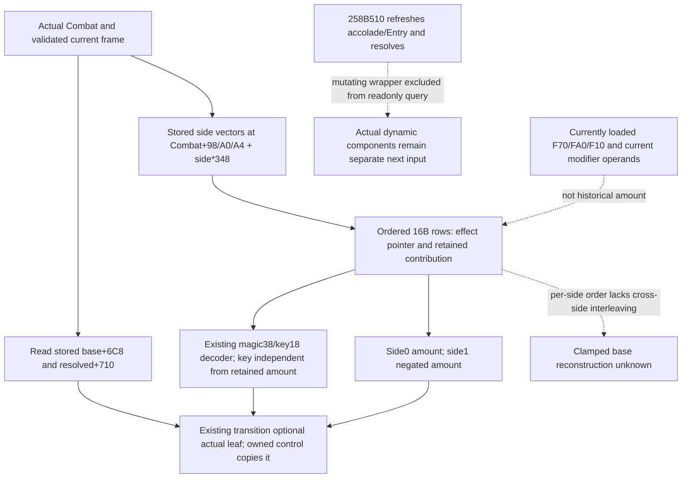

# Exact .3 next actual advantage inputs

Research only, recorded after the nine new production wire frames passed. CK3 1.20.0.3 / Steam 25652598 / EXE SHA256 `94b55397abb687a3dcd436805a5d885e6be90fa6c693feb44a9e3bbeeade02a6`. This package reuses cached source and the current provider. New EXE bytes, game operations, builds, tests and repository edits are all zero.

The next independently useful observation is the actual stored effect ledger. It closes the concrete distinction between currently selected Rules slots and contributions retained in a real Combat. `append-effect.json` freezes all chained pieces of `2586C90..2586ECD`, code SHA256 `1c0a0e673451f31b5269874d78af9f72b4a4f21ee924ae9f11071f1105efe472`.

At `2586D61/2586D68`, Append stores `{effect pointer, contribution_raw before side sign}` in a 16-byte stack tuple. `2586D9E` multiplies the side index by `348`. The vector fields are Combat-relative data `98 + side*348`, capacity `A0 + side*348`, count `A4 + side*348`. The allocation and no-allocation paths copy that tuple at index `count` and preserve the previous row order. In side-relative terms, actual side0 starts at Combat+20 and side1 at Combat+368, so these are side+78/+80/+84. The existing participant hard-casualty ledger at side+58 uses a different 24-byte record and must remain separate.

The stored second qword is already the scaled contribution, not a scale operand and not the effect's current points. Current effect+40 must not replace it. Side0 adds this amount; side1 negates it for its signed base contribution. A selected zero-point effect can produce a retained zero row. Rows contain no append timestamp, original scale, stage enum or global order shared between both sides. A present row proves current stored append membership; it does not identify the original constructor stage or when it was appended.

Append updates stored base Combat+6C8 using signed addition and a clamp after each append at `2586D54..2586D8F`. Both ledgers preserve order within their own side, but not the interleaving of the sides. Therefore their sums are not an exact reconstruction of the clamped base. Read the base directly. The owned control reader already reads `base_advantage_raw` from+6C8 and `resolved_advantage_raw` from+710. The existing foreign transition entrance is the place to publish the same optional actual leaf without changing ownership rules.

The cached complete `258B510..258B5A5` resolve body, code SHA256 `b340190919d89d1aff624453cf89e05e7d9bdc8e8cd96d9b3a21d082efbc23e0`, writes `resolved = stored base + sideTotal0 - sideTotal1`. It first calls side accolade refresh `2650A80` and final Entry stat refresh `2651070`, then `258A470` twice. The wrapper writes game state and must not be called by the read-only query. Existing phase code uses `258A470`, selected-commander `2589E10`, side aggregate `25899C0` and relation `2589810` in a query-owned hypothetical shell; that result cannot be relabeled as the actual stored result. A later actual dynamic-component observer needs its own direct getter input/source closure and must keep its observation time separate from stored+710.

The future first-contact constructor uses another qualified input boundary: ordered projected sides and native roles from the contact result, target Province and the actual incoming entry/constructor kind; current Army initialization tuples followed by changed-context final refresh; native selected commander; current loaded effects and current stage predicates. Retained kind+6F8 and holding+6FE do not establish that future contact's initiator or incoming edge.

Existing `phase_advantage.cpp` already supplies the source plan for 15 stages. The remaining actual-query inputs and the future-constructor inputs are listed concretely in `QUERY-PLAN.json`. Religion is implemented by its exact .3 predicate and loaded F50; it is not a pending research mystery. The next current-battle increment should expose retained rows first, because it produces real independently usable source amounts without pretending to recompute the entire constructor or advantage.

## Implementation input contract, 2026-10-06

Optional `actual_geography_v1.stored_advantage_sources_v1` carries scale100000,
signed int64 `base_advantage_raw` and `resolved_advantage_raw`, plus two ordered
side records. Each side has its actual index, available/unavailable status,
nullable rows and an unavailable reason. Each observed row contains
`effect_key` (nullable), `key_unavailable_reason` and signed int64
`contribution_raw` copied directly from row+8. Key decoding is independent of
amount observation; current effect points are never read for this amount.

The exact .3 enable path qualifies this optional native collector. It reads
the existing resolved Combat only and uses the existing bounded native vector
convention (count/capacity validity, at most65536 rows). Legacy missing leaves
retain their existing wire shape. A failed side vector yields a null side
ledger while the other side and stored base/total remain usable. The old
24-byte participant-hard ledger and the existing query ownership remain intact.

The strict normalizer copies this independent optional fragment. The production
service publishes `stored_advantage_sources_v1` as a separately qualified
current-frame diagnostic. A frozen pure adapter retains the native row order;
its only calculation is the side sign of an already observed retained amount,
including signed64 wrapped negation for defender. It does not sum both ledgers
to reconstruct base or supply missing original clamp order.

Validation is one new Python case covering actual transition and owned control,
current loaded points unequal to retained amounts, observed zero/negative rows,
an undecoded key, an empty side and an unavailable side. A dedicated new native
fixture command emits only these new stored-source frames. Root performs the
central build and the producer-byte consumer replay follows that result.
Implementation/native/live status remains pending at this source-tree commit.
