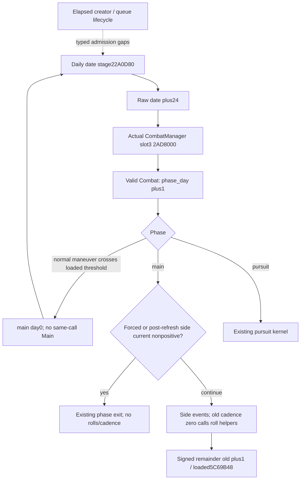

# Battle calendar admission — CK3 1.20.0.3

Exact build: CK3 1.20.0.3 / Steam25652598 / EXE SHA-256 `94B55397ABB687A3DCD436805A5D885E6BE90FA6C693FEB44A9E3BBEEADE02A6`. Readiness: static-ready conditional daily scheduling; outer creator and queue admission remain research. This source increment adds no game days or live/complete prediction credit.

The native daily command virtual+8 entry `2988170` calls `22A0D80` at `29881E7`. `22A0E8D` adds24 raw hours to `GameState+8`. Later `22A1D75` dispatches `GameData+2E9D8` virtual slot+18. Constructor, RTTI and secondary vtable `477F178` identify this interface as `CCombatManager+8`, whose slot3 is `2AD8000`. Each valid listed Combat receives a phase-day increment and phase dispatch. `Combat+705` is a processing flag, not a daily guard.

`simulation.battle_calendar_admission.project_daily_battle_schedule` is the pure prefix for existing P1/P2/refresh/phase/pursuit kernels. Inputs are explicit date-stage execution, initial raw date, valid manager membership, phase/day, forced-winner and post26505E0 side currents, cadence as tested after side events, and loaded intervals. It emits `dispatch_date_raw` and phase-work day; supply those explicitly to `CurrentMainPhaseTransitionInputs`. Accepted-invocation offsets alone are not calendar dates. A normal maneuver crossing5C69BB0 enters main/day0 without a Main call; the next separately admitted date performs the first Main invocation. Final phase/day on Main exit or pursuit is delegated to existing kernels.

Endpoint pause is metadata, so before/after paused snapshots do not cancel an intervening admitted advance. Missing admission remains typed unknown; elapsed sufficient, priority7 submission, frontend pumps and250ms transport heartbeats do not establish execution. Concrete remaining entrypoints are creator25A9C50 bound-state alias/helpers383E490 and29C5F30, frame-to-creator time provenance, priority7 queue consumer to generic runner29676A0, and slot2 pre-stage array registration. These gaps add no gameplay gates. Slot2 `2AD7F00` separately produces258B510/264D480 refresh; its post-date scheduling is not inferred from slot3.

The roll interval is loaded5C69B48 or an explicit caller assumption; stock3 is not defaulted. `roll_helpers_called` describes the helper call point, not native RNG draws or actual rolled values. Existing numeric losses, advantage/width/stat refresh, RNG state and terminal effects remain in their own kernels. Two focused cases reuse the sealed GREEN source validation: admitted paused-endpoint cadence wrap, and maneuver crossing followed by first main date. The canonical unit form was not rerun while packaging.

Evidence: [external source receipt](Z:/ck3_mod_rewrite_process_assets/g2-resume-20261004/battle-calendar-admission-v57/ROOT-DELIVERY.json), with manager/pause/roll source trees, exact cached spans, conditional model, two focused GREEN cases and Oct4/W40 fields. This package uses files only: SDK, pipe, window, game, shared edits and new saved days0. Pursuit hard-conversion slot5C69B98 is a separate owner-ledger/native-binding correction; it must not be confused with maneuver threshold5C69BB0.
