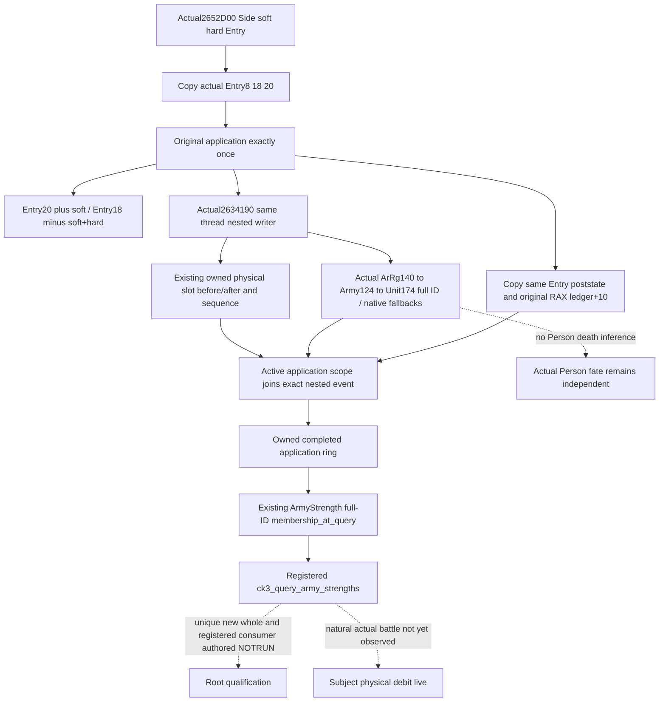

# Actual battle casualty application and physical soldier debit

Source-first package, 2026-10-10 Asia/Shanghai. Exact CK3 1.20.0.4 / Steam
25734779, frozen executable SHA
`98702f88a547cde2eaf29a85f93b85f68ee4cf8148336a4f7afaeb75319dd518`.
This package reuses the existing freeze; it does not hash an executable.

## Native source and the missing decision input

[Native55](army-actual-loss-writer-observation-12004.md) captures actual backing
slot debits at `2634190`, and joins full ArRg IDs held at query time. Native67
stat-cache writeback and Native68 current physical Entry rows are separate
static-qualified capabilities. None establishes that an unclassified global
writer event belongs to the selected Army or that a knight Person died.
The current actual pair has global sequence 0->163, selected Army1843->1843
and matching events0. Subject debit remains unobserved.

Root executed exactly one finite mapper request for the historical full266B
`2652D20` caller. Actual corresponding function is **[2652D00,2652E0A)**,
complete instruction-span normalized equality. Root recorded0.812s, one new
266-byte read; this worker performed no EXE read. Exact receipt:
`D:/codex-ck3-background-spill/battle-physical-debit-association-12004/actual4-map-first01/FAMILY-MAP.json`.
The detail and `ACTUAL4-CASUALTY-ENTRY.asm.txt` in that external package retain
the operands. Candidate ordinal alone was not treated as ABI proof.

Actual ABI is `(Side* RCX, int64 soft RDX, int64 hard R8, Entry* R9)` returning
the final owner-ledger row in RAX. `2652D53` adds soft to Entry+20;
`2652D5B` subtracts soft+hard from Entry+18. Entry+8 is a full ArRg ID;
the source generation-checks storage5D1F340 and uses fallback5D1F338.
It passes the resolved actual ArRg and hard unchanged to **2634190** at
`2652D65`, returning `2652D6A`. It then generation-resolves ArRg+140 through
Army5D1DE48/fallback5D1DE50, and Army+124 through Unit5D1E380/fallback5D1E378.
Unit+174 is the actual owner full Character ID supplied to `264E9F0`.
The returned row's +10 is increased by hard at `2652DFB`; RET is2652E09.
The row helper is not expanded: this package needs its observed return and
the already-proven +10 write, not its lookup algorithm or Person effects.

## Minimal implementation contract

A single natural `2652D00` wrapper copies Entry prestate, establishes a narrow
thread-local application scope, calls the original once and preserves its
pointer return. The existing2634190 journal notifies that active scope only
after completing its original-once physical reads. The application publishes
an owned completed event after its original returns. No query calls either
mutating function. Original arguments/results are never replaced by capture.

Each event retains actual Entry identity/full ArRg, soft/hard Q100000 requests,
before/after fighting and soft, the exact nested writer sequence and physical
debit, plus separately observed actual Army/Unit/owner full IDs and fallback
branches. Actual integer backing debit is not filled from Entry net changes,
hard Q requests or cached counts. Read failures remain null; zero remains zero.
The nested writer/full Entry ID association requires the actual active scope
and matching full ArRg, never global sequence proximity. Query membership
remains `membership_at_query`; invocation identities are separate data.

The new private DTO/ring is serialized as optional
`battle_casualty_observations_v1` in the existing ArmyStrength/MCP row. Older
wires omit it and normalize to None. Existing Native55 semantics are retained.
No `game_contract.hpp`, ArmyBindings, strategy or Person arithmetic changes
are needed. Army natural24E3410/monthly context is owned by the independent
attrition lane. New sole whole/registered consumer will exercise a positive
backing debit, soft/hard distinction and exact full-ID association; it is not
a replay of the Native55 fixture and does not qualify actual natural combat.

## Authored connected qualification

The implementation, formal Runtime/CMake connection and sole new qualification
sources are complete, **AUTHOR_NOT_RUN**. The existing journal exposes one
optional completion callback; old standalone writer targets have no link
dependency on the new observer. Only the new initialized observer registers
the callback, which runs after journal publication and outside its lock.
The native source owns a256-event ring; its15-byte application prologue contains
only complete stack/register instructions, with no RIP-relative relocation.

New native target/CTest:
`xar_ck3_12004_battle_casualty_physical_debit_whole`. It accepts only
`--wire-out <fresh-dir>/battle-casualty-physical-debit-12004-whole.json`.
One application calls one nested writer. The synthetic owned graph distinguishes
soft250000/hard750000, fighting10000000->9000000, soft500000->750000,
physical100->93 (debit7), raised cache100->95 (delta-5) and owner hard
ledger500000->1250000. It verifies actual return preservation and a real
generation mismatch selecting the Unit fallback. Source memory is changed
after capture; production serialization must retain the completed values
without additional native reads. A second query Army has the same low index
but a different full ArRg generation and receives a legitimate empty family.

The sole Python node is
`BattleCasualtyPhysicalDebitRegisteredMcp12004Tests.test_battle_casualty_whole_through_registered_army_query`
in `tests/unit/test_battle_casualty_physical_debit_registered_mcp_12004.py`.
Root supplies the new wire directory with
`CK3_BATTLE_CASUALTY_PHYSICAL_DEBIT_12004_MCP_WIRE_DIR`. One registered
`ck3_query_army_strengths` call with army_ids[11,12] and the genuine Driver
revision must pass through Service/Driver/transport and both normalizers,
preserve the complete emitted business result and expose both observation
families. The endpoint supplies synthetic paused scope/request correlation;
it does not invent a casualty result. This does not replay an older native
fixture or claim that an actual CK3 function was invoked by the synthetic graph.

External source, finite read receipt, unique FIRST argv and Oct10/W41 fields:
`D:/codex-ck3-background-spill/battle-physical-debit-association-12004/`.
Build owner projection must use current canonical dependencies for existing
`army_strength_v1_serializer.hpp` and
`ck3_12004_actual_loss_writer_journal.hpp`; no owner count is guessed here.
The new Runtime TU and the single new fixture TU are additional inputs. Existing
actual-loss journal Runtime source and bridge.cpp are changed production owners.
No full aggregate DTO changes or other domain tests are required by this source.

Current status: **research with connected implementation authored NOTRUN**.
Worker Game/SDK, process/UI, EXE/hash, build/test/import0. Root's sole new source
read is266B/1read. Existing qualifications are reused, not rerun. Natural
actual battle event, FullPerson and complete forecast/G2 credit0; Root must
perform the new offline qualification and later observe a natural subject event.
