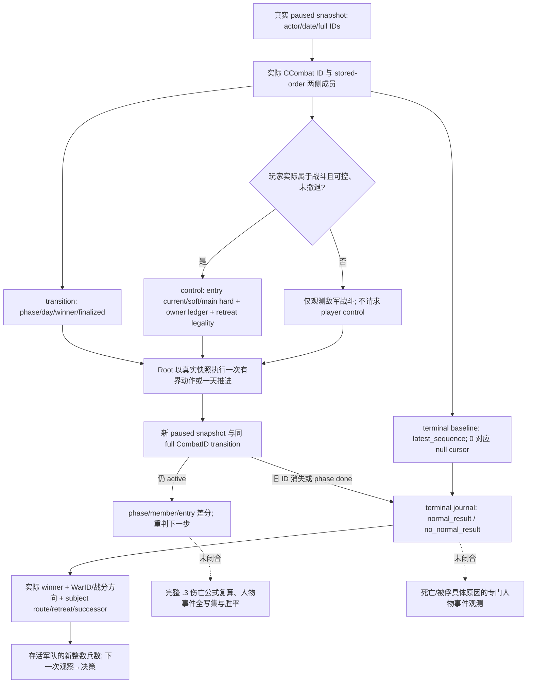

# CK3 1.20.0.3：首次战斗的伤亡、败退与结束结果观测

2026-10-03。Exact build 为 CK3 `1.20.0.3`、Steam `25652598`，EXE SHA-256
`94B55397ABB687A3DCD436805A5D885E6BE90FA6C693FEB44A9E3BBEEADE02A6`。
本页整理已存在的原生观测树和安装版 stock 规则，供 Robert `29829` 原普通战役首次战斗 OODA 使用。
战争已获全面授权；未实现的预测质量不构成战争禁令。本文没有提交动作、推进日期或操作窗口。

## 原生输入和证据

施工前读取 [battle 迁移](ck3-1.20.0.2-battle-migration.md)、
[伤亡账解释](combat-casualty-chain-explainer.md)、[终结与再入战](battle-terminal-and-reentry.md)及
[1.20.0.3 ABI 复用](crozier-1.20.0.3-native-migration.md)。1.19 的精确 casualty 数学和 phase-day
调用顺序仍是其原构建的研究证据；本页不将旧 EXE 地址或旧实战自动升级为 .3 live。

.3 production 在完整 descriptor 匹配后使用 `ReviewedCrozierAbiSha256` 选择已证明 unchanged 的 .2
ABI。永久证据 `native_bridge/research/ck3_1_20_0_3_abi_reuse.json` 的 `combat` 和 `battle`
模块分别引用 `ck3_1_20_0_2_combat.json`、`ck3_1_20_0_2_battle.json`；
`ck3_12003_abi_profile.cpp:18` 和 `bridge.cpp` 的 `ExecuteTypedQuery12002` 连接真实 owning-thread
paused snapshot 与现有 battle reader。实际 .3 身份来自 runtime freeze，而非为旧 binder 增加 SHA 例外。

已有原生读取入口及其职责如下：

| 入口 | 原生输入/结果 | 对首次战斗的用途 |
|---|---|---|
| `ck3_query_battle_transition_v1` | CCombat storage `5D1DE70`；完整 CombatID；phase `+6B0`、day `+6B4`、winner `+6E0`、forced winner `+700`、finalized `+704`、result ID `+708`；两侧 stored-order CArmy→CUnit 回链 | 给任何已实际观测的战斗定位阶段和成员，玩家尚未参战或已撤离时仍可查询 |
| `ck3_query_battle_control_snapshot_v1` | 玩家可控、正在战斗、未撤退 CUnit；两侧 Entry60 和 owner hard ledger；native strength `2651100/2657B50`；retreat validator `258AA10`、owner-taking rules `28C2E10` | 玩家实际入战后读取当前 fighting、soft、hard 和真实撤退资格 |
| `ck3_query_battle_terminal_transition_v1` | startup 安装的 natural finalizer `258CD50` 与 warscore writer `249A940` 被动 journal；旧 CombatID/省份/result、subject route/backlink、successor | 旧战斗删除后继续证明正常结果或无正常结果，并决定战后下一步 |
| `ck3_query_army_strengths` + `ck3_take_snapshot` | 完整 CUnit/CArmy；当前/最大整数兵数、所属战争、位置、路线、combat/retreat；snapshot 的玩家身份/存活和 native command history | 战前与战后可用军队兵力和行动状态差分，供继续围城、行军或撤退使用 |

`ck3_12002_battle.cpp::TransitionSample/Bucket/Side/Retreat/TerminalSample` 是本页字段语义的生产来源。
`bridge.cpp::XarCk3BridgePrepareStartup` 对 reviewed Crozier 构建安装 terminal journal；无需另行开启
旧 `WAR_CASH/PREWAR` 才能读取这些核心字段。

## 当前原战役真实基线

复用 `Z:/ck3_mod_rewrite_process_assets/g2-resume-20261003/war-battle-phase/actual-battle-transition-v34-01/004-ck3_query_battle_transition_v1.json`，
不重复实测：native revision `16` / public `2` / paused date raw `53236608`；CombatID
`1577058305`、province `2640`，maneuver `0` / day `0`，winner 与 forced winner 均 `none`、finalized false。
实际 attacker CUnits `[251658381,473,474]`，defender `[50331920,83886484]`。
Robert 军 `83886367` 不在双方数组。ResultID `1493172226` 在此机动初帧已经分配，因此 **result ID
非空不是战斗结束证据**。这些实际成员不能由另一份“玩家对叛军”的假想 v2 partition 替换。

本基线提升的是敌军战斗生命周期 `production-live primitive`；Robert 未参战，也尚无本战的伤亡、
结束、胜利或完整战争 OODA。敌军战斗的 terminal baseline 可以以实际 rebel CUnit `251658381`
作为 subject；该 query 没有 controllable 或 player-army 闸门。其 subject 状态描述这支叛军，不能写成 Robert 状态。

## 伤亡字段单位与差分

Entry 的 `starting_raw/current_fighting_raw/soft_casualties_raw/hard_casualties_raw` 和 owner hard
ledger 都是 **Q100000 兵员账**，除以 `100000` 才是人数当量。属性 damage/toughness/pursuit/screen、
native side strength 与 AI base power 各自保留计算单位，不能直接念为兵数或胜率。
`army-strength` 的 `current_soldiers/maximum_soldiers` 已是整数人数，不能再次除以 Q。

对 `fights_in_main_phase=true` 的保留 entry，reader 以 `starting-current-soft` 计算累计 hard；非 main
entry 的同一残差可能包含 reserve，其 `hard_casualties_status=unavailable`、raw null，不能补成 0。
同一 full CombatID、同一 full RegimentID 两帧的累计 hard 差才是该间隔的该行永久损失。owner hard
ledger 包含其自身归因，不将消失兵团的损失重新分摊给仍保留 entry。

`derived_current_fighting_raw` 是即时 entry 合计；`stored_current_fighting_raw` 可保留 tick-start cache。
既有 .2 fixture-live 已观察二者在 main 帧不同，这个标志不单独阻断 action readiness。
soft 是战斗中已溃散兵员；它可以在追击中转成 hard，战后可用军队整数兵数可以回升。
战前/战后整数军队人数差是净兵力变化，不能冒充 exact hard loss 或人物死亡人数。

## 最小结果验收

1. 战前保存现有实际 snapshot/army-strength，并为实际 CombatID 读取一次 terminal baseline。取
   `terminal_journal.latest_sequence` 为后续 cursor；正数原样传，`0` 传 `None`。
2. 若 Robert 真正入战，在新 snapshot 的真实 side membership 上查询 control + transition + terminal，
   记录 entry/owner ledger、phase/day、winner、retreat legality 和 cursor。对当前仅敌军战斗不调用 control。
3. Root 一次有界动作/一天推进后保存 paused snapshot；SDK root helper 给每个 query 绑定 fresh public
   revision。复用 native command history 与实际状态验证动作；ACK 不计后置条件。
4. 同 CombatID 仍 active 时记录阶段、成员、伤亡差分。owner-subset 撤退只移除 affected owner，其他成员
   和原战斗可继续；full-side 撤退后进入 pursuit 也可暂时保留原 CombatID/backlink。
5. 正常结束由 terminal journal `event_status=observed`、新的 event sequence、`normal_result`、实际
   winner/result 及 removal 证明。`combat_not_found` 只证明旧 generation 删除；`phase=done`、retreating、
   非空 result ID 或 winner 任一单字段均不单独证明正常胜利。`no_normal_result` 单独保留。
6. 战后记录 terminal subject 的 exists/route/retreat/backlink/blocked 和 successor；重新读取实际存活军队
   的 current/max 人数。journal 的真实 `war_id`、`winner_is_war_attacker` 与 attacker-relative delta 决定
   战分归属，combat attacker 不能自动当作 war attacker；当前多战争场景不可按目标省份猜归属。

2026-10-03 v35 实机 terminal baseline RED 纠正了此前“空字段不阻断”的判断：
`prior.phase_day` 是 active 与 observed terminal 的现有序列化必需字段，observed terminal 还必须有
`prior.terminal_date_raw`。原 .3 reader 未投影它们，导致 `typed query result is inconsistent`，
因此该查询不能作为当时已可用的胜负/战分/战后状态观测。最小修复沿现有 native reader/journal
投影真实 phase day 与捕获日期；外部 focused reader→serializer→Python 两场已 GREEN，仍待新 DLL
paused live 验收。`hard_loss_inputs` 仍是可选缺口，未在本修复扩大 producer。
详见 [v35 terminal 实际故障与定向修复](battle-terminal-phase-date-production-fault-1.20.0.3-2026-10-03.md)。

## Root 查询配方与报告

外部工作包目录：`Z:/ck3_mod_rewrite_process_assets/g2-resume-20261003/battle-casualty-outcomes/`。
`CURRENT-HOSTILE-TERMINAL-BASELINE-CALLS.json` 为当前真实敌军战斗只生成一个尚未采集的 terminal baseline。
`build_outcome_recipe.py` 只写配置，不发送 SDK/game 调用；baseline 阶段仅 terminal，player-contact
阶段 control/transition/terminal，post 阶段 transition/terminal。Root 在新实际 snapshot 选取阶段与完整 ID，
`root_sdk_capture_continue.py` 为每一调用刷新 revision。配置是 `{"calls":[...]}` 对象。

安装版 stock 规则与人物结果的差分边界见 [安装版人物结果链](battle-character-result-stock-1.20.0.3-2026-10-03.md)
与本工作包 `stock/STOCK-EVIDENCE.json`（九份实际安装版文件 SHA 与行号）。其中 main 基础 hard 转换
配置 `0.3`、pursuit 三日/转换 `1`、manual-retreat 配置 `14` 都不是人物死亡率或本战实际结果。
现行 `on_combat_end_winner→combat_event.1001→.1002` 捕获链要求双方 primary participant 真实交战；
仅 hostile 而无相互战争的战斗不走此链。`battle_event`/候选列表与真正 `house_arrest`/jailer 回读分开。
指挥官与骑士阶段受伤/死亡资格也分别读取，不能把骑士 wounded3 排除外推给指挥官。
首次作战主线先验收实际军事结果；
被俘与死亡只有在真实人物/羁押或事件证据出现后才计入，不因普通兵员 hard loss、骑士 entry 减少或
人物从一侧数组消失自动认定。

## 2026-10-03 v40：败军现有路线实读，零日增量

Root 的实际 `004` / `006` 查询在同一暂停日期 `date_raw=53238336` 读取两支败军；runtime 为 `v40` / `R0019` / PID `28788`，冻结源 `Z:/g42` / `02e88d57fcef399368f34b23f497d3e8565af95d`。复用 owner 已消费的 `battle-retreat-pursuit/query-increment/actual-v40-01/ROOT-DELIVERY.json` 与 `DAY-WEEK-FIELDS.json`，本段不重测原生树、终结或游戏状态。Exact build 仍为本文的 `1.20.0.3` / Steam `25652598` / Root EXE freeze。

`50331920` 仍在 `2634` 撤退，已提交路线为 `2633→2627→2626→8753→2629→2630→2631`，最终 move target `2631`；对应原生 arrival raw 数组为 `[53238480,53238720,53238936,53239080,53239272,53239440,53239560]`，相对本帧的预计到达分别为 `[6,16,25,31,39,46,51]` 日。`83886484` 同样仍在 `2634` 撤退，路线为 `1032→8645→8754`、move target `8754`，arrival raw `[53238960,53239104,53239344]`，预计 `[26,32,42]` 日。两行 `status=available`、coordinator `16777247`、`route_alignment=no_assignment`，assignment ETA 均合法 `null`。完整已提交 route/ETA 与原生 AI membership 已可读取，无需为这两条 timeline 新增 API。

两军的 `asking_for_help` / `assigned_to_help` / `asking_changed_last_evaluation` 均为 false；`cross_coordinator_request_valid_raw=0`，power basis 与 cross request power 保留 `null`。首条 route edge 的 remaining duration Q100000 分别为 `638752` 与 `2559441`，不替换已发布的 rounded arrival dates。该增量是两支实际败军路线与 AI membership 的 **production-live primitive**；ETA 是当前预计，不能证明撤退解除、保护期、实际到达、追击动作、玩家接战或胜率。原生继续/撤退树及策略仍由对应 owner 维护，见 [撤退锁、接触过滤与再交战原生树](battle-retreat-pursuit-reengagement-12003.md)。

本轮 latest normal pair 为 `h5034` / raw `53238336` / `91105480` B / save SHA-256 `7ebe6682539b7e5477566a4613afc2b36356e0880ed94a0d7f9c4a3b62758983`，R0019 / PID28788 已正常退出 `exit 0`。读取新增 `0` 日：累计仍 `3917/36524`，恢复后 `764` 日，2026-10-03 增量 `669` 日。未计撤退解除、收复、玩家胜利或完整战争完成；下一步在真实日期推进后重读撤退、位置和 route，继续以当前围城实际 outcome 决策。

## Oct4 first player normal terminal — sealed actual result

`production-live primitive`：玩家Combat1543503874@2618由真实journal event58（cursor17之后）发布normal_result，
phase3/day0/date53241792。winner_raw1对应combat defender Robert29829，实际defender CUnits
[167772189,83886367]；attacker primary30097、CUnits[50331920,83886484]。这是真实玩家参战胜利结果，
不据此声称战争结束或完整OODA loop。finalized_before=false为journal捕获前字段，不否定observed终结。

recorded battle_warscore绑定War16777231/row0，value1495100Q100000、winner_is_war_attacker=false、
combat_side0_is_war_attacker=true、attacker-relative delta−1495100（−14.951）。这里仅发布该battle row对war attacker的方向。
该原生方向与WarID有实值，不能由combat side标签代替，也不能把此单场delta当独立战争总分。
selected CB scale与denominator仍null，不展开审计或妨碍Root军事主线。

| 原生side | captured hard Q100000 / 兵员当量 | final baseline / survivors兵员当量 | captured current cache Q100000 |
|---|---|---|---|
| attacker0 | 63423101 / 634.23101 | 1596 / 1068 | 0 |
| defender1 | 16970782 / 169.70782 | 4029 / 3900 | 355758395 |

final survivor原始值为106800000/390000000Q100000；stored current cache不是该结果字段。
soft原始levy/MAA分别为side0=28866897/67310002、side1=22633122/7537701Q100000。
这些保留为不同原生账；不要求baseline-minus-survivors等于captured hard，不启动差值一致性审计。
已有army整数strength若另由指定consumer提供则保持整数人数，不再次除Q。

Result1694498817仍严格解析、relevant_player_count1；旧Combat已删除、省份不再包含旧ID。
subject167772189在2618存活存在，backlink/active null、blocked=false、AI membership none；successor
no_successor、无选中ID。现有normal result/removal/post-battle状态已可消费，不以等待第二次人物查询回退资格。

prior自动读到五个实际人物：30097/29829/35357/60822 alive=true，37671 alive=false；全部current custody
none/jailer−1。原生结果行combatant_killed_in_battle的left enemy_knight60822/right this combatant37671、
target_right=true；原生语义owner已从冻结stock combat_events.txt986–999/key988闭合death类型与后续
death_reason=death_battle、killer=enemy_knight。这里有限报告一条具名native killed record target37671，
同查询读回目标已死；不称完整骑士死亡总数。side0=false是event root side，不能推成victim side。
top character_observations=null，因为本次未请求character_ids，不表示prior人物观测缺失。
Root已取消重复第二次四人物query；现有prior足以消费，不设置新的结果门禁或等待人物blocker。

本正式追加仅消费主consumer之前落盘的FIRST-DECODED.json与FIRST-CONSUMED-FACTS.json，以及父代理
转述的原生stock语义与normal-save锚点；未读origin/raw/control/stock源或运行SDK/tests/shared/Git/窗口。
Root正常h5697/date53241792、已计total4061/resume908/Oct4+36，save SHA
10ee6273a5521493576bf41b7a90bb1dad6be5eb36b8b796b412e4d7f52ca0ec；Root报告J/main均regularnoncombat@2618。
此query与report新增日、动作均0。当前whole-war score及before/after整场战争分数没有在本包中读回，
不能把battle row delta变成整场战争当前分数或其变化。Root新fresh strength/occupation/merge/route由各自
consumer封包后只链接；本lane不重读origin。Root统一topic与日/周记录、正常commit/push。

本次短increment沿用已封真实normal_result；Root补充该结果 `wipe=false`。查询normal-save配对仍为 **h5697/date53241792**，不得用后续latest h5701替换。Root已发布的单场玩家战斗有限loop和06–09控制追加保持原归属；本页只补terminal/outcome组件，不新增whole-war或整代完成信用。v49 prep/verify stage GREEN与rebind30901 running是后续部署元数据，尚未新增本包live证据。

Sealed increment source: `Z:/ck3_mod_rewrite_process_assets/g2-resume-20261003/battle-casualty-outcomes/player-combat-1543503874-actual-terminal/ROOT-DELIVERY.json` and `reports/{TOPIC-APPEND.md,OCT4-W40-FIELDS.json}`. Only these sealed reports were consumed for this append; origin, raw, stock/source and the cancelled second query were not reread.

## Oct4 second player battle: normal wipe result and the retained march

状态增量为`production-live primitive`。主consumer已消费的schedule缓存记录玩家Combat1577058310@2629
正常终结：journal event383>cursor358、date53248296、phase3/day0/winner1，defender primary Robert29829，
defender CUnit83886367，attacker primary70766/CUnit150995107。wipe=true、final survivors enemy0/player3911；
旧Combat严格解析失败、省份不再包含它，Result1711276040 retained/relevant_player_count1，subject已清combat、
unblocked/no_successor。scheduler的STOPPED原因是actual_subject_left_combat_requires_root，保存了正常终态。

captured hard账side0=136300000Q100000（1363兵员当量）、side1=2631980（26.3198）；final baseline1363/3920，
survivors0/3911。player stored current fighting384688604（3846.88604）是缓存账，不能替代final survivor3911，
也不能把baseline-minus-survivors代替hard。soft levy3806020/MAA873396分别保留原始Q；不启动差值一致性审计。
army-strength若由别的owner提供则是整数人数，不能再次除Q。

recorded War50331736/row0 value2137000Q、winner_is_war_attacker=false、combat_side0_is_war_attacker=true，
该battle row对war attacker delta−2137000（−21.37）。缓存同帧whole-war current50331736=+11、War129=−25是
独立观测；−21.37不等于整场战争当前分数，不从这份单帧缓存构造whole-war before/after变化或战争已结束结论。

当前Robert29829和enemy actor70766均alive=true/custody none/jailer−1；原生character result rows是已读到的空列表。
这证明两人的当前状态和本结果列表为空，不证明完整骑士死亡总数为0；army wipe不等于敌方actor死亡。
没有重复字符query或捏造未观察knight IDs，人物结果不成为继续军事行军的额外门禁。

原生terminal subject.movement_or_retreat_state_raw=0单独保留；真正current snapshot army_state moving/code7，
main83886367在2629、in_combat=false/retreating=false，原route[2630,2631,2624,2619]完整非空且target2619。
两字段不是同一enum，不能因raw0把main改称regular。已有树与实际后态支持保持这条已开放的march，
不为终局重置路线或重复terminal query；此包记录结果与后态，不冒称新下达move或完整war/OODA loop。

证据仅来自主consumer的SCHEDULE-CACHED-ORIGIN.json、ORIGIN-PIN.json；本worker未读rawday/control/SDK。
Root正常h6549/save b17b038cd929782db8f11adffb8909c9680110d55266192a74a8bd4645273227，93567377B。
本战已计9日=3+6；Root已计total4332/resume1179/Oct4+307，本包新增游戏日与动作0。Root继续既定march，
其他topic、central/source/settlement由原owner整合；本lane不扩充研究或门禁。

保留的历史 before 明细仅引用 numeric owner 已封包的
`Z:/ck3_mod_rewrite_process_assets/g2-resume-20261003/battle-casualty-outcomes/player-combat-1577058310-actual-terminal/numeric-person/RETAINED-ENTRIES.json`
（SHA-256 `cc271dfdfc4ca06c32d3e1643b29054a5f203d6c9bb5e04162a907ef1d02b62c`），
而不重读 owner export/control：day06/native1124/public22/date53248272 的 51 typed entries
是历史帧，不能冒充本终局 native1127/date53248296。32 MAA 行的 knight_character_id_raw 均为−1，
positive knight IDs 为空；type_raw/prowess 尚未发布，因此不能推成完整骑士无死无俘。
这些是 source actor 的既有观测扩展入口，不是本次 march 的前置条件，也不启动未知逆向或额外查询。
该 before owner hard ledger（70766=51112494、Robert29829=2631980Q100000）与终局 side input 属不同 scope，
不计算跨账差或一致性问题。历史 selected rolls 为 phase1/day5/cadence2、advantage−5400000Q100000；
attacker current0/next0..0/commander null，defender Robert current6/next0..10；均不是终局后当前掷骰。

## 2026-10-04 v52：有效属性到实际 Entry 损失的 exact .3 消费链

Exact build 与本文相同；只读源 `Z:/g57` / owner-reported `1791d84`。原生树与有界指令 pin 已先落盘：`Z:/ck3_mod_rewrite_process_assets/g2-resume-20261004/battle-source-next-increments-v52/effective-attributes-loss/TREE.md`、`SOURCE-PINS.json`。本轮只研究 source，不改 producer、schema、flags 或 gate，不运行游戏/SDK/测试。

主阶段 `258C640` 先刷新两侧 cached current，再在 `258C753/258C76F→264FF70` 冻结两侧 outgoing，最后 `258C7A8/258C7C2→2652E30` 交叉施加。`264FC10` 读取真实 Entry+18 fighting、+40 effective damage 与 type+260 counter class；接收侧 Entry+48 toughness 是兵员损失除数。主阶段 hard 系数读取本侧0x199、对侧0x19A经`264DD20`和条件 winter0x1AC经`2C4D550`，不是只看指挥官。`2652D20` 将 soft 加 Entry+20、soft+hard 减 Entry+18；hard 经`26341B0→2657EA0`写真实组件，同时加所属 owner hard ledger，不能将两份账相加。追击 `258CB87→26520A0→2652420` 使用败方 Entry+20 soft 池和 Combat+6E8/+6F0阶段预算，转 hard 后扣 soft，区别于主阶段 fighting subtraction；terminal hook 输入和最终 survivors 仍按已发布 numeric topic 区分。伤亡 Q 账不等于人物死亡。

唯一 shared days04 cached projection（SHA `34310e64c51cb3a23476e9589fb121f7b2b5f0ca6ccbbe88d877ae84c4cb230c`）属于 R25 native g54 / Python g56，Combat1593835526、2629、Robert29829 defender、main12、native1200/public29/raw53248704。本帧双方 stored current 与 derived current 不同；这是 cache/immediate 时间语义，不能从人数差倒填实际伤害系数或给 g57 live 信用。

下一施工入口是已有 `ck3_query_battle_control_snapshot_v1` 的 `Bucket/Side/ReadBattleControlSnapshot`：在既有 actual Entry effective stats 上补只读 loss operands，读取 Combat+6D8、runtime scaling/conversion slots5C69B90/5C69BA0/5C69BB0及上述 final aggregate modifiers。`264FF70/264FC10` 会写归因账，不能作为 paused read-only calculator。若决策确需真实执行过的 outgoing，最短 passive capture 入口是`258C774..258C779`，两侧真实 native 返回后、任何 apply 前。Entry refresh 与部分 pursuit aggregate helpers 的未闭合边在原生树中保持虚线。Readiness 为 **research**，不是完整 simulator、live 新观测口、损失因果 parity 或完整战斗 OODA。
