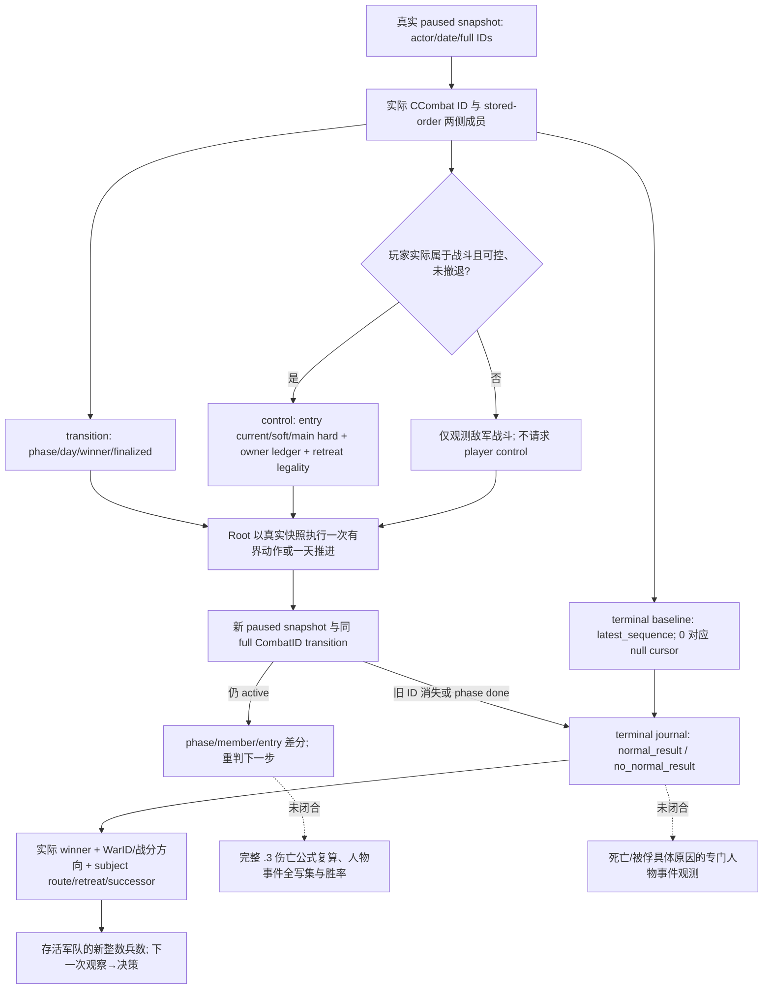

# CK3 1.20.0.3：首次战斗的伤亡、败退与结束结果观测

2026-10-03。Exact build 为 CK3 `1.20.0.3`、Steam `25652598`，EXE SHA-256
`94B55397ABB687A3DCD436805A5D885E6BE90FA6C693FEB44A9E3BBEEADE02A6`。
本页整理已存在的原生观测树和安装版 stock 规则，供 Robert `29829` 原普通战役首次战斗 OODA 使用。
战争已获全面授权；未实现的预测质量不构成战争禁令。本文没有提交动作、推进日期或操作窗口。

## 原生输入和证据

施工前读取 [battle 迁移](ck3-1.20.0.2-battle-migration.md)、
[伤亡账解释](combat-casualty-chain-explainer.md)、[终结与再入战](battle-terminal-and-reentry.md)及
[1.20.0.3 ABI 复用](crozier-1.20.0.3-native-migration.md)。1.19 的精确 casualty 数学和 phase-day
调用顺序仍是其原构建的研究证据；本页不将旧 EXE 地址或旧实战自动升级为 .3 live。

.3 production 在完整 descriptor 匹配后使用 `ReviewedCrozierAbiSha256` 选择已证明 unchanged 的 .2
ABI。永久证据 `native_bridge/research/ck3_1_20_0_3_abi_reuse.json` 的 `combat` 和 `battle`
模块分别引用 `ck3_1_20_0_2_combat.json`、`ck3_1_20_0_2_battle.json`；
`ck3_12003_abi_profile.cpp:18` 和 `bridge.cpp` 的 `ExecuteTypedQuery12002` 连接真实 owning-thread
paused snapshot 与现有 battle reader。实际 .3 身份来自 runtime freeze，而非为旧 binder 增加 SHA 例外。

已有原生读取入口及其职责如下：

| 入口 | 原生输入/结果 | 对首次战斗的用途 |
|---|---|---|
| `ck3_query_battle_transition_v1` | CCombat storage `5D1DE70`；完整 CombatID；phase `+6B0`、day `+6B4`、winner `+6E0`、forced winner `+700`、finalized `+704`、result ID `+708`；两侧 stored-order CArmy→CUnit 回链 | 给任何已实际观测的战斗定位阶段和成员，玩家尚未参战或已撤离时仍可查询 |
| `ck3_query_battle_control_snapshot_v1` | 玩家可控、正在战斗、未撤退 CUnit；两侧 Entry60 和 owner hard ledger；native strength `2651100/2657B50`；retreat validator `258AA10`、owner-taking rules `28C2E10` | 玩家实际入战后读取当前 fighting、soft、hard 和真实撤退资格 |
| `ck3_query_battle_terminal_transition_v1` | startup 安装的 natural finalizer `258CD50` 与 warscore writer `249A940` 被动 journal；旧 CombatID/省份/result、subject route/backlink、successor | 旧战斗删除后继续证明正常结果或无正常结果，并决定战后下一步 |
| `ck3_query_army_strengths` + `ck3_take_snapshot` | 完整 CUnit/CArmy；当前/最大整数兵数、所属战争、位置、路线、combat/retreat；snapshot 的玩家身份/存活和 native command history | 战前与战后可用军队兵力和行动状态差分，供继续围城、行军或撤退使用 |

`ck3_12002_battle.cpp::TransitionSample/Bucket/Side/Retreat/TerminalSample` 是本页字段语义的生产来源。
`bridge.cpp::XarCk3BridgePrepareStartup` 对 reviewed Crozier 构建安装 terminal journal；无需另行开启
旧 `WAR_CASH/PREWAR` 才能读取这些核心字段。

## 当前原战役真实基线

复用 `Z:/ck3_mod_rewrite_process_assets/g2-resume-20261003/war-battle-phase/actual-battle-transition-v34-01/004-ck3_query_battle_transition_v1.json`，
不重复实测：native revision `16` / public `2` / paused date raw `53236608`；CombatID
`1577058305`、province `2640`，maneuver `0` / day `0`，winner 与 forced winner 均 `none`、finalized false。
实际 attacker CUnits `[251658381,473,474]`，defender `[50331920,83886484]`。
Robert 军 `83886367` 不在双方数组。ResultID `1493172226` 在此机动初帧已经分配，因此 **result ID
非空不是战斗结束证据**。这些实际成员不能由另一份“玩家对叛军”的假想 v2 partition 替换。

本基线提升的是敌军战斗生命周期 `production-live primitive`；Robert 未参战，也尚无本战的伤亡、
结束、胜利或完整战争 OODA。敌军战斗的 terminal baseline 可以以实际 rebel CUnit `251658381`
作为 subject；该 query 没有 controllable 或 player-army 闸门。其 subject 状态描述这支叛军，不能写成 Robert 状态。

## 伤亡字段单位与差分

Entry 的 `starting_raw/current_fighting_raw/soft_casualties_raw/hard_casualties_raw` 和 owner hard
ledger 都是 **Q100000 兵员账**，除以 `100000` 才是人数当量。属性 damage/toughness/pursuit/screen、
native side strength 与 AI base power 各自保留计算单位，不能直接念为兵数或胜率。
`army-strength` 的 `current_soldiers/maximum_soldiers` 已是整数人数，不能再次除以 Q。

对 `fights_in_main_phase=true` 的保留 entry，reader 以 `starting-current-soft` 计算累计 hard；非 main
entry 的同一残差可能包含 reserve，其 `hard_casualties_status=unavailable`、raw null，不能补成 0。
同一 full CombatID、同一 full RegimentID 两帧的累计 hard 差才是该间隔的该行永久损失。owner hard
ledger 包含其自身归因，不将消失兵团的损失重新分摊给仍保留 entry。

`derived_current_fighting_raw` 是即时 entry 合计；`stored_current_fighting_raw` 可保留 tick-start cache。
既有 .2 fixture-live 已观察二者在 main 帧不同，这个标志不单独阻断 action readiness。
soft 是战斗中已溃散兵员；它可以在追击中转成 hard，战后可用军队整数兵数可以回升。
战前/战后整数军队人数差是净兵力变化，不能冒充 exact hard loss 或人物死亡人数。

## 最小结果验收

1. 战前保存现有实际 snapshot/army-strength，并为实际 CombatID 读取一次 terminal baseline。取
   `terminal_journal.latest_sequence` 为后续 cursor；正数原样传，`0` 传 `None`。
2. 若 Robert 真正入战，在新 snapshot 的真实 side membership 上查询 control + transition + terminal，
   记录 entry/owner ledger、phase/day、winner、retreat legality 和 cursor。对当前仅敌军战斗不调用 control。
3. Root 一次有界动作/一天推进后保存 paused snapshot；SDK root helper 给每个 query 绑定 fresh public
   revision。复用 native command history 与实际状态验证动作；ACK 不计后置条件。
4. 同 CombatID 仍 active 时记录阶段、成员、伤亡差分。owner-subset 撤退只移除 affected owner，其他成员
   和原战斗可继续；full-side 撤退后进入 pursuit 也可暂时保留原 CombatID/backlink。
5. 正常结束由 terminal journal `event_status=observed`、新的 event sequence、`normal_result`、实际
   winner/result 及 removal 证明。`combat_not_found` 只证明旧 generation 删除；`phase=done`、retreating、
   非空 result ID 或 winner 任一单字段均不单独证明正常胜利。`no_normal_result` 单独保留。
6. 战后记录 terminal subject 的 exists/route/retreat/backlink/blocked 和 successor；重新读取实际存活军队
   的 current/max 人数。journal 的真实 `war_id`、`winner_is_war_attacker` 与 attacker-relative delta 决定
   战分归属，combat attacker 不能自动当作 war attacker；当前多战争场景不可按目标省份猜归属。

当前 .3 terminal reader 没有填 `prior.terminal_date_raw`、`prior.phase_day`、`hard_loss_inputs`；
结果发生日期先以实际前后 snapshot 区间及现有 journal 结果记录，不能倒填精确 tick。
这三个空字段不妨碍上述真实胜负、战分、败退/后续状态和军队兵力里程碑；本工作不扩展 producer 或重复旧矩阵。
若后续决策确实依赖精确 terminal hard-loss/date，再沿当前 finalizer journal 增补同一查询。

## Root 查询配方与报告

外部工作包目录：`Z:/ck3_mod_rewrite_process_assets/g2-resume-20261003/battle-casualty-outcomes/`。
`CURRENT-HOSTILE-TERMINAL-BASELINE-CALLS.json` 为当前真实敌军战斗只生成一个尚未采集的 terminal baseline。
`build_outcome_recipe.py` 只写配置，不发送 SDK/game 调用；baseline 阶段仅 terminal，player-contact
阶段 control/transition/terminal，post 阶段 transition/terminal。Root 在新实际 snapshot 选取阶段与完整 ID，
`root_sdk_capture_continue.py` 为每一调用刷新 revision。配置是 `{"calls":[...]}` 对象。

安装版 stock 规则与人物结果的差分边界见 [安装版人物结果链](battle-character-result-stock-1.20.0.3-2026-10-03.md)
与本工作包 `stock/STOCK-EVIDENCE.json`（九份实际安装版文件 SHA 与行号）。其中 main 基础 hard 转换
配置 `0.3`、pursuit 三日/转换 `1`、manual-retreat 配置 `14` 都不是人物死亡率或本战实际结果。
现行 `on_combat_end_winner→combat_event.1001→.1002` 捕获链要求双方 primary participant 真实交战；
仅 hostile 而无相互战争的战斗不走此链。`battle_event`/候选列表与真正 `house_arrest`/jailer 回读分开。
指挥官与骑士阶段受伤/死亡资格也分别读取，不能把骑士 wounded3 排除外推给指挥官。
首次作战主线先验收实际军事结果；
被俘与死亡只有在真实人物/羁押或事件证据出现后才计入，不因普通兵员 hard loss、骑士 entry 减少或
人物从一侧数组消失自动认定。
